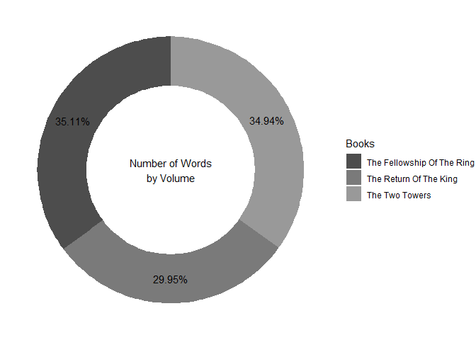
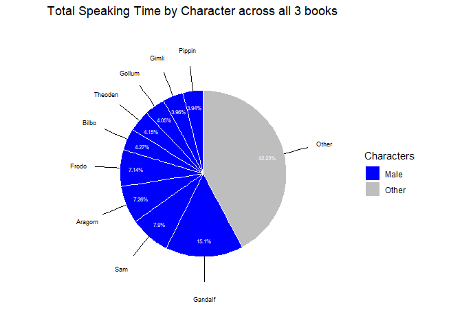
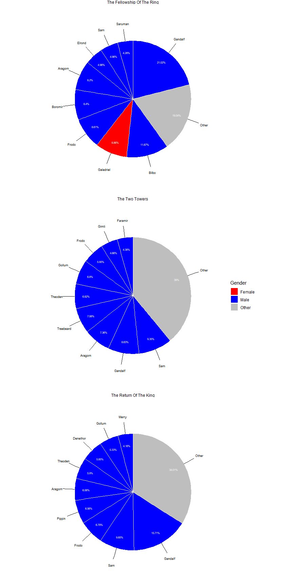
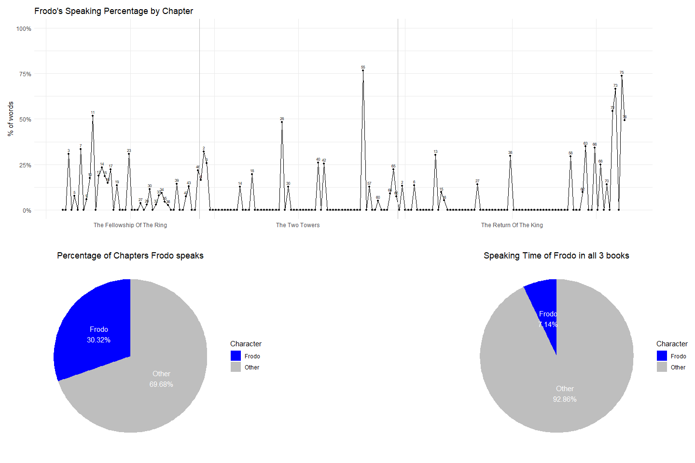

## Distribution of Speakers Time in Lord of the Rings

------------------------------------------------------------------------

## Introduction

Lord of the Rings is a fantasy novel trilogy written by J.R.R. Tolkien.
Until today, it is one of the most popular and influential works of
fantasy literature, and has been adapted into several films, video
games, and other media. The story follows a group of characters as they
embark on a quest to destroy a powerful ring that has the potential to
enslave the world.

In this analysis, we will explore the distribution of speakers time in
Lord of the Rings. For that, not the minutes of speaking in the movies,
but the number of words spoken by each character in the three books will
be used as a proxy for the time spent speaking.

------------------------------------------------------------------------

## Aim of the Analysis

This analysis will help us understand which characters have the most
dialogue and how the speaking time is distributed among the characters
in the story. We will also explore any patterns or trends in the
distribution of speakers time, and how it may relate to the overall
narrative of the novel. This also in light of the gender representation
in the novel, as the movies are often criticized for their lack of
diverse representation.

------------------------------------------------------------------------

## Data

The data used for this analysis will consist of two datasets.

### 1st Dataset: Words by Character

This dataset is concerned with the number of words spoken contains the
number of words spoken by each character in all three volumes of Lord of
the Rings. The data is organized in a tabular format, with each row
representing a character and the number of words they spoke in a
particular chapter of the novel. The columns include the name of the
film (book), the chapter, the character’s name, race and the number of
words spoken by them:

<table>
<colgroup>
<col style="width: 41%" />
<col style="width: 20%" />
<col style="width: 16%" />
<col style="width: 11%" />
<col style="width: 10%" />
</colgroup>
<thead>
<tr>
<th style="text-align: center;">Film</th>
<th style="text-align: center;">Chapter</th>
<th style="text-align: center;">Character</th>
<th style="text-align: center;">Race</th>
<th style="text-align: center;">Words</th>
</tr>
</thead>
<tbody>
<tr>
<td style="text-align: center;">The Fellowship of the Ring</td>
<td style="text-align: center;">01: Prologue</td>
<td style="text-align: center;">Bilbo</td>
<td style="text-align: center;">Hobbit</td>
<td style="text-align: center;">4</td>
</tr>
<tr>
<td style="text-align: center;">The Fellowship of the Ring</td>
<td style="text-align: center;">01: Prologue</td>
<td style="text-align: center;">Elrond</td>
<td style="text-align: center;">Elf</td>
<td style="text-align: center;">5</td>
</tr>
<tr>
<td style="text-align: center;">The Fellowship of the Ring</td>
<td style="text-align: center;">01: Prologue</td>
<td style="text-align: center;">Galadriel</td>
<td style="text-align: center;">Elf</td>
<td style="text-align: center;">460</td>
</tr>
</tbody>
</table>

The columns are defined as follows:

-   **Film**: The name of the individual novel (The Fellowship of the
    Ring, The Two Towers, The Return of the King).
-   **Chapter**: The chapter of the specified novel in which the
    character speaks.
-   **Character**: The name of the character who speaks.
-   **Race**: The race (species) of the specified character.
-   **Words**: The number of words spoken by the specified character in
    the specified chapter within the specified book.

### 2nd DataSet: Character Information

The second dataset contains information about the characters in Lord of
the Rings, including their name, race, gender and realm. The dataset is
available in the project folder under the name
`InformationByCharacter.csv`. The creator of this dataset is me, Emily.
The data was collected and compiled by me, based on information from the
novels and other sources, such as the LOTR-Wiki. The data is organized
in a tabular format, with each row representing a character:

<table>
<thead>
<tr>
<th style="text-align: center;">Character</th>
<th style="text-align: center;">Race</th>
<th style="text-align: center;">Gender</th>
<th style="text-align: center;">Realm</th>
</tr>
</thead>
<tbody>
<tr>
<td style="text-align: center;">Aragorn</td>
<td style="text-align: center;">Men</td>
<td style="text-align: center;">Male</td>
<td style="text-align: center;">Gondor</td>
</tr>
<tr>
<td style="text-align: center;">Arwen</td>
<td style="text-align: center;">Elf</td>
<td style="text-align: center;">Female</td>
<td style="text-align: center;">Rivendell</td>
</tr>
<tr>
<td style="text-align: center;">Bilbo</td>
<td style="text-align: center;">Hobbit</td>
<td style="text-align: center;">Male</td>
<td style="text-align: center;">The Shire</td>
</tr>
</tbody>
</table>

The columns are defined as follows:

-   **Name**: The name of the specified character.
-   **Race**: The race (species) of the specified character.
-   **Gender**: The gender of the specified character.
-   **Realm**: The realm (location) of which the specified character is
    mainly associated with.

------------------------------------------------------------------------

# Tasks

------------------------------------------------------------------------

## 1. Data Import and Manipulation

------------------------------------------------------------------------

    ## ── Attaching core tidyverse packages ──────────────────────── tidyverse 2.0.0 ──
    ## ✔ dplyr     1.1.4     ✔ readr     2.1.5
    ## ✔ forcats   1.0.1     ✔ stringr   1.5.2
    ## ✔ ggplot2   4.0.0     ✔ tibble    3.3.0
    ## ✔ lubridate 1.9.4     ✔ tidyr     1.3.1
    ## ✔ purrr     1.1.0     
    ## ── Conflicts ────────────────────────────────────────── tidyverse_conflicts() ──
    ## ✖ dplyr::filter() masks stats::filter()
    ## ✖ dplyr::lag()    masks stats::lag()
    ## ℹ Use the conflicted package (<http://conflicted.r-lib.org/>) to force all conflicts to become errors

    ## Warning: package 'ggrepel' was built under R version 4.5.3

    ## Warning: package 'patchwork' was built under R version 4.5.3

### 1.1. Fixing variable names

    ## Rows: 731 Columns: 5
    ## ── Column specification ────────────────────────────────────────────────────────
    ## Delimiter: ","
    ## chr (4): Film, Chapter, Character, Race
    ## dbl (1): Words
    ## 
    ## ℹ Use `spec()` to retrieve the full column specification for this data.
    ## ℹ Specify the column types or set `show_col_types = FALSE` to quiet this message.
    ## Rows: 74 Columns: 4
    ## ── Column specification ────────────────────────────────────────────────────────
    ## Delimiter: ","
    ## chr (4): Character, Race, Gender, Realm
    ## 
    ## ℹ Use `spec()` to retrieve the full column specification for this data.
    ## ℹ Specify the column types or set `show_col_types = FALSE` to quiet this message.

    ## # A tibble: 18 × 1
    ##    Realm                
    ##    <chr>                
    ##  1 Gondor               
    ##  2 Rivendell            
    ##  3 The Shire            
    ##  4 Lothlórien           
    ##  5 <NA>                 
    ##  6 Ithilien             
    ##  7 Vales of Anduin      
    ##  8 Rohan                
    ##  9 Valinor              
    ## 10 Lonely Mountain      
    ## 11 Misty Mountains      
    ## 12 Mordor               
    ## 13 Bree                 
    ## 14 The Paths of the Dead
    ## 15 Mirkwood             
    ## 16 Isengard             
    ## 17 Fangorn              
    ## 18 Dunland

<table>
<caption>Realm “Lothelórien” was written as “Lothl-rien”, so changed the
name for it.</caption>
<thead>
<tr>
<th style="text-align: left;">Realm</th>
</tr>
</thead>
<tbody>
<tr>
<td style="text-align: left;">Gondor</td>
</tr>
<tr>
<td style="text-align: left;">Rivendell</td>
</tr>
<tr>
<td style="text-align: left;">The Shire</td>
</tr>
<tr>
<td style="text-align: left;">Gondor</td>
</tr>
<tr>
<td style="text-align: left;">Gondor</td>
</tr>
<tr>
<td style="text-align: left;">Lothlórien</td>
</tr>
<tr>
<td style="text-align: left;">NA</td>
</tr>
<tr>
<td style="text-align: left;">Ithilien</td>
</tr>
<tr>
<td style="text-align: left;">Vales of Anduin</td>
</tr>
<tr>
<td style="text-align: left;">Gondor</td>
</tr>
<tr>
<td style="text-align: left;">Rivendell</td>
</tr>
<tr>
<td style="text-align: left;">Rohan</td>
</tr>
<tr>
<td style="text-align: left;">Rohan</td>
</tr>
<tr>
<td style="text-align: left;">Rohan</td>
</tr>
<tr>
<td style="text-align: left;">Gondor</td>
</tr>
<tr>
<td style="text-align: left;">The Shire</td>
</tr>
<tr>
<td style="text-align: left;">Rivendell</td>
</tr>
<tr>
<td style="text-align: left;">Rohan</td>
</tr>
<tr>
<td style="text-align: left;">The Shire</td>
</tr>
<tr>
<td style="text-align: left;">The Shire</td>
</tr>
<tr>
<td style="text-align: left;">Lothlórien</td>
</tr>
<tr>
<td style="text-align: left;">Rohan</td>
</tr>
<tr>
<td style="text-align: left;">Valinor</td>
</tr>
<tr>
<td style="text-align: left;">Gondor</td>
</tr>
<tr>
<td style="text-align: left;">Lonely Mountain</td>
</tr>
<tr>
<td style="text-align: left;">Misty Mountains</td>
</tr>
<tr>
<td style="text-align: left;">Gondor</td>
</tr>
<tr>
<td style="text-align: left;">Mordor</td>
</tr>
<tr>
<td style="text-align: left;">Rohan</td>
</tr>
<tr>
<td style="text-align: left;">Rohan</td>
</tr>
<tr>
<td style="text-align: left;">Mordor</td>
</tr>
<tr>
<td style="text-align: left;">Mordor</td>
</tr>
<tr>
<td style="text-align: left;">Lothlórien</td>
</tr>
<tr>
<td style="text-align: left;">Rohan</td>
</tr>
<tr>
<td style="text-align: left;">Rohan</td>
</tr>
<tr>
<td style="text-align: left;">The Shire</td>
</tr>
<tr>
<td style="text-align: left;">The Shire</td>
</tr>
<tr>
<td style="text-align: left;">Bree</td>
</tr>
<tr>
<td style="text-align: left;">Gondor</td>
</tr>
<tr>
<td style="text-align: left;">Gondor</td>
</tr>
<tr>
<td style="text-align: left;">The Paths of the Dead</td>
</tr>
<tr>
<td style="text-align: left;">Mirkwood</td>
</tr>
<tr>
<td style="text-align: left;">The Shire</td>
</tr>
<tr>
<td style="text-align: left;">Isengard</td>
</tr>
<tr>
<td style="text-align: left;">Gondor</td>
</tr>
<tr>
<td style="text-align: left;">Gondor</td>
</tr>
<tr>
<td style="text-align: left;">Isengard</td>
</tr>
<tr>
<td style="text-align: left;">Gondor</td>
</tr>
<tr>
<td style="text-align: left;">The Shire</td>
</tr>
<tr>
<td style="text-align: left;">Rohan</td>
</tr>
<tr>
<td style="text-align: left;">Mordor</td>
</tr>
<tr>
<td style="text-align: left;">The Shire</td>
</tr>
<tr>
<td style="text-align: left;">Mordor</td>
</tr>
<tr>
<td style="text-align: left;">Mordor</td>
</tr>
<tr>
<td style="text-align: left;">The Shire</td>
</tr>
<tr>
<td style="text-align: left;">The Shire</td>
</tr>
<tr>
<td style="text-align: left;">Rohan</td>
</tr>
<tr>
<td style="text-align: left;">Rohan</td>
</tr>
<tr>
<td style="text-align: left;">The Shire</td>
</tr>
<tr>
<td style="text-align: left;">The Shire</td>
</tr>
<tr>
<td style="text-align: left;">The Shire</td>
</tr>
<tr>
<td style="text-align: left;">Isengard</td>
</tr>
<tr>
<td style="text-align: left;">Mordor</td>
</tr>
<tr>
<td style="text-align: left;">Vales of Anduin</td>
</tr>
<tr>
<td style="text-align: left;">Mordor</td>
</tr>
<tr>
<td style="text-align: left;">The Shire</td>
</tr>
<tr>
<td style="text-align: left;">Rohan</td>
</tr>
<tr>
<td style="text-align: left;">Fangorn</td>
</tr>
<tr>
<td style="text-align: left;">Isengard</td>
</tr>
<tr>
<td style="text-align: left;">Isengard</td>
</tr>
<tr>
<td style="text-align: left;">Mordor</td>
</tr>
<tr>
<td style="text-align: left;">NA</td>
</tr>
<tr>
<td style="text-align: left;">Dunland</td>
</tr>
<tr>
<td style="text-align: left;">Mordor</td>
</tr>
</tbody>
</table>

### 1.2. Cleaning up NA

    ## [1] 0

    ## [1] 4

    ## # A tibble: 3 × 4
    ##   Character         Race  Gender Realm   
    ##   <chr>             <chr> <chr>  <chr>   
    ## 1 Crowd             Men   Mixed  <NA>    
    ## 2 Uruk-hai          Orc   <NA>   Isengard
    ## 3 Voice Of The Ring Ainur <NA>   <NA>

<table>
<caption>Found several NA data, and changed them into “Unknown” so that
the other information of the column still remains.</caption>
<thead>
<tr>
<th style="text-align: left;">Gender</th>
<th style="text-align: left;">Realm</th>
</tr>
</thead>
<tbody>
<tr>
<td style="text-align: left;">Mixed</td>
<td style="text-align: left;">Unknown</td>
</tr>
<tr>
<td style="text-align: left;">Unknown</td>
<td style="text-align: left;">Isengard</td>
</tr>
<tr>
<td style="text-align: left;">Unknown</td>
<td style="text-align: left;">Unknown</td>
</tr>
</tbody>
</table>

### 1.3. Fixing Character Name

    words_names <- unique(words_data$Character)

    info_names  <- unique(info_data$Character)

    setdiff(unique(words_data$Character), unique(info_data$Character))

    ## [1] "Boson"

    info_data$Character[info_data$Character=="Bosun"]<-"Boson"

: In Info\_data, there was “Bosun” instead of “Boson”, so fixed it to
unify the names with words\_data

### 1.4. Merging dataset

    lotr_data<- words_data %>%
      left_join(info_data%>%
          select(-Race),by = "Character")

: Merged dataset by Character

------------------------------------------------------------------------

## 2. Data Analysis & Visualization

------------------------------------------------------------------------

### 2.1 Speakers Time by Volume

**Total number of spoken words by book**

<table>
<thead>
<tr>
<th style="text-align: left;">Book</th>
<th style="text-align: right;">Total words</th>
</tr>
</thead>
<tbody>
<tr>
<td style="text-align: left;">The Fellowship Of The Ring</td>
<td style="text-align: right;">11225</td>
</tr>
<tr>
<td style="text-align: left;">The Return Of The King</td>
<td style="text-align: right;">9575</td>
</tr>
<tr>
<td style="text-align: left;">The Two Towers</td>
<td style="text-align: right;">11169</td>
</tr>
</tbody>
</table>

-   What is the total number of words spoken?

The Fellowship Of The Ring: 1.1225^{4} The Return Of The King: 9575 The
Two Towers: 1.1169^{4}

-   Which book has the highest number of words spoken?

Highest: The Fellowship Of The Ring

-   Which book has the lowest number of words spoken?

Lowest: The Return Of The King

**Visualization for “Number of Words spoken in each Volume”**

### 2.2. Speaking Time by Character

#### 2.2.1. Total Speaking Time by Character across all 3 books

**Total number of words spoken by each character across all three
books**

<table>
<thead>
<tr>
<th style="text-align: left;">Character</th>
<th style="text-align: right;">Total Words</th>
</tr>
</thead>
<tbody>
<tr>
<td style="text-align: left;">Gandalf</td>
<td style="text-align: right;">4828</td>
</tr>
<tr>
<td style="text-align: left;">Sam</td>
<td style="text-align: right;">2525</td>
</tr>
<tr>
<td style="text-align: left;">Aragorn</td>
<td style="text-align: right;">2322</td>
</tr>
<tr>
<td style="text-align: left;">Frodo</td>
<td style="text-align: right;">2281</td>
</tr>
<tr>
<td style="text-align: left;">Bilbo</td>
<td style="text-align: right;">1366</td>
</tr>
<tr>
<td style="text-align: left;">Theoden</td>
<td style="text-align: right;">1327</td>
</tr>
<tr>
<td style="text-align: left;">Gollum</td>
<td style="text-align: right;">1294</td>
</tr>
<tr>
<td style="text-align: left;">Gimli</td>
<td style="text-align: right;">1265</td>
</tr>
<tr>
<td style="text-align: left;">Pippin</td>
<td style="text-align: right;">1261</td>
</tr>
</tbody>
</table>

**Visualization for “Top 9 Characters with the most speaking time”**

    top9_data <- lotr_data %>%
      group_by(Character, Gender) %>%
      summarise(total_words = sum(Words, na.rm=TRUE),.groups="drop") %>%
      mutate(Character=fct_lump(
        Character,
        n=9, 
        w=total_words, 
        other_level="Other"),
      Gender=if_else(
        Character=="Other",
        "Other",
        Gender)) %>%
      group_by(Character, 
               Gender) %>% 
      summarise(total_words=sum(total_words),
                .groups="drop") %>%
      mutate(percentage=total_words/sum(total_words)*100,
             label=paste0(round(percentage,2),"%")) %>%
      arrange(desc(total_words))%>%
      mutate(percentage=total_words/sum(total_words)*100,
             label=paste0(round(percentage,2),"%"),
             ymin=lag(cumsum(percentage),default=0),
             ymax=cumsum(percentage),
             ypos=(ymin+ymax)/2)

    top9_data%>%
      ggplot()+
      geom_rect(
        aes(ymin=ymin,ymax=ymax,xmin=0,xmax=1,fill=Gender),
        color="white")+
      geom_segment(aes(x=1, xend=1.3, y=ypos, yend=ypos))+
      geom_text(aes(x=1.5,y=ypos,label=Character),size=2.5)+
      geom_text(aes(x=0.8,y=ypos,label=label),color="white",size=2)+
      coord_polar(theta="y")+
      theme_void()+
      labs(title="Total Speaking Time by Character across all 3 books", fill="Characters")+
      scale_fill_manual(values=c("Male"="blue","Female"="red","Other"="grey"))

#### 2.2.2. Visualizaion for “Total Speaking Time by Character for each individual book”

### 2.3. Speakers Time of Frodo

Here we loloked at three different aspects related to Frodo’s speaking
time, and visualized three charts into one scene.

#### 2.3.1. Speaking Time of Frodo across all 3 books

<table>
<caption>Frodo had 7.14% of speaking throughout all three
books</caption>
<thead>
<tr>
<th style="text-align: left;">Character</th>
<th style="text-align: left;">Percent</th>
</tr>
</thead>
<tbody>
<tr>
<td style="text-align: left;">Frodo</td>
<td style="text-align: left;">7.14%</td>
</tr>
<tr>
<td style="text-align: left;">Other</td>
<td style="text-align: left;">92.86%</td>
</tr>
</tbody>
</table>

#### Visualization for Speaking Time of Frodo across all 3 books

#### 2.3.2. Percentage of chapters where Frodo speaks

<table>
<caption>Frodo spoke in 30.32% of the chapters throughout all three
books.</caption>
<thead>
<tr>
<th style="text-align: left;">Character</th>
<th style="text-align: left;">Percent</th>
</tr>
</thead>
<tbody>
<tr>
<td style="text-align: left;">Frodo</td>
<td style="text-align: left;">30.32%</td>
</tr>
<tr>
<td style="text-align: left;">Other</td>
<td style="text-align: left;">69.68%</td>
</tr>
</tbody>
</table>

#### Visualization for Percentage of chapters where Frodo speaks

#### 2.3.3. Percentage of Frodo speaking for each chapters in each book

<table>
<colgroup>
<col style="width: 31%" />
<col style="width: 58%" />
<col style="width: 9%" />
</colgroup>
<thead>
<tr>
<th style="text-align: left;">Volume</th>
<th style="text-align: left;">Chapter</th>
<th style="text-align: left;">Percent</th>
</tr>
</thead>
<tbody>
<tr>
<td style="text-align: left;">The Fellowship Of The Ring</td>
<td style="text-align: left;">01: Prologue</td>
<td style="text-align: left;">0%</td>
</tr>
<tr>
<td style="text-align: left;">The Fellowship Of The Ring</td>
<td style="text-align: left;">02: Concerning Hobbits</td>
<td style="text-align: left;">0%</td>
</tr>
<tr>
<td style="text-align: left;">The Fellowship Of The Ring</td>
<td style="text-align: left;">03: The Shire</td>
<td style="text-align: left;">30.7%</td>
</tr>
<tr>
<td style="text-align: left;">The Fellowship Of The Ring</td>
<td style="text-align: left;">04: Very Old Friends</td>
<td style="text-align: left;">0%</td>
</tr>
<tr>
<td style="text-align: left;">The Fellowship Of The Ring</td>
<td style="text-align: left;">05: A Long Expected Party</td>
<td style="text-align: left;">7.57%</td>
</tr>
<tr>
<td style="text-align: left;">The Fellowship Of The Ring</td>
<td style="text-align: left;">06: Farewell Dear Bilbo</td>
<td style="text-align: left;">0%</td>
</tr>
<tr>
<td style="text-align: left;">The Fellowship Of The Ring</td>
<td style="text-align: left;">07: Keep It Secret Keep It Safe</td>
<td style="text-align: left;">33.33%</td>
</tr>
<tr>
<td style="text-align: left;">The Fellowship Of The Ring</td>
<td style="text-align: left;">08: The Account of Isildur</td>
<td style="text-align: left;">0%</td>
</tr>
<tr>
<td style="text-align: left;">The Fellowship Of The Ring</td>
<td style="text-align: left;">09: At The Green Dragon</td>
<td style="text-align: left;">5.86%</td>
</tr>
<tr>
<td style="text-align: left;">The Fellowship Of The Ring</td>
<td style="text-align: left;">10: The Shadow Of The Past</td>
<td style="text-align: left;">17.44%</td>
</tr>
<tr>
<td style="text-align: left;">The Fellowship Of The Ring</td>
<td style="text-align: left;">11: The Passing Of The Elves</td>
<td style="text-align: left;">51.81%</td>
</tr>
<tr>
<td style="text-align: left;">The Fellowship Of The Ring</td>
<td style="text-align: left;">12: Saruman The White</td>
<td style="text-align: left;">0%</td>
</tr>
<tr>
<td style="text-align: left;">The Fellowship Of The Ring</td>
<td style="text-align: left;">13: A Shortcut To Mushrooms</td>
<td style="text-align: left;">18.88%</td>
</tr>
<tr>
<td style="text-align: left;">The Fellowship Of The Ring</td>
<td style="text-align: left;">14: Buckleberry Ferry</td>
<td style="text-align: left;">23.26%</td>
</tr>
<tr>
<td style="text-align: left;">The Fellowship Of The Ring</td>
<td style="text-align: left;">15: At The Sign of the Prancing Pony</td>
<td style="text-align: left;">18.63%</td>
</tr>
<tr>
<td style="text-align: left;">The Fellowship Of The Ring</td>
<td style="text-align: left;">16: The Nazgul</td>
<td style="text-align: left;">14.87%</td>
</tr>
<tr>
<td style="text-align: left;">The Fellowship Of The Ring</td>
<td style="text-align: left;">17: The Midgewater Marshes</td>
<td style="text-align: left;">22.22%</td>
</tr>
<tr>
<td style="text-align: left;">The Fellowship Of The Ring</td>
<td style="text-align: left;">18: The Spoiling Of Isengard</td>
<td style="text-align: left;">0%</td>
</tr>
<tr>
<td style="text-align: left;">The Fellowship Of The Ring</td>
<td style="text-align: left;">19: A Knife In The Dark</td>
<td style="text-align: left;">13.56%</td>
</tr>
<tr>
<td style="text-align: left;">The Fellowship Of The Ring</td>
<td style="text-align: left;">20: The Caverns Of Isengard</td>
<td style="text-align: left;">0%</td>
</tr>
<tr>
<td style="text-align: left;">The Fellowship Of The Ring</td>
<td style="text-align: left;">21: Flight To The Ford</td>
<td style="text-align: left;">0%</td>
</tr>
<tr>
<td style="text-align: left;">The Fellowship Of The Ring</td>
<td style="text-align: left;">22: Rivendell</td>
<td style="text-align: left;">0%</td>
</tr>
<tr>
<td style="text-align: left;">The Fellowship Of The Ring</td>
<td style="text-align: left;">23: Many Meetings</td>
<td style="text-align: left;">30.75%</td>
</tr>
<tr>
<td style="text-align: left;">The Fellowship Of The Ring</td>
<td style="text-align: left;">24: The Fate Of The Ring</td>
<td style="text-align: left;">0%</td>
</tr>
<tr>
<td style="text-align: left;">The Fellowship Of The Ring</td>
<td style="text-align: left;">25: The Sword That Was Broken</td>
<td style="text-align: left;">0%</td>
</tr>
<tr>
<td style="text-align: left;">The Fellowship Of The Ring</td>
<td style="text-align: left;">26: The Evenstar</td>
<td style="text-align: left;">0%</td>
</tr>
<tr>
<td style="text-align: left;">The Fellowship Of The Ring</td>
<td style="text-align: left;">27: The Council Of Elrond</td>
<td style="text-align: left;">3.56%</td>
</tr>
<tr>
<td style="text-align: left;">The Fellowship Of The Ring</td>
<td style="text-align: left;">28: Gilraen’s Memorial</td>
<td style="text-align: left;">0%</td>
</tr>
<tr>
<td style="text-align: left;">The Fellowship Of The Ring</td>
<td style="text-align: left;">29: Bilbo’s Gifts</td>
<td style="text-align: left;">2.78%</td>
</tr>
<tr>
<td style="text-align: left;">The Fellowship Of The Ring</td>
<td style="text-align: left;">30: The Departure Of The Fellowship</td>
<td style="text-align: left;">11.29%</td>
</tr>
<tr>
<td style="text-align: left;">The Fellowship Of The Ring</td>
<td style="text-align: left;">31: The Ring Goes South</td>
<td style="text-align: left;">0%</td>
</tr>
<tr>
<td style="text-align: left;">The Fellowship Of The Ring</td>
<td style="text-align: left;">32: The Pass Of Caradhras</td>
<td style="text-align: left;">2.86%</td>
</tr>
<tr>
<td style="text-align: left;">The Fellowship Of The Ring</td>
<td style="text-align: left;">33: Moria</td>
<td style="text-align: left;">7.89%</td>
</tr>
<tr>
<td style="text-align: left;">The Fellowship Of The Ring</td>
<td style="text-align: left;">34: A Journey In The Dark</td>
<td style="text-align: left;">9.31%</td>
</tr>
<tr>
<td style="text-align: left;">The Fellowship Of The Ring</td>
<td style="text-align: left;">35: Balin’s Tomb</td>
<td style="text-align: left;">4.4%</td>
</tr>
<tr>
<td style="text-align: left;">The Fellowship Of The Ring</td>
<td style="text-align: left;">36: The Bridge Of Khazad-dûm</td>
<td style="text-align: left;">2.5%</td>
</tr>
<tr>
<td style="text-align: left;">The Fellowship Of The Ring</td>
<td style="text-align: left;">37: Lothlorien</td>
<td style="text-align: left;">0%</td>
</tr>
<tr>
<td style="text-align: left;">The Fellowship Of The Ring</td>
<td style="text-align: left;">38: Caras Galadhon</td>
<td style="text-align: left;">0%</td>
</tr>
<tr>
<td style="text-align: left;">The Fellowship Of The Ring</td>
<td style="text-align: left;">39: The Mirror Of Galadriel</td>
<td style="text-align: left;">14.4%</td>
</tr>
<tr>
<td style="text-align: left;">The Fellowship Of The Ring</td>
<td style="text-align: left;">40: The Fighting Uruk-hai</td>
<td style="text-align: left;">0%</td>
</tr>
<tr>
<td style="text-align: left;">The Fellowship Of The Ring</td>
<td style="text-align: left;">41: Farewell To Lorien</td>
<td style="text-align: left;">0%</td>
</tr>
<tr>
<td style="text-align: left;">The Fellowship Of The Ring</td>
<td style="text-align: left;">42: The Great River</td>
<td style="text-align: left;">7.27%</td>
</tr>
<tr>
<td style="text-align: left;">The Fellowship Of The Ring</td>
<td style="text-align: left;">43: Parth Galen</td>
<td style="text-align: left;">12.89%</td>
</tr>
<tr>
<td style="text-align: left;">The Fellowship Of The Ring</td>
<td style="text-align: left;">44: The Breaking Of The Fellowship</td>
<td style="text-align: left;">0%</td>
</tr>
<tr>
<td style="text-align: left;">The Fellowship Of The Ring</td>
<td style="text-align: left;">45: The Departure Of Boromir</td>
<td style="text-align: left;">0%</td>
</tr>
<tr>
<td style="text-align: left;">The Fellowship Of The Ring</td>
<td style="text-align: left;">46: The Road Goes Ever On…</td>
<td style="text-align: left;">21.69%</td>
</tr>
<tr>
<td style="text-align: left;">The Two Towers</td>
<td style="text-align: left;">01: The Foundations Of Stone</td>
<td style="text-align: left;">16.36%</td>
</tr>
<tr>
<td style="text-align: left;">The Two Towers</td>
<td style="text-align: left;">02: Elven Rope</td>
<td style="text-align: left;">32.17%</td>
</tr>
<tr>
<td style="text-align: left;">The Two Towers</td>
<td style="text-align: left;">03: The Taming of Sméagol</td>
<td style="text-align: left;">25.68%</td>
</tr>
<tr>
<td style="text-align: left;">The Two Towers</td>
<td style="text-align: left;">04: The Uruk-Hai</td>
<td style="text-align: left;">0%</td>
</tr>
<tr>
<td style="text-align: left;">The Two Towers</td>
<td style="text-align: left;">05: The Three Hunters</td>
<td style="text-align: left;">0%</td>
</tr>
<tr>
<td style="text-align: left;">The Two Towers</td>
<td style="text-align: left;">06: The Burning of the Westfold</td>
<td style="text-align: left;">0%</td>
</tr>
<tr>
<td style="text-align: left;">The Two Towers</td>
<td style="text-align: left;">07: Massacre at the Fords of Isen</td>
<td style="text-align: left;">0%</td>
</tr>
<tr>
<td style="text-align: left;">The Two Towers</td>
<td style="text-align: left;">08: The Banishment of Éomer</td>
<td style="text-align: left;">0%</td>
</tr>
<tr>
<td style="text-align: left;">The Two Towers</td>
<td style="text-align: left;">09: On The Trail Of The Uruk-Hai</td>
<td style="text-align: left;">0%</td>
</tr>
<tr>
<td style="text-align: left;">The Two Towers</td>
<td style="text-align: left;">10: Night Camp At Fangorn</td>
<td style="text-align: left;">0%</td>
</tr>
<tr>
<td style="text-align: left;">The Two Towers</td>
<td style="text-align: left;">11: The Riders Of Rohan</td>
<td style="text-align: left;">0%</td>
</tr>
<tr>
<td style="text-align: left;">The Two Towers</td>
<td style="text-align: left;">12: The Fate Of Merry And Pippin</td>
<td style="text-align: left;">0%</td>
</tr>
<tr>
<td style="text-align: left;">The Two Towers</td>
<td style="text-align: left;">13: Treebeard</td>
<td style="text-align: left;">0%</td>
</tr>
<tr>
<td style="text-align: left;">The Two Towers</td>
<td style="text-align: left;">14: The Passage Of The Marshes</td>
<td style="text-align: left;">12.65%</td>
</tr>
<tr>
<td style="text-align: left;">The Two Towers</td>
<td style="text-align: left;">15: The White Rider</td>
<td style="text-align: left;">0%</td>
</tr>
<tr>
<td style="text-align: left;">The Two Towers</td>
<td style="text-align: left;">16: The Song Of The Entwives</td>
<td style="text-align: left;">0%</td>
</tr>
<tr>
<td style="text-align: left;">The Two Towers</td>
<td style="text-align: left;">17: The Heir Of Númenor</td>
<td style="text-align: left;">0%</td>
</tr>
<tr>
<td style="text-align: left;">The Two Towers</td>
<td style="text-align: left;">18: The Black Gate Is Closed</td>
<td style="text-align: left;">19.5%</td>
</tr>
<tr>
<td style="text-align: left;">The Two Towers</td>
<td style="text-align: left;">19: Ent Draft</td>
<td style="text-align: left;">0%</td>
</tr>
<tr>
<td style="text-align: left;">The Two Towers</td>
<td style="text-align: left;">20: The King Of The Golden Hall</td>
<td style="text-align: left;">0%</td>
</tr>
<tr>
<td style="text-align: left;">The Two Towers</td>
<td style="text-align: left;">21: The Funeral Of Théodred</td>
<td style="text-align: left;">0%</td>
</tr>
<tr>
<td style="text-align: left;">The Two Towers</td>
<td style="text-align: left;">22: Simbelmynë on the Burial Mounds</td>
<td style="text-align: left;">0%</td>
</tr>
<tr>
<td style="text-align: left;">The Two Towers</td>
<td style="text-align: left;">23: The King’s Decision</td>
<td style="text-align: left;">0%</td>
</tr>
<tr>
<td style="text-align: left;">The Two Towers</td>
<td style="text-align: left;">24: Brego</td>
<td style="text-align: left;">0%</td>
</tr>
<tr>
<td style="text-align: left;">The Two Towers</td>
<td style="text-align: left;">25: The Ring Of Barahir</td>
<td style="text-align: left;">0%</td>
</tr>
<tr>
<td style="text-align: left;">The Two Towers</td>
<td style="text-align: left;">26: A Daughter Of Kings</td>
<td style="text-align: left;">0%</td>
</tr>
<tr>
<td style="text-align: left;">The Two Towers</td>
<td style="text-align: left;">27: Exodus From Edoras</td>
<td style="text-align: left;">0%</td>
</tr>
<tr>
<td style="text-align: left;">The Two Towers</td>
<td style="text-align: left;">28: The Forests Of Ithilien</td>
<td style="text-align: left;">48.21%</td>
</tr>
<tr>
<td style="text-align: left;">The Two Towers</td>
<td style="text-align: left;">29: Gollum and Sméagol</td>
<td style="text-align: left;">0%</td>
</tr>
<tr>
<td style="text-align: left;">The Two Towers</td>
<td style="text-align: left;">30: Of Herbs And Stewed Rabbit</td>
<td style="text-align: left;">12.79%</td>
</tr>
<tr>
<td style="text-align: left;">The Two Towers</td>
<td style="text-align: left;">31: Dwarf Women</td>
<td style="text-align: left;">0%</td>
</tr>
<tr>
<td style="text-align: left;">The Two Towers</td>
<td style="text-align: left;">32: One of the Dúnedain</td>
<td style="text-align: left;">0%</td>
</tr>
<tr>
<td style="text-align: left;">The Two Towers</td>
<td style="text-align: left;">33: The Evenstar</td>
<td style="text-align: left;">0%</td>
</tr>
<tr>
<td style="text-align: left;">The Two Towers</td>
<td style="text-align: left;">34: The Wolves Of Isengard</td>
<td style="text-align: left;">0%</td>
</tr>
<tr>
<td style="text-align: left;">The Two Towers</td>
<td style="text-align: left;">35: Helm’s Deep</td>
<td style="text-align: left;">0%</td>
</tr>
<tr>
<td style="text-align: left;">The Two Towers</td>
<td style="text-align: left;">36: Isengard Unleashed</td>
<td style="text-align: left;">0%</td>
</tr>
<tr>
<td style="text-align: left;">The Two Towers</td>
<td style="text-align: left;">37: The Grace Of The Valar</td>
<td style="text-align: left;">0%</td>
</tr>
<tr>
<td style="text-align: left;">The Two Towers</td>
<td style="text-align: left;">38: Arwen’s Fate</td>
<td style="text-align: left;">0%</td>
</tr>
<tr>
<td style="text-align: left;">The Two Towers</td>
<td style="text-align: left;">39: The Story Foreseen From Lórien</td>
<td style="text-align: left;">0%</td>
</tr>
<tr>
<td style="text-align: left;">The Two Towers</td>
<td style="text-align: left;">40: The Windows On The West</td>
<td style="text-align: left;">25.95%</td>
</tr>
<tr>
<td style="text-align: left;">The Two Towers</td>
<td style="text-align: left;">41: Sons Of The Steward</td>
<td style="text-align: left;">0%</td>
</tr>
<tr>
<td style="text-align: left;">The Two Towers</td>
<td style="text-align: left;">42: The Forbidden Pool</td>
<td style="text-align: left;">25.36%</td>
</tr>
<tr>
<td style="text-align: left;">The Two Towers</td>
<td style="text-align: left;">43: Aragorn’s Return</td>
<td style="text-align: left;">0%</td>
</tr>
<tr>
<td style="text-align: left;">The Two Towers</td>
<td style="text-align: left;">44: Entmoot</td>
<td style="text-align: left;">0%</td>
</tr>
<tr>
<td style="text-align: left;">The Two Towers</td>
<td style="text-align: left;">45: The Glittering Caves</td>
<td style="text-align: left;">0%</td>
</tr>
<tr>
<td style="text-align: left;">The Two Towers</td>
<td style="text-align: left;">46: Where Is The Horse And The Rider</td>
<td style="text-align: left;">0%</td>
</tr>
<tr>
<td style="text-align: left;">The Two Towers</td>
<td style="text-align: left;">47: Don’t Be Hasty Master Meriadoc!</td>
<td style="text-align: left;">0%</td>
</tr>
<tr>
<td style="text-align: left;">The Two Towers</td>
<td style="text-align: left;">48: The Host Of The Eldar</td>
<td style="text-align: left;">0%</td>
</tr>
<tr>
<td style="text-align: left;">The Two Towers</td>
<td style="text-align: left;">49: The Battle Of The Hornburg</td>
<td style="text-align: left;">0%</td>
</tr>
<tr>
<td style="text-align: left;">The Two Towers</td>
<td style="text-align: left;">50: Old Entish</td>
<td style="text-align: left;">0%</td>
</tr>
<tr>
<td style="text-align: left;">The Two Towers</td>
<td style="text-align: left;">51: The Breach Of The Deeping Wall</td>
<td style="text-align: left;">0%</td>
</tr>
<tr>
<td style="text-align: left;">The Two Towers</td>
<td style="text-align: left;">52: The Entmoot Decides</td>
<td style="text-align: left;">0%</td>
</tr>
<tr>
<td style="text-align: left;">The Two Towers</td>
<td style="text-align: left;">53: The Retreat To The Hornburg</td>
<td style="text-align: left;">0%</td>
</tr>
<tr>
<td style="text-align: left;">The Two Towers</td>
<td style="text-align: left;">54: Master Peregrin’s Plan</td>
<td style="text-align: left;">0%</td>
</tr>
<tr>
<td style="text-align: left;">The Two Towers</td>
<td style="text-align: left;">55: Osgiliath</td>
<td style="text-align: left;">76.67%</td>
</tr>
<tr>
<td style="text-align: left;">The Two Towers</td>
<td style="text-align: left;">56: The Last March Of The Ents</td>
<td style="text-align: left;">0%</td>
</tr>
<tr>
<td style="text-align: left;">The Two Towers</td>
<td style="text-align: left;">57: The Nazgûl Attack</td>
<td style="text-align: left;">12.61%</td>
</tr>
<tr>
<td style="text-align: left;">The Two Towers</td>
<td style="text-align: left;">58: Forth Eorlingas</td>
<td style="text-align: left;">0%</td>
</tr>
<tr>
<td style="text-align: left;">The Two Towers</td>
<td style="text-align: left;">59: The Flooding Of Isengard</td>
<td style="text-align: left;">0%</td>
</tr>
<tr>
<td style="text-align: left;">The Two Towers</td>
<td style="text-align: left;">60: The Tales That Really Mattered…</td>
<td style="text-align: left;">5%</td>
</tr>
<tr>
<td style="text-align: left;">The Two Towers</td>
<td style="text-align: left;">61: Fangorn Comes To Helm’s Deep</td>
<td style="text-align: left;">0%</td>
</tr>
<tr>
<td style="text-align: left;">The Two Towers</td>
<td style="text-align: left;">62: The Final Tally</td>
<td style="text-align: left;">0%</td>
</tr>
<tr>
<td style="text-align: left;">The Two Towers</td>
<td style="text-align: left;">63: Flotsam And Jetsam</td>
<td style="text-align: left;">0%</td>
</tr>
<tr>
<td style="text-align: left;">The Two Towers</td>
<td style="text-align: left;">64: Farewell To Faramir</td>
<td style="text-align: left;">9.05%</td>
</tr>
<tr>
<td style="text-align: left;">The Two Towers</td>
<td style="text-align: left;">65: The Battle For Middle Earth Is About
To Begin</td>
<td style="text-align: left;">22.22%</td>
</tr>
<tr>
<td style="text-align: left;">The Two Towers</td>
<td style="text-align: left;">66: Gollum’s Plan</td>
<td style="text-align: left;">7.28%</td>
</tr>
<tr>
<td style="text-align: left;">The Return Of The King</td>
<td style="text-align: left;">01: The Finding Of The Ring</td>
<td style="text-align: left;">0%</td>
</tr>
<tr>
<td style="text-align: left;">The Return Of The King</td>
<td style="text-align: left;">02: Journey To The Cross-roads</td>
<td style="text-align: left;">13.24%</td>
</tr>
<tr>
<td style="text-align: left;">The Return Of The King</td>
<td style="text-align: left;">03: The Road To Isengard</td>
<td style="text-align: left;">0%</td>
</tr>
<tr>
<td style="text-align: left;">The Return Of The King</td>
<td style="text-align: left;">04: The Voice Of Saruman</td>
<td style="text-align: left;">0%</td>
</tr>
<tr>
<td style="text-align: left;">The Return Of The King</td>
<td style="text-align: left;">05: Return To Edoras</td>
<td style="text-align: left;">0%</td>
</tr>
<tr>
<td style="text-align: left;">The Return Of The King</td>
<td style="text-align: left;">06: Gollum’s Villany</td>
<td style="text-align: left;">13.41%</td>
</tr>
<tr>
<td style="text-align: left;">The Return Of The King</td>
<td style="text-align: left;">07: Eowyn’s Dream</td>
<td style="text-align: left;">0%</td>
</tr>
<tr>
<td style="text-align: left;">The Return Of The King</td>
<td style="text-align: left;">08: The Palantir</td>
<td style="text-align: left;">0%</td>
</tr>
<tr>
<td style="text-align: left;">The Return Of The King</td>
<td style="text-align: left;">09: Arwen’s Vision</td>
<td style="text-align: left;">0%</td>
</tr>
<tr>
<td style="text-align: left;">The Return Of The King</td>
<td style="text-align: left;">10: The Reforging Of Narsil</td>
<td style="text-align: left;">0%</td>
</tr>
<tr>
<td style="text-align: left;">The Return Of The King</td>
<td style="text-align: left;">11: Minas Tirith</td>
<td style="text-align: left;">0%</td>
</tr>
<tr>
<td style="text-align: left;">The Return Of The King</td>
<td style="text-align: left;">12: The Decline Of Gondor</td>
<td style="text-align: left;">0%</td>
</tr>
<tr>
<td style="text-align: left;">The Return Of The King</td>
<td style="text-align: left;">13: Cross-roads Of The Fallen King</td>
<td style="text-align: left;">30.3%</td>
</tr>
<tr>
<td style="text-align: left;">The Return Of The King</td>
<td style="text-align: left;">14: The Deep Breath Before The Plunge</td>
<td style="text-align: left;">0%</td>
</tr>
<tr>
<td style="text-align: left;">The Return Of The King</td>
<td style="text-align: left;">15: Minas Morgul</td>
<td style="text-align: left;">9.64%</td>
</tr>
<tr>
<td style="text-align: left;">The Return Of The King</td>
<td style="text-align: left;">16: Sam’s Warning</td>
<td style="text-align: left;">5.13%</td>
</tr>
<tr>
<td style="text-align: left;">The Return Of The King</td>
<td style="text-align: left;">17: Pippin’s Task</td>
<td style="text-align: left;">0%</td>
</tr>
<tr>
<td style="text-align: left;">The Return Of The King</td>
<td style="text-align: left;">18: Osgiliath Invaded</td>
<td style="text-align: left;">0%</td>
</tr>
<tr>
<td style="text-align: left;">The Return Of The King</td>
<td style="text-align: left;">19: The Lighting Of The Beacons</td>
<td style="text-align: left;">0%</td>
</tr>
<tr>
<td style="text-align: left;">The Return Of The King</td>
<td style="text-align: left;">20: Theoren’s Decision</td>
<td style="text-align: left;">0%</td>
</tr>
<tr>
<td style="text-align: left;">The Return Of The King</td>
<td style="text-align: left;">21: The Fall of Osgiliath</td>
<td style="text-align: left;">0%</td>
</tr>
<tr>
<td style="text-align: left;">The Return Of The King</td>
<td style="text-align: left;">22: The Wizard’s Pupil</td>
<td style="text-align: left;">0%</td>
</tr>
<tr>
<td style="text-align: left;">The Return Of The King</td>
<td style="text-align: left;">23: The Stairs Of Cirith Ungol</td>
<td style="text-align: left;">0%</td>
</tr>
<tr>
<td style="text-align: left;">The Return Of The King</td>
<td style="text-align: left;">24: Courage Is The Best Defense</td>
<td style="text-align: left;">0%</td>
</tr>
<tr>
<td style="text-align: left;">The Return Of The King</td>
<td style="text-align: left;">25: Peregrin Of The Tower Guard</td>
<td style="text-align: left;">0%</td>
</tr>
<tr>
<td style="text-align: left;">The Return Of The King</td>
<td style="text-align: left;">26: Allegiance To Denethor</td>
<td style="text-align: left;">0%</td>
</tr>
<tr>
<td style="text-align: left;">The Return Of The King</td>
<td style="text-align: left;">27: The Parting Of Sam &amp; Frodo</td>
<td style="text-align: left;">14.05%</td>
</tr>
<tr>
<td style="text-align: left;">The Return Of The King</td>
<td style="text-align: left;">28: The Sacrifice Of Faramir</td>
<td style="text-align: left;">0%</td>
</tr>
<tr>
<td style="text-align: left;">The Return Of The King</td>
<td style="text-align: left;">29: Marshalling At Dunharrow</td>
<td style="text-align: left;">0%</td>
</tr>
<tr>
<td style="text-align: left;">The Return Of The King</td>
<td style="text-align: left;">30: Anduril - Flame Of The West</td>
<td style="text-align: left;">0%</td>
</tr>
<tr>
<td style="text-align: left;">The Return Of The King</td>
<td style="text-align: left;">31: Aragorn Takes The Paths Of The
Dead</td>
<td style="text-align: left;">0%</td>
</tr>
<tr>
<td style="text-align: left;">The Return Of The King</td>
<td style="text-align: left;">32: No More Despair</td>
<td style="text-align: left;">0%</td>
</tr>
<tr>
<td style="text-align: left;">The Return Of The King</td>
<td style="text-align: left;">33: Dwimoberg ~ The Haunted Mountain</td>
<td style="text-align: left;">0%</td>
</tr>
<tr>
<td style="text-align: left;">The Return Of The King</td>
<td style="text-align: left;">34: The Muster Of Rohan</td>
<td style="text-align: left;">0%</td>
</tr>
<tr>
<td style="text-align: left;">The Return Of The King</td>
<td style="text-align: left;">35: The Paths Of The Dead</td>
<td style="text-align: left;">0%</td>
</tr>
<tr>
<td style="text-align: left;">The Return Of The King</td>
<td style="text-align: left;">36: The Siege Of Gondor</td>
<td style="text-align: left;">0%</td>
</tr>
<tr>
<td style="text-align: left;">The Return Of The King</td>
<td style="text-align: left;">37: The Corsairs Of Umbar</td>
<td style="text-align: left;">0%</td>
</tr>
<tr>
<td style="text-align: left;">The Return Of The King</td>
<td style="text-align: left;">38: Shelob’s Lair</td>
<td style="text-align: left;">29.7%</td>
</tr>
<tr>
<td style="text-align: left;">The Return Of The King</td>
<td style="text-align: left;">39: Merry’s Simple Courage</td>
<td style="text-align: left;">0%</td>
</tr>
<tr>
<td style="text-align: left;">The Return Of The King</td>
<td style="text-align: left;">40: Grond ~ The Hammer Of The
Underworld</td>
<td style="text-align: left;">0%</td>
</tr>
<tr>
<td style="text-align: left;">The Return Of The King</td>
<td style="text-align: left;">41: The Tomb Of The Stewards</td>
<td style="text-align: left;">0%</td>
</tr>
<tr>
<td style="text-align: left;">The Return Of The King</td>
<td style="text-align: left;">42: Breaking The Gate Of Gondor</td>
<td style="text-align: left;">0%</td>
</tr>
<tr>
<td style="text-align: left;">The Return Of The King</td>
<td style="text-align: left;">43: The Choices Of Master Samwise
Gamgee</td>
<td style="text-align: left;">0%</td>
</tr>
<tr>
<td style="text-align: left;">The Return Of The King</td>
<td style="text-align: left;">44: Denethor’s Madness</td>
<td style="text-align: left;">0%</td>
</tr>
<tr>
<td style="text-align: left;">The Return Of The King</td>
<td style="text-align: left;">45: The Witch King’s Hour</td>
<td style="text-align: left;">0%</td>
</tr>
<tr>
<td style="text-align: left;">The Return Of The King</td>
<td style="text-align: left;">46: The Ride Of The Rohirrim</td>
<td style="text-align: left;">0%</td>
</tr>
<tr>
<td style="text-align: left;">The Return Of The King</td>
<td style="text-align: left;">47: The Pyre Of Denethor</td>
<td style="text-align: left;">0%</td>
</tr>
<tr>
<td style="text-align: left;">The Return Of The King</td>
<td style="text-align: left;">48: The Battle Of The Pelennor Fields</td>
<td style="text-align: left;">0%</td>
</tr>
<tr>
<td style="text-align: left;">The Return Of The King</td>
<td style="text-align: left;">49: A Far Green Country</td>
<td style="text-align: left;">0%</td>
</tr>
<tr>
<td style="text-align: left;">The Return Of The King</td>
<td style="text-align: left;">50: The Nazgul And His Prey</td>
<td style="text-align: left;">0%</td>
</tr>
<tr>
<td style="text-align: left;">The Return Of The King</td>
<td style="text-align: left;">51: The Black Ships</td>
<td style="text-align: left;">0%</td>
</tr>
<tr>
<td style="text-align: left;">The Return Of The King</td>
<td style="text-align: left;">52: Shieldmaiden Of Rohan</td>
<td style="text-align: left;">0%</td>
</tr>
<tr>
<td style="text-align: left;">The Return Of The King</td>
<td style="text-align: left;">53: Victory At Minar Tirith</td>
<td style="text-align: left;">0%</td>
</tr>
<tr>
<td style="text-align: left;">The Return Of The King</td>
<td style="text-align: left;">54: The Passing Of Theoden</td>
<td style="text-align: left;">0%</td>
</tr>
<tr>
<td style="text-align: left;">The Return Of The King</td>
<td style="text-align: left;">55: Oaths Fulfilled</td>
<td style="text-align: left;">0%</td>
</tr>
<tr>
<td style="text-align: left;">The Return Of The King</td>
<td style="text-align: left;">56: The Houses Of Healing</td>
<td style="text-align: left;">0%</td>
</tr>
<tr>
<td style="text-align: left;">The Return Of The King</td>
<td style="text-align: left;">57: Pippin Looks After Merry</td>
<td style="text-align: left;">0%</td>
</tr>
<tr>
<td style="text-align: left;">The Return Of The King</td>
<td style="text-align: left;">58: The Tower Of Cirith Ungol</td>
<td style="text-align: left;">29.36%</td>
</tr>
<tr>
<td style="text-align: left;">The Return Of The King</td>
<td style="text-align: left;">59: The Last Debate</td>
<td style="text-align: left;">0%</td>
</tr>
<tr>
<td style="text-align: left;">The Return Of The King</td>
<td style="text-align: left;">60: Aragorn Masters The Palantir</td>
<td style="text-align: left;">0%</td>
</tr>
<tr>
<td style="text-align: left;">The Return Of The King</td>
<td style="text-align: left;">61: The Captain And The White Lady</td>
<td style="text-align: left;">0%</td>
</tr>
<tr>
<td style="text-align: left;">The Return Of The King</td>
<td style="text-align: left;">62: In The Company Of Orcs</td>
<td style="text-align: left;">9.64%</td>
</tr>
<tr>
<td style="text-align: left;">The Return Of The King</td>
<td style="text-align: left;">63: The Land Of Shadow</td>
<td style="text-align: left;">34.88%</td>
</tr>
<tr>
<td style="text-align: left;">The Return Of The King</td>
<td style="text-align: left;">64: The Mouth Of Sauron</td>
<td style="text-align: left;">0%</td>
</tr>
<tr>
<td style="text-align: left;">The Return Of The King</td>
<td style="text-align: left;">65: The Black Gate Opens</td>
<td style="text-align: left;">0%</td>
</tr>
<tr>
<td style="text-align: left;">The Return Of The King</td>
<td style="text-align: left;">66: I Can’t Carry It For You… But I Can
Carry You</td>
<td style="text-align: left;">34.11%</td>
</tr>
<tr>
<td style="text-align: left;">The Return Of The King</td>
<td style="text-align: left;">67: The Last Move</td>
<td style="text-align: left;">0%</td>
</tr>
<tr>
<td style="text-align: left;">The Return Of The King</td>
<td style="text-align: left;">68: Mount Doom</td>
<td style="text-align: left;">25%</td>
</tr>
<tr>
<td style="text-align: left;">The Return Of The King</td>
<td style="text-align: left;">69: The Eagles Are Coming</td>
<td style="text-align: left;">0%</td>
</tr>
<tr>
<td style="text-align: left;">The Return Of The King</td>
<td style="text-align: left;">70: The Crack Of Doom</td>
<td style="text-align: left;">14%</td>
</tr>
<tr>
<td style="text-align: left;">The Return Of The King</td>
<td style="text-align: left;">71: Sauron Defeated</td>
<td style="text-align: left;">0%</td>
</tr>
<tr>
<td style="text-align: left;">The Return Of The King</td>
<td style="text-align: left;">72: The End Of All Things</td>
<td style="text-align: left;">54.41%</td>
</tr>
<tr>
<td style="text-align: left;">The Return Of The King</td>
<td style="text-align: left;">73: The Fellowship Reunited</td>
<td style="text-align: left;">66.67%</td>
</tr>
<tr>
<td style="text-align: left;">The Return Of The King</td>
<td style="text-align: left;">74: The Return Of The King</td>
<td style="text-align: left;">0%</td>
</tr>
<tr>
<td style="text-align: left;">The Return Of The King</td>
<td style="text-align: left;">75: Homeward Bound</td>
<td style="text-align: left;">73.68%</td>
</tr>
<tr>
<td style="text-align: left;">The Return Of The King</td>
<td style="text-align: left;">76: The Grey Havens</td>
<td style="text-align: left;">49.44%</td>
</tr>
</tbody>
</table>

#### Visualization for Percentage of Frodo speaking for each chapters in each book

    book_names<-frodo_chapters%>%
      group_by(Film)%>%
      summarise(start=min(chapter_label),end=max(chapter_label),middle=(start+end)/2,.groups="drop")%>%
      arrange(Film)%>%
      mutate(book_label=c("Fellowship","Two Towers","Return"))
      
    book_boundaries<-book_names%>%
      slice_head(n=nrow(book_names)-1)%>%
      mutate(boundary=end+0.5)

    p_frodo_lines<-frodo_chapters%>%
      ggplot(aes(x=chapter_label,y=percent_label,))+
      geom_line(linewidth=0.6)+
      geom_point(size=1)+
      geom_text(data=frodo_chapters%>%filter(frodo_words>0),
                aes(label=chapter_for_each_book),vjust=-0.7,size=2)+
      geom_vline(data=book_boundaries,aes(xintercept=boundary),
                 linewidth=0.5,color="grey")+
      scale_x_continuous(breaks=book_names$middle, labels=book_names$Film)+
      scale_y_continuous(limits=c(0,100),labels=scales::label_percent(scale=1))+
      labs(title="Frodo's Speaking Percentage by Chapter",x="",y="% of words")+
      theme_minimal()

#### 2.3.4. All three charts related to Frodo as a Speaker

    plot_all<-p_frodo_lines / (p_frodo_chapters | plot_spacer()| p_frodo_book)+plot_layout(widths=c(1,0.2,1))

    plot_all

