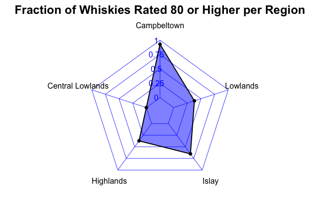
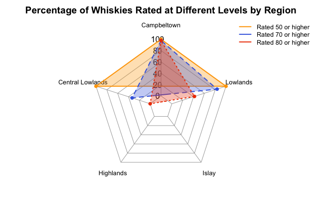

## Level 1

```{r setup, include=FALSE}
# Load required libraries
library(tidyverse)
library(fmsb)

# Load and clean the whisky data
whisky_data <- read.csv2("Projects/felix-gogollok/whisky-statistics/Whisky.csv", sep = ";", stringsAsFactors = FALSE) %>%
  rename_with(~ gsub("\\.+$", "", .), everything()) %>%  # Remove trailing dots from column names
  filter(!is.na(Region) & Region != "")  # Remove rows with NA or empty Region

# Convert 'Punkte' to numeric
whisky_data$Punkte <- as.numeric(whisky_data$Punkte)

# Calculate the fraction of whiskies rated 80 or higher by region
region_fractions <- whisky_data %>%
  mutate(High_Rating = Punkte > 80) %>%  # Add flag for high ratings
  group_by(Region) %>%
  summarise(Fraction = mean(High_Rating, na.rm = TRUE), .groups = "drop")  # Calculate fraction per region

# Prepare data for the spider web chart
max_fraction <- 1  # Maximum value for normalization
min_fraction <- 0  # Minimum value for normalization

# Transform data for radarchart
chart_data <- region_fractions %>%
  pivot_wider(names_from = Region, values_from = Fraction)

# Add Max and Min rows as a dataframe
chart_data <- rbind(
  Max = rep(max_fraction, ncol(chart_data)),
  Min = rep(min_fraction, ncol(chart_data)),
  chart_data
) %>%
  as.data.frame()  # Convert to data.frame

# Generate the spider web chart
par(mar = c(0, 0, 2, 0))  # Set margins
radarchart(
  chart_data,
  axistype = 1,                # Set axis type
  pcol = "black",              # Line color
  pfcol = adjustcolor("blue", alpha.f = 0.5),  # Transparent fill color
  plwd = 2,                    # Line width
  cglcol = "blue",             # Grid line color
  cglty = 1,                   # Grid line type (solid)
  cglwd = 0.8,                 # Grid line width
  axislabcol = "blue",         # Axis label color
  caxislabels = seq(0, 1, 0.25),  # Axis labels
  vlcex = 1.0                  # Vertex label size
)

# Add a title
title("Fraction of Whiskies Rated 80 or Higher per Region", cex.main = 1.5)
```



## Level 2

```{r setup, include=FALSE}
# Load required libraries
library(tidyverse)
library(fmsb)

# Load and clean the whisky data
whisky_data <- read.csv2("Projects/felix-gogollok/whisky-statistics/Whisky.csv", sep = ";", stringsAsFactors = FALSE) %>%
  rename_with(~ gsub("\\.+$", "", .), everything()) %>%
  filter(!is.na(Region) & Region != "")

# Convert 'Punkte' to numeric
whisky_data$Punkte <- as.numeric(whisky_data$Punkte)

# Compute percentage for thresholds 50, 70, and 80
threshold_data <- whisky_data %>%
  group_by(Region) %>%
  summarize(
    rated_50_more = (sum(Punkte >= 50) / n()) * 100,
    rated_70_more = (sum(Punkte >= 70) / n()) * 100,
    rated_80_more = (sum(Punkte >= 80) / n()) * 100,
    .groups = "drop"
  )

# Format data for fmsb
radar_threshold_data <- as.data.frame(t(select(threshold_data, -Region)))
colnames(radar_threshold_data) <- threshold_data$Region

# Add max and min rows
radar_threshold_data <- rbind(
  rep(100, ncol(radar_threshold_data)),  # Maximum values
  rep(0, ncol(radar_threshold_data)),   # Minimum values
  radar_threshold_data
)

# Define colors for the thresholds
colors <- c("#FFA500", "#4169E1", "#EE4000")  # Orange, Blue, Red
fill_colors <- c(
  rgb(255, 165, 0, max = 255, alpha = 80),  # Light orange
  rgb(65, 105, 225, max = 255, alpha = 80), # Light blue
  rgb(238, 64, 0, max = 255, alpha = 80)    # Light red
)

# Create the spider chart with multiple thresholds
par(mar = c(1, 1, 2, 1))  # Adjust margins
radarchart(
  radar_threshold_data,
  axistype = 1,
  caxislabels = seq(0, 100, 20),  # Axis labels for percentages
  pcol = colors,
  pfcol = fill_colors,
  plwd = 2,
  cglcol = "darkgrey",
  cglwd = 1,
  cglty = 1,
  axislabcol = "black",
  seg = 5,
  vlcex = 0.8
)

# Add a legend
legend("topright",
       legend = c("Rated 50 or higher", "Rated 70 or higher", "Rated 80 or higher"),
       col = colors,
       lwd = 2,
       bty = "n",
       cex = 0.8)

# Add a title
title("Percentage of Whiskies Rated at Different Levels by Region", cex.main = 1.2)
```


