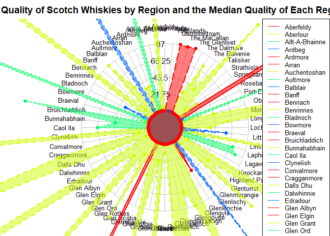

    knitr::opts_chunk$set(echo = TRUE)
    # Load necessary libraries
    library(tidyverse)

    ## ── Attaching core tidyverse packages ──────────────────────── tidyverse 2.0.0 ──
    ## ✔ dplyr     1.1.4     ✔ readr     2.1.5
    ## ✔ forcats   1.0.0     ✔ stringr   1.5.1
    ## ✔ ggplot2   3.5.1     ✔ tibble    3.2.1
    ## ✔ lubridate 1.9.3     ✔ tidyr     1.3.1
    ## ✔ purrr     1.0.2     
    ## ── Conflicts ────────────────────────────────────────── tidyverse_conflicts() ──
    ## ✖ dplyr::filter() masks stats::filter()
    ## ✖ dplyr::lag()    masks stats::lag()
    ## ℹ Use the conflicted package (<http://conflicted.r-lib.org/>) to force all conflicts to become errors

    library(fmsb)

    # Load data from the GitHub CSV link
    url <- "https://raw.githubusercontent.com/Dr-Eberle-Zentrum/Data-projects-with-R-and-GitHub/main/Projects/felix-gogollok/whisky-statistics/Whisky.csv"
    whisky_data <- read.csv(url, sep = ";", stringsAsFactors = FALSE)

    # Clean column names (remove extra dots)
    colnames(whisky_data) <- gsub("\\.+", "", colnames(whisky_data))  # Remove redundant dots

    # Filter whiskies with a score greater than 80
    high_rated_whiskies <- whisky_data %>%
      filter(Punkte > 80)

    # Count whiskies with high ratings (grouped by distillery and region)
    region_counts <- high_rated_whiskies %>%
      group_by(Region, Destillerie) %>%
      summarise(Count = n()) %>%
      spread(key = Destillerie, value = Count, fill = 0)

    ## `summarise()` has grouped output by 'Region'. You can override using the
    ## `.groups` argument.

    # Calculate median scores for each region
    median_data <- high_rated_whiskies %>%
      group_by(Region) %>%
      summarise(Median_Score = median(Punkte))

    # Add the median scores as a row
    median_row <- median_data %>%
      spread(key = Region, value = Median_Score) %>%
      mutate(Distillery = "Median")

    # Combine data
    region_distillery_count <- region_counts %>%
      ungroup() %>%
      select(-Region) %>%
      bind_rows(median_row)

    # Replace NAs with 0 for numeric columns
    region_distillery_count <- region_distillery_count %>%
      mutate(across(where(is.numeric), ~replace_na(., 0)))

    # Add max and min rows for spider chart normalization
    max_row <- sapply(region_distillery_count[-1], max, na.rm = TRUE)  # Exclude character column
    min_row <- rep(0, ncol(region_distillery_count) - 1)
    region_distillery_count <- rbind(max_row, min_row, region_distillery_count)

    ## Warning in rbind(deparse.level, ...): number of columns of result, 69, is not a
    ## multiple of vector length 68 of arg 1

    ## Warning in rbind(deparse.level, ...): number of columns of result, 69, is not a
    ## multiple of vector length 68 of arg 2

    # Convert to numeric (exclude character column)
    radar_data <- region_distillery_count %>%
      select(-Distillery) %>%  # Exclude character column
      mutate(across(everything(), as.numeric))  # Ensure numeric columns

    ## Warning: There was 1 warning in `mutate()`.
    ## ℹ In argument: `across(everything(), as.numeric)`.
    ## Caused by warning:
    ## ! NAs durch Umwandlung erzeugt

    # Generate the spider chart
    colors <- rainbow(nrow(radar_data) - 2)
    colors[length(colors)] <- "red"  # Median line in red

    par(mar = c(0, 0, 2, 0))  # Set chart margins
    radarchart(
      radar_data,
      axistype = 1,
      pcol = colors,
      pfcol = adjustcolor(colors, alpha.f = 0.5),
      plwd = 2,
      cglcol = "grey",
      cglty = 1,
      axislabcol = "black",
      caxislabels = seq(0, max(radar_data, na.rm = TRUE), length.out = 5),
      vlcex = 0.8
    )

    # Add title and legend
    title("The Quality of Scotch Whiskies by Region and the Median Quality of Each Region", cex.main = 1.2)
    legend("topright", legend = colnames(radar_data), col = colors, lty = 1, cex = 0.8)

