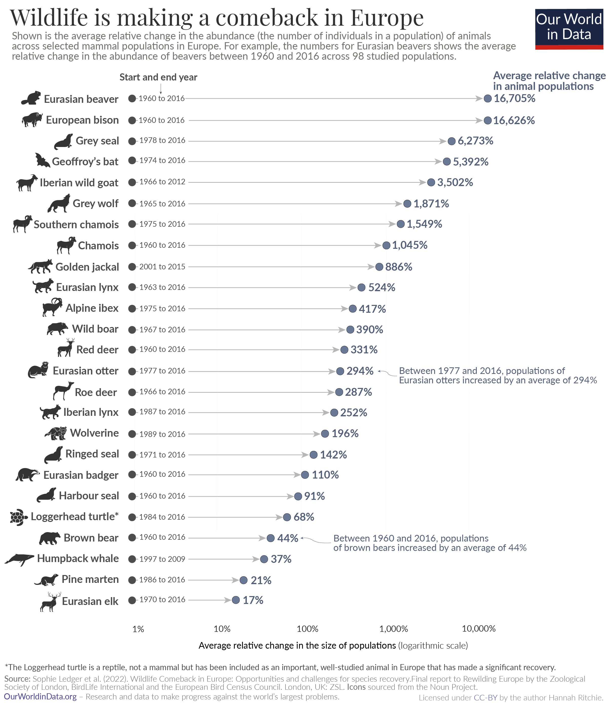

# Reproduce this super nice chart!

It is often that you find a chart that you really like but have no idea
how to do. An example might be the following one (click the image to
enlarge).

Which is shown and detailed on
[https://ourworldindata.org](https://ourworldindata.org/europe-mammal-comeback).

## Goal of the project

The idea of this project is to recreate this plot as close as possible
using `ggplot` and the data available in the provided [CSV
file](https://ourworldindata.org/uploads/2022/09/Mammal-comeback-in-Europe-data-OWID-download.csv)
with the following content (first lines):

<table>
<colgroup>
<col style="width: 16%" />
<col style="width: 13%" />
<col style="width: 27%" />
<col style="width: 8%" />
<col style="width: 6%" />
<col style="width: 27%" />
</colgroup>
<thead>
<tr>
<th style="text-align: left;">Common name of species</th>
<th style="text-align: left;">Species name</th>
<th style="text-align: right;">Number of mammal populations
included</th>
<th style="text-align: right;">Start year</th>
<th style="text-align: right;">End year</th>
<th style="text-align: left;">Average relative change in abundance</th>
</tr>
</thead>
<tbody>
<tr>
<td style="text-align: left;">Eurasian beaver</td>
<td style="text-align: left;">Castor fiber</td>
<td style="text-align: right;">98</td>
<td style="text-align: right;">1960</td>
<td style="text-align: right;">2016</td>
<td style="text-align: left;">16705%</td>
</tr>
<tr>
<td style="text-align: left;">European bison</td>
<td style="text-align: left;">Bison bonasus</td>
<td style="text-align: right;">20</td>
<td style="text-align: right;">1960</td>
<td style="text-align: right;">2016</td>
<td style="text-align: left;">16626%</td>
</tr>
<tr>
<td style="text-align: left;">Grey seal</td>
<td style="text-align: left;">Halichoerus grypus</td>
<td style="text-align: right;">18</td>
<td style="text-align: right;">1978</td>
<td style="text-align: right;">2016</td>
<td style="text-align: left;">6273%</td>
</tr>
<tr>
<td style="text-align: left;">Geoffroy’s bat</td>
<td style="text-align: left;">Myotis emarginatus</td>
<td style="text-align: right;">12</td>
<td style="text-align: right;">1974</td>
<td style="text-align: right;">2016</td>
<td style="text-align: left;">5392%</td>
</tr>
<tr>
<td style="text-align: left;">Iberian wild goat</td>
<td style="text-align: left;">Capra pyrenaica</td>
<td style="text-align: right;">9</td>
<td style="text-align: right;">1966</td>
<td style="text-align: right;">2012</td>
<td style="text-align: left;">3502%</td>
</tr>
</tbody>
</table>

### Visualization priorities (from high to low)

-   line style with animal name labels
-   percent labels at line ends
-   time range label at line start
-   x-axis marks
-   arrow line style
-   annotation of brown bear
-   text coloring
-   relative font sizes
-   animal symbol for brown bear
    

Let’s see how close you can get! As a starting point, you might want to
have a look at [The R Graph Gallery](https://r-graph-gallery.com/).

Looking forward to see your solutions!

Best, Martin
