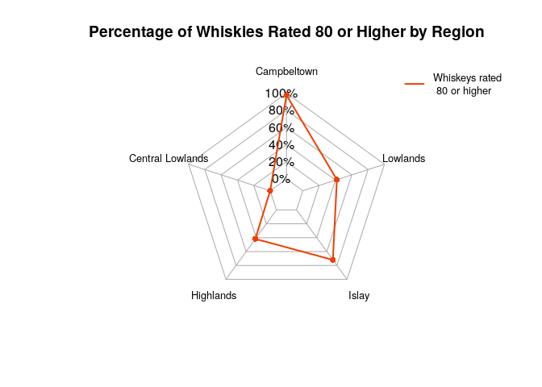
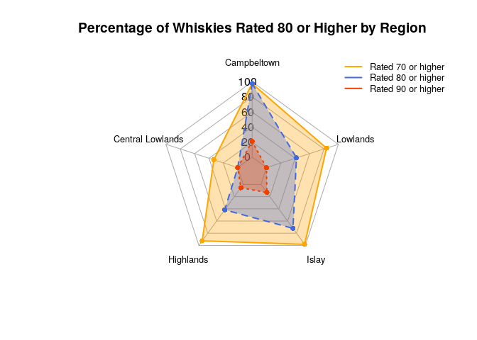

The task involves creating a spider web chart with two levels:

-   Level 1: Display the fraction of whiskies rated 80 or higher for
    each region.

-   Level 2: Add multiple lines to the spider web chart to represent
    different rating thresholds (50, 70, and 80 or higher).

## Clean the data set

As an initial data set I cleaned the data set to make it easier to read
/ work with. Therefore I renamed the columns by removing trailing
(e.g. Region. to Region)

    # look at data
    colnames(data)

    ##  [1] "Destillerie." "Region."      "Distrikt."    "Hersteller."  "Version."    
    ##  [6] "Punkte."      "Buch.vom."    "Adresse."     "Telefon"      "Website"     
    ## [11] "E.Mail"

    #View(data)

    #remove trailing
    data <- data %>%
      rename_with(~ gsub("\\.$", "", .))

    # remove unnecessary columns 
    # to create the spider chart 'Destillerie', 'Region' and 'Punkte' are relevant
    # remaining columns are not needed for visualization 
    data <- data  %>% select(Destillerie, Region, Punkte)

# Prepare the data for the spider plot

## Prepare the data for level 1 plotting

I computed the percentage of whiskies rated 80 or higher for each region
for level 1 plotting.

    # compute percentage of ratings >= 80

    level01_data <- data %>%
      group_by(Region) %>%
      summarize(
        percantage_high_ratings = (sum(Punkte >= 80) / n()) * 100
      )

    # format data to make it compatible with fmsb
    radar_level01 <- as.data.frame(t(level01_data$percantage_high_ratings)) # t() to transpose data 
    colnames(radar_level01) <- level01_data$Region

    # add max and min to df
    radar_level01 <- rbind(rep(100, ncol(radar_level01)), 
                           rep(0,   ncol(radar_level01)),
                           radar_level01)

## Create spider chart for ratings &gt;= 80

## Prepare the data for level 2 plotting with multiple thresholds

For level 2 plotting I computed the percentage of whiskies rated at or
above three thresholds of 70, 80 and 90

    # compute percentage for thresholds 60, 70 and 90

    level02_data <- data %>%
      group_by(Region) %>%
      summarize(
        rated_70_more = (sum(Punkte >= 70) / n()) * 100,
        rated_80_more = (sum(Punkte >= 80) / n()) * 100,
        rated_90_more = (sum(Punkte >= 90) / n()) * 100,
      )

    # format data to make it compatible with fmsb
    radar_level02 <- as.data.frame(t(select(level02_data, -Region))) 
    colnames(radar_level02) <- level02_data$Region

    # add max and min to df
    radar_level02 <- rbind(rep(100, ncol(radar_level02)), 
                           rep(0,   ncol(radar_level02)),
                           radar_level02)

## Create the spider chart with multiple thresholds

    # define colours for each of the three thresholds
    colours <- c("#FFA500", "#4169E1", "#EE4000")
    #colours to fill
    fill_colours <- c(
      rgb(255, 165, 0, max = 255, alpha = 80),  # Light orange
      rgb(65, 105, 225, max = 255, alpha = 80), # Light blue
      rgb(238, 64, 0, max = 255, alpha = 80)    # Light red
    )

    radarchart(
      radar_level02,
      axistype = 1,
      #caxislabels = c("0%", "20%", "40%", "60%", "80%", "100%"),
      caxislabels = seq(0, 100, 20),  # adjust axis labels for because of percentages
      title = "Percentage of Whiskies Rated 80 or Higher by Region",
      pcol = colours,
      pfcol = fill_colours,
      plwd = 2,
      cglcol = "darkgrey",
      cglwd = 1,
      cglty = 1,
      axislabcol = "black",
      maxmin = T,
      seg = 5,
      vlcex = 0.8,
      xlim = c(-1, 1),  
      ylim = c(-1, 1.2)
    )

    legend("topright", 
           legend = c("Rated 70 or higher", "Rated 80 or higher", "Rated 90 or higher"), 
           col = colours, 
           lwd = 2, 
           bty = "n",
           cex = 0.8)

