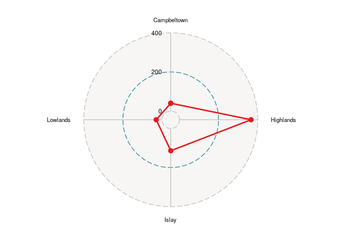
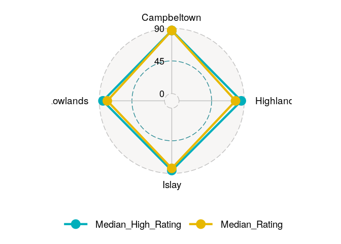

    # clean environment
    rm(list = ls())
    cat("\014")



    # load packages 
    library(tidyverse)

    ## ── Attaching core tidyverse packages ──────────────────────── tidyverse 2.0.0 ──
    ## ✔ dplyr     1.1.4     ✔ readr     2.1.5
    ## ✔ forcats   1.0.0     ✔ stringr   1.5.1
    ## ✔ ggplot2   3.5.1     ✔ tibble    3.2.1
    ## ✔ lubridate 1.9.3     ✔ tidyr     1.3.1
    ## ✔ purrr     1.0.2     
    ## ── Conflicts ────────────────────────────────────────── tidyverse_conflicts() ──
    ## ✖ dplyr::filter() masks stats::filter()
    ## ✖ dplyr::lag()    masks stats::lag()
    ## ℹ Use the conflicted package (<http://conflicted.r-lib.org/>) to force all conflicts to become errors

    #install.packages("devtools")
    library(devtools)

    ## Loading required package: usethis

    #devtools::install_github("ricardo-bion/ggradar", dependencies = TRUE)
    library(ggradar)
    #install.packages("scales")
    library(scales)

    ## 
    ## Attaching package: 'scales'
    ## 
    ## The following object is masked from 'package:purrr':
    ## 
    ##     discard
    ## 
    ## The following object is masked from 'package:readr':
    ## 
    ##     col_factor

    # read file 
    data <- read.csv2("~/Data-projects-with-R-and-GitHub/Projects/felix-gogollok/whisky-statistics/Whisky.csv") #use csv2() cause data is semicolon separated  

Before starting to work on the project I will get a overview of the data
I will work with

    # look at data
    #View(data)

    # structure of the data
    str(data)

    ## 'data.frame':    1307 obs. of  11 variables:
    ##  $ Destillerie.: chr  "Aberfeldy" "Aberfeldy" "Aberfeldy" "Aberfeldy" ...
    ##  $ Region.     : chr  "Highlands" "Highlands" "Highlands" "Highlands" ...
    ##  $ Distrikt.   : chr  "Midlands" "Midlands" "Midlands" "Midlands" ...
    ##  $ Hersteller. : chr  "United Distillers" "United Distillers" "Dewar`s (Baccardi)" "Dewar`s (Baccardi)" ...
    ##  $ Version.    : chr  "Aberfeldy 15 year old 43% (Flora und Fauna)" "Gordon MacPhail Connoisseurs Choice 1975" "Aberfeldy 14-year-old 59,5% Adelphi" "Aberfeldy 1980 62% Fassstärke" ...
    ##  $ Punkte.     : int  77 76 77 77 75 76 77 73 90 83 ...
    ##  $ Buch.vom.   : chr  "M.J. 1994" "M.J. 1994" "M. J. 1999" "M. J. 1999" ...
    ##  $ Adresse.    : chr  "Aberfeldy, Perthshire, PH15 2EB" "Aberfeldy, Perthshire, PH15 2EB" "Aberfeldy, Perthshire, PH15 2EB" "Aberfeldy, Perthshire, PH15 2EB" ...
    ##  $ Telefon     : chr  "0044/18 87-82 03 30" "0044/18 87-82 03 30" "0044/18 87-82 03 30" "0044/18 87-82 03 30" ...
    ##  $ Website     : chr  "" "" "" "" ...
    ##  $ E.Mail      : chr  "" "" "" "" ...

    #' 1307 objects (rows) and 11 variables (columns)
    #' all variables except for "Punkte" are character, $Punkte is of type integer 

Prepare data for spider plot

    # check summary stats 
    summary(data)

    ##  Destillerie.         Region.           Distrikt.         Hersteller.       
    ##  Length:1307        Length:1307        Length:1307        Length:1307       
    ##  Class :character   Class :character   Class :character   Class :character  
    ##  Mode  :character   Mode  :character   Mode  :character   Mode  :character  
    ##                                                                             
    ##                                                                             
    ##                                                                             
    ##                                                                             
    ##    Version.            Punkte.       Buch.vom.           Adresse.        
    ##  Length:1307        Min.   :55.00   Length:1307        Length:1307       
    ##  Class :character   1st Qu.:76.00   Class :character   Class :character  
    ##  Mode  :character   Median :79.00   Mode  :character   Mode  :character  
    ##                     Mean   :79.69                                        
    ##                     3rd Qu.:85.00                                        
    ##                     Max.   :96.00                                        
    ##                     NA's   :20                                           
    ##    Telefon            Website             E.Mail         
    ##  Length:1307        Length:1307        Length:1307       
    ##  Class :character   Class :character   Class :character  
    ##  Mode  :character   Mode  :character   Mode  :character  
    ##                                                          
    ##                                                          
    ##                                                          
    ## 

    #' the column 'Punkte.' (ratings) is the only column with NA's 
    #' summary stats for ratings (Punkte)
    #' min = 55.00 , max = 96.00 -> range of 44
    #' median = 79.00
    #' mean = 79.00
    #' total of 20 NAs

    # remove NA's from ratings column
    data <- data %>% filter(!is.na(Punkte.))
    summary(data$Punkte.) # check if NA's are removed

    ##    Min. 1st Qu.  Median    Mean 3rd Qu.    Max. 
    ##   55.00   76.00   79.00   79.69   85.00   96.00

    # look at relevant columns 

    # check how many distinct regions 
    length(unique(data$Region.)) # there are 5 distinct regions 

    ## [1] 5

    unique(data$Region.) # get names of the regions 

    ## [1] "Highlands"        "Islay"            "Lowlands"         "Central Lowlands"
    ## [5] "Campbeltown"

    # check number of distinct distilleries
    length(unique(data$Destillerie.))  # 121 distilleries

    ## [1] 121

    unique(data$Destillerie.)

    ##   [1] "Aberfeldy"          "Aberlour"           "Abhainn Dearg"     
    ##   [4] "Allt-A-Bhainne"     "Ardbeg"             "Ardmore"           
    ##   [7] "Arran"              "Auchentoshan"       "Auchroisk"         
    ##  [10] "Aultmore"           "Balblair"           "Balmenach"         
    ##  [13] "The Balvenie"       "Banff"              "Ben Nevis"         
    ##  [16] "Benriach"           "Benrinnes"          "Benromach"         
    ##  [19] "Bladnoch"           "Blair Athol"        "Bowmore"           
    ##  [22] "Brackla"            "Braes of Glenlivet" "Braeval"           
    ##  [25] "Bruichladdich"      "Bunnahabhain"       "Caol Ila"          
    ##  [28] "Caperdonich"        "Cardhu"             "Clynelish"         
    ##  [31] "An Cnoc"            "Coleburn"           "Convalmore"        
    ##  [34] "Cragganmore"        "Craigellachie"      "Dailuaine"         
    ##  [37] "Dalls Dhu"          "The Dalmore"        "Dalwhinnie"        
    ##  [40] "Deanston"           "Drumguish"          "Dufftown"          
    ##  [43] "Edradour"           "Fettercairn"        "Glen Albyn"        
    ##  [46] "Glenallachie"       "Glenburgie"         "Glencadam"         
    ##  [49] "Glen Deveron"       "Glendronach"        "Glendullan"        
    ##  [52] "Glen Elgin"         "Glenesk"            "Glenfarclas"       
    ##  [55] "Glenfiddich"        "Glen Flagler"       "Glengarioch"       
    ##  [58] "Glenglassaugh"      "Glengoyne"          "Glen Grant"        
    ##  [61] "Glengyle"           "Glen Keith"         "Glenkinchie"       
    ##  [64] "The Glenlivet"      "Glenlochy"          "Glenlossie"        
    ##  [67] "Glen Mhor"          "Glenmorangie"       "Glenmoray"         
    ##  [70] "Glen Ord"           "Glen Rothes"        "Glen Scotia"       
    ##  [73] "Glen Spey"          "Glentauchers"       "Glenturret"        
    ##  [76] "Glenugie"           "Glenury Royal"      "Highland Park"     
    ##  [79] "Imperial"           "Inchgower"          "Inchmurrin"        
    ##  [82] "Inverleven"         "Jura"               "Kinclaith"         
    ##  [85] "Knockando"          "Ladyburn"           "Lagavulin"         
    ##  [88] "Laphroaig"          "Linkwood"           "Littlemill"        
    ##  [91] "Loch Lomond"        "Lochnagar"          "Lochside"          
    ##  [94] "Longmorn"           "The MaCallan"       "Mannochmore"       
    ##  [97] "Millburn"           "Miltonduff"         "Mortlach"          
    ## [100] "North Port"         "Oban"               "Pittyvaich"        
    ## [103] "Port Ellen"         "Old Pulteney"       "Rosebank"          
    ## [106] "St Magdalene"       "Scapa"              "The Singleton"     
    ## [109] "Speyburn"           "Springbank"         "Strathisla"        
    ## [112] "Strathmill"         "Talisker"           "Tamdhu"            
    ## [115] "Tamnavulin"         "Teaninich"          "Tobermory"         
    ## [118] "Tomatin"            "Tomintoul"          "Tormore"           
    ## [121] "Tullibardine"

    # compute median rating per region and distillery for later plotting
    median_rating_region <- data %>%
                            group_by(Region.) %>%
                            summarise(median_rating = median(Punkte.))

    # filter high ratings ( > 80)
    dat_high_ratings <- data %>% filter(Punkte. > 80)

    # compute median of high ratings per region 
    median_high_ratings_region <- aggregate(Punkte. ~ Region., data = dat_high_ratings, FUN = median)

    # count number of high ratings per region
    high_ratings_region  <- dat_high_ratings %>%
                            group_by(Region.) %>%
                            summarise(number_top_ratings = n())

    radar_data <- high_ratings_region %>%
      pivot_wider(names_from = Region., values_from = number_top_ratings) %>%
      mutate(Category = "Ratings") %>% 
      relocate(Category)

    ggradar(radar_data,
            values.radar = c("0", "200", "400"),
            grid.min = 0, grid.mid = 200, grid.max = 400,
            grid.label.size = 4, 
            axis.label.size = 3, 
            group.line.width = 1, 
            group.point.size = 3)

    # create spider graph
    # combine df
    data_plot <- merge(median_rating_region, median_high_ratings_region, by = "Region.", all = F)
    colnames(data_plot) <- c("Region", "Median_Rating", "Median_High_Rating")

    # convert to long
    data_plot_long <- data_plot %>%
      gather(key = "Type", value = "Value", -Region)

    # data to wide format for ggradar
    data_plot_wide <- data_plot_long %>%
      spread(key = "Region", value = "Value")

    ggradar(data_plot_wide, 
            values.radar = c("0", "45", "90"),
            grid.min = 0, grid.mid = 45, grid.max = 90,
            group.colours = c("#00AFBB", "#E7B800"),
            legend.position = "bottom")

    median_rating_dist <- data %>%
                            group_by(Destillerie.) %>%
                            summarise(median_rating = median(Punkte.))

    median_rating_region_destillery <- data %>%
                            group_by(Destillerie., Region.) %>%
                            summarise(median_rating = median(Punkte.), .groups = 'drop')

    high_median_ratings <- median_rating_region_destillery %>% filter(median_rating > 80)

    summary(high_median_ratings$median_rating)

    ##    Min. 1st Qu.  Median    Mean 3rd Qu.    Max. 
    ##   80.50   82.00   85.50   85.11   87.75   92.00

    # count number of high ratings per distillery
    high_ratings_destillery <- dat_high_ratings %>%
                               group_by(Destillerie.) %>%
                               summarise(number_top_ratings = n())
