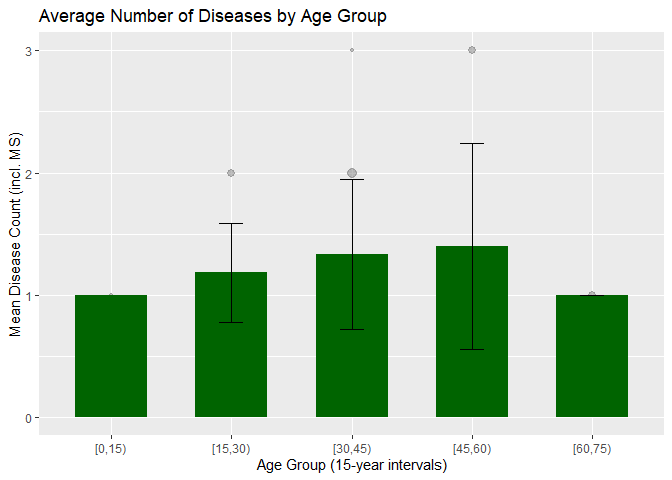

    library(tidyverse) 

    ## ── Attaching core tidyverse packages ──────────────────────── tidyverse 2.0.0 ──
    ## ✔ dplyr     1.1.4     ✔ readr     2.1.5
    ## ✔ forcats   1.0.0     ✔ stringr   1.5.1
    ## ✔ ggplot2   3.5.1     ✔ tibble    3.2.1
    ## ✔ lubridate 1.9.3     ✔ tidyr     1.3.1
    ## ✔ purrr     1.0.2     
    ## ── Conflicts ────────────────────────────────────────── tidyverse_conflicts() ──
    ## ✖ dplyr::filter() masks stats::filter()
    ## ✖ dplyr::lag()    masks stats::lag()
    ## ℹ Use the conflicted package (<http://conflicted.r-lib.org/>) to force all conflicts to become errors

    library(ggplot2) 
    library(readr) 
    library(dplyr) 
    library(tidyr)

    # read csv
    if (interactive()) {
      setwd(dirname(rstudioapi::getSourceEditorContext()$path))
    } else if (!is.null(knitr::current_input())) {
      setwd(dirname(knitr::current_input()))
    }
    ms <- read_csv2("data_MS.csv", show_col_types = FALSE)

    ## ℹ Using "','" as decimal and "'.'" as grouping mark. Use `read_delim()` for more control.

## Data manipulation

    ms_cleaned <- ms %>%
      # (1) MS duration in months, created a new column but didn't delete the old one
      mutate(
        MSDuration_months = case_when(
          grepl("Years", `MS Duration`) ~ as.integer(gsub("Years", "", `MS Duration`)) * 12,
          grepl("Year", `MS Duration`) ~ as.integer(gsub("Year", "", `MS Duration`)) * 12,
          grepl("Month?", `MS Duration`) ~ as.integer(gsub("Months", "", `MS Duration`)),
          TRUE ~ NA_integer_
        ),
        
      # (2) new column related to diseases
        Other_Diseases_Count = ifelse(
          `Other Diseases` == "-" | is.na(`Other Diseases`) | trimws(`Other Diseases`) == "",
          0,
          sapply(`Other Diseases`, function(x) {
            n_commas <- lengths(regmatches(x, gregexpr(",", x)))
            n_commas + 1
          })
        ),
        
        # (3) new columns (treated with Corticosteroid)
        Corticosteroid = ifelse(str_detect(Medication, regex("corticosteroid", ignore_case = TRUE)), "Yes", "No"),
        
        # (4) new columns (treated with B-cell depleting therapy
        BCellDepletion = ifelse(str_detect(Medication, regex("rituximab", ignore_case = TRUE)), "Yes", "No"),
        
        # (5) use coded names according to the schema instead of clear names and delete column names
        PatientCode = sprintf("MS_XS_%03d", as.integer(as.character(`No.`)))
      ) %>%
      select(-`Patient Name`)

    ## Warning: There were 3 warnings in `mutate()`.
    ## The first warning was:
    ## ℹ In argument: `MSDuration_months = case_when(...)`.
    ## Caused by warning:
    ## ! NAs durch Umwandlung erzeugt
    ## ℹ Run `dplyr::last_dplyr_warnings()` to see the 2 remaining warnings.

    print(ms_cleaned)

    ## # A tibble: 39 × 18
    ##      No.   Age Sex    `Abslang Test` Smoking Alcohol `Other Diseases` Medication
    ##    <dbl> <dbl> <chr>           <dbl>   <dbl>   <dbl> <chr>            <chr>     
    ##  1     1    24 Female              0       0       0 -                0         
    ##  2     2    40 Female              0       0       0 Heart palpitati… Chlordiaz…
    ##  3     3    46 Female              0       0       0 Tachycardia, mi… Corticost…
    ##  4     4    37 Female              0       0       0 -                Avonex, R…
    ##  5     7    21 Female              0       0       0 Polycystic ovar… Rituximab…
    ##  6     9    28 Female              0       0       0 Gastrointestina… Midazolam…
    ##  7    10    39 Female              0       0       0 Hypothyroidism   Texifoma,…
    ##  8    12    40 Male                0       0       0 -                Fampridine
    ##  9    13    56 Male                0       0       0 -                Corticost…
    ## 10    17    21 Female              0       0       0 -                Corticost…
    ## # ℹ 29 more rows
    ## # ℹ 10 more variables: `MS Duration` <chr>, `NO test result` <dbl>,
    ## #   `Cortisol Test Result` <dbl>, `BAI Score` <dbl>,
    ## #   `Severity of BAI test` <chr>, MSDuration_months <dbl>,
    ## #   Other_Diseases_Count <dbl>, Corticosteroid <chr>, BCellDepletion <chr>,
    ## #   PatientCode <chr>

## Visualization

# Graph 1: Scatterplot

    ggplot(ms_cleaned, aes(x = `Cortisol Test Result`, y = `BAI Score`, color = Sex, shape = Corticosteroid)) +
      geom_point(size = 3) +
      geom_smooth(method = "lm", se = FALSE,
                  aes(color = Sex, linetype = Corticosteroid, group = interaction(Sex, Corticosteroid))) +
      labs(title = "BAI Score vs Cortisol Level",
           x = "Cortisol (ng/mL)",
           y = "BAI Score")

    ## `geom_smooth()` using formula = 'y ~ x'

The plot displays the relationship between BAI Score and Cortisol Test
Result, with data points differentiated by shape.

# correlation value for four groups f+, f-, m+, m-

    cor_groups <- ms_cleaned %>%
      group_by(Sex, Corticosteroid) %>%
      summarise(Correlation = cor(`Cortisol Test Result`, `BAI Score`, use = "complete.obs"),
                .groups = "drop")
    print(cor_groups)

<table>
<thead>
<tr class="header">
<th>Sex</th>
<th>Corticosteroid</th>
<th>Correlation</th>
</tr>
</thead>
<tbody>
<tr class="odd">
<td>Female</td>
<td>No</td>
<td>-0.5616</td>
</tr>
<tr class="even">
<td>Female</td>
<td>Yes</td>
<td>-0.0314</td>
</tr>
<tr class="odd">
<td>Male</td>
<td>No</td>
<td>-0.2817</td>
</tr>
<tr class="even">
<td>Male</td>
<td>Yes</td>
<td>-0.1952</td>
</tr>
</tbody>
</table>

# Graph 2: chart showing average NO test value

    # Group MS duration into 6-month intervals
    ms_cleaned$MSDurationGroup <- cut(ms_cleaned$MSDuration_months, 
                              breaks = seq(0, max(ms_cleaned$MSDuration_months, na.rm = TRUE) + 6, by = 6), 
                              right = FALSE)

    # Calculate mean and standard deviation of NO test values for each MS duration group
    ms_cleaned %>%
      group_by(MSDurationGroup) %>%
      summarise(mean_NO = mean(`NO test result`, na.rm = TRUE),
                sd_NO = sd(`NO test result`, na.rm = TRUE)) %>%
      ggplot(aes(x = MSDurationGroup, y = mean_NO)) +
      geom_point(size = 3, color = "darkblue") +
      geom_errorbar(aes(ymin = mean_NO - sd_NO, ymax = mean_NO + sd_NO), width = 0.2) +
      labs(title = "NO Test Results by MS Duration (6-Month Groups)",
           x = "MS Duration Group",
           y = "Average NO Test Value") 

The graph shows the average NO test values as points and the standard
deviation as an error bar for each group.

# Graph 3: bar chart showing the median number of diseases for each of these age groups

    ms_adjusted <- ms_cleaned %>%
      mutate(
        Total_Diseases = Other_Diseases_Count + 1,
        Age_Group = cut(Age, breaks = seq(0, 100, by = 15), right = FALSE)
      ) %>%
      drop_na(Age_Group)

    ms_summary <- ms_adjusted %>%
      group_by(Age_Group) %>%
      summarise(
        MeanDiseases = mean(Total_Diseases, na.rm = TRUE),
        SDDiseases = sd(Total_Diseases, na.rm = TRUE),
        .groups = "drop"
      )

    #graph
    ggplot() +
      geom_count(
        data = ms_adjusted,
        aes(x = Age_Group, y = Total_Diseases),
        color = "gray50",
        alpha = 0.5
      ) +
      geom_bar(
        data = ms_summary,
        aes(x = Age_Group, y = MeanDiseases),
        stat = "identity", fill = "darkgreen", width = 0.6
      ) +
      geom_errorbar(
        data = ms_summary,
        aes(x = Age_Group,
            ymin = MeanDiseases - SDDiseases,
            ymax = MeanDiseases + SDDiseases),
        width = 0.2, color = "black"
      ) +
      labs(
        title = "Average Number of Diseases by Age Group",
        x = "Age Group (15-year intervals)",
        y = "Mean Disease Count (incl. MS)"
      ) +
      guides(size = "none")

The bar chart displays the average number of diseases, including MS,
across different age groups divided into 15-year intervals.
