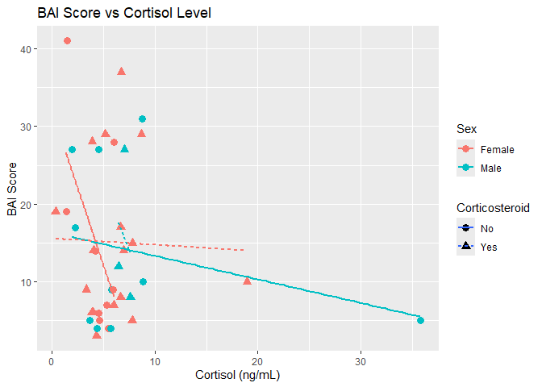
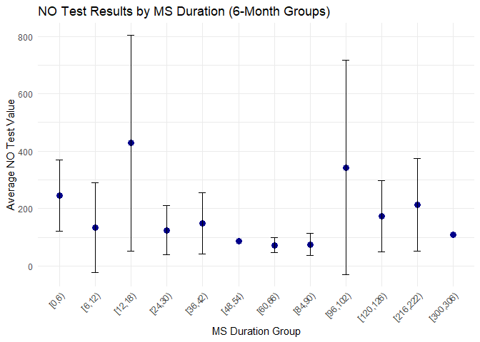
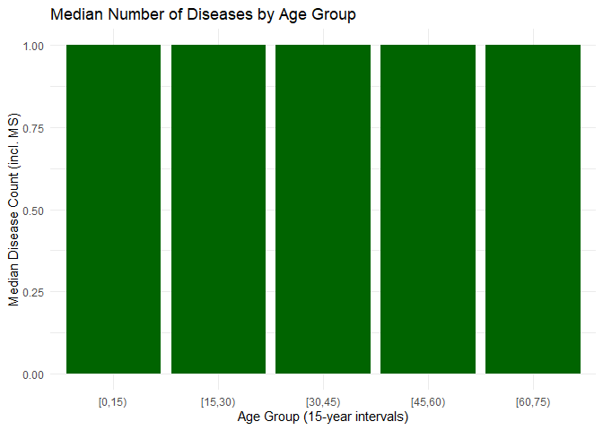

    library(tidyverse) 

    ## ── Attaching core tidyverse packages ──────────────────────── tidyverse 2.0.0 ──
    ## ✔ dplyr     1.1.4     ✔ readr     2.1.5
    ## ✔ forcats   1.0.0     ✔ stringr   1.5.1
    ## ✔ ggplot2   3.5.1     ✔ tibble    3.2.1
    ## ✔ lubridate 1.9.3     ✔ tidyr     1.3.1
    ## ✔ purrr     1.0.2     
    ## ── Conflicts ────────────────────────────────────────── tidyverse_conflicts() ──
    ## ✖ dplyr::filter() masks stats::filter()
    ## ✖ dplyr::lag()    masks stats::lag()
    ## ℹ Use the conflicted package (<http://conflicted.r-lib.org/>) to force all conflicts to become errors

    library(ggplot2) 
    library(readr) 
    library(dplyr) 

    # read csv
    ms <- read_csv2("data_MS.csv", show_col_types = FALSE)

    ## ℹ Using "','" as decimal and "'.'" as grouping mark. Use `read_delim()` for more control.

\##Data manipulation

    # (1) MS duration in months (+++), created a new column but didn't delete the old one
    ms$MSDuration_months <- case_when(
      grepl("Years", ms$`MS Duration`) ~ as.integer(gsub("Years", "", ms$`MS Duration`)) * 12,
      grepl("Year", ms$`MS Duration`) ~ as.integer(gsub("Year", "", ms$`MS Duration`)) * 12,
      grepl("Months?", ms$`MS Duration`) ~ as.integer(gsub("Months", "", ms$`MS Duration`)),
      TRUE ~ NA_integer_
    )

    ## Warning in eval_tidy(pair$rhs, env = default_env): NAs durch Umwandlung erzeugt
    ## Warning in eval_tidy(pair$rhs, env = default_env): NAs durch Umwandlung erzeugt
    ## Warning in eval_tidy(pair$rhs, env = default_env): NAs durch Umwandlung erzeugt

    # (2) new column related to diseases 

    ms$Other_Diseases_Count <- ifelse(
      ms$`Other Diseases` == "-" | is.na(ms$`Other Diseases`) | trimws(ms$`Other Diseases`) == "",
      0,
      sapply(ms$`Other Diseases`, function(x) {
        # Anzahl Kommas zählen
        n_commas <- lengths(regmatches(x, gregexpr(",", x)))
        # Anzahl Krankheiten = Kommas + 1
        n_commas + 1
      })
    )

    # ms$`Other Diseases` <- as.character(ms$`Other Diseases`)

    # ms$Other_Diseases_Count <- ifelse(
     # ms$`Other Diseases` == "-" | is.na(ms$`Other Diseases`),
     # 0,
     # sapply(strsplit(ms$`Other Diseases`, ","), length)

    # (3) new columns (treated with Corticosteroid)
    ms$Corticosteroid <- ifelse(str_detect(ms$Medication, regex("corticosteroid", ignore_case = TRUE)), "Yes", "No")

    # (4) new columns (treated with B-cell depleting therapy (+)
    ms$BCellDepletion <- ifelse(str_detect(ms$Medication, regex("rituximab", ignore_case = TRUE)), "Yes", "No")

    # (5) use coded names according to the schema instead of clear names and delete column names
    ms <- ms %>% 
      mutate(
        PatientCode = sprintf("MS_XS_%03d", as.integer(as.character(`No.`)))
      ) %>% 
      select(-`Patient Name`)
    print(ms)

    ## # A tibble: 39 × 18
    ##      No.   Age Sex    `Abslang Test` Smoking Alcohol `Other Diseases` Medication
    ##    <dbl> <dbl> <chr>           <dbl>   <dbl>   <dbl> <chr>            <chr>     
    ##  1     1    24 Female              0       0       0 -                0         
    ##  2     2    40 Female              0       0       0 Heart palpitati… Chlordiaz…
    ##  3     3    46 Female              0       0       0 Tachycardia, mi… Corticost…
    ##  4     4    37 Female              0       0       0 -                Avonex, R…
    ##  5     7    21 Female              0       0       0 Polycystic ovar… Rituximab…
    ##  6     9    28 Female              0       0       0 Gastrointestina… Midazolam…
    ##  7    10    39 Female              0       0       0 Hypothyroidism   Texifoma,…
    ##  8    12    40 Male                0       0       0 -                Fampridine
    ##  9    13    56 Male                0       0       0 -                Corticost…
    ## 10    17    21 Female              0       0       0 -                Corticost…
    ## # ℹ 29 more rows
    ## # ℹ 10 more variables: `MS Duration` <chr>, `NO test result` <dbl>,
    ## #   `Cortisol Test Result` <dbl>, `BAI Score` <dbl>,
    ## #   `Severity of BAI test` <chr>, MSDuration_months <dbl>,
    ## #   Other_Diseases_Count <dbl>, Corticosteroid <chr>, BCellDepletion <chr>,
    ## #   PatientCode <chr>

## Visualization

# Scatterplot

    ggplot(ms, aes(x = `Cortisol Test Result`, y = `BAI Score`, color = Sex, shape = Corticosteroid)) +
      geom_point(size = 3) +
      geom_smooth(method = "lm", se = FALSE, aes(group = interaction(Sex, Corticosteroid))) +
      labs(title = "BAI Score vs Cortisol Level",
           x = "Cortisol (ng/mL)",
           y = "BAI Score") +
      theme_minimal()

    ## `geom_smooth()` using formula = 'y ~ x'

    # correlation value for four groups f+, f-, m+, m-
    cor_groups <- ms %>%
      group_by(Sex, Corticosteroid) %>%
      summarise(Correlation = cor(`Cortisol Test Result`, `BAI Score`, use = "complete.obs"),
                .groups = "drop")
    print(cor_groups)

    ## # A tibble: 4 × 3
    ##   Sex    Corticosteroid Correlation
    ##   <chr>  <chr>                <dbl>
    ## 1 Female No                 -0.562 
    ## 2 Female Yes                -0.0314
    ## 3 Male   No                 -0.282 
    ## 4 Male   Yes                -0.195

# chart showing

    # Group MS duration into 6-month intervals
    ms$MSDurationGroup <- cut(ms$MSDuration_months, 
                              breaks = seq(0, max(ms$MSDuration_months, na.rm = TRUE) + 6, by = 6), 
                              right = FALSE)

    # Calculate mean and standard deviation of NO test values for each MS duration group
    ms %>%
      group_by(MSDurationGroup) %>%
      summarise(mean_NO = mean(`NO test result`, na.rm = TRUE),
                sd_NO = sd(`NO test result`, na.rm = TRUE)) %>%
      ggplot(aes(x = MSDurationGroup, y = mean_NO)) +
      geom_point(size = 3, color = "darkblue") +
      geom_errorbar(aes(ymin = mean_NO - sd_NO, ymax = mean_NO + sd_NO), width = 0.2) +
      labs(title = "NO Test Results by MS Duration (6-Month Groups)",
           x = "MS Duration Group",
           y = "Average NO Test Value") +
      theme_minimal() +
      theme(axis.text.x = element_text(angle = 45, hjust = 1))

# Group patients into 15-year age intervals

    ms_summary <- ms %>%
      mutate(
        Total_Diseases = Other_Diseases_Count + 1,
        Age_Group = cut(Age, breaks = seq(0, 100, by = 15), right = FALSE)
      ) %>%
      filter(!is.na(Age_Group)) %>%
      group_by(Age_Group) %>%
      summarise(MedianDiseases = median(Total_Diseases, na.rm = TRUE))

    ggplot(ms_summary, aes(x = Age_Group, y = MedianDiseases)) +
      geom_bar(stat = "identity", fill = "darkgreen") +
      labs(
        title = "Median Number of Diseases by Age Group",
        x = "Age Group (15-year intervals)",
        y = "Median Disease Count (incl. MS)"
      ) +
      theme_minimal()

