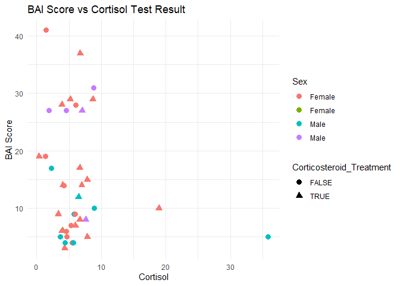
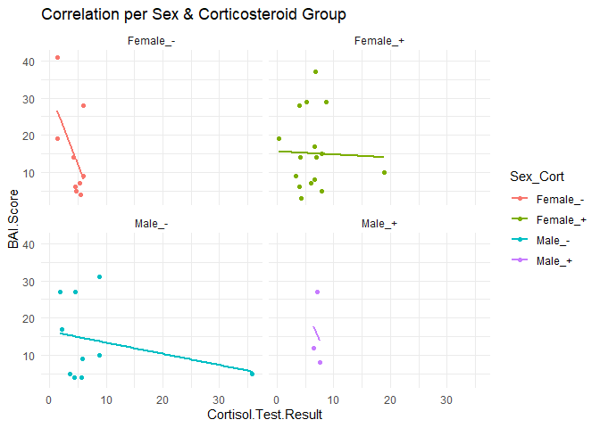
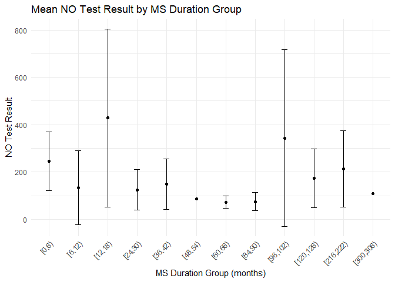
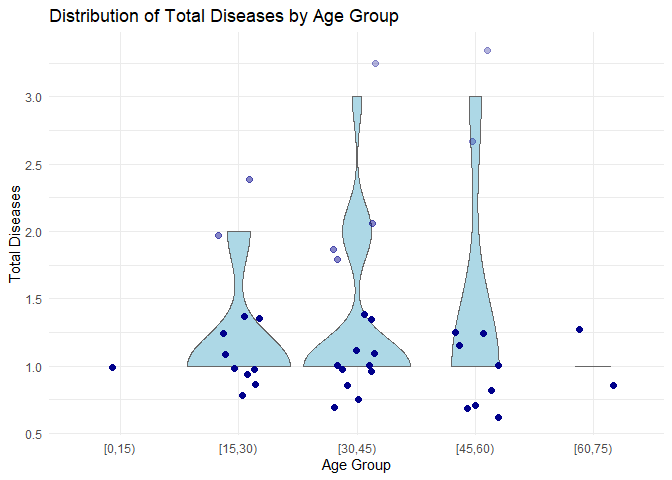

    rawdata <- read.csv2("data_MS.csv")

### Clean and Prepare Data

    data <- rawdata %>%
      mutate(
        ms_duration_clean = str_to_lower(str_replace_all(`MS.Duration`, " ", "")),
        ms_duration_value = as.numeric(str_extract(ms_duration_clean, "\\d+")),
        ms_duration_unit = str_extract(ms_duration_clean, "year|month"),
        `MS Duration (months)` = case_when(
          ms_duration_unit == "year" ~ ms_duration_value * 12,
          ms_duration_unit == "month" ~ ms_duration_value,
          TRUE ~ NA_real_
        ) %>% round(),
        Num_Other_Diseases = if_else(
          str_trim(`Other.Diseases`) == "-" | is.na(`Other.Diseases`),
          0L,
          str_count(`Other.Diseases`, ",") + 1L
        ),
        medication_clean = str_to_lower(trimws(Medication)),
        Corticosteroid_Treatment = str_detect(medication_clean, "corticosteroid"),
        Bcell_Treatment = str_detect(medication_clean, "rituximab"),
        Patient_ID = sprintf("MS_XS_%03d", row_number()),
        Sex = str_trim(Sex)
      ) %>%
      select(-"Patient.Name")

### Cortisol vs. BAI Score

    ggplot(data, aes(x = `Cortisol.Test.Result`, y = `BAI.Score`, color = Sex, shape = Corticosteroid_Treatment)) +
      geom_point(size = 3) +
      theme_minimal() +
      labs(
        title = "BAI Score vs Cortisol Test Result",
        x = "Cortisol",
        y = "BAI Score",
        color = "Sex",
        shape = "Corticosteroid Treatment"
      )

### Correlation by Sex and Corticosteroid Treatment

    data %>%
      mutate(Sex_Cort = paste0(Sex, ifelse(Corticosteroid_Treatment, " +", " -"))) %>%
      ggplot(aes(x = `Cortisol.Test.Result`, y = `BAI.Score`, color = Sex_Cort)) +
      geom_point() +
      geom_smooth(method = "lm", se = FALSE) +
      theme_minimal() +
      labs(
        title = "Correlation: BAI vs Cortisol by Sex & Corticosteroid Treatment",
        x = "Cortisol Test Result",
        y = "BAI Score",
        color = "Group"
      )

    ## `geom_smooth()` using formula = 'y ~ x'

### NO Test Results by MS Duration Group

    data %>%
      mutate(MS_Group = cut(`MS Duration (months)`, breaks = seq(0, max(`MS Duration (months)`, na.rm = TRUE) + 6, 6), right = FALSE)) %>%
      group_by(MS_Group) %>%
      summarise(
        mean_NO = mean(`NO.test.result`, na.rm = TRUE),
        sd_NO = sd(`NO.test.result`, na.rm = TRUE)
      ) %>%
      ggplot(aes(x = MS_Group, y = mean_NO)) +
      geom_point() +
      geom_errorbar(aes(ymin = mean_NO - sd_NO, ymax = mean_NO + sd_NO), width = 0.2) +
      theme_minimal() +
      theme(axis.text.x = element_text(angle = 45, hjust = 1)) +
      labs(
        title = "Mean NO Test Result by MS Duration Group",
        x = "MS Duration Group (months)",
        y = "NO Test Result"
      )

### Median Number of Diseases by Age Group

    data %>%
      mutate(
        Total_Diseases = Num_Other_Diseases + 1,
        Age_Group = cut(Age, breaks = seq(0, 100, by = 15), right = FALSE)
      ) %>%
      ggplot(aes(x = Age_Group, y = Total_Diseases)) +
      geom_violin(fill = "lightblue", color = "gray40") +
      geom_jitter(aes(alpha = 1 / Total_Diseases), width = 0.2, size = 2, color = "darkblue") +
      scale_alpha_continuous(range = c(0.3, 1), guide = "none") +
      theme_minimal() +
      labs(
        title = "Distribution of Total Diseases by Age Group",
        x = "Age Group",
        y = "Total Diseases"
      )

    ## Warning: Groups with fewer than two datapoints have been dropped.
    ## ℹ Set `drop = FALSE` to consider such groups for position adjustment purposes.

