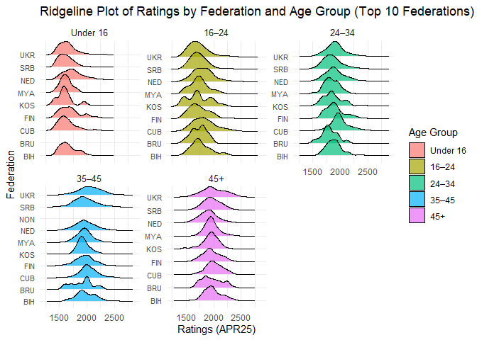

    ## Warning: Paket 'ggridges' wurde unter R Version 4.3.3 erstellt

    file <- "standard_rating_list.txt"
    data <- read_fwf(file = file, 
                             fwf_empty(file, 
                                       col_names = c("ID", "Name", "Fed", "Sex", "Tit", "WTit", 
                                                     "OTit", "FOA", "APR25", "Gms", "K", "Birthday", "Flag")),
                             skip = 1,
                             show_col_types = FALSE) %>%
      # Keep only Name, Fed, APR25, and Birthday columns
      select(Name, Fed, APR25, Birthday) %>%
      # Remove rows with missing Birthday or ratings (APR25)
      filter(!is.na(Birthday) & !is.na(APR25)) %>%
      # Calculate age based on the current year and the Birthday column
      mutate(Age = 2025 - Birthday) %>%
      # Create age categories
      mutate(AgeCategory = case_when(
        Age < 16 ~ "Under 16",
        Age >= 16 & Age < 24 ~ "16–24",
        Age >= 24 & Age < 34 ~ "24–34",
        Age >= 34 & Age < 45 ~ "35–45",
        Age >= 45 ~ "45+"
      )) %>%
      # Convert AgeCategory to a factor
      mutate(AgeCategory = factor(AgeCategory, levels = c("Under 16", "16–24", "24–34", "35–45", "45+")))

    # Compute mean ratings for each Federation (Fed) within each age category
    data_mean_ratings <- data %>%
      group_by(Fed, AgeCategory) %>%
      summarize(
        mean_APR25 = mean(APR25, na.rm = TRUE),
        .groups = "drop"  # To ungroup the data after summarizing
      )

    # Calculate the overall mean rating for each Federation
    data_overall <- data_mean_ratings %>%
      group_by(Fed) %>%
      summarize(
        overall_mean = mean(mean_APR25, na.rm = TRUE),
        .groups = "drop"
      )

    # Pivot the table: federations as rows and age categories as columns
    data_pivoted <- data_mean_ratings %>%
      pivot_wider(names_from = AgeCategory, values_from = mean_APR25) %>%
      left_join(data_overall, by = "Fed") %>%
      arrange(overall_mean) %>% # Sort by overall mean rating 
      drop_na() # Drop rows with missing values

    # Print the table
    knitr::kable(data_pivoted, format = "pipe", caption = "Federation Mean Ratings by Age Category with Overall Mean Rating")

<table>
<caption>Federation Mean Ratings by Age Category with Overall Mean
Rating</caption>
<thead>
<tr class="header">
<th style="text-align: left;">Fed</th>
<th style="text-align: right;">16–24</th>
<th style="text-align: right;">24–34</th>
<th style="text-align: right;">35–45</th>
<th style="text-align: right;">45+</th>
<th style="text-align: right;">Under 16</th>
<th style="text-align: right;">overall_mean</th>
</tr>
</thead>
<tbody>
<tr class="odd">
<td style="text-align: left;">OMA</td>
<td style="text-align: right;">1551.000</td>
<td style="text-align: right;">1605.063</td>
<td style="text-align: right;">1655.948</td>
<td style="text-align: right;">1621.843</td>
<td style="text-align: right;">1500.552</td>
<td style="text-align: right;">1586.881</td>
</tr>
<tr class="even">
<td style="text-align: left;">KUW</td>
<td style="text-align: right;">1597.882</td>
<td style="text-align: right;">1564.705</td>
<td style="text-align: right;">1627.759</td>
<td style="text-align: right;">1673.478</td>
<td style="text-align: right;">1507.667</td>
<td style="text-align: right;">1594.298</td>
</tr>
<tr class="odd">
<td style="text-align: left;">MDV</td>
<td style="text-align: right;">1538.467</td>
<td style="text-align: right;">1636.286</td>
<td style="text-align: right;">1612.923</td>
<td style="text-align: right;">1704.545</td>
<td style="text-align: right;">1482.706</td>
<td style="text-align: right;">1594.985</td>
</tr>
<tr class="even">
<td style="text-align: left;">SRI</td>
<td style="text-align: right;">1505.723</td>
<td style="text-align: right;">1603.483</td>
<td style="text-align: right;">1695.025</td>
<td style="text-align: right;">1679.277</td>
<td style="text-align: right;">1494.672</td>
<td style="text-align: right;">1595.636</td>
</tr>
<tr class="odd">
<td style="text-align: left;">SWZ</td>
<td style="text-align: right;">1586.800</td>
<td style="text-align: right;">1578.568</td>
<td style="text-align: right;">1575.440</td>
<td style="text-align: right;">1622.125</td>
<td style="text-align: right;">1621.000</td>
<td style="text-align: right;">1596.787</td>
</tr>
<tr class="even">
<td style="text-align: left;">IND</td>
<td style="text-align: right;">1544.082</td>
<td style="text-align: right;">1616.027</td>
<td style="text-align: right;">1654.020</td>
<td style="text-align: right;">1660.068</td>
<td style="text-align: right;">1522.962</td>
<td style="text-align: right;">1599.432</td>
</tr>
<tr class="odd">
<td style="text-align: left;">LES</td>
<td style="text-align: right;">1596.960</td>
<td style="text-align: right;">1613.170</td>
<td style="text-align: right;">1625.647</td>
<td style="text-align: right;">1653.250</td>
<td style="text-align: right;">1513.333</td>
<td style="text-align: right;">1600.472</td>
</tr>
<tr class="even">
<td style="text-align: left;">ANT</td>
<td style="text-align: right;">1609.333</td>
<td style="text-align: right;">1571.000</td>
<td style="text-align: right;">1481.000</td>
<td style="text-align: right;">1813.000</td>
<td style="text-align: right;">1538.000</td>
<td style="text-align: right;">1602.467</td>
</tr>
<tr class="odd">
<td style="text-align: left;">BHU</td>
<td style="text-align: right;">1577.444</td>
<td style="text-align: right;">1647.250</td>
<td style="text-align: right;">1686.167</td>
<td style="text-align: right;">1620.667</td>
<td style="text-align: right;">1548.000</td>
<td style="text-align: right;">1615.906</td>
</tr>
<tr class="even">
<td style="text-align: left;">TAN</td>
<td style="text-align: right;">1618.458</td>
<td style="text-align: right;">1637.111</td>
<td style="text-align: right;">1648.600</td>
<td style="text-align: right;">1765.033</td>
<td style="text-align: right;">1487.500</td>
<td style="text-align: right;">1631.341</td>
</tr>
<tr class="odd">
<td style="text-align: left;">CAY</td>
<td style="text-align: right;">1566.500</td>
<td style="text-align: right;">1606.250</td>
<td style="text-align: right;">1803.200</td>
<td style="text-align: right;">1688.667</td>
<td style="text-align: right;">1516.182</td>
<td style="text-align: right;">1636.160</td>
</tr>
<tr class="even">
<td style="text-align: left;">CPV</td>
<td style="text-align: right;">1591.045</td>
<td style="text-align: right;">1696.941</td>
<td style="text-align: right;">1737.833</td>
<td style="text-align: right;">1675.162</td>
<td style="text-align: right;">1487.000</td>
<td style="text-align: right;">1637.596</td>
</tr>
<tr class="odd">
<td style="text-align: left;">KEN</td>
<td style="text-align: right;">1594.142</td>
<td style="text-align: right;">1643.196</td>
<td style="text-align: right;">1695.366</td>
<td style="text-align: right;">1743.891</td>
<td style="text-align: right;">1520.190</td>
<td style="text-align: right;">1639.357</td>
</tr>
<tr class="even">
<td style="text-align: left;">IRI</td>
<td style="text-align: right;">1585.940</td>
<td style="text-align: right;">1696.176</td>
<td style="text-align: right;">1688.149</td>
<td style="text-align: right;">1725.050</td>
<td style="text-align: right;">1538.763</td>
<td style="text-align: right;">1646.816</td>
</tr>
<tr class="odd">
<td style="text-align: left;">BER</td>
<td style="text-align: right;">1543.400</td>
<td style="text-align: right;">1576.333</td>
<td style="text-align: right;">1754.625</td>
<td style="text-align: right;">1821.811</td>
<td style="text-align: right;">1538.000</td>
<td style="text-align: right;">1646.834</td>
</tr>
<tr class="even">
<td style="text-align: left;">KOR</td>
<td style="text-align: right;">1611.568</td>
<td style="text-align: right;">1686.078</td>
<td style="text-align: right;">1756.632</td>
<td style="text-align: right;">1650.560</td>
<td style="text-align: right;">1548.407</td>
<td style="text-align: right;">1650.649</td>
</tr>
<tr class="odd">
<td style="text-align: left;">GUY</td>
<td style="text-align: right;">1588.952</td>
<td style="text-align: right;">1688.700</td>
<td style="text-align: right;">1722.769</td>
<td style="text-align: right;">1684.091</td>
<td style="text-align: right;">1571.625</td>
<td style="text-align: right;">1651.228</td>
</tr>
<tr class="even">
<td style="text-align: left;">TUR</td>
<td style="text-align: right;">1599.626</td>
<td style="text-align: right;">1687.294</td>
<td style="text-align: right;">1723.619</td>
<td style="text-align: right;">1691.538</td>
<td style="text-align: right;">1570.562</td>
<td style="text-align: right;">1654.528</td>
</tr>
<tr class="odd">
<td style="text-align: left;">BRN</td>
<td style="text-align: right;">1579.750</td>
<td style="text-align: right;">1665.185</td>
<td style="text-align: right;">1683.700</td>
<td style="text-align: right;">1916.345</td>
<td style="text-align: right;">1475.364</td>
<td style="text-align: right;">1664.069</td>
</tr>
<tr class="even">
<td style="text-align: left;">MAD</td>
<td style="text-align: right;">1624.210</td>
<td style="text-align: right;">1676.990</td>
<td style="text-align: right;">1736.195</td>
<td style="text-align: right;">1744.177</td>
<td style="text-align: right;">1547.065</td>
<td style="text-align: right;">1665.727</td>
</tr>
<tr class="odd">
<td style="text-align: left;">GHA</td>
<td style="text-align: right;">1578.182</td>
<td style="text-align: right;">1691.180</td>
<td style="text-align: right;">1708.633</td>
<td style="text-align: right;">1736.810</td>
<td style="text-align: right;">1617.500</td>
<td style="text-align: right;">1666.461</td>
</tr>
<tr class="even">
<td style="text-align: left;">CYP</td>
<td style="text-align: right;">1607.473</td>
<td style="text-align: right;">1745.233</td>
<td style="text-align: right;">1696.420</td>
<td style="text-align: right;">1789.197</td>
<td style="text-align: right;">1511.950</td>
<td style="text-align: right;">1670.055</td>
</tr>
<tr class="odd">
<td style="text-align: left;">NAM</td>
<td style="text-align: right;">1599.790</td>
<td style="text-align: right;">1686.535</td>
<td style="text-align: right;">1745.611</td>
<td style="text-align: right;">1793.105</td>
<td style="text-align: right;">1529.316</td>
<td style="text-align: right;">1670.872</td>
</tr>
<tr class="even">
<td style="text-align: left;">BAH</td>
<td style="text-align: right;">1616.929</td>
<td style="text-align: right;">1696.375</td>
<td style="text-align: right;">1782.500</td>
<td style="text-align: right;">1743.250</td>
<td style="text-align: right;">1524.750</td>
<td style="text-align: right;">1672.761</td>
</tr>
<tr class="odd">
<td style="text-align: left;">JOR</td>
<td style="text-align: right;">1594.945</td>
<td style="text-align: right;">1673.726</td>
<td style="text-align: right;">1747.808</td>
<td style="text-align: right;">1799.713</td>
<td style="text-align: right;">1557.803</td>
<td style="text-align: right;">1674.799</td>
</tr>
<tr class="even">
<td style="text-align: left;">MAS</td>
<td style="text-align: right;">1590.583</td>
<td style="text-align: right;">1699.428</td>
<td style="text-align: right;">1768.012</td>
<td style="text-align: right;">1776.042</td>
<td style="text-align: right;">1540.408</td>
<td style="text-align: right;">1674.895</td>
</tr>
<tr class="odd">
<td style="text-align: left;">GRE</td>
<td style="text-align: right;">1586.897</td>
<td style="text-align: right;">1701.914</td>
<td style="text-align: right;">1779.090</td>
<td style="text-align: right;">1761.427</td>
<td style="text-align: right;">1548.054</td>
<td style="text-align: right;">1675.477</td>
</tr>
<tr class="even">
<td style="text-align: left;">NEP</td>
<td style="text-align: right;">1622.092</td>
<td style="text-align: right;">1704.286</td>
<td style="text-align: right;">1726.506</td>
<td style="text-align: right;">1734.639</td>
<td style="text-align: right;">1595.000</td>
<td style="text-align: right;">1676.505</td>
</tr>
<tr class="odd">
<td style="text-align: left;">THA</td>
<td style="text-align: right;">1594.605</td>
<td style="text-align: right;">1678.094</td>
<td style="text-align: right;">1730.243</td>
<td style="text-align: right;">1893.765</td>
<td style="text-align: right;">1506.769</td>
<td style="text-align: right;">1680.695</td>
</tr>
<tr class="even">
<td style="text-align: left;">KGZ</td>
<td style="text-align: right;">1596.027</td>
<td style="text-align: right;">1767.364</td>
<td style="text-align: right;">1799.847</td>
<td style="text-align: right;">1706.197</td>
<td style="text-align: right;">1538.661</td>
<td style="text-align: right;">1681.619</td>
</tr>
<tr class="odd">
<td style="text-align: left;">CRC</td>
<td style="text-align: right;">1579.092</td>
<td style="text-align: right;">1706.625</td>
<td style="text-align: right;">1806.011</td>
<td style="text-align: right;">1795.171</td>
<td style="text-align: right;">1526.267</td>
<td style="text-align: right;">1682.633</td>
</tr>
<tr class="even">
<td style="text-align: left;">MLT</td>
<td style="text-align: right;">1635.865</td>
<td style="text-align: right;">1686.536</td>
<td style="text-align: right;">1765.133</td>
<td style="text-align: right;">1783.010</td>
<td style="text-align: right;">1546.938</td>
<td style="text-align: right;">1683.496</td>
</tr>
<tr class="odd">
<td style="text-align: left;">ALG</td>
<td style="text-align: right;">1590.332</td>
<td style="text-align: right;">1708.201</td>
<td style="text-align: right;">1766.535</td>
<td style="text-align: right;">1847.941</td>
<td style="text-align: right;">1511.893</td>
<td style="text-align: right;">1684.980</td>
</tr>
<tr class="even">
<td style="text-align: left;">BOL</td>
<td style="text-align: right;">1566.687</td>
<td style="text-align: right;">1724.624</td>
<td style="text-align: right;">1780.804</td>
<td style="text-align: right;">1840.270</td>
<td style="text-align: right;">1512.537</td>
<td style="text-align: right;">1684.984</td>
</tr>
<tr class="odd">
<td style="text-align: left;">RSA</td>
<td style="text-align: right;">1601.852</td>
<td style="text-align: right;">1716.307</td>
<td style="text-align: right;">1780.664</td>
<td style="text-align: right;">1769.507</td>
<td style="text-align: right;">1559.583</td>
<td style="text-align: right;">1685.583</td>
</tr>
<tr class="even">
<td style="text-align: left;">PAR</td>
<td style="text-align: right;">1596.252</td>
<td style="text-align: right;">1734.603</td>
<td style="text-align: right;">1770.917</td>
<td style="text-align: right;">1811.167</td>
<td style="text-align: right;">1521.444</td>
<td style="text-align: right;">1686.876</td>
</tr>
<tr class="odd">
<td style="text-align: left;">CAM</td>
<td style="text-align: right;">1594.333</td>
<td style="text-align: right;">1677.667</td>
<td style="text-align: right;">1556.667</td>
<td style="text-align: right;">2038.667</td>
<td style="text-align: right;">1582.000</td>
<td style="text-align: right;">1689.867</td>
</tr>
<tr class="even">
<td style="text-align: left;">FIJ</td>
<td style="text-align: right;">1674.857</td>
<td style="text-align: right;">1697.333</td>
<td style="text-align: right;">1722.071</td>
<td style="text-align: right;">1847.412</td>
<td style="text-align: right;">1510.000</td>
<td style="text-align: right;">1690.335</td>
</tr>
<tr class="odd">
<td style="text-align: left;">LCA</td>
<td style="text-align: right;">1661.375</td>
<td style="text-align: right;">1856.800</td>
<td style="text-align: right;">1669.000</td>
<td style="text-align: right;">1683.500</td>
<td style="text-align: right;">1592.500</td>
<td style="text-align: right;">1692.635</td>
</tr>
<tr class="even">
<td style="text-align: left;">PAN</td>
<td style="text-align: right;">1591.490</td>
<td style="text-align: right;">1746.725</td>
<td style="text-align: right;">1791.935</td>
<td style="text-align: right;">1801.925</td>
<td style="text-align: right;">1531.559</td>
<td style="text-align: right;">1692.727</td>
</tr>
<tr class="odd">
<td style="text-align: left;">MTN</td>
<td style="text-align: right;">1682.700</td>
<td style="text-align: right;">1684.407</td>
<td style="text-align: right;">1743.444</td>
<td style="text-align: right;">1811.357</td>
<td style="text-align: right;">1552.000</td>
<td style="text-align: right;">1694.782</td>
</tr>
<tr class="even">
<td style="text-align: left;">PER</td>
<td style="text-align: right;">1580.801</td>
<td style="text-align: right;">1747.325</td>
<td style="text-align: right;">1811.279</td>
<td style="text-align: right;">1813.274</td>
<td style="text-align: right;">1521.890</td>
<td style="text-align: right;">1694.914</td>
</tr>
<tr class="odd">
<td style="text-align: left;">GAB</td>
<td style="text-align: right;">1655.000</td>
<td style="text-align: right;">1840.000</td>
<td style="text-align: right;">1680.400</td>
<td style="text-align: right;">1832.800</td>
<td style="text-align: right;">1469.000</td>
<td style="text-align: right;">1695.440</td>
</tr>
<tr class="even">
<td style="text-align: left;">FRA</td>
<td style="text-align: right;">1627.218</td>
<td style="text-align: right;">1741.285</td>
<td style="text-align: right;">1801.469</td>
<td style="text-align: right;">1744.696</td>
<td style="text-align: right;">1564.355</td>
<td style="text-align: right;">1695.804</td>
</tr>
<tr class="odd">
<td style="text-align: left;">POR</td>
<td style="text-align: right;">1616.340</td>
<td style="text-align: right;">1715.554</td>
<td style="text-align: right;">1805.435</td>
<td style="text-align: right;">1795.513</td>
<td style="text-align: right;">1570.766</td>
<td style="text-align: right;">1700.722</td>
</tr>
<tr class="even">
<td style="text-align: left;">BOT</td>
<td style="text-align: right;">1618.617</td>
<td style="text-align: right;">1699.800</td>
<td style="text-align: right;">1806.671</td>
<td style="text-align: right;">1818.146</td>
<td style="text-align: right;">1569.760</td>
<td style="text-align: right;">1702.599</td>
</tr>
<tr class="odd">
<td style="text-align: left;">SUR</td>
<td style="text-align: right;">1565.881</td>
<td style="text-align: right;">1697.340</td>
<td style="text-align: right;">1911.429</td>
<td style="text-align: right;">1785.294</td>
<td style="text-align: right;">1560.571</td>
<td style="text-align: right;">1704.103</td>
</tr>
<tr class="even">
<td style="text-align: left;">MAW</td>
<td style="text-align: right;">1668.216</td>
<td style="text-align: right;">1741.941</td>
<td style="text-align: right;">1796.852</td>
<td style="text-align: right;">1758.355</td>
<td style="text-align: right;">1556.857</td>
<td style="text-align: right;">1704.444</td>
</tr>
<tr class="odd">
<td style="text-align: left;">UGA</td>
<td style="text-align: right;">1590.911</td>
<td style="text-align: right;">1729.523</td>
<td style="text-align: right;">1829.194</td>
<td style="text-align: right;">1845.284</td>
<td style="text-align: right;">1528.409</td>
<td style="text-align: right;">1704.664</td>
</tr>
<tr class="even">
<td style="text-align: left;">HON</td>
<td style="text-align: right;">1625.196</td>
<td style="text-align: right;">1742.282</td>
<td style="text-align: right;">1774.667</td>
<td style="text-align: right;">1849.362</td>
<td style="text-align: right;">1535.138</td>
<td style="text-align: right;">1705.329</td>
</tr>
<tr class="odd">
<td style="text-align: left;">TTO</td>
<td style="text-align: right;">1551.745</td>
<td style="text-align: right;">1754.867</td>
<td style="text-align: right;">1882.958</td>
<td style="text-align: right;">1816.688</td>
<td style="text-align: right;">1523.531</td>
<td style="text-align: right;">1705.958</td>
</tr>
<tr class="even">
<td style="text-align: left;">GUM</td>
<td style="text-align: right;">1652.231</td>
<td style="text-align: right;">1854.222</td>
<td style="text-align: right;">1689.385</td>
<td style="text-align: right;">1733.395</td>
<td style="text-align: right;">1605.647</td>
<td style="text-align: right;">1706.976</td>
</tr>
<tr class="odd">
<td style="text-align: left;">HKG</td>
<td style="text-align: right;">1618.545</td>
<td style="text-align: right;">1722.419</td>
<td style="text-align: right;">1774.659</td>
<td style="text-align: right;">1847.216</td>
<td style="text-align: right;">1575.183</td>
<td style="text-align: right;">1707.604</td>
</tr>
<tr class="even">
<td style="text-align: left;">POL</td>
<td style="text-align: right;">1621.327</td>
<td style="text-align: right;">1726.231</td>
<td style="text-align: right;">1827.187</td>
<td style="text-align: right;">1808.626</td>
<td style="text-align: right;">1564.395</td>
<td style="text-align: right;">1709.553</td>
</tr>
<tr class="odd">
<td style="text-align: left;">TUN</td>
<td style="text-align: right;">1589.588</td>
<td style="text-align: right;">1729.441</td>
<td style="text-align: right;">1826.661</td>
<td style="text-align: right;">1845.026</td>
<td style="text-align: right;">1561.495</td>
<td style="text-align: right;">1710.442</td>
</tr>
<tr class="even">
<td style="text-align: left;">CIV</td>
<td style="text-align: right;">1631.077</td>
<td style="text-align: right;">1773.562</td>
<td style="text-align: right;">1800.714</td>
<td style="text-align: right;">1796.094</td>
<td style="text-align: right;">1552.667</td>
<td style="text-align: right;">1710.823</td>
</tr>
<tr class="odd">
<td style="text-align: left;">NOR</td>
<td style="text-align: right;">1690.482</td>
<td style="text-align: right;">1760.979</td>
<td style="text-align: right;">1740.177</td>
<td style="text-align: right;">1758.259</td>
<td style="text-align: right;">1607.364</td>
<td style="text-align: right;">1711.452</td>
</tr>
<tr class="even">
<td style="text-align: left;">NCL</td>
<td style="text-align: right;">1699.000</td>
<td style="text-align: right;">1663.000</td>
<td style="text-align: right;">1865.500</td>
<td style="text-align: right;">1842.667</td>
<td style="text-align: right;">1489.000</td>
<td style="text-align: right;">1711.833</td>
</tr>
<tr class="odd">
<td style="text-align: left;">IRQ</td>
<td style="text-align: right;">1626.899</td>
<td style="text-align: right;">1707.193</td>
<td style="text-align: right;">1793.599</td>
<td style="text-align: right;">1883.176</td>
<td style="text-align: right;">1555.383</td>
<td style="text-align: right;">1713.250</td>
</tr>
<tr class="even">
<td style="text-align: left;">MRI</td>
<td style="text-align: right;">1605.667</td>
<td style="text-align: right;">1746.133</td>
<td style="text-align: right;">1808.800</td>
<td style="text-align: right;">1841.438</td>
<td style="text-align: right;">1566.333</td>
<td style="text-align: right;">1713.674</td>
</tr>
<tr class="odd">
<td style="text-align: left;">BAN</td>
<td style="text-align: right;">1659.774</td>
<td style="text-align: right;">1731.966</td>
<td style="text-align: right;">1785.605</td>
<td style="text-align: right;">1812.131</td>
<td style="text-align: right;">1580.101</td>
<td style="text-align: right;">1713.916</td>
</tr>
<tr class="even">
<td style="text-align: left;">ESA</td>
<td style="text-align: right;">1654.660</td>
<td style="text-align: right;">1759.076</td>
<td style="text-align: right;">1839.531</td>
<td style="text-align: right;">1788.670</td>
<td style="text-align: right;">1528.438</td>
<td style="text-align: right;">1714.075</td>
</tr>
<tr class="odd">
<td style="text-align: left;">PAK</td>
<td style="text-align: right;">1677.554</td>
<td style="text-align: right;">1716.436</td>
<td style="text-align: right;">1756.161</td>
<td style="text-align: right;">1849.765</td>
<td style="text-align: right;">1574.579</td>
<td style="text-align: right;">1714.899</td>
</tr>
<tr class="even">
<td style="text-align: left;">ITA</td>
<td style="text-align: right;">1658.353</td>
<td style="text-align: right;">1766.385</td>
<td style="text-align: right;">1791.941</td>
<td style="text-align: right;">1788.179</td>
<td style="text-align: right;">1579.803</td>
<td style="text-align: right;">1716.932</td>
</tr>
<tr class="odd">
<td style="text-align: left;">ARU</td>
<td style="text-align: right;">1633.938</td>
<td style="text-align: right;">1875.000</td>
<td style="text-align: right;">1781.500</td>
<td style="text-align: right;">1786.600</td>
<td style="text-align: right;">1511.333</td>
<td style="text-align: right;">1717.674</td>
</tr>
<tr class="even">
<td style="text-align: left;">KSA</td>
<td style="text-align: right;">1724.148</td>
<td style="text-align: right;">1746.632</td>
<td style="text-align: right;">1765.736</td>
<td style="text-align: right;">1782.429</td>
<td style="text-align: right;">1570.000</td>
<td style="text-align: right;">1717.789</td>
</tr>
<tr class="odd">
<td style="text-align: left;">VEN</td>
<td style="text-align: right;">1605.320</td>
<td style="text-align: right;">1780.641</td>
<td style="text-align: right;">1843.962</td>
<td style="text-align: right;">1816.494</td>
<td style="text-align: right;">1542.633</td>
<td style="text-align: right;">1717.810</td>
</tr>
<tr class="even">
<td style="text-align: left;">BAR</td>
<td style="text-align: right;">1560.350</td>
<td style="text-align: right;">1707.479</td>
<td style="text-align: right;">1856.931</td>
<td style="text-align: right;">1890.000</td>
<td style="text-align: right;">1575.778</td>
<td style="text-align: right;">1718.108</td>
</tr>
<tr class="odd">
<td style="text-align: left;">AUS</td>
<td style="text-align: right;">1663.261</td>
<td style="text-align: right;">1766.748</td>
<td style="text-align: right;">1794.079</td>
<td style="text-align: right;">1781.141</td>
<td style="text-align: right;">1601.087</td>
<td style="text-align: right;">1721.263</td>
</tr>
<tr class="even">
<td style="text-align: left;">TPE</td>
<td style="text-align: right;">1625.248</td>
<td style="text-align: right;">1774.375</td>
<td style="text-align: right;">1842.900</td>
<td style="text-align: right;">1803.111</td>
<td style="text-align: right;">1575.548</td>
<td style="text-align: right;">1724.236</td>
</tr>
<tr class="odd">
<td style="text-align: left;">EGY</td>
<td style="text-align: right;">1627.763</td>
<td style="text-align: right;">1755.796</td>
<td style="text-align: right;">1815.736</td>
<td style="text-align: right;">1871.110</td>
<td style="text-align: right;">1552.674</td>
<td style="text-align: right;">1724.616</td>
</tr>
<tr class="even">
<td style="text-align: left;">ROU</td>
<td style="text-align: right;">1615.679</td>
<td style="text-align: right;">1765.487</td>
<td style="text-align: right;">1863.065</td>
<td style="text-align: right;">1826.233</td>
<td style="text-align: right;">1556.636</td>
<td style="text-align: right;">1725.420</td>
</tr>
<tr class="odd">
<td style="text-align: left;">KAZ</td>
<td style="text-align: right;">1589.014</td>
<td style="text-align: right;">1796.511</td>
<td style="text-align: right;">1889.787</td>
<td style="text-align: right;">1812.793</td>
<td style="text-align: right;">1542.618</td>
<td style="text-align: right;">1726.145</td>
</tr>
<tr class="even">
<td style="text-align: left;">ESP</td>
<td style="text-align: right;">1657.225</td>
<td style="text-align: right;">1769.232</td>
<td style="text-align: right;">1828.714</td>
<td style="text-align: right;">1792.846</td>
<td style="text-align: right;">1585.094</td>
<td style="text-align: right;">1726.622</td>
</tr>
<tr class="odd">
<td style="text-align: left;">MOZ</td>
<td style="text-align: right;">1656.423</td>
<td style="text-align: right;">1717.258</td>
<td style="text-align: right;">1783.733</td>
<td style="text-align: right;">1738.929</td>
<td style="text-align: right;">1738.000</td>
<td style="text-align: right;">1726.869</td>
</tr>
<tr class="even">
<td style="text-align: left;">NCA</td>
<td style="text-align: right;">1688.610</td>
<td style="text-align: right;">1737.789</td>
<td style="text-align: right;">1789.827</td>
<td style="text-align: right;">1853.470</td>
<td style="text-align: right;">1570.150</td>
<td style="text-align: right;">1727.969</td>
</tr>
<tr class="odd">
<td style="text-align: left;">URU</td>
<td style="text-align: right;">1683.962</td>
<td style="text-align: right;">1773.161</td>
<td style="text-align: right;">1830.473</td>
<td style="text-align: right;">1813.676</td>
<td style="text-align: right;">1551.320</td>
<td style="text-align: right;">1730.518</td>
</tr>
<tr class="even">
<td style="text-align: left;">CHI</td>
<td style="text-align: right;">1615.034</td>
<td style="text-align: right;">1756.800</td>
<td style="text-align: right;">1842.691</td>
<td style="text-align: right;">1880.175</td>
<td style="text-align: right;">1558.358</td>
<td style="text-align: right;">1730.611</td>
</tr>
<tr class="odd">
<td style="text-align: left;">LBN</td>
<td style="text-align: right;">1655.269</td>
<td style="text-align: right;">1736.154</td>
<td style="text-align: right;">1806.238</td>
<td style="text-align: right;">1844.000</td>
<td style="text-align: right;">1611.697</td>
<td style="text-align: right;">1730.672</td>
</tr>
<tr class="even">
<td style="text-align: left;">UAE</td>
<td style="text-align: right;">1592.134</td>
<td style="text-align: right;">1743.695</td>
<td style="text-align: right;">1927.761</td>
<td style="text-align: right;">1884.170</td>
<td style="text-align: right;">1507.739</td>
<td style="text-align: right;">1731.100</td>
</tr>
<tr class="odd">
<td style="text-align: left;">AHO</td>
<td style="text-align: right;">1689.875</td>
<td style="text-align: right;">1740.643</td>
<td style="text-align: right;">1834.538</td>
<td style="text-align: right;">1874.091</td>
<td style="text-align: right;">1537.500</td>
<td style="text-align: right;">1735.329</td>
</tr>
<tr class="even">
<td style="text-align: left;">PUR</td>
<td style="text-align: right;">1644.459</td>
<td style="text-align: right;">1772.282</td>
<td style="text-align: right;">1851.688</td>
<td style="text-align: right;">1845.635</td>
<td style="text-align: right;">1569.526</td>
<td style="text-align: right;">1736.718</td>
</tr>
<tr class="odd">
<td style="text-align: left;">SEN</td>
<td style="text-align: right;">1702.000</td>
<td style="text-align: right;">1776.818</td>
<td style="text-align: right;">1725.600</td>
<td style="text-align: right;">1858.286</td>
<td style="text-align: right;">1622.500</td>
<td style="text-align: right;">1737.041</td>
</tr>
<tr class="even">
<td style="text-align: left;">PLE</td>
<td style="text-align: right;">1728.656</td>
<td style="text-align: right;">1721.915</td>
<td style="text-align: right;">1787.097</td>
<td style="text-align: right;">1818.317</td>
<td style="text-align: right;">1633.444</td>
<td style="text-align: right;">1737.886</td>
</tr>
<tr class="odd">
<td style="text-align: left;">BEL</td>
<td style="text-align: right;">1688.299</td>
<td style="text-align: right;">1783.914</td>
<td style="text-align: right;">1824.485</td>
<td style="text-align: right;">1791.633</td>
<td style="text-align: right;">1602.441</td>
<td style="text-align: right;">1738.155</td>
</tr>
<tr class="even">
<td style="text-align: left;">SUD</td>
<td style="text-align: right;">1734.300</td>
<td style="text-align: right;">1730.980</td>
<td style="text-align: right;">1796.148</td>
<td style="text-align: right;">1815.244</td>
<td style="text-align: right;">1623.500</td>
<td style="text-align: right;">1740.034</td>
</tr>
<tr class="odd">
<td style="text-align: left;">GUA</td>
<td style="text-align: right;">1679.650</td>
<td style="text-align: right;">1758.209</td>
<td style="text-align: right;">1817.283</td>
<td style="text-align: right;">1846.481</td>
<td style="text-align: right;">1605.600</td>
<td style="text-align: right;">1741.445</td>
</tr>
<tr class="even">
<td style="text-align: left;">JAM</td>
<td style="text-align: right;">1617.099</td>
<td style="text-align: right;">1767.337</td>
<td style="text-align: right;">1852.364</td>
<td style="text-align: right;">1916.523</td>
<td style="text-align: right;">1558.733</td>
<td style="text-align: right;">1742.411</td>
</tr>
<tr class="odd">
<td style="text-align: left;">NZL</td>
<td style="text-align: right;">1685.511</td>
<td style="text-align: right;">1788.590</td>
<td style="text-align: right;">1802.125</td>
<td style="text-align: right;">1851.073</td>
<td style="text-align: right;">1586.842</td>
<td style="text-align: right;">1742.828</td>
</tr>
<tr class="even">
<td style="text-align: left;">FAI</td>
<td style="text-align: right;">1691.281</td>
<td style="text-align: right;">1792.968</td>
<td style="text-align: right;">1859.811</td>
<td style="text-align: right;">1824.705</td>
<td style="text-align: right;">1551.667</td>
<td style="text-align: right;">1744.086</td>
</tr>
<tr class="odd">
<td style="text-align: left;">ZIM</td>
<td style="text-align: right;">1689.461</td>
<td style="text-align: right;">1758.655</td>
<td style="text-align: right;">1808.547</td>
<td style="text-align: right;">1905.464</td>
<td style="text-align: right;">1559.368</td>
<td style="text-align: right;">1744.299</td>
</tr>
<tr class="even">
<td style="text-align: left;">ECU</td>
<td style="text-align: right;">1592.063</td>
<td style="text-align: right;">1751.522</td>
<td style="text-align: right;">1938.494</td>
<td style="text-align: right;">1905.370</td>
<td style="text-align: right;">1539.285</td>
<td style="text-align: right;">1745.347</td>
</tr>
<tr class="odd">
<td style="text-align: left;">SGP</td>
<td style="text-align: right;">1608.355</td>
<td style="text-align: right;">1826.388</td>
<td style="text-align: right;">1859.612</td>
<td style="text-align: right;">1886.471</td>
<td style="text-align: right;">1546.841</td>
<td style="text-align: right;">1745.534</td>
</tr>
<tr class="even">
<td style="text-align: left;">LTU</td>
<td style="text-align: right;">1619.288</td>
<td style="text-align: right;">1819.180</td>
<td style="text-align: right;">1911.034</td>
<td style="text-align: right;">1863.602</td>
<td style="text-align: right;">1534.683</td>
<td style="text-align: right;">1749.557</td>
</tr>
<tr class="odd">
<td style="text-align: left;">ARG</td>
<td style="text-align: right;">1679.307</td>
<td style="text-align: right;">1792.867</td>
<td style="text-align: right;">1821.093</td>
<td style="text-align: right;">1868.330</td>
<td style="text-align: right;">1597.612</td>
<td style="text-align: right;">1751.842</td>
</tr>
<tr class="even">
<td style="text-align: left;">LBA</td>
<td style="text-align: right;">1714.895</td>
<td style="text-align: right;">1783.896</td>
<td style="text-align: right;">1821.307</td>
<td style="text-align: right;">1839.358</td>
<td style="text-align: right;">1601.706</td>
<td style="text-align: right;">1752.232</td>
</tr>
<tr class="odd">
<td style="text-align: left;">ANG</td>
<td style="text-align: right;">1698.233</td>
<td style="text-align: right;">1767.804</td>
<td style="text-align: right;">1823.073</td>
<td style="text-align: right;">1869.133</td>
<td style="text-align: right;">1612.037</td>
<td style="text-align: right;">1754.056</td>
</tr>
<tr class="even">
<td style="text-align: left;">HAI</td>
<td style="text-align: right;">1644.458</td>
<td style="text-align: right;">1874.182</td>
<td style="text-align: right;">1874.250</td>
<td style="text-align: right;">1919.429</td>
<td style="text-align: right;">1462.000</td>
<td style="text-align: right;">1754.864</td>
</tr>
<tr class="odd">
<td style="text-align: left;">MDA</td>
<td style="text-align: right;">1648.478</td>
<td style="text-align: right;">1795.277</td>
<td style="text-align: right;">1960.090</td>
<td style="text-align: right;">1843.228</td>
<td style="text-align: right;">1529.243</td>
<td style="text-align: right;">1755.263</td>
</tr>
<tr class="even">
<td style="text-align: left;">ISL</td>
<td style="text-align: right;">1663.570</td>
<td style="text-align: right;">1820.055</td>
<td style="text-align: right;">1844.485</td>
<td style="text-align: right;">1902.106</td>
<td style="text-align: right;">1556.211</td>
<td style="text-align: right;">1757.285</td>
</tr>
<tr class="odd">
<td style="text-align: left;">TJK</td>
<td style="text-align: right;">1670.596</td>
<td style="text-align: right;">1771.848</td>
<td style="text-align: right;">1958.727</td>
<td style="text-align: right;">1845.247</td>
<td style="text-align: right;">1548.125</td>
<td style="text-align: right;">1758.909</td>
</tr>
<tr class="even">
<td style="text-align: left;">SVK</td>
<td style="text-align: right;">1701.719</td>
<td style="text-align: right;">1814.320</td>
<td style="text-align: right;">1871.595</td>
<td style="text-align: right;">1818.417</td>
<td style="text-align: right;">1598.197</td>
<td style="text-align: right;">1760.850</td>
</tr>
<tr class="odd">
<td style="text-align: left;">MEX</td>
<td style="text-align: right;">1697.453</td>
<td style="text-align: right;">1799.571</td>
<td style="text-align: right;">1836.423</td>
<td style="text-align: right;">1884.929</td>
<td style="text-align: right;">1588.449</td>
<td style="text-align: right;">1761.365</td>
</tr>
<tr class="even">
<td style="text-align: left;">AZE</td>
<td style="text-align: right;">1594.306</td>
<td style="text-align: right;">1833.979</td>
<td style="text-align: right;">1953.870</td>
<td style="text-align: right;">1891.820</td>
<td style="text-align: right;">1533.148</td>
<td style="text-align: right;">1761.425</td>
</tr>
<tr class="odd">
<td style="text-align: left;">ZAM</td>
<td style="text-align: right;">1734.958</td>
<td style="text-align: right;">1800.353</td>
<td style="text-align: right;">1857.605</td>
<td style="text-align: right;">1857.045</td>
<td style="text-align: right;">1566.483</td>
<td style="text-align: right;">1763.289</td>
</tr>
<tr class="even">
<td style="text-align: left;">COL</td>
<td style="text-align: right;">1680.141</td>
<td style="text-align: right;">1826.252</td>
<td style="text-align: right;">1874.614</td>
<td style="text-align: right;">1850.121</td>
<td style="text-align: right;">1588.248</td>
<td style="text-align: right;">1763.875</td>
</tr>
<tr class="odd">
<td style="text-align: left;">CAF</td>
<td style="text-align: right;">1630.833</td>
<td style="text-align: right;">1836.250</td>
<td style="text-align: right;">1737.000</td>
<td style="text-align: right;">1709.500</td>
<td style="text-align: right;">1908.000</td>
<td style="text-align: right;">1764.317</td>
</tr>
<tr class="even">
<td style="text-align: left;">LAT</td>
<td style="text-align: right;">1643.231</td>
<td style="text-align: right;">1808.983</td>
<td style="text-align: right;">1952.839</td>
<td style="text-align: right;">1872.478</td>
<td style="text-align: right;">1549.429</td>
<td style="text-align: right;">1765.392</td>
</tr>
<tr class="odd">
<td style="text-align: left;">MKD</td>
<td style="text-align: right;">1645.234</td>
<td style="text-align: right;">1808.356</td>
<td style="text-align: right;">1884.825</td>
<td style="text-align: right;">1965.114</td>
<td style="text-align: right;">1524.726</td>
<td style="text-align: right;">1765.651</td>
</tr>
<tr class="even">
<td style="text-align: left;">SWE</td>
<td style="text-align: right;">1704.628</td>
<td style="text-align: right;">1788.041</td>
<td style="text-align: right;">1845.212</td>
<td style="text-align: right;">1853.925</td>
<td style="text-align: right;">1636.758</td>
<td style="text-align: right;">1765.713</td>
</tr>
<tr class="odd">
<td style="text-align: left;">BRA</td>
<td style="text-align: right;">1690.104</td>
<td style="text-align: right;">1796.267</td>
<td style="text-align: right;">1861.677</td>
<td style="text-align: right;">1868.673</td>
<td style="text-align: right;">1616.429</td>
<td style="text-align: right;">1766.630</td>
</tr>
<tr class="even">
<td style="text-align: left;">GEO</td>
<td style="text-align: right;">1592.335</td>
<td style="text-align: right;">1781.318</td>
<td style="text-align: right;">1989.449</td>
<td style="text-align: right;">1941.549</td>
<td style="text-align: right;">1533.217</td>
<td style="text-align: right;">1767.573</td>
</tr>
<tr class="odd">
<td style="text-align: left;">LBR</td>
<td style="text-align: right;">1713.818</td>
<td style="text-align: right;">1797.727</td>
<td style="text-align: right;">1813.467</td>
<td style="text-align: right;">1774.895</td>
<td style="text-align: right;">1749.000</td>
<td style="text-align: right;">1769.781</td>
</tr>
<tr class="even">
<td style="text-align: left;">BUL</td>
<td style="text-align: right;">1629.563</td>
<td style="text-align: right;">1819.728</td>
<td style="text-align: right;">1935.351</td>
<td style="text-align: right;">1936.574</td>
<td style="text-align: right;">1544.724</td>
<td style="text-align: right;">1773.188</td>
</tr>
<tr class="odd">
<td style="text-align: left;">DEN</td>
<td style="text-align: right;">1739.408</td>
<td style="text-align: right;">1796.166</td>
<td style="text-align: right;">1838.862</td>
<td style="text-align: right;">1831.584</td>
<td style="text-align: right;">1661.920</td>
<td style="text-align: right;">1773.588</td>
</tr>
<tr class="even">
<td style="text-align: left;">PHI</td>
<td style="text-align: right;">1679.247</td>
<td style="text-align: right;">1833.254</td>
<td style="text-align: right;">1851.383</td>
<td style="text-align: right;">1919.331</td>
<td style="text-align: right;">1585.967</td>
<td style="text-align: right;">1773.836</td>
</tr>
<tr class="odd">
<td style="text-align: left;">ALB</td>
<td style="text-align: right;">1667.085</td>
<td style="text-align: right;">1836.545</td>
<td style="text-align: right;">1844.089</td>
<td style="text-align: right;">1936.549</td>
<td style="text-align: right;">1587.952</td>
<td style="text-align: right;">1774.444</td>
</tr>
<tr class="even">
<td style="text-align: left;">SYR</td>
<td style="text-align: right;">1700.208</td>
<td style="text-align: right;">1785.808</td>
<td style="text-align: right;">1852.067</td>
<td style="text-align: right;">1944.235</td>
<td style="text-align: right;">1596.872</td>
<td style="text-align: right;">1775.838</td>
</tr>
<tr class="odd">
<td style="text-align: left;">WLS</td>
<td style="text-align: right;">1713.862</td>
<td style="text-align: right;">1818.162</td>
<td style="text-align: right;">1885.522</td>
<td style="text-align: right;">1880.632</td>
<td style="text-align: right;">1584.136</td>
<td style="text-align: right;">1776.463</td>
</tr>
<tr class="even">
<td style="text-align: left;">ETH</td>
<td style="text-align: right;">1760.174</td>
<td style="text-align: right;">1750.458</td>
<td style="text-align: right;">1887.122</td>
<td style="text-align: right;">1932.000</td>
<td style="text-align: right;">1560.000</td>
<td style="text-align: right;">1777.951</td>
</tr>
<tr class="odd">
<td style="text-align: left;">QAT</td>
<td style="text-align: right;">1558.000</td>
<td style="text-align: right;">1736.562</td>
<td style="text-align: right;">1903.667</td>
<td style="text-align: right;">2105.381</td>
<td style="text-align: right;">1596.333</td>
<td style="text-align: right;">1779.989</td>
</tr>
<tr class="even">
<td style="text-align: left;">GAM</td>
<td style="text-align: right;">1746.000</td>
<td style="text-align: right;">1788.667</td>
<td style="text-align: right;">1875.667</td>
<td style="text-align: right;">1855.471</td>
<td style="text-align: right;">1636.000</td>
<td style="text-align: right;">1780.361</td>
</tr>
<tr class="odd">
<td style="text-align: left;">CRO</td>
<td style="text-align: right;">1679.705</td>
<td style="text-align: right;">1832.915</td>
<td style="text-align: right;">1922.717</td>
<td style="text-align: right;">1910.515</td>
<td style="text-align: right;">1569.621</td>
<td style="text-align: right;">1783.094</td>
</tr>
<tr class="even">
<td style="text-align: left;">LUX</td>
<td style="text-align: right;">1740.229</td>
<td style="text-align: right;">1853.156</td>
<td style="text-align: right;">1901.969</td>
<td style="text-align: right;">1856.817</td>
<td style="text-align: right;">1563.795</td>
<td style="text-align: right;">1783.193</td>
</tr>
<tr class="odd">
<td style="text-align: left;">IRL</td>
<td style="text-align: right;">1775.977</td>
<td style="text-align: right;">1804.396</td>
<td style="text-align: right;">1830.212</td>
<td style="text-align: right;">1829.924</td>
<td style="text-align: right;">1683.025</td>
<td style="text-align: right;">1784.707</td>
</tr>
<tr class="even">
<td style="text-align: left;">UZB</td>
<td style="text-align: right;">1667.895</td>
<td style="text-align: right;">1868.700</td>
<td style="text-align: right;">1954.152</td>
<td style="text-align: right;">1865.562</td>
<td style="text-align: right;">1572.838</td>
<td style="text-align: right;">1785.829</td>
</tr>
<tr class="odd">
<td style="text-align: left;">CZE</td>
<td style="text-align: right;">1712.155</td>
<td style="text-align: right;">1850.400</td>
<td style="text-align: right;">1917.285</td>
<td style="text-align: right;">1861.628</td>
<td style="text-align: right;">1606.997</td>
<td style="text-align: right;">1789.693</td>
</tr>
<tr class="even">
<td style="text-align: left;">YEM</td>
<td style="text-align: right;">1706.263</td>
<td style="text-align: right;">1775.107</td>
<td style="text-align: right;">1814.192</td>
<td style="text-align: right;">1977.722</td>
<td style="text-align: right;">1678.333</td>
<td style="text-align: right;">1790.323</td>
</tr>
<tr class="odd">
<td style="text-align: left;">JPN</td>
<td style="text-align: right;">1747.627</td>
<td style="text-align: right;">1824.445</td>
<td style="text-align: right;">1894.495</td>
<td style="text-align: right;">1865.664</td>
<td style="text-align: right;">1620.238</td>
<td style="text-align: right;">1790.494</td>
</tr>
<tr class="even">
<td style="text-align: left;">ISR</td>
<td style="text-align: right;">1694.136</td>
<td style="text-align: right;">1844.830</td>
<td style="text-align: right;">1914.804</td>
<td style="text-align: right;">1888.036</td>
<td style="text-align: right;">1615.801</td>
<td style="text-align: right;">1791.521</td>
</tr>
<tr class="odd">
<td style="text-align: left;">HUN</td>
<td style="text-align: right;">1698.424</td>
<td style="text-align: right;">1823.817</td>
<td style="text-align: right;">1937.819</td>
<td style="text-align: right;">1885.154</td>
<td style="text-align: right;">1617.774</td>
<td style="text-align: right;">1792.597</td>
</tr>
<tr class="even">
<td style="text-align: left;">BLR</td>
<td style="text-align: right;">1646.105</td>
<td style="text-align: right;">1847.309</td>
<td style="text-align: right;">1989.554</td>
<td style="text-align: right;">1935.438</td>
<td style="text-align: right;">1547.116</td>
<td style="text-align: right;">1793.105</td>
</tr>
<tr class="odd">
<td style="text-align: left;">RUS</td>
<td style="text-align: right;">1617.472</td>
<td style="text-align: right;">1855.455</td>
<td style="text-align: right;">2002.759</td>
<td style="text-align: right;">1965.446</td>
<td style="text-align: right;">1539.944</td>
<td style="text-align: right;">1796.215</td>
</tr>
<tr class="even">
<td style="text-align: left;">DOM</td>
<td style="text-align: right;">1717.661</td>
<td style="text-align: right;">1816.107</td>
<td style="text-align: right;">1891.417</td>
<td style="text-align: right;">1910.794</td>
<td style="text-align: right;">1659.049</td>
<td style="text-align: right;">1799.006</td>
</tr>
<tr class="odd">
<td style="text-align: left;">SUI</td>
<td style="text-align: right;">1745.629</td>
<td style="text-align: right;">1844.312</td>
<td style="text-align: right;">1893.002</td>
<td style="text-align: right;">1880.623</td>
<td style="text-align: right;">1647.909</td>
<td style="text-align: right;">1802.295</td>
</tr>
<tr class="even">
<td style="text-align: left;">SLO</td>
<td style="text-align: right;">1687.716</td>
<td style="text-align: right;">1871.957</td>
<td style="text-align: right;">1989.274</td>
<td style="text-align: right;">1904.538</td>
<td style="text-align: right;">1599.396</td>
<td style="text-align: right;">1810.576</td>
</tr>
<tr class="odd">
<td style="text-align: left;">MAR</td>
<td style="text-align: right;">1751.819</td>
<td style="text-align: right;">1813.263</td>
<td style="text-align: right;">1885.949</td>
<td style="text-align: right;">1931.252</td>
<td style="text-align: right;">1691.750</td>
<td style="text-align: right;">1814.807</td>
</tr>
<tr class="even">
<td style="text-align: left;">CAN</td>
<td style="text-align: right;">1771.583</td>
<td style="text-align: right;">1849.738</td>
<td style="text-align: right;">1909.479</td>
<td style="text-align: right;">1893.744</td>
<td style="text-align: right;">1651.807</td>
<td style="text-align: right;">1815.270</td>
</tr>
<tr class="odd">
<td style="text-align: left;">JCI</td>
<td style="text-align: right;">1641.846</td>
<td style="text-align: right;">1708.500</td>
<td style="text-align: right;">2026.333</td>
<td style="text-align: right;">1929.667</td>
<td style="text-align: right;">1776.000</td>
<td style="text-align: right;">1816.469</td>
</tr>
<tr class="even">
<td style="text-align: left;">KOS</td>
<td style="text-align: right;">1731.375</td>
<td style="text-align: right;">1873.814</td>
<td style="text-align: right;">1939.400</td>
<td style="text-align: right;">1942.083</td>
<td style="text-align: right;">1598.000</td>
<td style="text-align: right;">1816.934</td>
</tr>
<tr class="odd">
<td style="text-align: left;">MGL</td>
<td style="text-align: right;">1762.464</td>
<td style="text-align: right;">1845.298</td>
<td style="text-align: right;">1987.542</td>
<td style="text-align: right;">1875.631</td>
<td style="text-align: right;">1620.466</td>
<td style="text-align: right;">1818.280</td>
</tr>
<tr class="even">
<td style="text-align: left;">MNE</td>
<td style="text-align: right;">1678.670</td>
<td style="text-align: right;">1915.488</td>
<td style="text-align: right;">1978.900</td>
<td style="text-align: right;">1977.083</td>
<td style="text-align: right;">1548.022</td>
<td style="text-align: right;">1819.633</td>
</tr>
<tr class="odd">
<td style="text-align: left;">ENG</td>
<td style="text-align: right;">1746.881</td>
<td style="text-align: right;">1848.579</td>
<td style="text-align: right;">1918.084</td>
<td style="text-align: right;">1891.960</td>
<td style="text-align: right;">1695.677</td>
<td style="text-align: right;">1820.236</td>
</tr>
<tr class="even">
<td style="text-align: left;">EST</td>
<td style="text-align: right;">1654.162</td>
<td style="text-align: right;">1858.237</td>
<td style="text-align: right;">2041.544</td>
<td style="text-align: right;">1997.581</td>
<td style="text-align: right;">1552.153</td>
<td style="text-align: right;">1820.735</td>
</tr>
<tr class="odd">
<td style="text-align: left;">TKM</td>
<td style="text-align: right;">1714.568</td>
<td style="text-align: right;">1873.012</td>
<td style="text-align: right;">1978.013</td>
<td style="text-align: right;">1984.230</td>
<td style="text-align: right;">1557.027</td>
<td style="text-align: right;">1821.370</td>
</tr>
<tr class="even">
<td style="text-align: left;">MYA</td>
<td style="text-align: right;">1740.493</td>
<td style="text-align: right;">1842.961</td>
<td style="text-align: right;">1950.340</td>
<td style="text-align: right;">1963.191</td>
<td style="text-align: right;">1615.278</td>
<td style="text-align: right;">1822.452</td>
</tr>
<tr class="odd">
<td style="text-align: left;">GER</td>
<td style="text-align: right;">1761.369</td>
<td style="text-align: right;">1863.716</td>
<td style="text-align: right;">1934.077</td>
<td style="text-align: right;">1931.080</td>
<td style="text-align: right;">1655.222</td>
<td style="text-align: right;">1829.093</td>
</tr>
<tr class="even">
<td style="text-align: left;">BRU</td>
<td style="text-align: right;">1733.000</td>
<td style="text-align: right;">1804.188</td>
<td style="text-align: right;">1908.538</td>
<td style="text-align: right;">1967.983</td>
<td style="text-align: right;">1733.000</td>
<td style="text-align: right;">1829.342</td>
</tr>
<tr class="odd">
<td style="text-align: left;">ARM</td>
<td style="text-align: right;">1687.952</td>
<td style="text-align: right;">1867.477</td>
<td style="text-align: right;">2034.544</td>
<td style="text-align: right;">2003.825</td>
<td style="text-align: right;">1565.456</td>
<td style="text-align: right;">1831.851</td>
</tr>
<tr class="even">
<td style="text-align: left;">AUT</td>
<td style="text-align: right;">1798.566</td>
<td style="text-align: right;">1867.882</td>
<td style="text-align: right;">1930.570</td>
<td style="text-align: right;">1896.870</td>
<td style="text-align: right;">1668.126</td>
<td style="text-align: right;">1832.403</td>
</tr>
<tr class="odd">
<td style="text-align: left;">SRB</td>
<td style="text-align: right;">1742.862</td>
<td style="text-align: right;">1866.501</td>
<td style="text-align: right;">1959.468</td>
<td style="text-align: right;">1970.961</td>
<td style="text-align: right;">1628.592</td>
<td style="text-align: right;">1833.677</td>
</tr>
<tr class="even">
<td style="text-align: left;">VIE</td>
<td style="text-align: right;">1738.451</td>
<td style="text-align: right;">1873.996</td>
<td style="text-align: right;">1981.891</td>
<td style="text-align: right;">2007.256</td>
<td style="text-align: right;">1590.053</td>
<td style="text-align: right;">1838.330</td>
</tr>
<tr class="odd">
<td style="text-align: left;">MNC</td>
<td style="text-align: right;">1750.176</td>
<td style="text-align: right;">1995.929</td>
<td style="text-align: right;">1995.714</td>
<td style="text-align: right;">1920.978</td>
<td style="text-align: right;">1549.417</td>
<td style="text-align: right;">1842.443</td>
</tr>
<tr class="even">
<td style="text-align: left;">INA</td>
<td style="text-align: right;">1797.478</td>
<td style="text-align: right;">1940.727</td>
<td style="text-align: right;">1904.888</td>
<td style="text-align: right;">1959.439</td>
<td style="text-align: right;">1624.163</td>
<td style="text-align: right;">1845.339</td>
</tr>
<tr class="odd">
<td style="text-align: left;">AND</td>
<td style="text-align: right;">1779.267</td>
<td style="text-align: right;">1772.444</td>
<td style="text-align: right;">2041.312</td>
<td style="text-align: right;">1913.111</td>
<td style="text-align: right;">1735.667</td>
<td style="text-align: right;">1848.360</td>
</tr>
<tr class="even">
<td style="text-align: left;">NGR</td>
<td style="text-align: right;">1816.648</td>
<td style="text-align: right;">1867.744</td>
<td style="text-align: right;">1913.042</td>
<td style="text-align: right;">1921.840</td>
<td style="text-align: right;">1738.146</td>
<td style="text-align: right;">1851.484</td>
</tr>
<tr class="odd">
<td style="text-align: left;">SCO</td>
<td style="text-align: right;">1749.885</td>
<td style="text-align: right;">1863.831</td>
<td style="text-align: right;">1923.370</td>
<td style="text-align: right;">1921.423</td>
<td style="text-align: right;">1799.552</td>
<td style="text-align: right;">1851.612</td>
</tr>
<tr class="even">
<td style="text-align: left;">FIN</td>
<td style="text-align: right;">1741.482</td>
<td style="text-align: right;">1905.473</td>
<td style="text-align: right;">1968.781</td>
<td style="text-align: right;">1958.913</td>
<td style="text-align: right;">1687.538</td>
<td style="text-align: right;">1852.437</td>
</tr>
<tr class="odd">
<td style="text-align: left;">FID</td>
<td style="text-align: right;">1868.609</td>
<td style="text-align: right;">1889.282</td>
<td style="text-align: right;">1920.046</td>
<td style="text-align: right;">1895.996</td>
<td style="text-align: right;">1713.644</td>
<td style="text-align: right;">1857.515</td>
</tr>
<tr class="even">
<td style="text-align: left;">BIH</td>
<td style="text-align: right;">1787.014</td>
<td style="text-align: right;">1890.297</td>
<td style="text-align: right;">1985.538</td>
<td style="text-align: right;">1985.268</td>
<td style="text-align: right;">1659.125</td>
<td style="text-align: right;">1861.449</td>
</tr>
<tr class="odd">
<td style="text-align: left;">USA</td>
<td style="text-align: right;">1825.921</td>
<td style="text-align: right;">1908.348</td>
<td style="text-align: right;">1930.334</td>
<td style="text-align: right;">1946.536</td>
<td style="text-align: right;">1723.772</td>
<td style="text-align: right;">1866.982</td>
</tr>
<tr class="even">
<td style="text-align: left;">UKR</td>
<td style="text-align: right;">1731.736</td>
<td style="text-align: right;">1915.529</td>
<td style="text-align: right;">2056.312</td>
<td style="text-align: right;">2001.265</td>
<td style="text-align: right;">1645.790</td>
<td style="text-align: right;">1870.126</td>
</tr>
<tr class="odd">
<td style="text-align: left;">NED</td>
<td style="text-align: right;">1816.230</td>
<td style="text-align: right;">1909.538</td>
<td style="text-align: right;">1969.701</td>
<td style="text-align: right;">1907.855</td>
<td style="text-align: right;">1747.681</td>
<td style="text-align: right;">1870.201</td>
</tr>
<tr class="even">
<td style="text-align: left;">CUB</td>
<td style="text-align: right;">1827.623</td>
<td style="text-align: right;">1996.200</td>
<td style="text-align: right;">2028.557</td>
<td style="text-align: right;">2013.782</td>
<td style="text-align: right;">1630.358</td>
<td style="text-align: right;">1899.304</td>
</tr>
<tr class="odd">
<td style="text-align: left;">CHN</td>
<td style="text-align: right;">1735.627</td>
<td style="text-align: right;">1974.962</td>
<td style="text-align: right;">2082.961</td>
<td style="text-align: right;">2072.058</td>
<td style="text-align: right;">1637.901</td>
<td style="text-align: right;">1900.702</td>
</tr>
</tbody>
</table>

Federation Mean Ratings by Age Category with Overall Mean Rating

    # Step 1: Calculate mean APR25 per Federation and filter top 10 federations
    top_federations <- data %>%
      group_by(Fed) %>%
      summarise(mean_rating = mean(APR25)) %>%
      arrange(desc(mean_rating)) %>%
      slice_head(n = 10)  # Keep only the top 10 federations

    # Step 2: Filter original dataset to include only the top 10 federations
    data_top_10 <- data %>%
      filter(Fed %in% top_federations$Fed)

    # Step 3: Create the ridgeline plot
    ggplot(data_top_10, aes(x = APR25, y = Fed, fill = AgeCategory)) +
      geom_density_ridges(alpha = 0.7, scale = 1.5) +
      facet_wrap(~ AgeCategory, scales = "free_y") +  # Create a separate plot per age category
      theme_minimal() +
      labs(
        title = "Ridgeline Plot of Ratings by Federation and Age Group (Top 10 Federations)",
        x = "Ratings (APR25)",
        y = "Federation",
        fill = "Age Group"
      ) +
      theme(
        strip.text = element_text(size = 10),  # Adjust facet labels size
        axis.text.y = element_text(size = 8)   # Adjust y-axis label size
      )

    ## Picking joint bandwidth of 47.2

    ## Picking joint bandwidth of 57.2

    ## Picking joint bandwidth of 46.5

    ## Picking joint bandwidth of 47.1

    ## Picking joint bandwidth of 39.7

    ## `summarise()` has grouped output by 'Fed'. You can override using the `.groups`
    ## argument.

