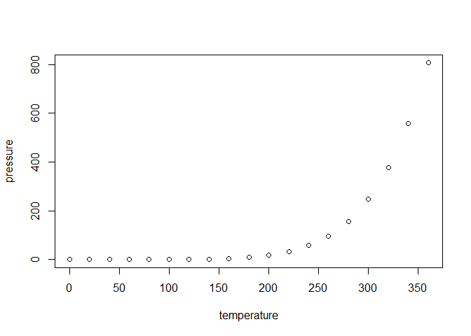

    ## Warning: Paket 'ggridges' wurde unter R Version 4.3.3 erstellt

## Including Plots

You can also embed plots, for example:

Note that the `echo = FALSE` parameter was added to the code chunk to
prevent printing of the R code that generated the plot.
