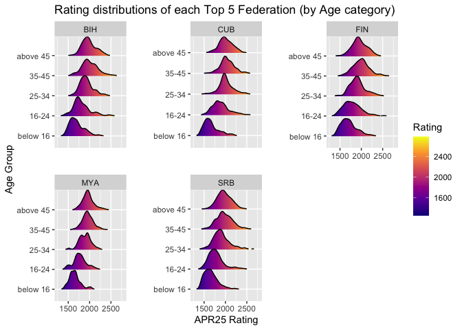
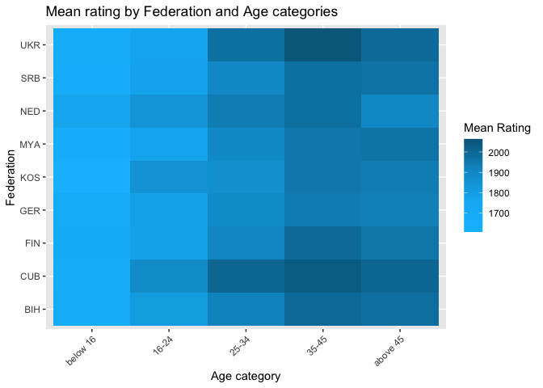

## Dataset Manipulation

    library(tidyverse)
    file <- "standard_rating_list.txt"
    df <- read_fwf(file=file, 
                   fwf_empty(file, 
                            col_names=c("ID", "Name", "Fed", "Sex", "Tit", "WTit", "OTit", "FOA", "APR25", "Gms", "K", "Birthday", "Flag")),
                            skip=1) %>%
          mutate(Fed = na_if(Fed, "NON")) %>%
          drop_na(Birthday, APR25, Fed) %>% # remove rows without birthday or rating
          # filter out rows with invalid birthday year
          filter(Birthday > 1900) %>%
          select(Name, Fed, APR25, Birthday) %>%
          # remove irrelevant columns
          mutate(# using cut already create factor-typed column
                 bin = cut(2024-Birthday, breaks=c(1,16,25,35,46,Inf), labels=c("below 16", "16-24", "25-34", "35-45", "above 45"))
                 ) %>%
          drop_na(bin)

    by_country_by_age <- group_by(df, Fed, bin) %>%
      summarise(mean_rating=mean(APR25, na.rm=TRUE), .groups="drop") %>%
      pivot_wider(names_from=bin, values_from=mean_rating) %>%
      select("Fed", "below 16", "16-24", "25-34", "35-45", "above 45")

    by_country <- group_by(df, Fed) %>%
      summarise(mean_rating=mean(APR25, na.rm=TRUE)) %>%
      arrange(desc(mean_rating)) 

    final_df <- left_join(by_country, by_country_by_age, by="Fed") %>%
      arrange(desc(mean_rating)) %>%
      slice_head(n=10)

    knitr::kable(final_df, format = "pipe", caption="table sorted by average rating of each federation (Top 10)")

<table>
<caption>table sorted by average rating of each federation (Top
10)</caption>
<thead>
<tr>
<th style="text-align: left;">Fed</th>
<th style="text-align: right;">mean_rating</th>
<th style="text-align: right;">below 16</th>
<th style="text-align: right;">16-24</th>
<th style="text-align: right;">25-34</th>
<th style="text-align: right;">35-45</th>
<th style="text-align: right;">above 45</th>
</tr>
</thead>
<tbody>
<tr>
<td style="text-align: left;">CUB</td>
<td style="text-align: right;">1941.712</td>
<td style="text-align: right;">1665.968</td>
<td style="text-align: right;">1885.176</td>
<td style="text-align: right;">2009.319</td>
<td style="text-align: right;">2039.182</td>
<td style="text-align: right;">2009.836</td>
</tr>
<tr>
<td style="text-align: left;">BIH</td>
<td style="text-align: right;">1934.607</td>
<td style="text-align: right;">1699.621</td>
<td style="text-align: right;">1812.250</td>
<td style="text-align: right;">1923.701</td>
<td style="text-align: right;">1999.206</td>
<td style="text-align: right;">1981.751</td>
</tr>
<tr>
<td style="text-align: left;">MYA</td>
<td style="text-align: right;">1917.426</td>
<td style="text-align: right;">1652.611</td>
<td style="text-align: right;">1772.000</td>
<td style="text-align: right;">1893.522</td>
<td style="text-align: right;">1954.941</td>
<td style="text-align: right;">1964.498</td>
</tr>
<tr>
<td style="text-align: left;">FIN</td>
<td style="text-align: right;">1916.444</td>
<td style="text-align: right;">1707.103</td>
<td style="text-align: right;">1786.681</td>
<td style="text-align: right;">1910.691</td>
<td style="text-align: right;">1992.398</td>
<td style="text-align: right;">1955.388</td>
</tr>
<tr>
<td style="text-align: left;">SRB</td>
<td style="text-align: right;">1912.044</td>
<td style="text-align: right;">1657.771</td>
<td style="text-align: right;">1775.522</td>
<td style="text-align: right;">1898.519</td>
<td style="text-align: right;">1975.574</td>
<td style="text-align: right;">1970.373</td>
</tr>
<tr>
<td style="text-align: left;">KOS</td>
<td style="text-align: right;">1906.109</td>
<td style="text-align: right;">1607.316</td>
<td style="text-align: right;">1853.719</td>
<td style="text-align: right;">1868.889</td>
<td style="text-align: right;">1955.057</td>
<td style="text-align: right;">1939.668</td>
</tr>
<tr>
<td style="text-align: left;">NED</td>
<td style="text-align: right;">1903.981</td>
<td style="text-align: right;">1761.653</td>
<td style="text-align: right;">1840.350</td>
<td style="text-align: right;">1938.054</td>
<td style="text-align: right;">1976.723</td>
<td style="text-align: right;">1902.765</td>
</tr>
<tr>
<td style="text-align: left;">UKR</td>
<td style="text-align: right;">1896.574</td>
<td style="text-align: right;">1664.897</td>
<td style="text-align: right;">1772.076</td>
<td style="text-align: right;">1976.746</td>
<td style="text-align: right;">2063.388</td>
<td style="text-align: right;">1993.814</td>
</tr>
<tr>
<td style="text-align: left;">GER</td>
<td style="text-align: right;">1889.695</td>
<td style="text-align: right;">1684.138</td>
<td style="text-align: right;">1791.569</td>
<td style="text-align: right;">1891.149</td>
<td style="text-align: right;">1943.909</td>
<td style="text-align: right;">1929.801</td>
</tr>
<tr>
<td style="text-align: left;">MNE</td>
<td style="text-align: right;">1881.261</td>
<td style="text-align: right;">1578.988</td>
<td style="text-align: right;">1738.929</td>
<td style="text-align: right;">1962.662</td>
<td style="text-align: right;">1975.857</td>
<td style="text-align: right;">1977.656</td>
</tr>
</tbody>
</table>

## Data Visualisation

-   Ridgeline Plots

<!-- -->

    library(ggridges)
    ridgePlot <- df %>%
      filter(Fed %in% c("CUB", "BIH", "MYA","FIN","SRB")) %>%
      ggplot(aes(x = APR25, y = as.factor(bin), fill = ..x..)) +  # Gradient fill based on APR25 rating
      geom_density_ridges_gradient(scale = 1, rel_min_height = 0.01) +  
      facet_wrap(~ Fed, scales = "free_y") +  # One plot per federation
      scale_fill_viridis_c(name = "Rating", option = "C") +  # Apply viridis color scale
      labs(title = "Rating distributions of each Top 5 Federation (by Age category)",
           x = "APR25 Rating",
           y = "Age Group",
           fill = "Rating Intensity") +
      theme(legend.position = "right",
            panel.spacing = unit(2, "lines"))

    ridgePlot

-   Heatmap

<!-- -->

    library(reshape2)

    age_groups <- c("below 16", "16-24", "25-34", "35-45", "above 45") # for strict ordering

    df_heatmap_pivot <- by_country_by_age %>%
      filter(Fed %in% c("NON", "CUB", "BIH", "MYA","FIN","SRB", "KOS", "NED", "UKR", "GER")) %>%
      select(Fed, all_of(age_groups)) %>%
      pivot_longer(cols = all_of(age_groups), 
                   names_to = "Age", 
                   values_to = "APR25")

    df_heatmap_pivot$Age <- factor(df_heatmap_pivot$Age, levels = age_groups) # to fix the age order

    ggplot(df_heatmap_pivot, aes(x = Age, y = Fed, fill = APR25)) +
      geom_tile() +  # heatmap needs tiles
      scale_fill_gradientn(colors = colorRampPalette(c("yellow","deepskyblue2", "deepskyblue4"))(20),
                           name = "Mean Rating") + # more fine-grained palette
      labs(title = "Mean rating by Federation and Age categories", 
           x = "Age category", 
           y = "Federation") + 
      theme(axis.text.x = element_text(angle = 45, hjust = 1))  # rotate x-axis and align with plot)

