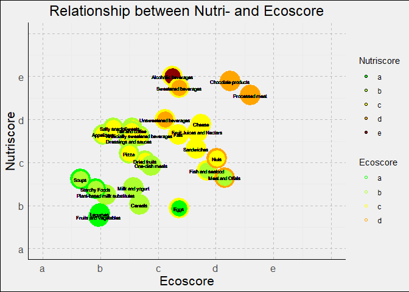

# Solution for Jan’s project

This is my current solution for Jan’s project. The goal was to create a
plot with eco- and nutriscore of different food groups. I have to admit
that I used ChatGPT quite a lot for this project, as I didn’t have too
much time on hand. So if you see any ways how the code can be optimised,
feel free to let me know!

## Step 1: install libraries

## Step 2: load data and select variables

I used the subset Jan provided and selected the following variables:
nutriscore\_grade, ecoscore\_grade and pnns\_groups\_1 and 2 (those
included the different food categories). I then deleted rows containing
missing data.

This is how the dataset looks like:

    ## # A tibble: 6 × 4
    ##   nutriscore_grade ecoscore_grade pnns_groups_1         pnns_groups_2    
    ##   <chr>            <chr>          <chr>                 <chr>            
    ## 1 d                c              Sugary snacks         Sweets           
    ## 2 c                c              Sugary snacks         Sweets           
    ## 3 a                b              Fruits and vegetables Fruits           
    ## 4 d                b              Cereals and potatoes  Cereals          
    ## 5 c                b              Salty snacks          Appetizers       
    ## 6 a                b              Cereals and potatoes  Breakfast cereals

## Step 3: Combine food categories

As the food categories were saved in two variables, I tried to combine
them. Those were the different categories in pnns\_groups\_1:

    ## # A tibble: 10 × 2
    ## # Groups:   pnns_groups_1 [10]
    ##    pnns_groups_1               n
    ##    <chr>                   <int>
    ##  1 Alcoholic beverages         4
    ##  2 Beverages                1876
    ##  3 Cereals and potatoes     4009
    ##  4 Composite foods          1184
    ##  5 Fat and sauces           2406
    ##  6 Fish Meat Eggs           3133
    ##  7 Fruits and vegetables    1840
    ##  8 Milk and dairy products  6222
    ##  9 Salty snacks             1498
    ## 10 Sugary snacks            4477

And those were the groups in pnns\_groups\_2:

    ## # A tibble: 38 × 2
    ## # Groups:   pnns_groups_2 [38]
    ##    pnns_groups_2                        n
    ##    <chr>                            <int>
    ##  1 Alcoholic beverages                  4
    ##  2 Appetizers                         353
    ##  3 Artificially sweetened beverages    66
    ##  4 Biscuits and cakes                1678
    ##  5 Bread                              770
    ##  6 Breakfast cereals                 1263
    ##  7 Cereals                           1182
    ##  8 Cheese                            3337
    ##  9 Chocolate products                 902
    ## 10 Dairy desserts                     551
    ## # ℹ 28 more rows

As you can see, the second group was way more detailed. I decided to
combine the following categories and keep the other categories as they
are in pnns\_groups\_2.

    data <- data %>%
      mutate(pnns_groups_2 = case_when(
        pnns_groups_2 %in% c("Breakfast cereals", "Cereals") ~ "Cereals",
        pnns_groups_2 %in% c("Sweets", "Biscuits and cakes", "Ice cream", "Dairy desserts", "Pastries") ~ "Sweets",
        pnns_groups_2 %in% c("Fruits", "Vegetables") ~ "Fruits and Vegetables",
        pnns_groups_2 %in% c("Fruit juices", "Fruit nectars") ~ "Fruit Juices and Nectars",
        pnns_groups_2 %in% c("Potatoes", "Bread") ~ "Starchy Foods",
        pnns_groups_2 %in% c("Meat", "Offals") ~ "Meat and Offals",
        pnns_groups_2 == "Salty and fatty products" ~ "Salty snacks",
        pnns_groups_2 == "Teas and herbal teas and coffees" ~ "Tea and coffee",
        pnns_groups_2 == "Pizza pies and quiches" ~ "Pizza",
        TRUE ~ pnns_groups_2
      ))

Now it looks like this:

    ## # A tibble: 29 × 2
    ## # Groups:   pnns_groups_2 [29]
    ##    pnns_groups_2                        n
    ##    <chr>                            <int>
    ##  1 Alcoholic beverages                  4
    ##  2 Appetizers                         353
    ##  3 Artificially sweetened beverages    66
    ##  4 Cereals                           2445
    ##  5 Cheese                            3337
    ##  6 Chocolate products                 902
    ##  7 Dressings and sauces              1732
    ##  8 Dried fruits                       201
    ##  9 Eggs                               153
    ## 10 Fats                               674
    ## # ℹ 19 more rows

## Step 4: Create and reshape matrix to count

Because each category in itself varied a lot in their eco- and
nutriscore, I then had to create a matrix for each category, counting
how often which combination of nutri- and ecoscore appeared. To do this
I first extracted the categories and defined possible values of nutri-
and ecoscores. I alsp created a dataframe containing all possible
combinations of nutri- and ecoscores.

    categories <- unique(data$pnns_groups_2)
    grades <- c('a', 'b', 'c', 'd', 'e')
    combinations <- expand.grid(nutriscore_grade = grades, ecoscore_grade = grades)

I then grouped the counts for each foodgroup:

    grouped_counts <- data %>% 
      group_by( pnns_groups_2, nutriscore_grade, ecoscore_grade ) %>% 
      count() %>% 
      ungroup()

    grouped_counts

    ## # A tibble: 496 × 4
    ##    pnns_groups_2       nutriscore_grade ecoscore_grade     n
    ##    <chr>               <chr>            <chr>          <int>
    ##  1 Alcoholic beverages e                c                  3
    ##  2 Alcoholic beverages e                d                  1
    ##  3 Appetizers          a                b                  7
    ##  4 Appetizers          b                a                  2
    ##  5 Appetizers          b                b                  8
    ##  6 Appetizers          b                e                  1
    ##  7 Appetizers          c                a                 13
    ##  8 Appetizers          c                b                 84
    ##  9 Appetizers          c                c                  3
    ## 10 Appetizers          c                e                  3
    ## # ℹ 486 more rows

Then I had to count, how often each combination appeared in each
category. To do this, I created a list of dataframes with one dataframe
for each category. Each dataframe contains the count of each possible
combination.

    list_of_data_counts <- lapply(categories, function(cat) {
      # filter grouped data for current category and left-join it with possible combinations
      combinations %>% 
        left_join(grouped_counts %>%
                    filter(pnns_groups_2 == cat), by = c("nutriscore_grade", "ecoscore_grade"))%>%
        # change NA counts to zero
        mutate(n = replace_na(n, 0), pnns_groups_2 = replace_na(pnns_groups_2, cat)) %>% 
        # delete pnns_groups_2 row
        select(-"pnns_groups_2") %>% 
        # change format of table
        pivot_wider(names_from = ecoscore_grade, 
                    values_from = n, 
                    values_fill = list(n = 0)) %>% 
        # change order of rows so a is at bottom
        arrange(match(nutriscore_grade, rev(grades))) %>% 
        # make it a dataframe
        as.data.frame() %>% 
      # delete first row
        select(-1)
    })

    names(list_of_data_counts) <- categories

Here is an example, how such a dataframe looks like for Sweets:

    ##     a    b   c   d  e
    ## 1  16  341 656 284 12
    ## 2 244 1151 550 123 20
    ## 3  62  390 122  66  4
    ## 4  21   83 138  58  0
    ## 5  20  118  60 127  1

## Step 5: Calculating center of mass

Now I had to calculate the center of mass for every category.

    center_of_mass <- lapply(list_of_data_counts, function(count_matrix) {
      # sum entries in count_matrix
      num <- sum(count_matrix)
      # weighting of columns
      column_weights <- colSums(count_matrix) / num
      # reverse sequence of rows
      count_matrix <- count_matrix[rev(rownames(count_matrix)), ]
      # weighting of rows
      row_weights <- rowSums(count_matrix) / num
      # calculation of center of mass, return x and y coordinates
      c(sum(column_weights * 0:4), sum(row_weights * 0:4))
    })

Here is how this looks for Sweets as an example:

    center_of_mass[['Sweets']]

    ## [1] 1.554960 2.804371

## Step 6: Calculating size of bubbles

The size of bubbles was defined as the variance inside of the
categories. That means that a category that differed a lot in eco- and
nutriscore should have a bigger bubble size. Therefore, I first had to
calculate the variances of the categories:

    variance_data <- data %>%
      # group by categories
      group_by(pnns_groups_2) %>%
      summarise(
        # calculate variance in nutriscore per category
        nutriscore_var = var(as.numeric(factor(nutriscore_grade, levels = grades)), na.rm = TRUE),
        # calculate variance in ecoscore per category
        ecoscore_var = var(as.numeric(factor(ecoscore_grade, levels = grades)), na.rm = TRUE),
        # bubbles size is sum of both variances
        bubble_size = nutriscore_var + ecoscore_var
      )

    head(variance_data)

    ## # A tibble: 6 × 4
    ##   pnns_groups_2                    nutriscore_var ecoscore_var bubble_size
    ##   <chr>                                     <dbl>        <dbl>       <dbl>
    ## 1 Alcoholic beverages                       0            0.25        0.25 
    ## 2 Appetizers                                0.540        0.293       0.834
    ## 3 Artificially sweetened beverages          0.824        1.76        2.58 
    ## 4 Cereals                                   1.38         1.39        2.77 
    ## 5 Cheese                                    0.281        0.303       0.584
    ## 6 Chocolate products                        0.110        0.550       0.661

Then I scaled the bubbles size to 1000 based on the maximum.

    # get maximum of bubble site
    max_bubble_size <- max(variance_data$bubble_size)
    # scale bubble size based on max
    variance_data <- variance_data %>%
      mutate(bubble_size = (bubble_size / max_bubble_size) * 1000)

    head(variance_data)

    ## # A tibble: 6 × 4
    ##   pnns_groups_2                    nutriscore_var ecoscore_var bubble_size
    ##   <chr>                                     <dbl>        <dbl>       <dbl>
    ## 1 Alcoholic beverages                       0            0.25         90.2
    ## 2 Appetizers                                0.540        0.293       301. 
    ## 3 Artificially sweetened beverages          0.824        1.76        931. 
    ## 4 Cereals                                   1.38         1.39       1000  
    ## 5 Cheese                                    0.281        0.303       211. 
    ## 6 Chocolate products                        0.110        0.550       238.

As you can see, Cereals had the biggest variance = bubble size, so they
now have a scaled bubble size of 1000.

## Step 7: combine center of mass and variance

I was not able to combine the computation of center of mass and variance
in one step, as Martin had suggested. I therefore now combine the two.

    final_data <- variance_data %>%
      merge(data.frame(
      category = names(center_of_mass),
      center_x = sapply(center_of_mass, function(x) x[1]),
      center_y = sapply(center_of_mass, function(x) x[2])))%>%
      mutate(
        color_factor_x = factor(floor(center_x)),
        color_factor_y = factor(floor(center_y))
      )

    head(final_data)

    ##                      pnns_groups_2 nutriscore_var ecoscore_var bubble_size
    ## 1              Alcoholic beverages      0.0000000    0.2500000    90.16619
    ## 2                       Appetizers      0.5401751    0.2933943   300.63909
    ## 3 Artificially sweetened beverages      0.8235431    1.7587413   931.33893
    ## 4                          Cereals      1.3804976    1.3921604  1000.00000
    ## 5                           Cheese      0.2812124    0.3032547   210.79670
    ## 6               Chocolate products      0.1102692    0.5503530   238.26314
    ##   category center_x center_y color_factor_x color_factor_y
    ## 1   Sweets  1.55496 2.804371              1              2
    ## 2   Sweets  1.55496 2.804371              1              2
    ## 3   Sweets  1.55496 2.804371              1              2
    ## 4   Sweets  1.55496 2.804371              1              2
    ## 5   Sweets  1.55496 2.804371              1              2
    ## 6   Sweets  1.55496 2.804371              1              2

## Step 8: Plot

Now it is finally time to plot!

    final_data %>% 
    ggplot(aes(x = center_x, y = center_y)) +
      # fill = nutri, colour = eco, shape: circles
      geom_point(aes(size = bubble_size, color = color_factor_x, fill = color_factor_y, stroke = 2), shape = 21) +
      # no legend, set size of bubbles
      scale_size_continuous(range = c(1, 10), guide = "none") +
      scale_fill_identity() +
      # add category-label
      geom_text(aes(label = category), size = 2) +
      # add labs
      labs(x = "Ecoscore", y = "Nutriscore", title = "Relationship between Nutri- and Ecoscore") +
      # add scale
      scale_x_continuous(breaks = 0:5, labels = c('a', 'b', 'c', 'd', 'e', '')) +
      scale_y_continuous(breaks = 0:5, labels = c('a', 'b', 'c', 'd', 'e', '')) +
      coord_cartesian(xlim = c(0, 5), ylim = c(0, 5)) +
      # color them
      scale_fill_manual(
        name = "Nutriscore",
        values = c("green", "greenyellow", "yellow", "orange", "darkred"),
        labels = c('a', 'b', 'c', 'd', 'e'))+
      scale_color_manual(
        name = "Ecoscore",
        values = c("green", "greenyellow", "yellow", "orange", "darkred"),
        labels = c('a', 'b', 'c', 'd', 'e')) +
      # change design
      theme_minimal() +
      theme(
        plot.background = element_rect(fill = "#f0f0f0"),
        panel.grid.major = element_line(color = "gray", linetype = "dashed"),
        axis.line = element_line(color = "black"),
        axis.title.x = element_text(size = 16),
        axis.title.y = element_text(size = 16),
        axis.text.x = element_text(size = 12),
        axis.text.y = element_text(size = 12),
        plot.title = element_text(size = 18, hjust = 0.5)
      )

    ## Scale for fill is already present.
    ## Adding another scale for fill, which will replace the existing scale.

As you can see, the category labels are a little all over the place. But
I’m quite happy how close I got to Jans plot!
