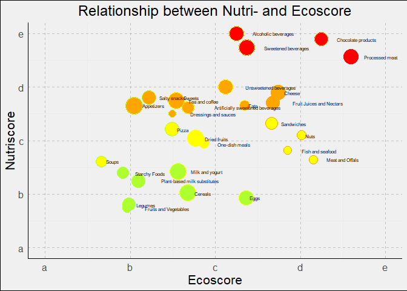

# Solution for Jan’s project

This is my current solution for Jan’s project. The goal was to create a
plot with eco- and nutriscore of different food groups. I have to admit
that I used ChatGPT quite a lot for this project, as I didn’t have too
much time on hand. So if you see any ways how the code can be optimised,
feel free to let me know!

## Step 1: install libraries

    library("dplyr")

    ## 
    ## Attache Paket: 'dplyr'

    ## Die folgenden Objekte sind maskiert von 'package:stats':
    ## 
    ##     filter, lag

    ## Die folgenden Objekte sind maskiert von 'package:base':
    ## 
    ##     intersect, setdiff, setequal, union

    library("tidyverse")

    ## ── Attaching core tidyverse packages ──────────────────────── tidyverse 2.0.0 ──
    ## ✔ forcats   1.0.0     ✔ readr     2.1.5
    ## ✔ ggplot2   3.5.0     ✔ stringr   1.5.1
    ## ✔ lubridate 1.9.3     ✔ tibble    3.2.1
    ## ✔ purrr     1.0.2     ✔ tidyr     1.3.1

    ## ── Conflicts ────────────────────────────────────────── tidyverse_conflicts() ──
    ## ✖ dplyr::filter() masks stats::filter()
    ## ✖ dplyr::lag()    masks stats::lag()
    ## ℹ Use the conflicted package (<http://conflicted.r-lib.org/>) to force all conflicts to become errors

    library("ggplot2")

## Step 2: load data and select variables

I used the subset Jan provided and selected the following variables:
nutriscore\_grade, ecoscore\_grade and pnns\_groups\_1 and 2 (those
included the different food categories). I then deleted rows containing
missing data.

    data <- read.csv("data_openfood.csv") %>%
      select(nutriscore_grade, ecoscore_grade, pnns_groups_1, pnns_groups_2) %>%
      # Delete rows only containing NA or unknown/not-applicable
      filter(!(is.na(nutriscore_grade) | nutriscore_grade %in% c("unknown", "not-applicable")),
             !(is.na(ecoscore_grade) | ecoscore_grade %in% c("unknown", "not-applicable")),
             # deleting data not having any food category
             !(pnns_groups_1 == "unknown" & pnns_groups_2 == "unknown"))

This is how the dataset looks like:

    ##   nutriscore_grade ecoscore_grade         pnns_groups_1     pnns_groups_2
    ## 1                d              c         Sugary snacks            Sweets
    ## 2                c              c         Sugary snacks            Sweets
    ## 3                a              b Fruits and vegetables            Fruits
    ## 4                d              b  Cereals and potatoes           Cereals
    ## 5                c              b          Salty snacks        Appetizers
    ## 6                a              b  Cereals and potatoes Breakfast cereals

## Step 3: Combine food categories

As the food categories were saved in two variables, I tried to combine
them. Those were the different categories in pnns\_groups\_1:

    ## 
    ##     Alcoholic beverages               Beverages    Cereals and potatoes 
    ##                       4                    1876                    4009 
    ##         Composite foods          Fat and sauces          Fish Meat Eggs 
    ##                    1184                    2406                    3133 
    ##   Fruits and vegetables Milk and dairy products            Salty snacks 
    ##                    1840                    6222                    1498 
    ##           Sugary snacks 
    ##                    4477

And those were the groups in pnns\_groups\_2:

    ## 
    ##              Alcoholic beverages                       Appetizers 
    ##                                4                              353 
    ## Artificially sweetened beverages               Biscuits and cakes 
    ##                               66                             1678 
    ##                            Bread                Breakfast cereals 
    ##                              770                             1263 
    ##                          Cereals                           Cheese 
    ##                             1182                             3337 
    ##               Chocolate products                   Dairy desserts 
    ##                              902                              551 
    ##             Dressings and sauces                     Dried fruits 
    ##                             1732                              201 
    ##                             Eggs                             Fats 
    ##                              153                              674 
    ##                 Fish and seafood                     Fruit juices 
    ##                             1073                              803 
    ##                    Fruit nectars                           Fruits 
    ##                              122                              476 
    ##                        Ice cream                          Legumes 
    ##                              541                              622 
    ##                             Meat                  Milk and yogurt 
    ##                              430                             1793 
    ##                             Nuts                           Offals 
    ##                              710                                9 
    ##                   One-dish meals                         Pastries 
    ##                              962                              104 
    ##           Pizza pies and quiches     Plant-based milk substitutes 
    ##                              169                              483 
    ##                         Potatoes                   Processed meat 
    ##                              172                             1468 
    ##         Salty and fatty products                       Sandwiches 
    ##                              435                               53 
    ##                            Soups              Sweetened beverages 
    ##                               59                              328 
    ##                           Sweets Teas and herbal teas and coffees 
    ##                             1793                               57 
    ##            Unsweetened beverages                       Vegetables 
    ##                               17                             1104

As you can see, the second group was way more detailed. I decided to
combine the following categories and keep the other categories as they
are in pnns\_groups\_2.

    data <- data %>%
      mutate(pnns_groups_2 = case_when(
        pnns_groups_2 %in% c("Breakfast cereals", "Cereals") ~ "Cereals",
        pnns_groups_2 %in% c("Sweets", "Biscuits and cakes", "Ice cream", "Dairy desserts", "Pastries") ~ "Sweets",
        pnns_groups_2 %in% c("Fruits", "Vegetables") ~ "Fruits and Vegetables",
        pnns_groups_2 %in% c("Fruit juices", "Fruit nectars") ~ "Fruit Juices and Nectars",
        pnns_groups_2 %in% c("Potatoes", "Bread") ~ "Starchy Foods",
        pnns_groups_2 %in% c("Meat", "Offals") ~ "Meat and Offals",
        pnns_groups_2 == "Salty and fatty products" ~ "Salty snacks",
        pnns_groups_2 == "Teas and herbal teas and coffees" ~ "Tea and coffee",
        pnns_groups_2 == "Pizza pies and quiches" ~ "Pizza",
        TRUE ~ pnns_groups_2
      ))

Now it looks like this:

    ## 
    ##              Alcoholic beverages                       Appetizers 
    ##                                4                              353 
    ## Artificially sweetened beverages                          Cereals 
    ##                               66                             2445 
    ##                           Cheese               Chocolate products 
    ##                             3337                              902 
    ##             Dressings and sauces                     Dried fruits 
    ##                             1732                              201 
    ##                             Eggs                             Fats 
    ##                              153                              674 
    ##                 Fish and seafood         Fruit Juices and Nectars 
    ##                             1073                              925 
    ##            Fruits and Vegetables                          Legumes 
    ##                             1580                              622 
    ##                  Meat and Offals                  Milk and yogurt 
    ##                              439                             1793 
    ##                             Nuts                   One-dish meals 
    ##                              710                              962 
    ##                            Pizza     Plant-based milk substitutes 
    ##                              169                              483 
    ##                   Processed meat                     Salty snacks 
    ##                             1468                              435 
    ##                       Sandwiches                            Soups 
    ##                               53                               59 
    ##                    Starchy Foods              Sweetened beverages 
    ##                              942                              328 
    ##                           Sweets                   Tea and coffee 
    ##                             4667                               57 
    ##            Unsweetened beverages 
    ##                               17

## Step 4: Create and reshape matrix to count

Because each category in itself varied a lot in their eco- and
nutriscore, I then had to create a matrix for each category, counting
how often which combination of nutri- and ecoscore appeared. To do this
I first extracted the categories and defined possible values of nutri-
and ecoscores.

    categories <- unique(data$pnns_groups_2)
    grades <- c('a', 'b', 'c', 'd', 'e')

Then I had to count, how often each combination appeared in each
category. To do this, I created a list of dataframes with one dataframe
for each category. Each dataframe contains the count of each possible
combination.

    list_of_data_counts <- lapply(categories, function(cat) {
      data_category <- data %>% filter(pnns_groups_2 == cat)  # filters data for current category
      # creates matrix counting frequency of each combination of nutri- and ecoscore
      # outer function is used to apply a function to all pairs of elements from two vectors
      count_matrix <- outer(grades, grades, Vectorize(function(grade1, grade2) {
        sum(data_category$nutriscore_grade == grade1 & data_category$ecoscore_grade == grade2)  # counts the combination
      }))
      count_matrix <- count_matrix[rev(seq_along(grades)), ]  # reverses sequence of rows so a is at bottom
      colnames(count_matrix) <- grades  # puts column names to values in grades
      rownames(count_matrix) <- rev(grades)  # puts reversed grades as row names
      as.data.frame(count_matrix)  # converts matrix to dataframe me
    })

    # naming the elements of list according to category name
    names(list_of_data_counts) <- categories

Here is an example, how such a dataframe looks like for Sweets:

    ##     a    b   c   d  e
    ## e  16  341 656 284 12
    ## d 244 1151 550 123 20
    ## c  62  390 122  66  4
    ## b  21   83 138  58  0
    ## a  20  118  60 127  1

## Setp 5: Calculating center of mass

Now I had to calculate the center of mass for every category.

    center_of_mass <- lapply(list_of_data_counts, function(count_matrix) {
      # sum entries in count_matrix
      num <- sum(count_matrix)
      # weighting of columns
      column_weights <- colSums(count_matrix) / num
      # reverse sequence of rows
      count_matrix <- count_matrix[rev(rownames(count_matrix)), ]
      # weighting of rows
      row_weights <- rowSums(count_matrix) / num
      # calculation of center of mass, return x and y coordinates
      c(sum(column_weights * 0:4), sum(row_weights * 0:4))
    })

Here is how this looks for Sweets as an example:

    center_of_mass[['Sweets']]

    ## [1] 1.554960 2.804371

## Step 6: Calculating size of bubbles

The size of bubbles was defined as the variance inside of the
categories. That means that a category that differed a lot in eco- and
nutriscore should have a bigger bubble size. Therefore, I first had to
calculate the variances of the categories:

    variance_data <- data %>%
      # group by categories
      group_by(pnns_groups_2) %>%
      summarise(
        # calculate variance in nutriscore per category
        nutriscore_var = var(as.numeric(factor(nutriscore_grade, levels = grades)), na.rm = TRUE),
        # calculate variance in ecoscore per category
        ecoscore_var = var(as.numeric(factor(ecoscore_grade, levels = grades)), na.rm = TRUE),
        # bubbles size is sum of both variances
        bubble_size = nutriscore_var + ecoscore_var
      )

    head(variance_data)

    ## # A tibble: 6 × 4
    ##   pnns_groups_2                    nutriscore_var ecoscore_var bubble_size
    ##   <chr>                                     <dbl>        <dbl>       <dbl>
    ## 1 Alcoholic beverages                       0            0.25        0.25 
    ## 2 Appetizers                                0.540        0.293       0.834
    ## 3 Artificially sweetened beverages          0.824        1.76        2.58 
    ## 4 Cereals                                   1.38         1.39        2.77 
    ## 5 Cheese                                    0.281        0.303       0.584
    ## 6 Chocolate products                        0.110        0.550       0.661

Then I scaled the bubbles size to 1000 based on the maximum.

    # get maximum of bubble site
    max_bubble_size <- max(variance_data$bubble_size)
    # scale bubble size based on max
    variance_data <- variance_data %>%
      mutate(bubble_size = (bubble_size / max_bubble_size) * 1000)

    head(variance_data)

    ## # A tibble: 6 × 4
    ##   pnns_groups_2                    nutriscore_var ecoscore_var bubble_size
    ##   <chr>                                     <dbl>        <dbl>       <dbl>
    ## 1 Alcoholic beverages                       0            0.25         90.2
    ## 2 Appetizers                                0.540        0.293       301. 
    ## 3 Artificially sweetened beverages          0.824        1.76        931. 
    ## 4 Cereals                                   1.38         1.39       1000  
    ## 5 Cheese                                    0.281        0.303       211. 
    ## 6 Chocolate products                        0.110        0.550       238.

As you can see, Cereals had the biggest variance = bubble size, so they
now have a scaled bubble size of 1000.

## Step 7: Plot

Now it is time to plot the data. But first, I have to prepare the data.
I first extracted the bubble size for each catagory.

    bubble_sizes <- variance_data[variance_data$pnns_groups_2 %in% categories, "bubble_size"]

And I extracted the x- and y-coordinates from center\_of\_mass.

    x_coordinates <- sapply(center_of_mass, function(x) x[1])
    y_coordinates <- sapply(center_of_mass, function(x) x[2])

Another objective of the project was to display the bubble colours based
on the average of the coordinates. I used the colour scale provided in
the project description.

    average_coordinates <- (x_coordinates + y_coordinates) / 2

    get_color <- function(average) {
      if (average <= 0.5) {
        return("green")
      } else if (average <= 1.5) {
        return("greenyellow")
      } else if (average <= 2.5) {
        return("yellow")
      } else if (average <= 3.5) {
        return("orange")
      } else {
        return("red")
      }
    }

    # calculate colors for x coordinates
    color_x <- sapply(x_coordinates, get_color)

    # calculate colors for y coordinates
    color_y <- sapply(y_coordinates, get_color)

Lastly, I created a dataframe to be used for plotting.

    plot_data <- data.frame(
      x = x_coordinates,
      y = y_coordinates,
      category = categories,
      bubble_size = bubble_sizes,
      color_nutri = color_x,
      color_eco = color_y
    )

    head(plot_data)

    ##                               x         y              category bubble_size
    ## Sweets                1.5549604 2.8043711                Sweets    90.16619
    ## Fruits and Vegetables 0.9677215 0.7379747 Fruits and Vegetables   300.63909
    ## Cereals               1.6817996 1.0208589               Cereals   931.33893
    ## Appetizers            1.0453258 2.6515581            Appetizers  1000.00000
    ## Dressings and sauces  1.4965358 2.5005774  Dressings and sauces   210.79670
    ## Fish and seafood      2.8518173 1.8117428      Fish and seafood   238.26314
    ##                       color_nutri   color_eco
    ## Sweets                     yellow      orange
    ## Fruits and Vegetables greenyellow greenyellow
    ## Cereals                    yellow greenyellow
    ## Appetizers            greenyellow      orange
    ## Dressings and sauces  greenyellow      orange
    ## Fish and seafood           orange      yellow

Now it is finally time to plot!

    plot_data %>% 
    ggplot(aes(x = x, y = y)) +
      # fill = nutri, colour = eco, shape: circles
      geom_point(aes(size = bubble_size, fill = color_y), shape = 21 , colour = color_x) +
      # no legend, set size of bubbles
      scale_size_continuous(range = c(1, 10), guide = "none") +
      scale_fill_identity() +
      # add category-label
      geom_text(aes(label = category), hjust = -0.4, size = 2) +
      # add labs
      labs(x = "Ecoscore", y = "Nutriscore", title = "Relationship between Nutri- and Ecoscore") +
      # add scale
      scale_x_continuous(breaks = 0:4, labels = c('a', 'b', 'c', 'd', 'e')) +
      scale_y_continuous(breaks = 0:4, labels = c('a', 'b', 'c', 'd', 'e')) +
      coord_cartesian(xlim = c(0, 4), ylim = c(0, 4)) +
      # change design
      theme_minimal() +
      theme(
        plot.background = element_rect(fill = "#f0f0f0"),
        panel.grid.major = element_line(color = "gray", linetype = "dashed"),
        axis.line = element_line(color = "black"),
        axis.title.x = element_text(size = 16),
        axis.title.y = element_text(size = 16),
        axis.text.x = element_text(size = 12),
        axis.text.y = element_text(size = 12),
        plot.title = element_text(size = 18, hjust = 0.5)
      )

As you can see, the category labels are a little all over the place. But
I’m quite happy how close I got to Jans plot!
