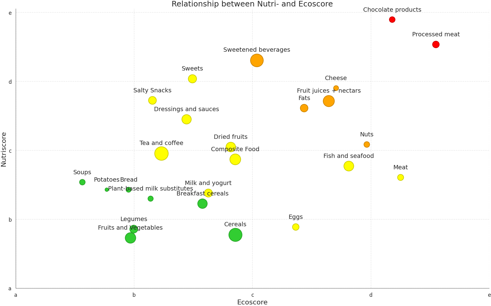
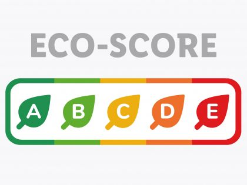
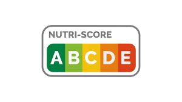

A while back I did a data class where we had to do a project on any dataset we wanted. Our group decided on the Openfoodfacts data set. We were interested in the relationship between nutritional value and environmental impact of food products sold in Germany. We did the project in Python and now I would like to know how it would like in R. 

### About the Data set
Openfoodfacts is an app and website where users can look up any information about food products either by scanning the bar code or searching for it manually. 

The information users can look up include e.g production places, nutritional information like fat, sugar, protein per 100g and front-package labels such as the Nutriscore, Ecoscore and NOVA groups.

The data on the website is crowdsourced, meaning users can enter information about food products on their own. This results in a lot of missing and therefore messy data.   

There are two options to download the dataset.

1. Downloading the whole data set. 

It is quite huge which could make computations difficult. But if you know ways of dealing with huge data sets in R feel free to download the whole dataset from the [Openfoodfacts Website](https://world.openfoodfacts.org/data).

It is also possible to read in specific columns of the dataset while it is in a zip-folder. I provided an example on github titled "reading_dataset_germany.csv" which downloads the relevant information for the project.  

2. Downloading a subset of the data

Using the [advanced search form](https://world.openfoodfacts.org/cgi/search.pl) you can download a subset of the data by specifying a criterion like **countries = Germany** to get all the products sold in Germany. 
Sometimes the website has high traffic, making downloading the dataset difficult, because the download would timeout and fail on the website. 

If none of these methods work, I provided a subset of the data in the project folder on github. It is basically the original dataset but only products sold in Germany. 
 

### Goal of the Project
The goal of this project is to analyze the relationship between nutritional value and environmental impact of different food groups sold within germany. Particularly we are interested in discovering foods which are both healthy and environmentally friendly.

Both factors are summarised as the Nutriscore and Ecoscore respectively. They are front-package labels originating from France, which try to communicate health and impact on the environment on a 5 step colored scale.

- A = highly nutritional / low environmental impact
- E = low nutritional value / high environmental impact

## Visualization Goals
In the end I would like to see a bubble plot that shows the relationship between Nutriscore and Ecoscore divided by categories. Here you can see an example.

#### Visualization priorities (from high to low)
- Ecoscore on the x axis
- Nutriscore on the y axis 
- The size of the bubble should determined by how widespread the combinations of Nutri- and Ecoscore labels are. For example if most of the products in the category "Milk" have the combination of Nutriscore A and Ecoscore B then the center of the bubble should be there in the graph. Depending on how many other combination the specific category shows the bigger the bubble. Originally we did this by using a heatmap for each category.
- coloring of the bubbles with the colors of the nutriscore and ecoscore colors (e.g. if something has nutriscore of B and an ecoscore of B then it is colored green. Pay attention to the in between cases (e.g Nutriscore B and Ecoscore D). One way if doing this is to fill the bubble with one color and use a ring for the other color. (Below you can find the logo for Nutri- and Ecoscore)
- The data set contains several categorization variables. 
The plot above uses the *pnns_groups_1* and *pnns_groups_2* from the full data set. The same variables are called *off:food_groups* and *off:food_groups_tags* in the subset data set you get from the advanced search option on Openfoodfacts. They differ in their level of detail. For example, pnns_group_1 contains the category "Milk, yoghurt and dairy" while pnns_group_2 splits this up in "Milk", "dairy", and "yoghurt". In the original project we used both variables and comnbined some of them. Maybe you can find a useful combinations of them as well? 

