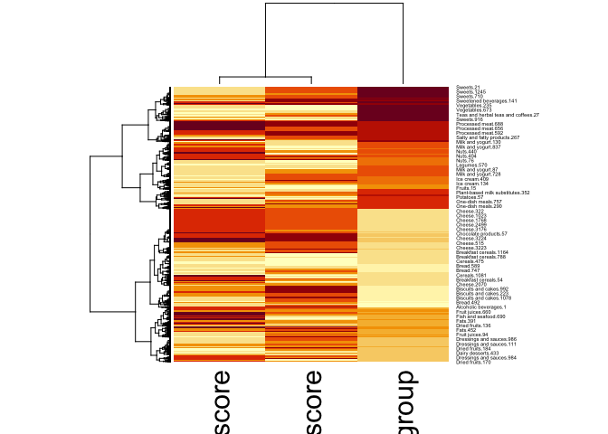

## Solution for Jan’s project

This is my attempt for a solution for Jan’s project. I will use the
dataset that Jan provided.

### Libraries

    library(tidyverse)

    ## Warning: package 'ggplot2' was built under R version 4.2.3

    ## Warning: package 'dplyr' was built under R version 4.2.3

    ## Warning: package 'stringr' was built under R version 4.2.3

    ## ── Attaching core tidyverse packages ──────────────────────── tidyverse 2.0.0 ──
    ## ✔ dplyr     1.1.4     ✔ readr     2.1.4
    ## ✔ forcats   1.0.0     ✔ stringr   1.5.1
    ## ✔ ggplot2   3.5.1     ✔ tibble    3.2.1
    ## ✔ lubridate 1.9.2     ✔ tidyr     1.3.0
    ## ✔ purrr     1.0.1     
    ## ── Conflicts ────────────────────────────────────────── tidyverse_conflicts() ──
    ## ✖ dplyr::filter() masks stats::filter()
    ## ✖ dplyr::lag()    masks stats::lag()
    ## ℹ Use the conflicted package (<http://conflicted.r-lib.org/>) to force all conflicts to become errors

    library(ggrepel)

    ## Warning: package 'ggrepel' was built under R version 4.2.3

### Read in data

    # read in dataset
    food_data <- read.csv("/Users/sarahlober/Data Projects with R and GitHub/Projects/jan-thiele7/data_openfood.csv")
    head(food_data)

    ##   X                                 product_name countries_en nutriscore_grade
    ## 1 1                                     Andr\xe8      Germany             <NA>
    ## 2 2                                         Test      Germany             <NA>
    ## 3 3 Katsuobushi (Dried and smoked bonito flakes)      Germany                b
    ## 4 4                                         <NA>      Germany             <NA>
    ## 5 5                                     blabblub      Germany             <NA>
    ## 6 6                             Steak Kr\xe4uter      Germany          unknown
    ##   ecoscore_grade pnns_groups_1 pnns_groups_2
    ## 1        unknown       unknown       unknown
    ## 2        unknown       unknown       unknown
    ## 3        unknown       unknown       unknown
    ## 4        unknown       unknown       unknown
    ## 5        unknown       unknown       unknown
    ## 6        unknown       unknown       unknown

I did not quite grasp the categories in the categorization variables as
the head does not tell me much about them, so I’m taking a look at them
first. I then decided to go with the second group category only, as this
gives more information about the categories than groups 1.

    table(food_data$pnns_groups_1)

    ## 
    ##     Alcoholic beverages               Beverages    Cereals and potatoes 
    ##                    1832                    5150                    7696 
    ##         Composite foods          Fat and sauces          Fish Meat Eggs 
    ##                    4257                    4356                    6938 
    ##   Fruits and vegetables Milk and dairy products            Salty snacks 
    ##                    4984                    8585                    2509 
    ##           Sugary snacks                 unknown 
    ##                    9205                  111680

    table(food_data$pnns_groups_2)

    ## 
    ##              Alcoholic beverages                       Appetizers 
    ##                             1832                              513 
    ## Artificially sweetened beverages               Biscuits and cakes 
    ##                              548                             3124 
    ##                            Bread                Breakfast cereals 
    ##                             1782                             1430 
    ##                          Cereals                           Cheese 
    ##                             3186                             3753 
    ##               Chocolate products                   Dairy desserts 
    ##                             1587                             1200 
    ##             Dressings and sauces                     Dried fruits 
    ##                             3235                              439 
    ##                             Eggs                             Fats 
    ##                              345                             1121 
    ##                 Fish and seafood                     Fruit juices 
    ##                             1852                              996 
    ##                    Fruit nectars                           Fruits 
    ##                              154                             1562 
    ##                        Ice cream                          Legumes 
    ##                              681                              996 
    ##                             Meat                  Milk and yogurt 
    ##                             1310                             2951 
    ##                             Nuts                           Offals 
    ##                             1086                               11 
    ##                   One-dish meals                         Pastries 
    ##                             3434                              125 
    ##           Pizza pies and quiches     Plant-based milk substitutes 
    ##                              632                              635 
    ##                         Potatoes                   Processed meat 
    ##                              302                             3420 
    ##         Salty and fatty products                       Sandwiches 
    ##                              910                              191 
    ##                            Soups              Sweetened beverages 
    ##                               72                             1775 
    ##                           Sweets Teas and herbal teas and coffees 
    ##                             4369                              140 
    ##                          unknown            Unsweetened beverages 
    ##                           111680                               53 
    ##                       Vegetables       Waters and flavored waters 
    ##                             2911                              849

### Cleaning the data

I’m getting the data ready for plotting first, then create the actual
plot. I’m removing the unknown / not-applicable categories, drop the NAs
(if there are any) and change the groups to factor.

    df <- food_data %>%
      drop_na(pnns_groups_1, nutriscore_grade, ecoscore_grade) %>%
      filter(
        pnns_groups_1 != "unknown" & 
        nutriscore_grade != "unknown" & 
        ecoscore_grade != "unknown" & 
        nutriscore_grade != "not-applicable" & 
        ecoscore_grade != "not-applicable") %>%
      mutate(pnns_groups_2 = factor(pnns_groups_2)
      )

For this next part, I did not really know how to approach it. I took
your idea from the description and started off with a heatmap, however,
that did not really work out as I wanted. The rownames have to be
unique, therefore cannot be grouped and a matrix takes numeric variables
only. It looks cool but did not help me much.

    # convert data to matrix 

    df1 <- df %>%
      select(-c(X, countries_en, product_name, pnns_groups_1))

    df1$nutriscore <- as.numeric(as.factor(df1$nutriscore_grade))
    df1$ecoscore <- as.numeric(as.factor(df1$ecoscore_grade)) 
    df1$pnns_group <- as.numeric(df1$pnns_groups_2) 

    rn <- df1[,3]
    rn <- make.unique(as.character(rn))
    df1 <- df1[,-3]

    df1 <- df1 %>%
      select(-c(nutriscore_grade, ecoscore_grade))
    rownames(df1) <- rn

    matrix <- as.matrix(df1)
    heatmap(matrix, scale="column")

 So I had
ChatGPT do it in the end…

    nutriscore_levels <- c("a" = 1, "b" = 2, "c" = 3, "d" = 4, "e" = 5)
    ecoscore_levels <- c("a" = 1, "b" = 2, "c" = 3, "d" = 4, "e" = 5)

    # Compute the centers and sizes of the bubbles
    plot_data <- df %>%
      group_by(pnns_groups_2, nutriscore_grade, ecoscore_grade) %>%
      summarise(count = n()) %>%
      ungroup() %>%
      mutate(nutriscore_value = nutriscore_levels[nutriscore_grade],
             ecoscore_value = ecoscore_levels[ecoscore_grade])

    ## `summarise()` has grouped output by 'pnns_groups_2', 'nutriscore_grade'. You
    ## can override using the `.groups` argument.

    # Compute the size of bubbles based on the number of unique combinations within each group
    bubble_size <- df %>%
      group_by(pnns_groups_2) %>%
      summarise(size = n_distinct(nutriscore_grade, ecoscore_grade))

    # Merge bubble size with plot data
    plot_data <- plot_data %>%
      left_join(bubble_size, by = "pnns_groups_2") %>%
      group_by(pnns_groups_2) %>%
      slice_max(order_by = count, n = 1) %>%
      ungroup()

And this is the plot that came out of it. I’m not super happy with it,
but I’ll send this out for feedback so I have time to revise it later :)

    nutriscore_colors <- c("a" = "#009e73", "b" = "#d6db32", "c" = "#f7c239", "d" = "#e06666", "e" = "#e21a1a")
    ecoscore_colors <- c("a" = "#009e73", "b" = "#d6db32", "c" = "#f7c239", "d" = "#e06666", "e" = "#e21a1a")

    # Create the plot
    ggplot(plot_data, aes(x = ecoscore_value, y = nutriscore_value, size = size)) +
      geom_point(aes(color = nutriscore_grade, fill = ecoscore_grade), alpha = 0.6, shape = 21, 
                 position = position_jitter(width = 0.9, height = 0.6)) +
      scale_size_area(max_size = 20, guide = 'none') +  # Remove the count legend
      scale_color_manual(values = nutriscore_colors) +
      scale_fill_manual(values = ecoscore_colors) +
      scale_x_continuous(breaks = 1:5, labels = names(ecoscore_levels)) +
      scale_y_continuous(breaks = 1:5, labels = names(nutriscore_levels)) +
      theme_minimal() +
      labs(
        title = "Relationship between Nutri- and Ecoscore",
        x = "Ecoscore",
        y = "Nutriscore"
      ) +
      geom_text_repel(aes(label = pnns_groups_2), size = 2, max.overlaps = Inf, box.padding = 0.2, point.padding = 0.2, force = 1, segment.size = 0.2)

