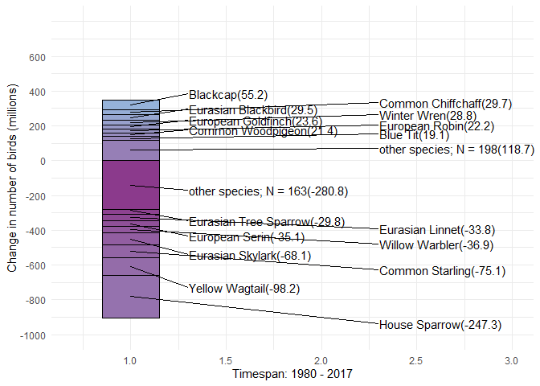

# Project Solution of Jasmin’s ‘Bye Bye Birdie’ Project

## Preparing the Dataset

First we need to load the data set and take the variables of interest
into a working data set. Since the Data Set is organized in Losses, a
higher positive number means that that species experienced higher losses
and vice versa.To make it more clear, I flipped the values, so that
positive values now mean a gain in population instead of a loss and
rounded the values to full values. Now, mean, SD and median values
represent the gains/losses of that specific species across Europe.

<table>
<colgroup>
<col style="width: 14%" />
<col style="width: 22%" />
<col style="width: 8%" />
<col style="width: 6%" />
<col style="width: 7%" />
<col style="width: 21%" />
<col style="width: 18%" />
</colgroup>
<thead>
<tr class="header">
<th style="text-align: left;">species</th>
<th style="text-align: left;">common_name</th>
<th style="text-align: right;">Loss_mean</th>
<th style="text-align: right;">Loss_sd</th>
<th style="text-align: right;">Loss_med</th>
<th style="text-align: right;">total_proportional_change</th>
<th style="text-align: right;">annual rate of change</th>
</tr>
</thead>
<tbody>
<tr class="odd">
<td style="text-align: left;">Bubo scandiacus</td>
<td style="text-align: left;">Snowy Owl</td>
<td style="text-align: right;">1.3</td>
<td style="text-align: right;">-11.6</td>
<td style="text-align: right;">-0.2</td>
<td style="text-align: right;">0.867</td>
<td style="text-align: right;">0.996</td>
</tr>
<tr class="even">
<td style="text-align: left;">Xenus cinereus</td>
<td style="text-align: left;">Terek Sandpiper</td>
<td style="text-align: right;">-34.7</td>
<td style="text-align: right;">-5.1</td>
<td style="text-align: right;">-34.4</td>
<td style="text-align: right;">0.263</td>
<td style="text-align: right;">0.965</td>
</tr>
<tr class="odd">
<td style="text-align: left;">Anser erythropus</td>
<td style="text-align: left;">Lesser White-fronted Goose</td>
<td style="text-align: right;">21.1</td>
<td style="text-align: right;">-7.4</td>
<td style="text-align: right;">20.5</td>
<td style="text-align: right;">1.938</td>
<td style="text-align: right;">1.018</td>
</tr>
<tr class="even">
<td style="text-align: left;">Apus affinis</td>
<td style="text-align: left;">Little Swift</td>
<td style="text-align: right;">96.8</td>
<td style="text-align: right;">-46.1</td>
<td style="text-align: right;">88.7</td>
<td style="text-align: right;">13.142</td>
<td style="text-align: right;">1.072</td>
</tr>
<tr class="odd">
<td style="text-align: left;">Clanga clanga</td>
<td style="text-align: left;">Greater Spotted Eagle</td>
<td style="text-align: right;">-17.9</td>
<td style="text-align: right;">-51.1</td>
<td style="text-align: right;">-21.4</td>
<td style="text-align: right;">0.660</td>
<td style="text-align: right;">0.989</td>
</tr>
<tr class="even">
<td style="text-align: left;">Fulica cristata</td>
<td style="text-align: left;">Red-knobbed Coot</td>
<td style="text-align: right;">1.4</td>
<td style="text-align: right;">-13.2</td>
<td style="text-align: right;">0.7</td>
<td style="text-align: right;">1.007</td>
<td style="text-align: right;">1.000</td>
</tr>
</tbody>
</table>

Now with the working Data Set, the next step would be to implement the
“other” category. In the graph you provided, the cutoff was at these two
species: Cyanistes caeruleus, Passer montanus

We want to summarize every species, that has a lower/higher mean value
than these two species, into a “other” category. To accomplish this, we
have to create a new variable, that copies the name of the species if it
is outside the range specified, or changes its name to “other”.

<table>
<thead>
<tr class="header">
<th style="text-align: right;">Loss_mean</th>
<th style="text-align: right;">Loss_med</th>
<th style="text-align: left;">category_name</th>
</tr>
</thead>
<tbody>
<tr class="odd">
<td style="text-align: right;">-280.8</td>
<td style="text-align: right;">-281.3</td>
<td style="text-align: left;">other species; N = 163</td>
</tr>
<tr class="even">
<td style="text-align: right;">118.7</td>
<td style="text-align: right;">114.4</td>
<td style="text-align: left;">other species; N = 198</td>
</tr>
<tr class="odd">
<td style="text-align: right;">-98.2</td>
<td style="text-align: right;">-97.0</td>
<td style="text-align: left;">Yellow Wagtail</td>
</tr>
<tr class="even">
<td style="text-align: right;">-29.8</td>
<td style="text-align: right;">-29.7</td>
<td style="text-align: left;">Eurasian Tree Sparrow</td>
</tr>
<tr class="odd">
<td style="text-align: right;">-33.8</td>
<td style="text-align: right;">-33.7</td>
<td style="text-align: left;">Eurasian Linnet</td>
</tr>
<tr class="even">
<td style="text-align: right;">-35.1</td>
<td style="text-align: right;">-34.9</td>
<td style="text-align: left;">European Serin</td>
</tr>
<tr class="odd">
<td style="text-align: right;">21.4</td>
<td style="text-align: right;">21.3</td>
<td style="text-align: left;">Common Woodpigeon</td>
</tr>
<tr class="even">
<td style="text-align: right;">-75.1</td>
<td style="text-align: right;">-74.6</td>
<td style="text-align: left;">Common Starling</td>
</tr>
<tr class="odd">
<td style="text-align: right;">29.7</td>
<td style="text-align: right;">29.4</td>
<td style="text-align: left;">Common Chiffchaff</td>
</tr>
<tr class="even">
<td style="text-align: right;">23.6</td>
<td style="text-align: right;">22.7</td>
<td style="text-align: left;">European Goldfinch</td>
</tr>
<tr class="odd">
<td style="text-align: right;">-68.1</td>
<td style="text-align: right;">-68.0</td>
<td style="text-align: left;">Eurasian Skylark</td>
</tr>
<tr class="even">
<td style="text-align: right;">19.1</td>
<td style="text-align: right;">19.0</td>
<td style="text-align: left;">Blue Tit</td>
</tr>
<tr class="odd">
<td style="text-align: right;">-36.9</td>
<td style="text-align: right;">-36.9</td>
<td style="text-align: left;">Willow Warbler</td>
</tr>
<tr class="even">
<td style="text-align: right;">28.8</td>
<td style="text-align: right;">28.2</td>
<td style="text-align: left;">Winter Wren</td>
</tr>
<tr class="odd">
<td style="text-align: right;">55.2</td>
<td style="text-align: right;">54.9</td>
<td style="text-align: left;">Blackcap</td>
</tr>
<tr class="even">
<td style="text-align: right;">22.2</td>
<td style="text-align: right;">21.9</td>
<td style="text-align: left;">European Robin</td>
</tr>
<tr class="odd">
<td style="text-align: right;">29.5</td>
<td style="text-align: right;">29.2</td>
<td style="text-align: left;">Eurasian Blackbird</td>
</tr>
<tr class="even">
<td style="text-align: right;">-247.3</td>
<td style="text-align: right;">-246.7</td>
<td style="text-align: left;">House Sparrow</td>
</tr>
</tbody>
</table>

With the data frame assembled, now we can tackle the visualization.

# Visualization

The goal of this task is to try and reproduce this
[chart](https://onlinelibrary.wiley.com/cms/asset/c4301ccb-4375-41ff-95e5-b92db8ae4463/ece38282-fig-0004-m.jpg)
The results can be seen below. What I have not managed so far is the
correct coloring of the graph as well as the annotations. The lines and
the spacing of the annotations are also not perfectly optimized.

