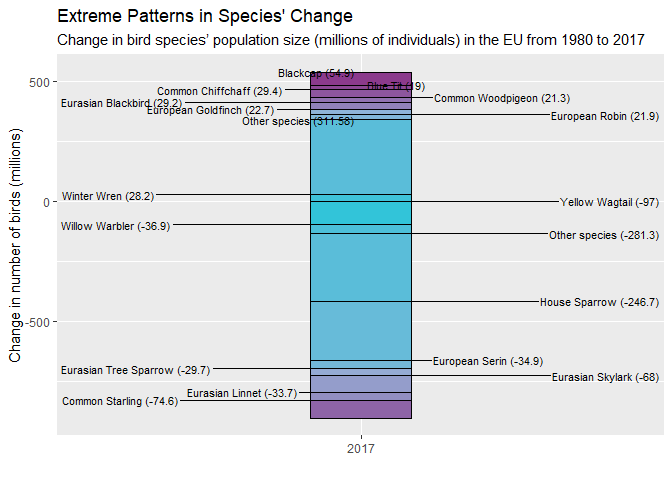

    ## 
    ## Attaching package: 'dplyr'

    ## The following objects are masked from 'package:stats':
    ## 
    ##     filter, lag

    ## The following objects are masked from 'package:base':
    ## 
    ##     intersect, setdiff, setequal, union

    ## Warning: package 'ggrepel' was built under R version 4.2.3

# Bye Bye Birdie

Biodiversity decline is a real problem around the globe. While for
European audiences, the word normally conjures up images of rare orchids
or reptiles in the world’s rain forests, there is also biodiversity loss
that hits a lot closer to home with a species that is considered
omnipresent.

[According to research published in scientific journal Ecology and
Evolution](https://onlinelibrary.wiley.com/doi/full/10.1002/ece3.8282),
there are a “considerable numerical loss in the avifauna of EU” since
1980. This biodiversity loss is “also heterogeneous across habitats”.

The following [data set](https://zenodo.org/record/5544548#.ZFkcpi9n6x_)
allows find patterns of change about the bird species decline. In the
table, we can find a first look to the variables of the data:

<table style="width:100%;">
<colgroup>
<col style="width: 4%" />
<col style="width: 7%" />
<col style="width: 3%" />
<col style="width: 4%" />
<col style="width: 8%" />
<col style="width: 14%" />
<col style="width: 3%" />
<col style="width: 5%" />
<col style="width: 2%" />
<col style="width: 2%" />
<col style="width: 2%" />
<col style="width: 2%" />
<col style="width: 2%" />
<col style="width: 1%" />
<col style="width: 3%" />
<col style="width: 3%" />
<col style="width: 2%" />
<col style="width: 3%" />
<col style="width: 3%" />
<col style="width: 3%" />
<col style="width: 7%" />
<col style="width: 6%" />
</colgroup>
<thead>
<tr class="header">
<th style="text-align: left;">species</th>
<th style="text-align: left;">common_name</th>
<th style="text-align: left;">family</th>
<th style="text-align: left;">order</th>
<th style="text-align: left;">migratory.strategy</th>
<th style="text-align: left;">breeding.biome</th>
<th style="text-align: left;">bird.group</th>
<th style="text-align: left;">abundance.category</th>
<th style="text-align: left;">ts_source</th>
<th style="text-align: right;">firstyear</th>
<th style="text-align: right;">lastyear</th>
<th style="text-align: right;">year_est1</th>
<th style="text-align: right;">year_est2</th>
<th style="text-align: right;">popest</th>
<th style="text-align: right;">popse</th>
<th style="text-align: right;">Loss_mean</th>
<th style="text-align: right;">Loss_sd</th>
<th style="text-align: right;">Loss_lci95</th>
<th style="text-align: right;">Loss_med</th>
<th style="text-align: right;">Loss_uci95</th>
<th style="text-align: right;">total_proportional_change</th>
<th style="text-align: right;">annual.rate.of.change</th>
</tr>
</thead>
<tbody>
<tr class="odd">
<td style="text-align: left;">Bubo scandiacus</td>
<td style="text-align: left;">Snowy Owl</td>
<td style="text-align: left;">Strigidae</td>
<td style="text-align: left;">STRIGIFORMES</td>
<td style="text-align: left;">Partial migrant within Europe</td>
<td style="text-align: left;">Tundra, mires and moorland</td>
<td style="text-align: left;">landbirds</td>
<td style="text-align: left;">Rare</td>
<td style="text-align: left;">Article12</td>
<td style="text-align: right;">1980</td>
<td style="text-align: right;">2017</td>
<td style="text-align: right;">2014</td>
<td style="text-align: right;">2017</td>
<td style="text-align: right;">5</td>
<td style="text-align: right;">3.8775510</td>
<td style="text-align: right;">-1.336005</td>
<td style="text-align: right;">11.559215</td>
<td style="text-align: right;">-28.66843</td>
<td style="text-align: right;">0.1573545</td>
<td style="text-align: right;">14.607557</td>
<td style="text-align: right;">0.8671325</td>
<td style="text-align: right;">0.9961543</td>
</tr>
<tr class="even">
<td style="text-align: left;">Xenus cinereus</td>
<td style="text-align: left;">Terek Sandpiper</td>
<td style="text-align: left;">Scolopacidae</td>
<td style="text-align: left;">CHARADRIIFORMES</td>
<td style="text-align: left;">Long-distance migrant</td>
<td style="text-align: left;">Tundra, mires and moorland</td>
<td style="text-align: left;">shorebirds</td>
<td style="text-align: left;">Rare</td>
<td style="text-align: left;">Article12</td>
<td style="text-align: right;">1980</td>
<td style="text-align: right;">2017</td>
<td style="text-align: right;">2014</td>
<td style="text-align: right;">2017</td>
<td style="text-align: right;">13</td>
<td style="text-align: right;">0.9463745</td>
<td style="text-align: right;">34.654695</td>
<td style="text-align: right;">5.137701</td>
<td style="text-align: right;">25.27814</td>
<td style="text-align: right;">34.3949653</td>
<td style="text-align: right;">45.521182</td>
<td style="text-align: right;">0.2630238</td>
<td style="text-align: right;">0.9645488</td>
</tr>
<tr class="odd">
<td style="text-align: left;">Anser erythropus</td>
<td style="text-align: left;">Lesser White-fronted Goose</td>
<td style="text-align: left;">Anatidae</td>
<td style="text-align: left;">ANSERIFORMES</td>
<td style="text-align: left;">Short-distance migrant</td>
<td style="text-align: left;">Tundra, mires and moorland</td>
<td style="text-align: left;">waterfowl</td>
<td style="text-align: left;">Rare</td>
<td style="text-align: left;">Article12</td>
<td style="text-align: right;">1980</td>
<td style="text-align: right;">2017</td>
<td style="text-align: right;">2014</td>
<td style="text-align: right;">2017</td>
<td style="text-align: right;">41</td>
<td style="text-align: right;">3.7106196</td>
<td style="text-align: right;">-21.105073</td>
<td style="text-align: right;">7.374291</td>
<td style="text-align: right;">-37.43832</td>
<td style="text-align: right;">-20.4596234</td>
<td style="text-align: right;">-8.464499</td>
<td style="text-align: right;">1.9376489</td>
<td style="text-align: right;">1.0180385</td>
</tr>
<tr class="even">
<td style="text-align: left;">Apus affinis</td>
<td style="text-align: left;">Little Swift</td>
<td style="text-align: left;">Apodidae</td>
<td style="text-align: left;">CAPRIMULGIFORMES</td>
<td style="text-align: left;">Partial migrant within Europe</td>
<td style="text-align: left;">mediterranean forest, shrubland and rocky
habitats</td>
<td style="text-align: left;">landbirds</td>
<td style="text-align: left;">Rare</td>
<td style="text-align: left;">Article12</td>
<td style="text-align: right;">1980</td>
<td style="text-align: right;">2017</td>
<td style="text-align: right;">2003</td>
<td style="text-align: right;">2017</td>
<td style="text-align: right;">45</td>
<td style="text-align: right;">12.9561355</td>
<td style="text-align: right;">-96.811110</td>
<td style="text-align: right;">46.092092</td>
<td style="text-align: right;">-210.32013</td>
<td style="text-align: right;">-88.7352254</td>
<td style="text-align: right;">-30.626474</td>
<td style="text-align: right;">13.1421443</td>
<td style="text-align: right;">1.0720973</td>
</tr>
<tr class="odd">
<td style="text-align: left;">Clanga clanga</td>
<td style="text-align: left;">Greater Spotted Eagle</td>
<td style="text-align: left;">Accipitridae</td>
<td style="text-align: left;">ACCIPITRIFORMES</td>
<td style="text-align: left;">Short-distance migrant</td>
<td style="text-align: left;">Unclassified</td>
<td style="text-align: left;">landbirds</td>
<td style="text-align: left;">Rare</td>
<td style="text-align: left;">Article12</td>
<td style="text-align: right;">1980</td>
<td style="text-align: right;">2017</td>
<td style="text-align: right;">2014</td>
<td style="text-align: right;">2017</td>
<td style="text-align: right;">47</td>
<td style="text-align: right;">2.1368451</td>
<td style="text-align: right;">17.948491</td>
<td style="text-align: right;">51.095958</td>
<td style="text-align: right;">-100.53426</td>
<td style="text-align: right;">21.4412132</td>
<td style="text-align: right;">106.617787</td>
<td style="text-align: right;">0.6599532</td>
<td style="text-align: right;">0.9888308</td>
</tr>
</tbody>
</table>

## Which species is decreasing its population?

We particularly interested in which of the bird species increased in
population and which decreased in population.

To answer this question through a graph, we should first extract the
data we are most interested in terms of minimum and maximum values.

The following table show the result data of this process.

<table style="width:100%;">
<colgroup>
<col style="width: 30%" />
<col style="width: 27%" />
<col style="width: 11%" />
<col style="width: 11%" />
<col style="width: 13%" />
<col style="width: 5%" />
</colgroup>
<thead>
<tr class="header">
<th style="text-align: left;">species</th>
<th style="text-align: left;">common_name</th>
<th style="text-align: right;">Loss_med</th>
<th style="text-align: right;">lastyear</th>
<th style="text-align: right;">popest</th>
<th style="text-align: right;">n</th>
</tr>
</thead>
<tbody>
<tr class="odd">
<td style="text-align: left;">Passer domesticus</td>
<td style="text-align: left;">House Sparrow</td>
<td style="text-align: right;">-246.70</td>
<td style="text-align: right;">2017</td>
<td style="text-align: right;">261335765</td>
<td style="text-align: right;">1</td>
</tr>
<tr class="even">
<td style="text-align: left;">Motacilla flava</td>
<td style="text-align: left;">Yellow Wagtail</td>
<td style="text-align: right;">-97.00</td>
<td style="text-align: right;">2017</td>
<td style="text-align: right;">18299573</td>
<td style="text-align: right;">1</td>
</tr>
<tr class="odd">
<td style="text-align: left;">Sturnus vulgaris</td>
<td style="text-align: left;">Common Starling</td>
<td style="text-align: right;">-74.60</td>
<td style="text-align: right;">2017</td>
<td style="text-align: right;">50419667</td>
<td style="text-align: right;">1</td>
</tr>
<tr class="even">
<td style="text-align: left;">Alauda arvensis</td>
<td style="text-align: left;">Eurasian Skylark</td>
<td style="text-align: right;">-68.00</td>
<td style="text-align: right;">2017</td>
<td style="text-align: right;">63378501</td>
<td style="text-align: right;">1</td>
</tr>
<tr class="odd">
<td style="text-align: left;">Phylloscopus trochilus</td>
<td style="text-align: left;">Willow Warbler</td>
<td style="text-align: right;">-36.90</td>
<td style="text-align: right;">2017</td>
<td style="text-align: right;">64158506</td>
<td style="text-align: right;">1</td>
</tr>
<tr class="even">
<td style="text-align: left;">Serinus serinus</td>
<td style="text-align: left;">European Serin</td>
<td style="text-align: right;">-34.90</td>
<td style="text-align: right;">2017</td>
<td style="text-align: right;">41494567</td>
<td style="text-align: right;">1</td>
</tr>
<tr class="odd">
<td style="text-align: left;">Linaria cannabina</td>
<td style="text-align: left;">Eurasian Linnet</td>
<td style="text-align: right;">-33.70</td>
<td style="text-align: right;">2017</td>
<td style="text-align: right;">33548676</td>
<td style="text-align: right;">1</td>
</tr>
<tr class="even">
<td style="text-align: left;">Passer montanus</td>
<td style="text-align: left;">Eurasian Tree Sparrow</td>
<td style="text-align: right;">-29.70</td>
<td style="text-align: right;">2017</td>
<td style="text-align: right;">29221560</td>
<td style="text-align: right;">1</td>
</tr>
<tr class="odd">
<td style="text-align: left;">Sylvia atricapilla</td>
<td style="text-align: left;">Blackcap</td>
<td style="text-align: right;">54.90</td>
<td style="text-align: right;">2017</td>
<td style="text-align: right;">86007217</td>
<td style="text-align: right;">1</td>
</tr>
<tr class="even">
<td style="text-align: left;">Phylloscopus collybita</td>
<td style="text-align: left;">Common Chiffchaff</td>
<td style="text-align: right;">29.40</td>
<td style="text-align: right;">2017</td>
<td style="text-align: right;">51203800</td>
<td style="text-align: right;">1</td>
</tr>
<tr class="odd">
<td style="text-align: left;">Turdus merula</td>
<td style="text-align: left;">Eurasian Blackbird</td>
<td style="text-align: right;">29.20</td>
<td style="text-align: right;">2017</td>
<td style="text-align: right;">121733979</td>
<td style="text-align: right;">1</td>
</tr>
<tr class="even">
<td style="text-align: left;">Troglodytes troglodytes</td>
<td style="text-align: left;">Winter Wren</td>
<td style="text-align: right;">28.20</td>
<td style="text-align: right;">2017</td>
<td style="text-align: right;">71822811</td>
<td style="text-align: right;">1</td>
</tr>
<tr class="odd">
<td style="text-align: left;">Carduelis carduelis</td>
<td style="text-align: left;">European Goldfinch</td>
<td style="text-align: right;">22.70</td>
<td style="text-align: right;">2017</td>
<td style="text-align: right;">57158811</td>
<td style="text-align: right;">1</td>
</tr>
<tr class="even">
<td style="text-align: left;">Erithacus rubecula</td>
<td style="text-align: left;">European Robin</td>
<td style="text-align: right;">21.90</td>
<td style="text-align: right;">2017</td>
<td style="text-align: right;">94427980</td>
<td style="text-align: right;">1</td>
</tr>
<tr class="odd">
<td style="text-align: left;">Columba palumbus</td>
<td style="text-align: left;">Common Woodpigeon</td>
<td style="text-align: right;">21.30</td>
<td style="text-align: right;">2017</td>
<td style="text-align: right;">44935325</td>
<td style="text-align: right;">1</td>
</tr>
<tr class="even">
<td style="text-align: left;">Cyanistes caeruleus</td>
<td style="text-align: left;">Blue Tit</td>
<td style="text-align: right;">19.00</td>
<td style="text-align: right;">2017</td>
<td style="text-align: right;">63851686</td>
<td style="text-align: right;">1</td>
</tr>
<tr class="odd">
<td style="text-align: left;">Other species</td>
<td style="text-align: left;">Other species</td>
<td style="text-align: right;">-281.30</td>
<td style="text-align: right;">2017</td>
<td style="text-align: right;">750804587</td>
<td style="text-align: right;">104</td>
</tr>
<tr class="even">
<td style="text-align: left;">Other species</td>
<td style="text-align: left;">Other species</td>
<td style="text-align: right;">311.58</td>
<td style="text-align: right;">2017</td>
<td style="text-align: right;">1215924681</td>
<td style="text-align: right;">231</td>
</tr>
</tbody>
</table>

## Data visualization

Now, we create a column graph to show the which bird species have
decrease or increase its population to 2017

As graph show, house sparrow it is the bird specie more affected in the
last 30 years. On the other side, black cap have increase its
population.
