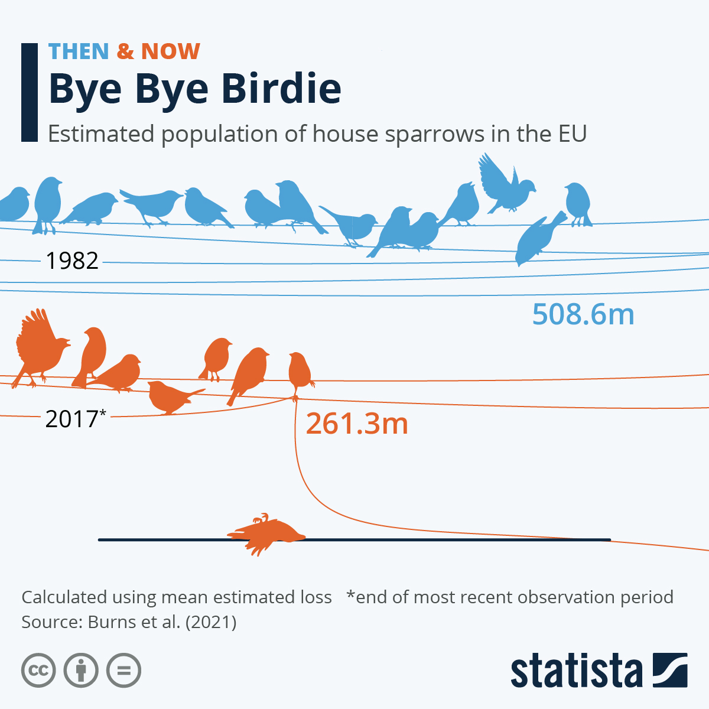

# Advanced-data-processing-with-R

------------------------------------------------------------------------

# Project Idea: Bye Bye Birdie

------------------------------------------------------------------------

Biodiversity decline is a real problem around the globe. While for European audiences, the word normally conjures up images of rare orchids or reptiles in the world's rain forests, there is also biodiversity loss that hits a lot closer to home with a species that is considered omnipresent.

[According to research published in scientific journal Ecology and Evolution](https://onlinelibrary.wiley.com/doi/full/10.1002/ece3.8282), house sparrow populations in the European Union have almost halved between 1982 and 2017. The researchers estimated that between 2014 and 2017, the EU sparrow population only stood at around [261 million](https://zenodo.org/record/5544548#.ZFkcpi9n6x_).

The sparrow population remained the largest among the more than 300 birds species analyzed in the study, but also suffered the most dramatic relative decline. According to the makers of the study, species that like the sparrow are using farmland as habitat were hit harder by population declines. Overall, EU bird populations are estimated to have declined by 17 to 19 percent since the early 1980s, the equivalent of the loss of approximately 600 million birds.

Farmland became a more hostile [environment](https://www.statista.com/topics/4739/environmental-pollution/#topicOverview) to birds due to the [growing industrialization of agriculture and the use of chemicals](https://www.theguardian.com/environment/2021/nov/16/house-sparrow-population-in-europe-drops-by-247m) which shrank insect and subsequently bird populations.

While the overall loss of birds was a grave concern, some bird species increased their populations, for example blackbirds, wrens, robins, woodpidgeons, blue tits and raptors, which benefited from protection and restoration projects. Yellow wagtails, starlings and skylarks, on the other hand, were flagged as having become increasingly rare.

## Goal of the project

------------------------------------------------------------------------

The idea of this project is to recreate the "Bye Bye Birdie" plot as close as possible using the data from Burns et al. (2021) which is linked above. I am not sure if this is even possible but I really liked the chart.

Best, Jasmin
