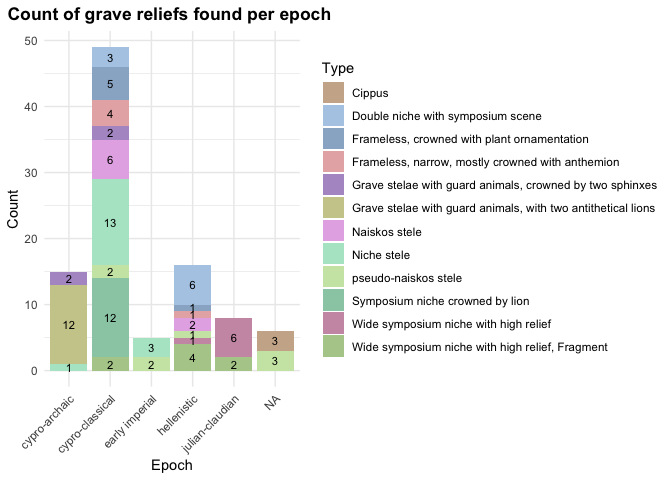
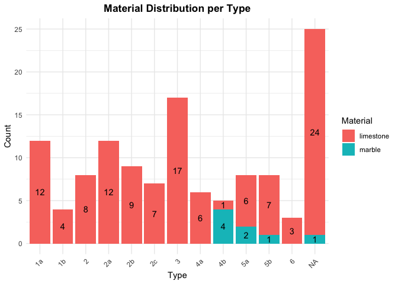

\#Data Cleaning

    library(tidyverse)

    ## ── Attaching core tidyverse packages ──────────────────────── tidyverse 2.0.0 ──
    ## ✔ dplyr     1.1.4     ✔ readr     2.1.5
    ## ✔ forcats   1.0.0     ✔ stringr   1.5.1
    ## ✔ ggplot2   3.5.0     ✔ tibble    3.2.1
    ## ✔ lubridate 1.9.3     ✔ tidyr     1.3.1
    ## ✔ purrr     1.0.2     
    ## ── Conflicts ────────────────────────────────────────── tidyverse_conflicts() ──
    ## ✖ dplyr::filter() masks stats::filter()
    ## ✖ dplyr::lag()    masks stats::lag()
    ## ℹ Use the conflicted package (<http://conflicted.r-lib.org/>) to force all conflicts to become errors

    df <- read.csv("StelaeCyprus.csv", 
                     sep = ";", 
                     header = TRUE,
                     na = c("unknown", "undefined"))

    df[df == "not defined"] <- NA
    df[df == ""] <- NA

    names_to_keep <- c("Amathus", "Golgoi", "Idalion", "Kition", "Marion", "Salamis", "Soloi", "Tamassos")
    df <- df %>%
      mutate(
        type = str_replace_all(type, "\\?", ""),
        type = if_else(catNo == 98 | catNo == 99, "6", type),
        epoch = if_else(epoch == "antoninisch", "Antonine", epoch),
        material = case_when(grepl("limestone", material) ~ "limestone",
                                  grepl("marble", material) ~ "marble",
                                  TRUE ~ NA_character_),
        typeCertain = if_else(typeCertain == 0, FALSE, TRUE),
         location = if_else(catNo == 12 & location == "probably Idalion", "Cyprus", location),
       location = if_else(is.na(location), "Cyprus", location),
       location = if_else(str_detect(location, "\\(\\?\\)"), "Cyprus", location),
       location = case_when(
          location %in% c("region of Limassol", "Mathikoloni") ~ "Amathus",
          location %in% c("Athienou", "Melousha", "Pergamon") ~ "Golgoi",
          location == "Alambra (Larnaca)" ~ "Kition",
          location %in% c("Pano Arodes", "Polis") ~ "Marion",
          location %in% c("Kotschines (neighbourhood of Lysi)", "north of Lysi, district Famagusta") ~ "Salamis",
          location == "Ambelia, near Morphou" ~ "Soloi",
          location == "Pera (Asproji)" ~ "Tamassos",
          TRUE ~ location 
        ), 
       location = case_when(
        str_detect(location, paste(names_to_keep, collapse = "|")) ~ 
          str_extract(location, paste(names_to_keep, collapse = "|")),
        TRUE ~ location
      ),location = case_when(
          location == "Salamiu, NE of Kouklia (Alt Paphos)" ~ "Salamis",
          TRUE ~ location 
        )
      )

\#Create table to show amount of type per epoch

    df$epoch <- factor(df$epoch, ordered = TRUE, 
                            levels = c("antonine", "cypro-archaic", "cypro-classical","early imperial", "hellenistic",
                                       "hellenistic-roman", "julian-claudian"))
    df_cleaned <- df %>% filter(!is.na(typeDesc))

    count_table <- df_cleaned %>%
      group_by(typeDesc, epoch) %>%
      summarise(count = n(), .groups = 'drop')
    print(count_table)

    ## # A tibble: 25 × 3
    ##    typeDesc                                                     epoch      count
    ##    <chr>                                                        <ord>      <int>
    ##  1 Cippus                                                       <NA>           3
    ##  2 Double niche with symposium scene                            cypro-cla…     3
    ##  3 Double niche with symposium scene                            hellenist…     6
    ##  4 Frameless, crowned with plant ornamentation                  cypro-cla…     5
    ##  5 Frameless, crowned with plant ornamentation                  hellenist…     1
    ##  6 Frameless, narrow, mostly crowned with anthemion             cypro-cla…     4
    ##  7 Frameless, narrow, mostly crowned with anthemion             hellenist…     1
    ##  8 Grave stelae with guard animals, crowned by two sphinxes     cypro-arc…     2
    ##  9 Grave stelae with guard animals, crowned by two sphinxes     cypro-cla…     2
    ## 10 Grave stelae with guard animals, with two antithetical lions cypro-arc…    12
    ## # ℹ 15 more rows

    knitr::kable(table(df$typeDesc, df$epoch))

<table style="width:100%;">
<colgroup>
<col style="width: 37%" />
<col style="width: 5%" />
<col style="width: 8%" />
<col style="width: 9%" />
<col style="width: 9%" />
<col style="width: 7%" />
<col style="width: 11%" />
<col style="width: 9%" />
</colgroup>
<thead>
<tr class="header">
<th style="text-align: left;"></th>
<th style="text-align: right;">antonine</th>
<th style="text-align: right;">cypro-archaic</th>
<th style="text-align: right;">cypro-classical</th>
<th style="text-align: right;">early imperial</th>
<th style="text-align: right;">hellenistic</th>
<th style="text-align: right;">hellenistic-roman</th>
<th style="text-align: right;">julian-claudian</th>
</tr>
</thead>
<tbody>
<tr class="odd">
<td style="text-align: left;">Cippus</td>
<td style="text-align: right;">0</td>
<td style="text-align: right;">0</td>
<td style="text-align: right;">0</td>
<td style="text-align: right;">0</td>
<td style="text-align: right;">0</td>
<td style="text-align: right;">0</td>
<td style="text-align: right;">0</td>
</tr>
<tr class="even">
<td style="text-align: left;">Double niche with symposium scene</td>
<td style="text-align: right;">0</td>
<td style="text-align: right;">0</td>
<td style="text-align: right;">3</td>
<td style="text-align: right;">0</td>
<td style="text-align: right;">6</td>
<td style="text-align: right;">0</td>
<td style="text-align: right;">0</td>
</tr>
<tr class="odd">
<td style="text-align: left;">Frameless, crowned with plant
ornamentation</td>
<td style="text-align: right;">0</td>
<td style="text-align: right;">0</td>
<td style="text-align: right;">5</td>
<td style="text-align: right;">0</td>
<td style="text-align: right;">1</td>
<td style="text-align: right;">0</td>
<td style="text-align: right;">0</td>
</tr>
<tr class="even">
<td style="text-align: left;">Frameless, narrow, mostly crowned with
anthemion</td>
<td style="text-align: right;">0</td>
<td style="text-align: right;">0</td>
<td style="text-align: right;">4</td>
<td style="text-align: right;">0</td>
<td style="text-align: right;">1</td>
<td style="text-align: right;">0</td>
<td style="text-align: right;">0</td>
</tr>
<tr class="odd">
<td style="text-align: left;">Grave stelae with guard animals, crowned
by two sphinxes</td>
<td style="text-align: right;">0</td>
<td style="text-align: right;">2</td>
<td style="text-align: right;">2</td>
<td style="text-align: right;">0</td>
<td style="text-align: right;">0</td>
<td style="text-align: right;">0</td>
<td style="text-align: right;">0</td>
</tr>
<tr class="even">
<td style="text-align: left;">Grave stelae with guard animals, with two
antithetical lions</td>
<td style="text-align: right;">0</td>
<td style="text-align: right;">12</td>
<td style="text-align: right;">0</td>
<td style="text-align: right;">0</td>
<td style="text-align: right;">0</td>
<td style="text-align: right;">0</td>
<td style="text-align: right;">0</td>
</tr>
<tr class="odd">
<td style="text-align: left;">Naiskos stele</td>
<td style="text-align: right;">0</td>
<td style="text-align: right;">0</td>
<td style="text-align: right;">6</td>
<td style="text-align: right;">0</td>
<td style="text-align: right;">2</td>
<td style="text-align: right;">0</td>
<td style="text-align: right;">0</td>
</tr>
<tr class="even">
<td style="text-align: left;">Niche stele</td>
<td style="text-align: right;">0</td>
<td style="text-align: right;">1</td>
<td style="text-align: right;">13</td>
<td style="text-align: right;">3</td>
<td style="text-align: right;">0</td>
<td style="text-align: right;">0</td>
<td style="text-align: right;">0</td>
</tr>
<tr class="odd">
<td style="text-align: left;">pseudo-naiskos stele</td>
<td style="text-align: right;">0</td>
<td style="text-align: right;">0</td>
<td style="text-align: right;">2</td>
<td style="text-align: right;">2</td>
<td style="text-align: right;">1</td>
<td style="text-align: right;">0</td>
<td style="text-align: right;">0</td>
</tr>
<tr class="even">
<td style="text-align: left;">Symposium niche crowned by lion</td>
<td style="text-align: right;">0</td>
<td style="text-align: right;">0</td>
<td style="text-align: right;">12</td>
<td style="text-align: right;">0</td>
<td style="text-align: right;">0</td>
<td style="text-align: right;">0</td>
<td style="text-align: right;">0</td>
</tr>
<tr class="odd">
<td style="text-align: left;">Wide symposium niche with high relief</td>
<td style="text-align: right;">0</td>
<td style="text-align: right;">0</td>
<td style="text-align: right;">0</td>
<td style="text-align: right;">0</td>
<td style="text-align: right;">1</td>
<td style="text-align: right;">0</td>
<td style="text-align: right;">6</td>
</tr>
<tr class="even">
<td style="text-align: left;">Wide symposium niche with high relief,
Fragment</td>
<td style="text-align: right;">0</td>
<td style="text-align: right;">0</td>
<td style="text-align: right;">2</td>
<td style="text-align: right;">0</td>
<td style="text-align: right;">4</td>
<td style="text-align: right;">0</td>
<td style="text-align: right;">2</td>
</tr>
</tbody>
</table>

    pastel_colors <- c("#ccb299", "#b2cce6", "#99b2cc", "#e6b2b2", "#b299cc", 
                                 "#cccc99", "#e6b2e6", "#b2e6cc", "#cce6b2", "#99ccb2", 
                                 "#cc99b2", "#b2cc99")

    ggplot(count_table, aes(x = epoch, y = count, fill = typeDesc)) +
      geom_bar(stat = "identity", position = "stack") +
      geom_text(aes(label = count), position = position_stack(vjust = 0.5), size = 3) +
      labs(title = "Count of grave reliefs found per epoch ", x = "Epoch", y = "Count", fill = "Type") +
      scale_fill_manual(values = pastel_colors)  +  
      theme_minimal() +
    theme(legend.position = "right",
            axis.text.x = element_text(angle = 45, hjust = 1),
            plot.title = element_text(face = "bold", hjust = 0.5))

    knitr::kable(table(df$typeDesc, df$material))

<table>
<colgroup>
<col style="width: 78%" />
<col style="width: 12%" />
<col style="width: 8%" />
</colgroup>
<thead>
<tr class="header">
<th style="text-align: left;"></th>
<th style="text-align: right;">limestone</th>
<th style="text-align: right;">marble</th>
</tr>
</thead>
<tbody>
<tr class="odd">
<td style="text-align: left;">Cippus</td>
<td style="text-align: right;">3</td>
<td style="text-align: right;">0</td>
</tr>
<tr class="even">
<td style="text-align: left;">Double niche with symposium scene</td>
<td style="text-align: right;">9</td>
<td style="text-align: right;">0</td>
</tr>
<tr class="odd">
<td style="text-align: left;">Frameless, crowned with plant
ornamentation</td>
<td style="text-align: right;">6</td>
<td style="text-align: right;">0</td>
</tr>
<tr class="even">
<td style="text-align: left;">Frameless, narrow, mostly crowned with
anthemion</td>
<td style="text-align: right;">1</td>
<td style="text-align: right;">4</td>
</tr>
<tr class="odd">
<td style="text-align: left;">Grave stelae with guard animals, crowned
by two sphinxes</td>
<td style="text-align: right;">4</td>
<td style="text-align: right;">0</td>
</tr>
<tr class="even">
<td style="text-align: left;">Grave stelae with guard animals, with two
antithetical lions</td>
<td style="text-align: right;">12</td>
<td style="text-align: right;">0</td>
</tr>
<tr class="odd">
<td style="text-align: left;">Naiskos stele</td>
<td style="text-align: right;">6</td>
<td style="text-align: right;">2</td>
</tr>
<tr class="even">
<td style="text-align: left;">Niche stele</td>
<td style="text-align: right;">17</td>
<td style="text-align: right;">0</td>
</tr>
<tr class="odd">
<td style="text-align: left;">pseudo-naiskos stele</td>
<td style="text-align: right;">7</td>
<td style="text-align: right;">1</td>
</tr>
<tr class="even">
<td style="text-align: left;">Symposium niche crowned by lion</td>
<td style="text-align: right;">12</td>
<td style="text-align: right;">0</td>
</tr>
<tr class="odd">
<td style="text-align: left;">Wide symposium niche with high relief</td>
<td style="text-align: right;">7</td>
<td style="text-align: right;">0</td>
</tr>
<tr class="even">
<td style="text-align: left;">Wide symposium niche with high relief,
Fragment</td>
<td style="text-align: right;">8</td>
<td style="text-align: right;">0</td>
</tr>
</tbody>
</table>

    df$type <- factor(df$type, levels = sort(unique(df$type)))

    ggplot(df, aes(x = type, fill = material)) +
      geom_bar(position = "stack") +
      geom_text(aes(label = after_stat(count)), position = position_stack(vjust = 0.5), stat = "count") +
      labs(title = "Material Distribution per Type",
           x = "Type",
           y = "Count",
           fill = "Material") +
      theme_minimal() +
        theme(legend.position = "right",
            axis.text.x = element_text(angle = 45, hjust = 1),
            plot.title = element_text(face = "bold", hjust = 0.5))

