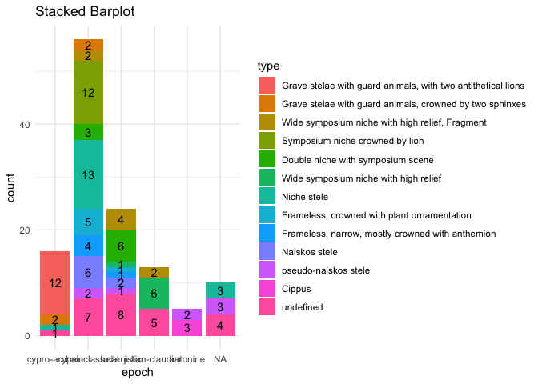
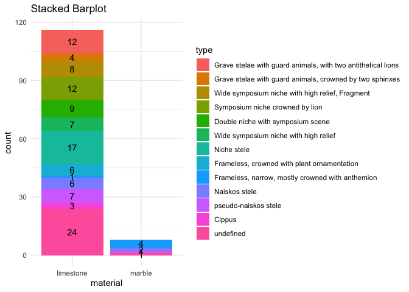

# Read in and clean data

    data <- read.csv("Projects/johannaroever/StelaeCyprus.csv", sep = ";", header = TRUE)

## Data modification

1.  All values of *unknown* and *undefined* are to be replaced with `NA`
    for easier handling in R. The values of *not specified* should be
    kept.

<!-- -->

    data %<>%
      mutate_all(~ifelse(. == "unknown", NA, .)) %>%
      mutate_all(~ifelse(. == "undefined", NA, .))

1.  In `epoch` the value *antoninisch* should be replaced by *antonine*
    for using a consistent language.

<!-- -->

    data %<>%
      mutate(epoch = str_replace(epoch, "antoninisch", "antonine"))

1.  In the column `type`some values still include a “?” which should be
    deleted, since the information it was meant to convey is written in
    `typeCertain`.

<!-- -->

    data %<>%
      mutate(type = str_replace_all(type, "\\?", ""))

1.  For the stelae with the `catNo` = *98* and *99* the value of `type`
    has to be changed to *6*.

<!-- -->

    data %<>%
      mutate(type = if_else(catNo == 98 | catNo == 99, "6", type))

1.  The values in `typeCertain` are to be replaced for easier handling
    in R: *0* to *FALSE*, *1* to *TRUE*.

<!-- -->

    data %<>%
      mutate(typeCertain = if_else(typeCertain == 0, "FALSE", "TRUE"))

1.  The column `location` has to be reviewed for only containing the
    values of the general regions, while more specific information can
    be deleted:
    -   *Amathus, Golgoi, Idalion, Kition, Marion/Paphos, Salamis,
        Soloi, Tamassos*

    -   1.  All *unknown* in this column can be converted to *Cyprus*. -
            CHECK

    -   1.  All values which include “(?)” can be converted to
            *Cyprus*. - CHECK

    -   1.  If the current value already includes one of the region
            names, shorten it to only that. This applies to values which
            include “near”, “bei”

    -   1.  The value of the observation of `catNo`=*12* which says
            “probably Idalion” should be changed to *Cyprus*.

    -   1.  Other:

        -   region of Limassol –&gt; Amathus
        -   Limassol –&gt; Amathus
        -   Mathikoloni –&gt; Amathus  
        -   Athienou –&gt; Golgoi
        -   Melousha –&gt; Golgoi
        -   Pergamon –&gt; Golgoi  
        -   Alambra (Larnaca) –&gt; Kition
        -   Pano Arodes –&gt; Marion
        -   Polis –&gt; Marion  
        -   Kotschines (neighbourhood of Lysi) –&gt; Salamis
        -   north of Lysi, district Famagusta –&gt; Salamis  
        -   Ambelia, near Morphou –&gt; Soloi  
        -   Pera (Asproji) –&gt; Tamassos

<!-- -->

    data %<>%
      mutate(location = if_else(location == "unknown", "Cyprus", location)) %>% # (1)
      mutate(location = if_else(str_detect(location, "\\?"), "Cyprus", location)) %>% # (2)
      mutate(location = if_else(location == "probably Idalion", "Cyprus", location)) %>% # (3)
      mutate(location = if_else(location == "region of Limassol" | location == "Limassol" | location == "Mathikoloni", "Amathus", location)) %>% # (4 ff.)
      mutate(location = if_else(location == "Athienou" | location == "Melousha" | location == "Pergamon", "Golgoi", location)) %>%
      mutate(location == if_else(location == "Alambra (Larnaca)", "Kition", location)) %>%
      mutate(location == if_else(location == "Pano Arodes" | location == "Polis", "Marion", location)) %>%
      mutate(location == if_else(location == "Kotschines (neighbourhood of Lysi)" | location == "north of Lysi, district Famagusta", "Salamis", location)) %>%
      mutate(location == if_else(location == "Ambelia, near Morphou", "Soloi", location)) %>%
      mutate(location == if_else(location == "Pera (Asproji", "Tamassos", location))

    data %<>%
      mutate(location = if_else(str_detect(location, "Golgoi"), "Golgoi", location)) %>%
      mutate(location = if_else(str_detect(location, "Tamassos"), "Tamassos", location)) %>%
      mutate(location = if_else(str_detect(location, "Marion"), "Marion", location)) %>%
      mutate(location = if_else(str_detect(location, "Amathus"), "Amathus", location)) %>%
      mutate(location = if_else(str_detect(location, "Idalion"), "Idalion", location)) %>%
      mutate(location = if_else(str_detect(location, "Salamis"), "Salamis", location)) %>%
      mutate(location = if_else(str_detect(location, "Salamiu"), "Salamis", location))

even after this, there are some regions that are single, or I am not
sure where to put them - is this correct? Or do they belong to another
region?

1.  For easier handling of `material`the values should just be reduced
    to either *limestone* or *marble*.

<!-- -->

    data %<>%
      mutate(material = if_else(str_detect(material, "limestone"), "limestone", material)) %>%
      mutate(material = if_else(str_detect(material, "marble"), "marble", material))

# Visualization

## 1. Stacked bar plot epoch - type

### Table to show amount of type per epoch

    data$epoch <- factor(data$epoch, ordered = TRUE, 
                            levels = c("cypro-archaic", "cypro-classical", "hellenistic",
                                       "julian-claudian", "early_imperial", "flavian",
                                       "antonine"))
    data$type <- factor(data$type)
    table(data$epoch, data$type)

    ##                  
    ##                   1a 1b  2 2a 2b 2c  3 4a 4b 5a 5b  6 not defined
    ##   cypro-archaic   12  2  0  0  0  0  1  0  0  0  0  0           1
    ##   cypro-classical  0  2  2 12  3  0 13  5  4  6  2  0           7
    ##   hellenistic      0  0  4  0  6  1  0  1  1  2  1  0           8
    ##   julian-claudian  0  0  2  0  0  6  0  0  0  0  0  0           5
    ##   early_imperial   0  0  0  0  0  0  0  0  0  0  0  0           0
    ##   flavian          0  0  0  0  0  0  0  0  0  0  0  0           0
    ##   antonine         0  0  0  0  0  0  0  0  0  0  2  3           0

-   still to do: make this a nice table

### Stacked bar plot to show the correlation `epoch - type`:

How can you show a correlation with a bar plot?

    data$typeDesc <- factor(data$typeDesc)
    data$type <- factor(data$type, labels = c(
      "Grave stelae with guard animals, with two antithetical lions",
      "Grave stelae with guard animals, crowned by two sphinxes",
      "Wide symposium niche with high relief, Fragment",
      "Symposium niche crowned by lion",
      "Double niche with symposium scene",
      "Wide symposium niche with high relief",
      "Niche stele",
      "Frameless, crowned with plant ornamentation",
      "Frameless, narrow, mostly crowned with anthemion",
      "Naiskos stele",
      "pseudo-naiskos stele",
      "Cippus",
      "undefined"
      ))

    ggplot(data, aes(x = epoch, fill = type)) +
      geom_bar() +
      labs(title = "Stacked Barplot",
           x = "epoch",
           fill = "type") +
      geom_text(stat = "count", aes(label = after_stat(count)), position = position_stack(vjust = 0.5)) +
      theme_minimal()

## 2. Stacked barplot type - material

### Table to show amounts of each material per type

    table(data$type, data$material)

    ##                                                               
    ##                                                                limestone marble
    ##   Grave stelae with guard animals, with two antithetical lions        12      0
    ##   Grave stelae with guard animals, crowned by two sphinxes             4      0
    ##   Wide symposium niche with high relief, Fragment                      8      0
    ##   Symposium niche crowned by lion                                     12      0
    ##   Double niche with symposium scene                                    9      0
    ##   Wide symposium niche with high relief                                7      0
    ##   Niche stele                                                         17      0
    ##   Frameless, crowned with plant ornamentation                          6      0
    ##   Frameless, narrow, mostly crowned with anthemion                     1      4
    ##   Naiskos stele                                                        6      2
    ##   pseudo-naiskos stele                                                 7      1
    ##   Cippus                                                               3      0
    ##   undefined                                                           24      1

### Stacked bar plot to show the correlation type - material

Also here: how can you see a correlation with a barplot?

    ggplot(data, aes(x = material, fill = type)) +
      geom_bar() +
      labs(title = "Stacked Barplot",
           x = "material",
           fill = "type") +
      geom_text(stat = "count", aes(label = after_stat(count)), position = position_stack(vjust = 0.5)) +
      theme_minimal()

