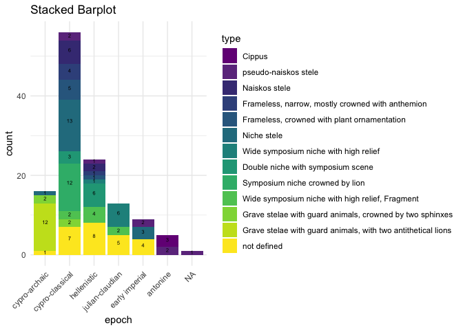
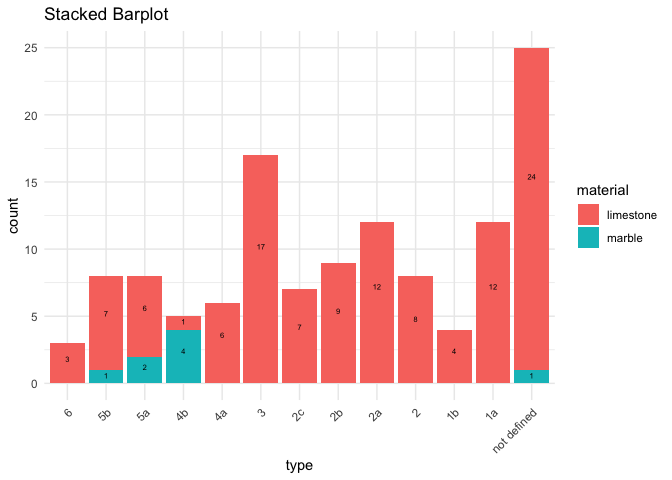

## Read in and clean data

set `NA` values

    data <- read.csv("Projects/johannaroever/StelaeCyprus.csv", 
                     sep = ";", 
                     header = TRUE,
                     na = c("unknown", "undefined"))

## Data modification

In `epoch` the value *antoninisch* should be replaced by *antonine* for
using a consistent language.

    data %<>%
      mutate(epoch = str_replace(epoch, "antoninisch", "antonine"))

In the column `type`some values still include a “?” which should be
deleted, since the information it was meant to convey is written in
`typeCertain`.

    data %<>%
      mutate(type = str_replace_all(type, "\\?", ""))

For the stelae with the `catNo` = *98* and *99* the value of `type` has
to be changed to *6*.

    data %<>%
      mutate(type = if_else(catNo == 98 | catNo == 99, "6", type))

The values in `typeCertain` are to be replaced for easier handling in R:
*0* to *FALSE*, *1* to *TRUE*.

    data %<>%
      mutate(typeCertain = (typeCertain == 0))

The column `location` has to be reviewed for only containing the values
of the general regions, while more specific information can be deleted:
\* *Amathus, Golgoi, Idalion, Kition, Marion/Paphos, Salamis, Soloi,
Tamassos* \* All *unknown* in this column can be converted to *Cyprus*.
(1) \* All values which include “(?)” can be converted to *Cyprus*. (2)
\* If the current value already includes one of the region names,
shorten it to only that. This applies to values which include “near”,
“bei” (5) \* The value of the observation of `catNo`=*12* which says
“probably Idalion” should be changed to *Cyprus*. (3) \* Other: (4) \*
region of Limassol –&gt; Amathus \* Limassol –&gt; Amathus \*
Mathikoloni –&gt; Amathus  
\* Athienou –&gt; Golgoi \* Melousha –&gt; Golgoi \* Pergamon –&gt;
Golgoi  
\* Alambra (Larnaca) –&gt; Kition \* Pano Arodes –&gt; Marion \* Polis
–&gt; Marion  
\* Kotschines (neighbourhood of Lysi) –&gt; Salamis \* north of Lysi,
district Famagusta –&gt; Salamis  
\* Ambelia, near Morphou –&gt; Soloi  
\* Pera (Asproji) –&gt; Tamassos

    data %<>%
      mutate(location = if_else(location == "unknown", "Cyprus", location)) %>% # (1)
      mutate(location = if_else(str_detect(location, "\\?"), "Cyprus", location)) %>% # (2)
      mutate(location = if_else(location == "probably Idalion", "Cyprus", location)) %>% # (3)
      mutate(location = case_when(
        location %in% c("region of Limassol", "Limassol", "Mathikoloni") ~ "Amathus", TRUE ~ location)) %>% # (4 ff.)
      mutate(location = case_when(
        location %in% c("Athienou", "Melousha", "Pergamon") ~ "Golgoi", TRUE ~ location)) %>%
      mutate(location = if_else(location == "Alambra (Larnaca)", "Kition", location)) %>%
      mutate(location = case_when(
        location %in% c("Pano Arodes", "Polis") ~ "Marion", TRUE ~ location)) %>%
      mutate(location = case_when(
        location %in% c("Kotschines (neighbourhood of Lysi)", "north of Lysi, district Famagusta") ~ "Salamis", TRUE ~ location)) %>%
      mutate(location = if_else(location == "Ambelia, near Morphou", "Soloi", location)) %>%
      mutate(location = if_else(location == "Pera (Asproji)", "Tamassos", location)) %>%
      mutate(location = if_else(location == "Salamiu, NE of Kouklia (Alt Paphos)", "Marion", location))

    data %<>% # (5 ff.)
      mutate(location = case_when(str_detect(location, "Golgoi") ~ "Golgoi",
                                  str_detect(location, "Tamassos") ~ "Tamassos",
                                  str_detect(location, "Marion") ~ "Marion",
                                  str_detect(location, "Amathus") ~ "Amathus",
                                  str_detect(location, "Idalion") ~ "Idalion",
                                  str_detect(location, "Salamis") ~ "Salamis",
                                  str_detect(location, "Soloi") ~ "Salamis",
                                  .default = location)
             )

For easier handling of `material` the values should just be reduced to
either *limestone* or *marble*.

    data %<>%
      mutate(material = if_else(str_detect(material, "limestone"), "limestone", material)) %>%
      mutate(material = if_else(str_detect(material, "marble"), "marble", material))

# Visualization

## 1. Stacked bar plot epoch - type

### Table to show amount of type per epoch

    savedata <- data # to be removed
    data <- savedata

    data$epoch <- factor(data$epoch, ordered = TRUE, 
                            levels = c("cypro-archaic", "cypro-classical", "hellenistic",
                                       "hellenistic-roman", "julian-claudian", 
                                       "early imperial", "antonine"))

    data$type <- fct_relevel(data$type, c("6", "5b", "5a", "4b", "4a", "3", "2c", "2b", "2a", "2", "1b", "1a", "not defined"))

    typeData <- 
      distinct(data, type,typeDesc) %>% 
      replace_na(list(type = "NA", typeDesc = "unknown")) %>%
      arrange(type)

    data %<>% 
      mutate( type = factor(type, levels = typeData$type, labels = typeData$typeDesc))

    knitr::kable(table(data$type, data$epoch))

<table style="width:100%;">
<colgroup>
<col style="width: 37%" />
<col style="width: 8%" />
<col style="width: 9%" />
<col style="width: 7%" />
<col style="width: 11%" />
<col style="width: 9%" />
<col style="width: 9%" />
<col style="width: 5%" />
</colgroup>
<thead>
<tr class="header">
<th style="text-align: left;"></th>
<th style="text-align: right;">cypro-archaic</th>
<th style="text-align: right;">cypro-classical</th>
<th style="text-align: right;">hellenistic</th>
<th style="text-align: right;">hellenistic-roman</th>
<th style="text-align: right;">julian-claudian</th>
<th style="text-align: right;">early imperial</th>
<th style="text-align: right;">antonine</th>
</tr>
</thead>
<tbody>
<tr class="odd">
<td style="text-align: left;">Cippus</td>
<td style="text-align: right;">0</td>
<td style="text-align: right;">0</td>
<td style="text-align: right;">0</td>
<td style="text-align: right;">0</td>
<td style="text-align: right;">0</td>
<td style="text-align: right;">0</td>
<td style="text-align: right;">3</td>
</tr>
<tr class="even">
<td style="text-align: left;">pseudo-naiskos stele</td>
<td style="text-align: right;">0</td>
<td style="text-align: right;">2</td>
<td style="text-align: right;">1</td>
<td style="text-align: right;">0</td>
<td style="text-align: right;">0</td>
<td style="text-align: right;">2</td>
<td style="text-align: right;">2</td>
</tr>
<tr class="odd">
<td style="text-align: left;">Naiskos stele</td>
<td style="text-align: right;">0</td>
<td style="text-align: right;">6</td>
<td style="text-align: right;">2</td>
<td style="text-align: right;">0</td>
<td style="text-align: right;">0</td>
<td style="text-align: right;">0</td>
<td style="text-align: right;">0</td>
</tr>
<tr class="even">
<td style="text-align: left;">Frameless, narrow, mostly crowned with
anthemion</td>
<td style="text-align: right;">0</td>
<td style="text-align: right;">4</td>
<td style="text-align: right;">1</td>
<td style="text-align: right;">0</td>
<td style="text-align: right;">0</td>
<td style="text-align: right;">0</td>
<td style="text-align: right;">0</td>
</tr>
<tr class="odd">
<td style="text-align: left;">Frameless, crowned with plant
ornamentation</td>
<td style="text-align: right;">0</td>
<td style="text-align: right;">5</td>
<td style="text-align: right;">1</td>
<td style="text-align: right;">0</td>
<td style="text-align: right;">0</td>
<td style="text-align: right;">0</td>
<td style="text-align: right;">0</td>
</tr>
<tr class="even">
<td style="text-align: left;">Niche stele</td>
<td style="text-align: right;">1</td>
<td style="text-align: right;">13</td>
<td style="text-align: right;">0</td>
<td style="text-align: right;">0</td>
<td style="text-align: right;">0</td>
<td style="text-align: right;">3</td>
<td style="text-align: right;">0</td>
</tr>
<tr class="odd">
<td style="text-align: left;">Wide symposium niche with high relief</td>
<td style="text-align: right;">0</td>
<td style="text-align: right;">0</td>
<td style="text-align: right;">1</td>
<td style="text-align: right;">0</td>
<td style="text-align: right;">6</td>
<td style="text-align: right;">0</td>
<td style="text-align: right;">0</td>
</tr>
<tr class="even">
<td style="text-align: left;">Double niche with symposium scene</td>
<td style="text-align: right;">0</td>
<td style="text-align: right;">3</td>
<td style="text-align: right;">6</td>
<td style="text-align: right;">0</td>
<td style="text-align: right;">0</td>
<td style="text-align: right;">0</td>
<td style="text-align: right;">0</td>
</tr>
<tr class="odd">
<td style="text-align: left;">Symposium niche crowned by lion</td>
<td style="text-align: right;">0</td>
<td style="text-align: right;">12</td>
<td style="text-align: right;">0</td>
<td style="text-align: right;">0</td>
<td style="text-align: right;">0</td>
<td style="text-align: right;">0</td>
<td style="text-align: right;">0</td>
</tr>
<tr class="even">
<td style="text-align: left;">Wide symposium niche with high relief,
Fragment</td>
<td style="text-align: right;">0</td>
<td style="text-align: right;">2</td>
<td style="text-align: right;">4</td>
<td style="text-align: right;">0</td>
<td style="text-align: right;">2</td>
<td style="text-align: right;">0</td>
<td style="text-align: right;">0</td>
</tr>
<tr class="odd">
<td style="text-align: left;">Grave stelae with guard animals, crowned
by two sphinxes</td>
<td style="text-align: right;">2</td>
<td style="text-align: right;">2</td>
<td style="text-align: right;">0</td>
<td style="text-align: right;">0</td>
<td style="text-align: right;">0</td>
<td style="text-align: right;">0</td>
<td style="text-align: right;">0</td>
</tr>
<tr class="even">
<td style="text-align: left;">Grave stelae with guard animals, with two
antithetical lions</td>
<td style="text-align: right;">12</td>
<td style="text-align: right;">0</td>
<td style="text-align: right;">0</td>
<td style="text-align: right;">0</td>
<td style="text-align: right;">0</td>
<td style="text-align: right;">0</td>
<td style="text-align: right;">0</td>
</tr>
<tr class="odd">
<td style="text-align: left;">not defined</td>
<td style="text-align: right;">1</td>
<td style="text-align: right;">7</td>
<td style="text-align: right;">8</td>
<td style="text-align: right;">0</td>
<td style="text-align: right;">5</td>
<td style="text-align: right;">4</td>
<td style="text-align: right;">0</td>
</tr>
</tbody>
</table>

### Stacked bar plot to show the correlation `epoch - type`:

    # make a color palette to be used
    my_colors <- viridis_pal()(13)
    my_colors[1] <- "#750786FF"
    my_colors[2] <- "#6D378CFF"

    ggplot(data, aes(x = epoch, fill = type)) +
      geom_bar() +
      labs(title = "Stacked Barplot",
           x = "epoch",
           fill = "type") +
      geom_text(stat = "count", aes(label = after_stat(count)), position = position_stack(vjust = 0.6), size = 2) +
      theme_minimal() + 
      theme(axis.text.x = element_text(angle = 45, hjust = 1)) +
      scale_fill_manual(values = my_colors)

## 2. Stacked barplot type - material

### Table to show amounts of each material per type

    knitr::kable(table(data$type, data$material))

<table>
<colgroup>
<col style="width: 78%" />
<col style="width: 12%" />
<col style="width: 8%" />
</colgroup>
<thead>
<tr class="header">
<th style="text-align: left;"></th>
<th style="text-align: right;">limestone</th>
<th style="text-align: right;">marble</th>
</tr>
</thead>
<tbody>
<tr class="odd">
<td style="text-align: left;">Cippus</td>
<td style="text-align: right;">3</td>
<td style="text-align: right;">0</td>
</tr>
<tr class="even">
<td style="text-align: left;">pseudo-naiskos stele</td>
<td style="text-align: right;">7</td>
<td style="text-align: right;">1</td>
</tr>
<tr class="odd">
<td style="text-align: left;">Naiskos stele</td>
<td style="text-align: right;">6</td>
<td style="text-align: right;">2</td>
</tr>
<tr class="even">
<td style="text-align: left;">Frameless, narrow, mostly crowned with
anthemion</td>
<td style="text-align: right;">1</td>
<td style="text-align: right;">4</td>
</tr>
<tr class="odd">
<td style="text-align: left;">Frameless, crowned with plant
ornamentation</td>
<td style="text-align: right;">6</td>
<td style="text-align: right;">0</td>
</tr>
<tr class="even">
<td style="text-align: left;">Niche stele</td>
<td style="text-align: right;">17</td>
<td style="text-align: right;">0</td>
</tr>
<tr class="odd">
<td style="text-align: left;">Wide symposium niche with high relief</td>
<td style="text-align: right;">7</td>
<td style="text-align: right;">0</td>
</tr>
<tr class="even">
<td style="text-align: left;">Double niche with symposium scene</td>
<td style="text-align: right;">9</td>
<td style="text-align: right;">0</td>
</tr>
<tr class="odd">
<td style="text-align: left;">Symposium niche crowned by lion</td>
<td style="text-align: right;">12</td>
<td style="text-align: right;">0</td>
</tr>
<tr class="even">
<td style="text-align: left;">Wide symposium niche with high relief,
Fragment</td>
<td style="text-align: right;">8</td>
<td style="text-align: right;">0</td>
</tr>
<tr class="odd">
<td style="text-align: left;">Grave stelae with guard animals, crowned
by two sphinxes</td>
<td style="text-align: right;">4</td>
<td style="text-align: right;">0</td>
</tr>
<tr class="even">
<td style="text-align: left;">Grave stelae with guard animals, with two
antithetical lions</td>
<td style="text-align: right;">12</td>
<td style="text-align: right;">0</td>
</tr>
<tr class="odd">
<td style="text-align: left;">not defined</td>
<td style="text-align: right;">24</td>
<td style="text-align: right;">1</td>
</tr>
</tbody>
</table>

### Stacked bar plot to show the correlation type - material

Also here: how can you see a correlation with a barplot?

    ggplot(data, aes(x = type, fill = material)) +
      geom_bar() +
      labs(title = "Stacked Barplot",
           x = "type",
           fill = "material") +
      geom_text(stat = "count", aes(label = after_stat(count)), position = position_stack(vjust = 0.6), size = 2) +
      theme_minimal() +
      theme(axis.text.x = element_text(angle = 45, hjust = 1)) +
      scale_x_discrete(labels = c("6", "5b", "5a", "4b", "4a", "3", "2c", "2b", "2a", "2", "1b", "1a", "not defined"))

