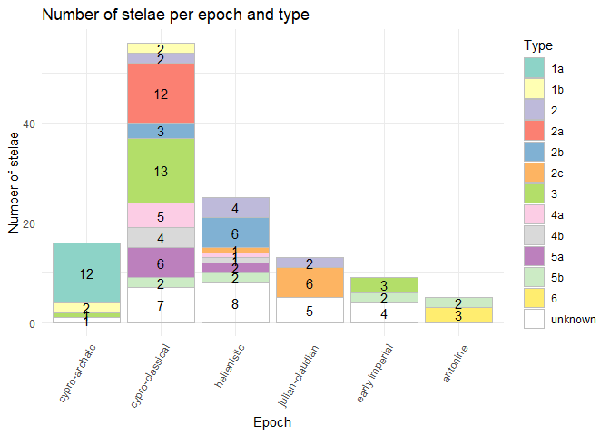
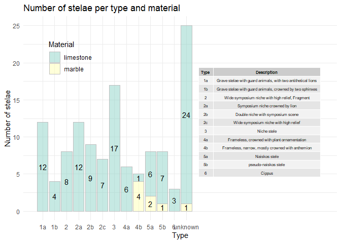

# Data wrangling

    data <-
      read_delim("StelaeCyprus.csv",
                 delim=";",
                 # (1)
               na = c("","NA","unknown", "not defined"),
               locale = locale(encoding = "latin1"),
               show_col_types = F) |>
        # (2)
        mutate( epoch = if_else( epoch == "hellenistic-römisch", "hellenistic", epoch)) |>
        mutate( epoch = if_else(epoch == "antoninisch", "antonine", epoch) |>
      #The chronological order for epoch is:
                    factor(levels = c("cypro-archaic",
                                      "cypro-classical",
                                      "hellenistic",
                                      "julian-claudian",
                                      "early imperial",
                                      "flavian",
                                      "antonine",
                                      "unknown"))

                ) |>
        # (3)
        mutate( type = str_remove(type,"\\?")) |>
        # (4)
        mutate( type = ifelse(catNo %in% c(98,99), 6, type)) |>
        # (5)
        mutate( typeCertain = typeCertain == 1) |>
        # (6)
        mutate( location = ifelse(catNo == 12, "Cyprus", location)) |>
        mutate( location = case_when(
          str_detect(location, "region of Limassol|Limassol|Mathikoloni") ~ "Amathus",
          str_detect(location, "Athienou|Melousha|Pergamon") ~ "Golgoi",
          str_detect(location, "Alambra (Larnaca)") ~ "Kition",
          str_detect(location, "Pano Arodes|Episkopi") ~ "Marion/Paphos",
          str_detect(location, "Kotschines (neighbourhood of Lysi)|north of Lysi, district Famagusta") ~ "Salamis",
          str_detect(location, "Ambelia, near Morphou") ~ "Soloi",
          str_detect(location, "Pera (Asproji)") ~ "Tamassos"
        )
                  ) |>
        mutate(location = if_else( str_detect(location, "unknown|\\(\\?\\)"), "Cyprus", location)) |>
        # filter( !str_detect(location, "Amathus|Golgoi|Idalion|Kition|Marion/Paphos|Salamis|Soloi|Tamassos|Cyprus")) |>
        # distinct(location)
        # (7)
        mutate( material = str_extract(material, "limestone|marble"))
        # distinct(material)
      # View()

# Visualization 1. Stacked bar plot epoch - type

    countTable <-
      data |>
      replace_na(list(type="unknown")) |>
      select(epoch, type) |>
      group_by(epoch, type) |>
      count() |>
      ungroup() |>
      pivot_wider(names_from = type, values_from = n, values_fill = 0) |>
      # change column order in lexicographical order
      select(epoch, sort(unique(data$type)), unknown)

    countTable |> 
      # add space between columns
      kableExtra::kable(align = "c", format = "html") 

<table>
<thead>
<tr>
<th style="text-align:center;">
epoch
</th>
<th style="text-align:center;">
1a
</th>
<th style="text-align:center;">
1b
</th>
<th style="text-align:center;">
2
</th>
<th style="text-align:center;">
2a
</th>
<th style="text-align:center;">
2b
</th>
<th style="text-align:center;">
2c
</th>
<th style="text-align:center;">
3
</th>
<th style="text-align:center;">
4a
</th>
<th style="text-align:center;">
4b
</th>
<th style="text-align:center;">
5a
</th>
<th style="text-align:center;">
5b
</th>
<th style="text-align:center;">
6
</th>
<th style="text-align:center;">
unknown
</th>
</tr>
</thead>
<tbody>
<tr>
<td style="text-align:center;">
cypro-archaic
</td>
<td style="text-align:center;">
12
</td>
<td style="text-align:center;">
2
</td>
<td style="text-align:center;">
0
</td>
<td style="text-align:center;">
0
</td>
<td style="text-align:center;">
0
</td>
<td style="text-align:center;">
0
</td>
<td style="text-align:center;">
1
</td>
<td style="text-align:center;">
0
</td>
<td style="text-align:center;">
0
</td>
<td style="text-align:center;">
0
</td>
<td style="text-align:center;">
0
</td>
<td style="text-align:center;">
0
</td>
<td style="text-align:center;">
1
</td>
</tr>
<tr>
<td style="text-align:center;">
cypro-classical
</td>
<td style="text-align:center;">
0
</td>
<td style="text-align:center;">
2
</td>
<td style="text-align:center;">
2
</td>
<td style="text-align:center;">
12
</td>
<td style="text-align:center;">
3
</td>
<td style="text-align:center;">
0
</td>
<td style="text-align:center;">
13
</td>
<td style="text-align:center;">
5
</td>
<td style="text-align:center;">
4
</td>
<td style="text-align:center;">
6
</td>
<td style="text-align:center;">
2
</td>
<td style="text-align:center;">
0
</td>
<td style="text-align:center;">
7
</td>
</tr>
<tr>
<td style="text-align:center;">
hellenistic
</td>
<td style="text-align:center;">
0
</td>
<td style="text-align:center;">
0
</td>
<td style="text-align:center;">
4
</td>
<td style="text-align:center;">
0
</td>
<td style="text-align:center;">
6
</td>
<td style="text-align:center;">
1
</td>
<td style="text-align:center;">
0
</td>
<td style="text-align:center;">
1
</td>
<td style="text-align:center;">
1
</td>
<td style="text-align:center;">
2
</td>
<td style="text-align:center;">
2
</td>
<td style="text-align:center;">
0
</td>
<td style="text-align:center;">
8
</td>
</tr>
<tr>
<td style="text-align:center;">
julian-claudian
</td>
<td style="text-align:center;">
0
</td>
<td style="text-align:center;">
0
</td>
<td style="text-align:center;">
2
</td>
<td style="text-align:center;">
0
</td>
<td style="text-align:center;">
0
</td>
<td style="text-align:center;">
6
</td>
<td style="text-align:center;">
0
</td>
<td style="text-align:center;">
0
</td>
<td style="text-align:center;">
0
</td>
<td style="text-align:center;">
0
</td>
<td style="text-align:center;">
0
</td>
<td style="text-align:center;">
0
</td>
<td style="text-align:center;">
5
</td>
</tr>
<tr>
<td style="text-align:center;">
early imperial
</td>
<td style="text-align:center;">
0
</td>
<td style="text-align:center;">
0
</td>
<td style="text-align:center;">
0
</td>
<td style="text-align:center;">
0
</td>
<td style="text-align:center;">
0
</td>
<td style="text-align:center;">
0
</td>
<td style="text-align:center;">
3
</td>
<td style="text-align:center;">
0
</td>
<td style="text-align:center;">
0
</td>
<td style="text-align:center;">
0
</td>
<td style="text-align:center;">
2
</td>
<td style="text-align:center;">
0
</td>
<td style="text-align:center;">
4
</td>
</tr>
<tr>
<td style="text-align:center;">
antonine
</td>
<td style="text-align:center;">
0
</td>
<td style="text-align:center;">
0
</td>
<td style="text-align:center;">
0
</td>
<td style="text-align:center;">
0
</td>
<td style="text-align:center;">
0
</td>
<td style="text-align:center;">
0
</td>
<td style="text-align:center;">
0
</td>
<td style="text-align:center;">
0
</td>
<td style="text-align:center;">
0
</td>
<td style="text-align:center;">
0
</td>
<td style="text-align:center;">
2
</td>
<td style="text-align:center;">
3
</td>
<td style="text-align:center;">
0
</td>
</tr>
</tbody>
</table>

    countTable |>
      pivot_longer(cols = -epoch, names_to = "type", values_to = "n") |>
      ggplot(aes(x = epoch, y=n, fill=type)) +
      geom_bar(stat="identity", col="gray") +
      theme_minimal() +
      theme(axis.text.x = element_text(angle = 60, hjust = 1)) +
      # show counts in bar segments if not 0
      geom_text(aes(label=ifelse(n==0, "", n)), position=position_stack(vjust=0.5)) +
      # set well distinguishable fill colors
      scale_fill_brewer(palette="Set3") +
      labs(x="Epoch", y="Number of stelae", fill="Type") +
      ggtitle("Number of stelae per epoch and type")

    ## Warning in RColorBrewer::brewer.pal(n, pal): n too large, allowed maximum for palette Set3 is 12
    ## Returning the palette you asked for with that many colors

# Visualization 2. Stacked bar plot type - material

    data |>
      replace_na(list(type="unknown",typeDescr="unknown")) |>
      select(type, typeDesc, material) |>
      group_by(type, typeDesc, material) |>
      count() |>
      ungroup() ->
      typeMaterial

    typeMaterial |>
      ggplot(aes(x=type, y=n, fill=material)) +
      geom_bar(stat="identity", col="gray", alpha = 0.5) +
      annotate(geom = "table",
             x = 14,
             y = 12,
             label = list(typeMaterial |>
                            select(Type = type,`Description` = typeDesc) |>
                            filter(Type != "unknown") |>
                            distinct() |>
                            # mutate(codename = str_wrap(codename,width=80) |> str_c(sep="\n")) |>
                            arrange(Type)),
             hjust=0,
             vjust=0.5,
             size=2) +
      theme_minimal() +
      geom_text(aes(label=ifelse(n==0, "", n)), position=position_stack(vjust=0.5)) +
      scale_fill_brewer(palette="Set3") +
      labs(x="Type", y="Number of stelae", fill="Material") +
      ggtitle("Number of stelae per type and material") +
      # add table to typeMaterial below graph with typeDescr for each type
      coord_cartesian(clip = "off", xlim = c(0, 25)) +
      # move fill legend inside plot
      theme(legend.position = c(0.15,0.8))

