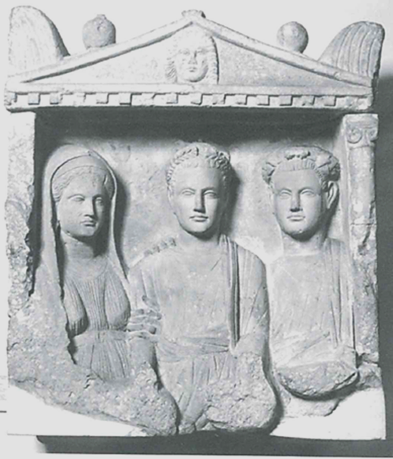
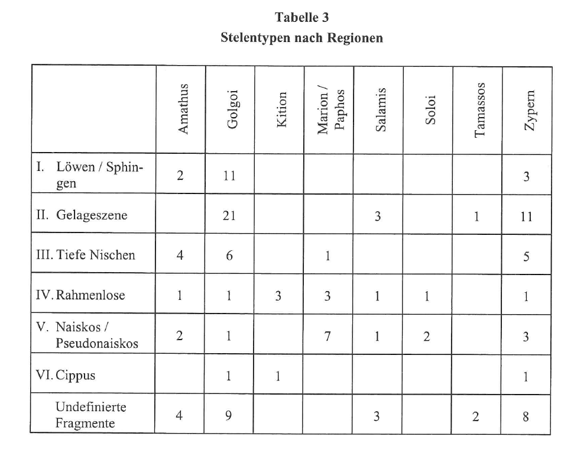
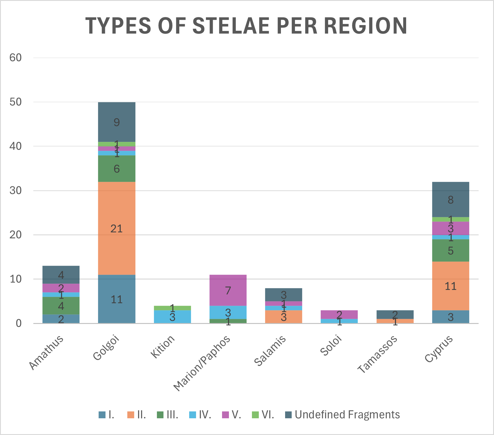

```{r setup, include=FALSE}
knitr::opts_chunk$set(echo = TRUE)
```

# Visualisation for grave stelae from Cyprus during the Roman Empire

During the Roman Empire grave reliefs across the empire show similarities but can differ depending on the exact area they were used in. This can be the case because of local traditions and influences from other regions.  
Here the focus should be on the stelae from Cyprus which were categorized and dated by the archaeologist Pogiatzi.The provided [CSV](StelaeCyprus.csv) was assembled by me (J. Roever) from the data described in Pogiatzi's book:  
_E. Pogiatzi, Die Grabreliefs auf Zypern von der archaischen bis zur roemischen Zeit, Peleus 23 (Diss. Albert-Ludwigs-Universitaet Freiburg 2002, Moehnesee-Wamel 2003)_

This is one example of the reliefs, from the julian-claudian era:
<figure>

<figcaption aria-hidden="true">Example stele, julian-claudian era, Pogiatzi 2002 Cat.-No. 44</figcaption>
</figure>

# Data

The analysed  attributes are:

* `catNo`: number given to the stele in Pogiatzi's catalogue
* `epoch`: the epoch to which Pogiatzi dated the stele
* `type`: the type identified in Pogiatzi's classification
* `typeDesc`: description of the type
* `typeCertain`: indicator whether the type could be identified certainly or not, the latter usually due to only fragmentary conservation
* `location`: where the stele was found
* `locationType`: in which context the stele was found
* `paintedSurface`: description of painted areas
* `material`: the material the stele is made of

The chronological order for `epoch` is:
_cypro-archaic, cypro-classical, hellenistic, julian-claudian, early_imperial, flavian, antonine_

In some cases the data can be uncertain or incomplete because grave reliefs as well as other artifacts were found and/or excavated without modern archaeological methods. (For further interpretation it is also important to be aware that usually not 100% of the artifacts are known and excavated.)


The data describes the stelae by attributes which might correlate with
each other. The first few of 124 observations are shown here:

```{r, echo = FALSE}
library(knitr)
data <- read.csv("StelaeCyprus.csv", sep=';', header = TRUE)
kable(data[1:6, ])

```

# Goals
## Data Modification

1. All values of _unknown_ and _undefined_ are to be replaced with `NA` for easier handling in R. The values of _not specified_ should be kept.
2. In `epoch` the value _antoninisch_ should be replaced by _antonine_ for using a consistent language.
3. In the column `type`some values still include a "?" which should be deleted, since the information it was meant to convey is written in `typeCertain`.
4. For the stelae with the `catNo` =  _98_ and _99_ the value of `type` has to be changed to _6_.
5. The values in `typeCertain` are to be replaced for easier handling in R: _0_ to _FALSE_, _1_ to _TRUE_.
6. The column `location` has to be reviewed for only containing the values of the general regions, while more specific information can be deleted: 
    * _Amathus, Golgoi, Idalion, Kition, Marion/Paphos, Salamis, Soloi, Tamassos_
    * All _unknown_ in this column can be converted to _Cyprus_.
    * All values which include "(?)" can be converted to _Cyprus_.
    * If the current value already includes one of the region names, shorten it to only that. This appies to values which include  "near", "bei"
    * The value of the observation of `catNo`=_12_ which says "probably Idalion" should be changed to _Cyprus_.
    * Other:
        * region of Limassol --> Amathus
        * Limassol --> Amathus
        * Mathikoloni --> Amathus  
        * Athienou --> Golgoi
        * Melousha --> Golgoi
        * Pergamon --> Golgoi  
        * Alambra (Larnaca) --> Kition
        * Pano Arodes --> Marion
        * Polis --> Marion  
        * Kotschines (neighbourhood of Lysi) --> Salamis
        * north of Lysi, district Famagusta --> Salamis    
        * Ambelia, near Morphou --> Soloi  
        * Pera (Asproji) --> Tamassos
7. For easier handling of `material`the values should just be reduced to either _limestone_ or _marble_.

## Visualisation

To get a better view of the data for answering certain questions, some of the attributes should be shown in tables as well as in plots using `ggplot2`.

### 1. Stacked bar plot epoch - type


To answer the question which types (including the sub-types) are used per epoch:  
1. Create a table to show the amounts of each type per epoch.
2. Create a stacked bar plot to show the correlation `epoch - type`:

* `epoch` is the variable on the x-axis
* For the order to show `epoch` in follow the chronological order given in the [data description](#Data).
* The amounts of each `type` should be shown with the number added to each part of the stack.
* The order to show `type` in should be following the stages in alphanumeric order.
* Add a legend to display the `typeDescription` on the side of the diagram.

When only the general type is given     
The stelae without defined values in `type` should still be counted and shown as "undefined" for each epoch.
The column `typeCertain` can be ignored for this. If the type is marked as uncertain count it for the type given in `type`.

This should be done similar to the following example table and diagram showing the stele types per region:
<figure>

<figcaption aria-hidden="true">Example table: Stele types per region</figcaption>
</figure>

<figure>

<figcaption aria-hidden="true">Example diagram: Stele types per region</figcaption>
</figure>

### 2. Scatterplot epoch - type - material

The goal of this is to visualise if and when there are there any changes in the material that go along with the epoch and type:

Create a scatterplot to show the correlations between `epoch - type - material`.

* `epoch` on the x-axis, for the order to show `epoch` in follow the chronological order given in the [data description](#Data).
* `type` on the y-axis
* Use the marker `color` to display the material and include the legend for this.
* Optional: Add a correlation line.

