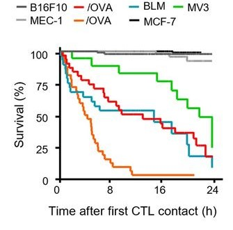

```{r setup, include=FALSE}
library(ggplot2)
library(dplyr)
library(knitr)
library(kableExtra)
library(cowplot)

knitr::opts_chunk$set(echo = TRUE)
```

--------------------------------------------------------------------------------

## __Background__

--------------------------------------------------------------------------------

To understand tumor growth, researchers often expose tumor cell lines to different treatments, e.g., chemotherapy, radiation therapy or immune therapy, to observe their response. Do the tumor cells stop growing? Do they die? This information is essential to evaluate the success of potential cancer therapies.

Live-cell microscopy is one way to observe tumor cell response to therapy. For this, tumor cells are labelled with a fluorescent marker and imaged by taking one image, e.g., every minute for 48 hours. When the tumor cells die, their cell size shrinks and their fluorescence intensity fades until they completely vanish. The actual fluorescence microscopy image could look like this:

<center>

{#id .class width=20% height=20%}     {#id .class width=20% height=20%}

*Fluorescence microscopy images of tumor cells 0 hours after treatment and 48 hours after treatment*

</center>

The cell size and fluorescence intensity of the cells in the movie can be tracked using automatic cell segmentation and cell tracking tools, e.g., the ImageJ plugins [Stardist](https://imagej.net/plugins/stardist) and [TrackMate](https://imagej.net/plugins/trackmate/).


[This data frame ](Track_one_dying_cell.csv) shows the measurements of a dying cell whereas [this data frame ](Track_one_viable_cell.csv) represents the measurements of a viable cell. Each row in the data frame represents the respective cell at one time point and it includes columns for

* the cell name (called cell ID)
* the time point
* the fluorescence intensity of this cell at this time point
* the area of the cell at this time point

The first rows of the measurements of a dying cell is shown below:

```{r, echo = FALSE}
df <- read.csv("Track_one_dying_cell.csv")
df <- df[ , c("Cell.ID","Time.point", "Intensity", "Area")]
knitr::kable( head( df ), col.names = gsub("[.]", " ", names(df)), caption = "Table: Tumor cell data from live-cell imaging") %>%
    kable_styling(c("bordered", "striped"), full_width = T)
```

For a dying cell, the fluorescence intensity and cell size show a downward tendency over time:

```{r dead_cell, echo = FALSE, out.width='70%', message=FALSE, fig.height=3, fig.width=6, fig.align="center"}
# Load the data and set the time column
df_dead <- read.csv("Track_one_dying_cell.csv")
df_dead$Time.in.hours <- as.double(df_dead$Time.point /60) # Frame was taken every 60 s

# Plot the data of the dying cell
plot_intens_dying_cell <- ggplot( df_dead, aes(x = Time.in.hours, y = Intensity, color = "indianred1") ) +
  geom_line() +
  theme_classic() +
  labs(
    title = "Fluorescence fades in dying cells",
    x = "Time in hours (h)",
    y = "Fluorescence intensity"
  ) +
  theme(plot.title = element_text(size = rel(1), angle = 0)) +
  theme(legend.position = "none") + 
  theme(aspect.ratio=3/4)

plot_area_dying_cell <- ggplot( df_dead, aes(x = Time.in.hours, y = Area) ) +
  geom_line() +
  theme_classic() + 
  labs(
    title = "Cell size shrinks in dying cells",
    x = "Time in hours (h)",
    y = "Cell size"
  ) +
  theme(plot.title = element_text(size = rel(1), angle = 0)) + 
  theme(aspect.ratio=3/4)

cowplot::plot_grid(plot_intens_dying_cell, plot_area_dying_cell)
```

For a viable cell, the fluorescence intensity and cell size remain rather stable and only decrease at the end of the movie when paraformaldehyde is added to preserve the cells:

```{r viable_cell, echo = FALSE, out.width='70%', message=FALSE, fig.height=3, fig.width=6, fig.align="center"}
df_viable <- read.csv("Track_one_viable_cell.csv")
df_viable$Time.in.hours <- df_viable$Time.point /60 # Frame was taken every 60 s

# Plot the data of the viable cell
plot_intens_viable_cell <- ggplot( df_viable, aes(x = Time.in.hours, y = Intensity, color =  "indianred1" ) ) +
  geom_line() +
  theme_classic() + 
  labs(
    title = "Fluorescence intensity is \nstable in viable cells",
    x = "Time in hours (h)",
    y = "Fluorescence intensity"  
  ) +
  theme(plot.title = element_text(size = rel(1), angle = 0)) +
  theme(legend.position = "none") +
  theme(aspect.ratio=3/4)

plot_area_viable_cell <- ggplot( df_viable, aes(x = Time.in.hours, y = Area) ) +
  geom_line() +
  theme_classic() + 
  labs(
    title = "Cell size does not shrink \nin viable cells",
    x = "Time in hours (h)",
    y = "Cell size"
  ) +
  theme(plot.title = element_text(size = rel(1), angle = 0)) +
  theme(aspect.ratio=3/4)


plot_grid(plot_intens_viable_cell, plot_area_viable_cell)

```
--------------------------------------------------------------------------------

## __Data and goal__

--------------------------------------------------------------------------------

We have two populations of tumor cells, [the first one](Tracks_Treated_Cells.csv) has been treated with a new therapy and [the second one](Tracks_Untreated_Cells.csv) is a negative control. Now, we would like to know which cell die at which time point. For this, we need to identify dying tumor cells by their drop in cell size and their declining fluorescence intensity. 

We aim to add a column to the original data frame that classifies cells as either alive or dying for comparison of the growth behavior and the survival rate in both populations.

For some visualization, we could plot the results like the figure below. 

<center>

{#id .class width=30% height=30%}    

*Each color represents a different cell population. The grey colored cell lines are the negative controls. Source: @RN297 *

</center>

--------------------------------------------------------------------------------

## __Priorities (from high to low)__

--------------------------------------------------------------------------------

- Identify dying tumor cells in the data sets and estimate the point of death. One suggestion for the criteria would be:
  - Observe whether the cell size dropped by 40% or more compared to the inital cell size.
  - Observe whether the fluorescence intensity shows a linear downward trend.
- Count dying tumor cells and compute the relative number of cell deaths.
- Plot the cell survival for both cell populations in one plot. In our case, we opt for two colored lines representing the treated cell population and the untreated cell population.


--------------------------------------------------------------------------------

## __Additional notes__

--------------------------------------------------------------------------------

- It might happen that the measured cell size of dying cells increase again. This is because the fluorescent area of the cells is not restricted to the cell nucleus anymore after the cell died. Therefore, it is critical to identify a clear drop in cell size rather than only comparing the initial and end size.
- It is not sufficient to view the end of a cell track as point of death. This is because cells might move out of the frame and more importantly, cell segmentation and cell tracking is far from perfect. For this reason, cell tracks are often lost despite the cells still being there. 
- For the data set of untreated set, there is a initial drop of the fluorescence intensity for all cells. This is a technical artifact of the microscope. 
- For reference: In the data set of treated cells, the cell with the Cell.ID 0 stayed alive and the cell with the Cell.ID 70 died.

Let me know if you have any questions or remarks!

Best,

Julia

--------------------------------------------------------------------------------

## __References__

--------------------------------------------------------------------------------


