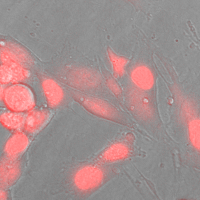
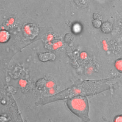
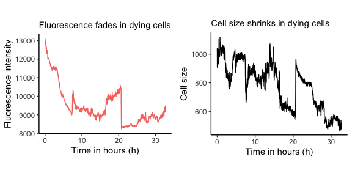
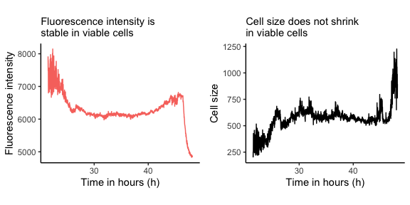

------------------------------------------------------------------------

## **Background**

------------------------------------------------------------------------

To understand tumor growth, researchers often expose tumor cell lines to
different treatments, e.g., chemotherapy, radiation therapy or immune
therapy, to observe their response. Do the tumor cells stop growing? Do
they die? This information is essential to evaluate the success of
potential cancer therapies.

Live-cell microscopy is one way to observe tumor cell response to
therapy. For this, tumor cells are labelled with a fluorescent marker
and imaged by taking one image, e.g., every minute for 48 hours. When
the tumor cells die, their cell size shrinks and their fluorescence
intensity fades until they completely vanish. The actual fluorescence
microscopy image could look like this:

*Fluorescence microscopy images of tumor cells 0 hours after treatment
and 48 hours after treatment*

The cell size and fluorescence intensity of the cells in the movie can
be tracked using automatic cell segmentation and cell tracking tools,
e.g., the ImageJ plugins [Stardist](https://imagej.net/plugins/stardist)
and [TrackMate](https://imagej.net/plugins/trackmate/).

[This data frame](Track_one_dying_cell.csv) shows the measurements of a
dying cell whereas [this data frame](Track_one_viable_cell.csv)
represents the measurements of a viable cell. Each row in the data frame
represents the respective cell at one time point and it includes columns
for

-   the cell name (called cell ID)
-   the time point
-   the fluorescence intensity of this cell at this time point
-   the area of the cell at this time point

The first rows of the measurements of a dying cell is shown below:

<table class="table table-bordered table-striped" style="margin-left: auto; margin-right: auto;">
<caption>
Table: Tumor cell data from live-cell imaging
</caption>
<thead>
<tr>
<th style="text-align:right;">
Cell ID
</th>
<th style="text-align:right;">
Time point
</th>
<th style="text-align:right;">
Intensity
</th>
<th style="text-align:right;">
Area
</th>
</tr>
</thead>
<tbody>
<tr>
<td style="text-align:right;">
0
</td>
<td style="text-align:right;">
0
</td>
<td style="text-align:right;">
12917.11
</td>
<td style="text-align:right;">
1044.0
</td>
</tr>
<tr>
<td style="text-align:right;">
0
</td>
<td style="text-align:right;">
1
</td>
<td style="text-align:right;">
13109.96
</td>
<td style="text-align:right;">
909.5
</td>
</tr>
<tr>
<td style="text-align:right;">
0
</td>
<td style="text-align:right;">
2
</td>
<td style="text-align:right;">
13029.61
</td>
<td style="text-align:right;">
923.5
</td>
</tr>
<tr>
<td style="text-align:right;">
0
</td>
<td style="text-align:right;">
3
</td>
<td style="text-align:right;">
13005.40
</td>
<td style="text-align:right;">
907.5
</td>
</tr>
<tr>
<td style="text-align:right;">
0
</td>
<td style="text-align:right;">
4
</td>
<td style="text-align:right;">
13006.43
</td>
<td style="text-align:right;">
907.0
</td>
</tr>
<tr>
<td style="text-align:right;">
0
</td>
<td style="text-align:right;">
5
</td>
<td style="text-align:right;">
12909.86
</td>
<td style="text-align:right;">
932.0
</td>
</tr>
</tbody>
</table>

For a dying cell, the fluorescence intensity and cell size show a
downward tendency over time:

For a viable cell, the fluorescence intensity and cell size remain
rather stable and only decrease at the end of the movie when
paraformaldehyde is added to preserve the cells:

## 

## **Data and goal**

------------------------------------------------------------------------

We have two populations of tumor cells, [the first
one](Tracks_Treated_Cells.csv) has been treated with a new therapy and
[the second one](Tracks_Untreated_Cells.csv) is a negative control. Now,
we would like to know which cell die at which time point. For this, we
need to identify dying tumor cells by their drop in cell size and their
declining fluorescence intensity.

We aim to add a column to the original data frame that classifies cells
as either alive or dying for comparison of the growth behavior and the
survival rate in both populations.

For some visualization, we could plot the results like the figure below.

*Each color represents a different cell population. The grey colored
cell lines are the negative controls. Source: Weigelin et al. (2021) *

------------------------------------------------------------------------

## **Priorities (from high to low)**

------------------------------------------------------------------------

-   Identify dying tumor cells in the data sets and estimate the point
    of death. One suggestion for the criteria would be:
    -   Observe whether the cell size dropped by 40% or more compared to
        the inital cell size.
    -   Observe whether the fluorescence intensity shows a linear
        downward trend.
-   Count dying tumor cells and compute the relative number of cell
    deaths.
-   Plot the cell survival for both cell populations in one plot. In our
    case, we opt for two colored lines representing the treated cell
    population and the untreated cell population.

------------------------------------------------------------------------

## **Additional notes**

------------------------------------------------------------------------

-   It might happen that the measured cell size of dying cells increase
    again. This is because the fluorescent area of the cells is not
    restricted to the cell nucleus anymore after the cell died.
    Therefore, it is critical to identify a clear drop in cell size
    rather than only comparing the initial and end size.
-   It is not sufficient to view the end of a cell track as point of
    death. This is because cells might move out of the frame and more
    importantly, cell segmentation and cell tracking is far from
    perfect. For this reason, cell tracks are often lost despite the
    cells still being there.
-   For the data set of untreated set, there is a initial drop of the
    fluorescence intensity for all cells. This is a technical artifact
    of the microscope.
-   For reference: In the data set of treated cells, the cell with the
    Cell.ID 0 stayed alive and the cell with the Cell.ID 70 died.

Let me know if you have any questions or remarks!

Best,

Julia

------------------------------------------------------------------------

## **References**

------------------------------------------------------------------------

Weigelin, Bettina, Annemieke Th den Boer, Esther Wagena, Kelly Broen,
Harry Dolstra, Rob J. de Boer, Carl G. Figdor, Johannes Textor, and
Peter Friedl. 2021. “Cytotoxic t Cells Are Able to Efficiently Eliminate
Cancer Cells by Additive Cytotoxicity.” Journal Article. *Nature
Communications* 12 (1): 5217.
<https://doi.org/10.1038/s41467-021-25282-3>.
