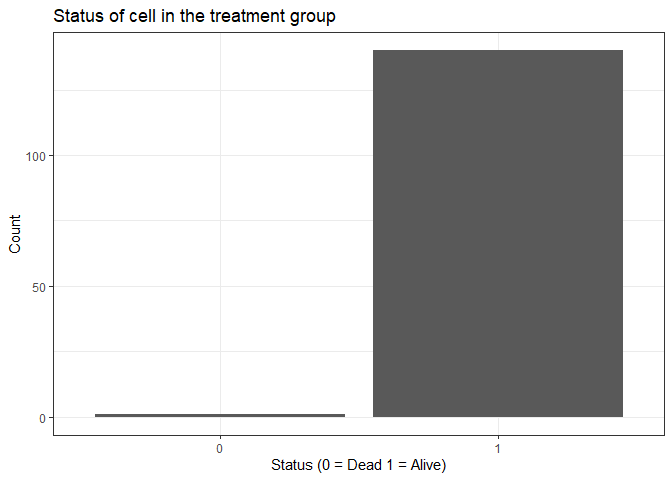

# The project focused on identifying dying tumor cells in a treatment and a control group. In order to identify dying tumor cells, the criteria was applied that the intensity of the cell is below 40% of its initial intensity.

# For each time point I calculated the relative intensity compared to the initial intensity. Based on this calculation I defined a Dummy Variable that indicates whether the cell is alive.

<table style="width:100%;">
<colgroup>
<col style="width: 16%" />
<col style="width: 16%" />
<col style="width: 16%" />
<col style="width: 16%" />
<col style="width: 16%" />
<col style="width: 16%" />
</colgroup>
<thead>
<tr class="header">
<th>Time Point</th>
<th>Cell.ID</th>
<th>Initial Intensity</th>
<th>Current Intensity</th>
<th>Relative Intensity</th>
<th>Alive</th>
</tr>
</thead>
<tbody>
<tr class="odd">
<td>0</td>
<td>0</td>
<td>100</td>
<td>100</td>
<td>1</td>
<td>1</td>
</tr>
<tr class="even">
<td>1</td>
<td>0</td>
<td>100</td>
<td>75</td>
<td>0.75</td>
<td>1</td>
</tr>
<tr class="odd">
<td>2</td>
<td>0</td>
<td>100</td>
<td>60</td>
<td>0.6</td>
<td>1</td>
</tr>
<tr class="even">
<td>3</td>
<td>0</td>
<td>100</td>
<td>35</td>
<td>0.35</td>
<td>0</td>
</tr>
<tr class="odd">
<td>4</td>
<td>0</td>
<td>100</td>
<td>25</td>
<td>0.25</td>
<td>0</td>
</tr>
</tbody>
</table>

    treated_cells_mean |> arrange(alive) |> print(n = 10)

    ## # A tibble: 141 × 3
    ##    Cell.ID share_above_40 alive
    ##      <int>          <dbl> <dbl>
    ##  1     250          0.697     0
    ##  2       0          1         1
    ##  3       1          1         1
    ##  4       2          1         1
    ##  5       3          1         1
    ##  6       4          1         1
    ##  7       5          1         1
    ##  8       6          1         1
    ##  9       7          1         1
    ## 10       8          1         1
    ## # ℹ 131 more rows

    untreated_cells_mean |> arrange(alive) |> print(n = 10)

    ## # A tibble: 129 × 3
    ##    Cell.ID share_above_40 alive
    ##      <int>          <dbl> <dbl>
    ##  1       0         0.508      0
    ##  2       2         0.130      0
    ##  3       3         0.195      0
    ##  4       6         0.752      0
    ##  5       8         0.0835     0
    ##  6       1         1          1
    ##  7       5         1          1
    ##  8       7         1          1
    ##  9       9         1          1
    ## 10      10         1          1
    ## # ℹ 119 more rows

    ggplot(df_t, aes(x = Var1, y = Freq)) + geom_col(position = "stack")

    ggplot(df_u, aes(x = Var1, y = Freq)) + geom_col(position = "stack")

## R Markdown

This is an R Markdown document. Markdown is a simple formatting syntax
for authoring HTML, PDF, and MS Word documents. For more details on
using R Markdown see <http://rmarkdown.rstudio.com>.

When you click the **Knit** button a document will be generated that
includes both content as well as the output of any embedded R code
chunks within the document. You can embed an R code chunk like this:

## Including Plots

You can also embed plots, for example:

Note that the `echo = FALSE` parameter was added to the code chunk to
prevent printing of the R code that generated the plot.
