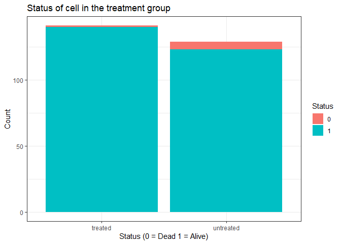
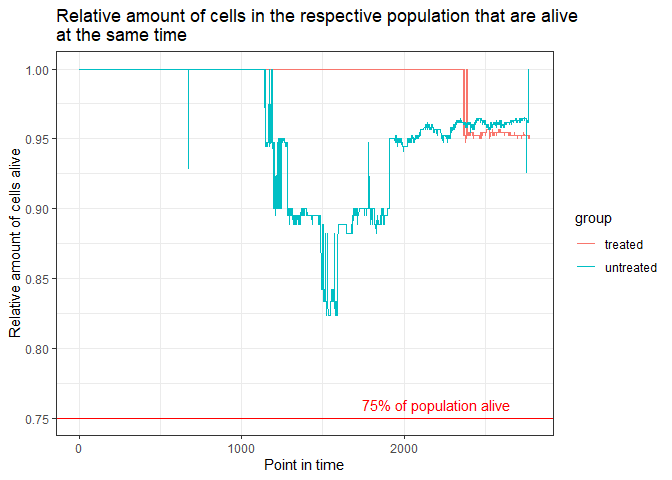

## **Identifying dead cells**

------------------------------------------------------------------------

The project focused on identifying dying tumor cells in a treatment and
a control group. In order to identify dying tumor cells, the criteria
was applied that the intensity of the cell is below 40% of its initial
intensity. For each time point I calculated the relative intensity
compared to the initial intensity. Based on this calculation I defined a
Dummy Variable that indicates whether the cell is alive. Please see an
example of this approach below:

<table style="width:100%;">
<colgroup>
<col style="width: 16%" />
<col style="width: 16%" />
<col style="width: 16%" />
<col style="width: 16%" />
<col style="width: 16%" />
<col style="width: 16%" />
</colgroup>
<thead>
<tr class="header">
<th style="text-align: center;">Time Point</th>
<th style="text-align: center;">Cell.ID</th>
<th style="text-align: center;">Initial Intensity</th>
<th style="text-align: center;">Current Intensity</th>
<th style="text-align: center;">Relative Intensity</th>
<th style="text-align: center;">Alive</th>
</tr>
</thead>
<tbody>
<tr class="odd">
<td style="text-align: center;">0</td>
<td style="text-align: center;">0</td>
<td style="text-align: center;">100</td>
<td style="text-align: center;">100</td>
<td style="text-align: center;">1</td>
<td style="text-align: center;">1</td>
</tr>
<tr class="even">
<td style="text-align: center;">1</td>
<td style="text-align: center;">0</td>
<td style="text-align: center;">100</td>
<td style="text-align: center;">75</td>
<td style="text-align: center;">0.75</td>
<td style="text-align: center;">1</td>
</tr>
<tr class="odd">
<td style="text-align: center;">2</td>
<td style="text-align: center;">0</td>
<td style="text-align: center;">100</td>
<td style="text-align: center;">60</td>
<td style="text-align: center;">0.6</td>
<td style="text-align: center;">1</td>
</tr>
<tr class="even">
<td style="text-align: center;">3</td>
<td style="text-align: center;">0</td>
<td style="text-align: center;">100</td>
<td style="text-align: center;">35</td>
<td style="text-align: center;">0.35</td>
<td style="text-align: center;">0</td>
</tr>
<tr class="odd">
<td style="text-align: center;">4</td>
<td style="text-align: center;">0</td>
<td style="text-align: center;">100</td>
<td style="text-align: center;">25</td>
<td style="text-align: center;">0.25</td>
<td style="text-align: center;">0</td>
</tr>
</tbody>
</table>

Afterwards I calculated the average value of this dummy variable. As
soon as this variable was once 0 (at some point the cell died), the mean
will also be below 1. Thus, I identified the cells that died in each
repsective group.

You can see that in the *treatment group* only one cell (250) died at
one point, while in the *control group* five cells died.

<table>
<thead>
<tr class="header">
<th style="text-align: left;">group</th>
<th style="text-align: right;">Cell.ID</th>
<th style="text-align: right;">rel_intensity_above_40</th>
<th style="text-align: left;">total_alive</th>
</tr>
</thead>
<tbody>
<tr class="odd">
<td style="text-align: left;">Control group</td>
<td style="text-align: right;">0</td>
<td style="text-align: right;">1</td>
<td style="text-align: left;">Alive</td>
</tr>
<tr class="even">
<td style="text-align: left;">Control group</td>
<td style="text-align: right;">1</td>
<td style="text-align: right;">1</td>
<td style="text-align: left;">Alive</td>
</tr>
<tr class="odd">
<td style="text-align: left;">Control group</td>
<td style="text-align: right;">2</td>
<td style="text-align: right;">1</td>
<td style="text-align: left;">Alive</td>
</tr>
<tr class="even">
<td style="text-align: left;">Control group</td>
<td style="text-align: right;">3</td>
<td style="text-align: right;">1</td>
<td style="text-align: left;">Alive</td>
</tr>
<tr class="odd">
<td style="text-align: left;">Control group</td>
<td style="text-align: right;">5</td>
<td style="text-align: right;">1</td>
<td style="text-align: left;">Alive</td>
</tr>
<tr class="even">
<td style="text-align: left;">Control group</td>
<td style="text-align: right;">6</td>
<td style="text-align: right;">1</td>
<td style="text-align: left;">Alive</td>
</tr>
</tbody>
</table>

## **Visualization of the population**

------------------------------------------------------------------------

You can see that only a small amount of cells did completely die during
the time of observation.

It is notable that the cells in the treatment group are nearly all the
time all alive. In the control group there is a significant drop in the
relative amount of cells that are alive at the same time.
