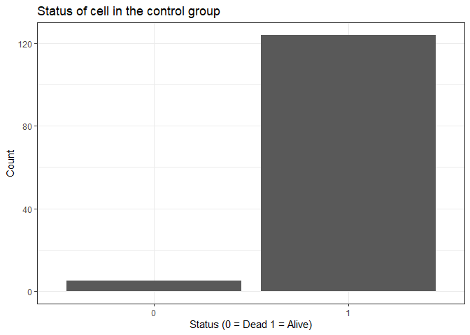

## **Identifying dead cells**

------------------------------------------------------------------------

The project focused on identifying dying tumor cells in a treatment and
a control group. In order to identify dying tumor cells, the criteria
was applied that the intensity of the cell is below 40% of its initial
intensity. For each time point I calculated the relative intensity
compared to the initial intensity. Based on this calculation I defined a
Dummy Variable that indicates whether the cell is alive. Please see an
example of this approach below:

<table style="width:100%;">
<colgroup>
<col style="width: 16%" />
<col style="width: 16%" />
<col style="width: 16%" />
<col style="width: 16%" />
<col style="width: 16%" />
<col style="width: 16%" />
</colgroup>
<thead>
<tr class="header">
<th style="text-align: center;">Time Point</th>
<th style="text-align: center;">Cell.ID</th>
<th style="text-align: center;">Initial Intensity</th>
<th style="text-align: center;">Current Intensity</th>
<th style="text-align: center;">Relative Intensity</th>
<th style="text-align: center;">Alive</th>
</tr>
</thead>
<tbody>
<tr class="odd">
<td style="text-align: center;">0</td>
<td style="text-align: center;">0</td>
<td style="text-align: center;">100</td>
<td style="text-align: center;">100</td>
<td style="text-align: center;">1</td>
<td style="text-align: center;">1</td>
</tr>
<tr class="even">
<td style="text-align: center;">1</td>
<td style="text-align: center;">0</td>
<td style="text-align: center;">100</td>
<td style="text-align: center;">75</td>
<td style="text-align: center;">0.75</td>
<td style="text-align: center;">1</td>
</tr>
<tr class="odd">
<td style="text-align: center;">2</td>
<td style="text-align: center;">0</td>
<td style="text-align: center;">100</td>
<td style="text-align: center;">60</td>
<td style="text-align: center;">0.6</td>
<td style="text-align: center;">1</td>
</tr>
<tr class="even">
<td style="text-align: center;">3</td>
<td style="text-align: center;">0</td>
<td style="text-align: center;">100</td>
<td style="text-align: center;">35</td>
<td style="text-align: center;">0.35</td>
<td style="text-align: center;">0</td>
</tr>
<tr class="odd">
<td style="text-align: center;">4</td>
<td style="text-align: center;">0</td>
<td style="text-align: center;">100</td>
<td style="text-align: center;">25</td>
<td style="text-align: center;">0.25</td>
<td style="text-align: center;">0</td>
</tr>
</tbody>
</table>

Afterwards I calculated the average value of this dummy variable. As
soon as this variable was once 0 (at some point the cell died), the mean
will also be below 1. Thus, I identified the cells that died in each
repsective group.

You can see that in the *treatment group* only one cell (250) died at
one point, while in the *control group* five cells died.

    ## # A tibble: 141 × 3
    ##    Cell.ID rel_intensity_above_40 alive
    ##      <int>                  <dbl> <dbl>
    ##  1     250                  0.697     0
    ##  2       0                  1         1
    ##  3       1                  1         1
    ##  4       2                  1         1
    ##  5       3                  1         1
    ##  6       4                  1         1
    ##  7       5                  1         1
    ##  8       6                  1         1
    ##  9       7                  1         1
    ## 10       8                  1         1
    ## # ℹ 131 more rows

    ## # A tibble: 129 × 3
    ##    Cell.ID rel_intensity_above_40 alive
    ##      <int>                  <dbl> <dbl>
    ##  1       0                 0.508      0
    ##  2       2                 0.130      0
    ##  3       3                 0.195      0
    ##  4       6                 0.752      0
    ##  5       8                 0.0835     0
    ##  6       1                 1          1
    ##  7       5                 1          1
    ##  8       7                 1          1
    ##  9       9                 1          1
    ## 10      10                 1          1
    ## # ℹ 119 more rows

## **Visualization of the population**

------------------------------------------------------------------------

