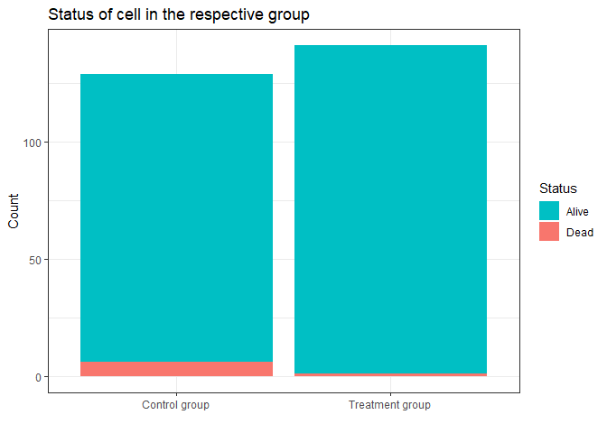

## **Identifying dead cells**

------------------------------------------------------------------------

The project focused on identifying dying tumor cells in a treatment and
a control group. In order to identify dying tumor cells, the criteria
was applied that the intensity of the cell is below 40% of its initial
intensity. For each time point I calculated the relative intensity
compared to the initial intensity. Based on this calculation I defined a
Dummy Variable that indicates whether the cell is alive. Please see an
example of this approach below:

<table style="width:100%;">
<colgroup>
<col style="width: 16%" />
<col style="width: 16%" />
<col style="width: 16%" />
<col style="width: 16%" />
<col style="width: 16%" />
<col style="width: 16%" />
</colgroup>
<thead>
<tr class="header">
<th style="text-align: center;">Time Point</th>
<th style="text-align: center;">Cell.ID</th>
<th style="text-align: center;">Initial Intensity</th>
<th style="text-align: center;">Current Intensity</th>
<th style="text-align: center;">Relative Intensity</th>
<th style="text-align: center;">Alive</th>
</tr>
</thead>
<tbody>
<tr class="odd">
<td style="text-align: center;">0</td>
<td style="text-align: center;">0</td>
<td style="text-align: center;">100</td>
<td style="text-align: center;">100</td>
<td style="text-align: center;">1</td>
<td style="text-align: center;">1</td>
</tr>
<tr class="even">
<td style="text-align: center;">1</td>
<td style="text-align: center;">0</td>
<td style="text-align: center;">100</td>
<td style="text-align: center;">75</td>
<td style="text-align: center;">0.75</td>
<td style="text-align: center;">1</td>
</tr>
<tr class="odd">
<td style="text-align: center;">2</td>
<td style="text-align: center;">0</td>
<td style="text-align: center;">100</td>
<td style="text-align: center;">60</td>
<td style="text-align: center;">0.6</td>
<td style="text-align: center;">1</td>
</tr>
<tr class="even">
<td style="text-align: center;">3</td>
<td style="text-align: center;">0</td>
<td style="text-align: center;">100</td>
<td style="text-align: center;">35</td>
<td style="text-align: center;">0.35</td>
<td style="text-align: center;">0</td>
</tr>
<tr class="odd">
<td style="text-align: center;">4</td>
<td style="text-align: center;">0</td>
<td style="text-align: center;">100</td>
<td style="text-align: center;">25</td>
<td style="text-align: center;">0.25</td>
<td style="text-align: center;">0</td>
</tr>
</tbody>
</table>

    ## `summarise()` has grouped output by 'group'. You can override using the
    ## `.groups` argument.

<table>
<thead>
<tr class="header">
<th style="text-align: left;">Group</th>
<th style="text-align: left;">Status</th>
<th style="text-align: right;">Freq</th>
</tr>
</thead>
<tbody>
<tr class="odd">
<td style="text-align: left;">Control group</td>
<td style="text-align: left;">Alive</td>
<td style="text-align: right;">123</td>
</tr>
<tr class="even">
<td style="text-align: left;">Treatment group</td>
<td style="text-align: left;">Alive</td>
<td style="text-align: right;">140</td>
</tr>
<tr class="odd">
<td style="text-align: left;">Control group</td>
<td style="text-align: left;">Dead</td>
<td style="text-align: right;">6</td>
</tr>
<tr class="even">
<td style="text-align: left;">Treatment group</td>
<td style="text-align: left;">Dead</td>
<td style="text-align: right;">1</td>
</tr>
</tbody>
</table>

You can see that in the *treatment group* only one cell (250) died at
one point, while in the *control group* six cells died.

## **Visualization of the population**

------------------------------------------------------------------------

It is notable that the cells in the treatment group are nearly all the
time all alive. In the control group there is a significant drop in the
relative amount of cells that are alive at the same time.
