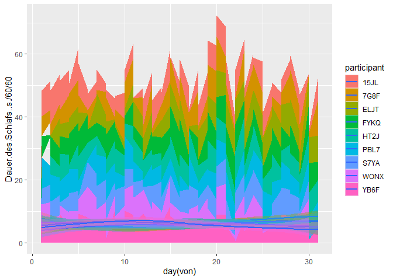
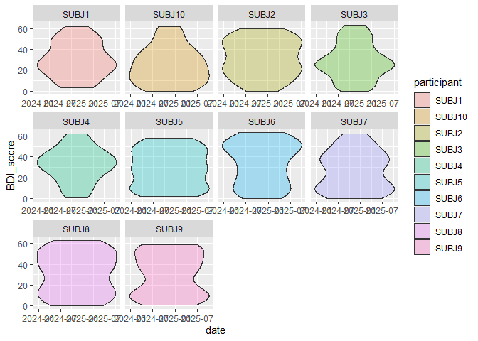
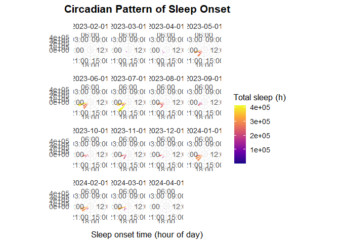

## Reading in the data

    subjects <- list()

    for (id in list.files("Week4 Homework- Sleep synthetic project", pattern = "^subject_.*\\.csv$")){
      subjects[[id]]<- read.csv(paste0("Week4 Homework- Sleep synthetic project/",id))
    }

    all_subjects <- bind_rows(subjects)

    PANAS <- read.csv("Week4 Homework- Sleep synthetic project/PANAS_scores.csv")
    BDI<- read.csv("Week4 Homework- Sleep synthetic project/BDI_scores.csv")

## Cleaning and validating the data

    # Formatting the Date
    all_subjects <- all_subjects %>% 
      mutate(
        von = ymd_hms(von),
        bis = ymd_hms(bis)
      )

    #Removing Duplicates
    all_subjects <- all_subjects %>% arrange(von, bis, participant, desc(Dauer.des.Schlafs..s.)) %>% 
      distinct(von, bis, participant, .keep_all = TRUE)

Are there really this many duplicates ? I can’t believe it.

    only_dupes <- all_subjects %>% 
     filter(duplicated(across(c(participant, von, bis)))) %>%
      arrange(von, bis, participant, desc(Dauer.des.Schlafs..s.))

I guess there are…

    # Checking for NA's
    all_subjects %>% count(is.na(all_subjects)) # 0 Missing values (not including night.events)

    ##   is.na(all_subjects).participant is.na(all_subjects).von
    ## 1                           FALSE                   FALSE
    ##   is.na(all_subjects).bis is.na(all_subjects).leicht..s.
    ## 1                   FALSE                          FALSE
    ##   is.na(all_subjects).tief..s. is.na(all_subjects).rem..s.
    ## 1                        FALSE                       FALSE
    ##   is.na(all_subjects).wach..s. is.na(all_subjects).Aufwachen
    ## 1                        FALSE                         FALSE
    ##   is.na(all_subjects).Dauer.des.Schlafs..s.
    ## 1                                     FALSE
    ##   is.na(all_subjects).Dauer.bis.zum.Wachwerden..s.
    ## 1                                            FALSE
    ##   is.na(all_subjects).Schnarchen..s. is.na(all_subjects).Schnarchepisoden
    ## 1                              FALSE                                FALSE
    ##   is.na(all_subjects).Durchschnittliche.Herzfrequenz
    ## 1                                              FALSE
    ##   is.na(all_subjects).Herzfrequenz..min. is.na(all_subjects).Herzfrequenz..max.
    ## 1                                  FALSE                                  FALSE
    ##   is.na(all_subjects).Night.events   n
    ## 1                             TRUE 585

    # Looking for implausible values
    all_subjects <- all_subjects %>% 
      mutate(
        unplausible =
          ifelse(Dauer.des.Schlafs..s. > 57600 | Herzfrequenz..min. < 30 | Herzfrequenz..max. > 200, 1, 0) # no implausible values
      )

## Data Validation Checks

    # Verify sleep duration:
    all_subjects <- all_subjects %>% 
      mutate(
        sleep_sum = `leicht..s.` + `tief..s.` + `rem..s.` + `wach..s.`,
        diff_secs = `Dauer.des.Schlafs..s.` - sleep_sum,
        sleep_ok  = abs(diff_secs) <= 600   # Toleranz 10 Minuten
      )

    # Confirm timestamps logical (bis > von):
    all_subjects <- all_subjects %>% 
      mutate(
        timestamp_ok = bis > von
      )

    # Check sleep period duration matches timestamp difference:
    all_subjects <- all_subjects %>% 
      mutate(
        duration_secs_calc = as.numeric(bis - von, units = "secs"),
        duration_check = abs(duration_secs_calc - `Dauer.des.Schlafs..s.`) <= 60*5 #5 Minutes Tolerance
      )

    # Identify outliers: sleep duration < 3 hours or > 12 hours:
    all_subjects <- all_subjects %>% 
      mutate(
        sleepduration.over.12 = ifelse(Dauer.des.Schlafs..s. > 12*60*60, 1, 0),
        sleepduration.under.3 = ifelse(Dauer.des.Schlafs..s. < 3*60*60, 1, 0)
      )

    # Flag sequences with >3 consecutive missing days:
    #'* Considering over 75% of the entries were deleted because they are duplicates this seems rather useless. Also unsure how to properly do*

    # Physiological plausibility:
    all_subjects <- all_subjects %>% 
      mutate(
        physiologically.plausible = ifelse(Herzfrequenz..min. > 40 & Herzfrequenz..max. < 100, 1, 0)
      )

## Visualization Goals

    # Sleep Architecture Over Time:
    all_subjects %>% 
      ggplot(
        aes(x = day(von), color = participant)
      )+
      geom_ribbon(aes(ymin = von, ymax = bis ))

    all_subjects %>% 
      ggplot(
        aes(x = day(von), fill = participant)
      )+
      geom_area(aes(y = Dauer.des.Schlafs..s./60/60))+
      geom_smooth(aes(y = Dauer.des.Schlafs..s./60/60), method = "loess")

    ## `geom_smooth()` using formula = 'y ~ x'

    # Sleep Duration Distribution:
    df <- all_subjects %>%
      mutate(
        date       = as_date(von),
        duration_h = `Dauer.des.Schlafs..s.` / 3600,
        week       = floor_date(date, unit = "week")  # "week" is enough
      )

    # sanity check: do these columns exist?
    str(df[, c("duration_h", "week")])

    ## 'data.frame':    585 obs. of  2 variables:
    ##  $ duration_h: num  6.21 4.09 9.95 7.42 8.75 ...
    ##  $ week      : Date, format: "2023-02-05" "2023-02-12" ...

    ggplot(df, aes(
      x = duration_h,
      y = factor(week),
      fill = factor(week)
    )) +
      geom_density_ridges(
        alpha = 0.8,
        color = "white",
        scale = 1.2,
        rel_min_height = 0.01
      ) +
      labs(
        title = "Sleep Duration Distribution by Week",
        x = "Sleep Duration (hours)",
        y = "Week",
        fill = "Block Start"
      ) +
      theme_minimal(base_size = 14) +
      theme(
        plot.title = element_text(face = "bold"),
        legend.position = "none"
      )

    ## Picking joint bandwidth of 1.32

    # Overview of BDI Scores
    BDI <- BDI %>%
      mutate(date = ymd(date))

    BDI %>% 
      ggplot(
        aes(
          x = date,
          y = BDI_score
        )
      )+
      geom_violin(
        aes(
          fill = participant),
        alpha = 0.3
        )+
      facet_wrap(~ participant, scales = "free_x")

    #' Circadian Pattern Visualization *by GPT*

    ggplot(
      all_subjects,
      aes(x = hour(von))
    ) +
      stat_summary_bin(
        aes(y = Dauer.des.Schlafs..s., fill = after_stat(y)),
        fun = sum,
        binwidth = 1,
        geom = "col",
        color = "white",
        alpha = 0.9
      ) +
      coord_polar(start = -pi/2) +
      scale_x_continuous(
        breaks = seq(0, 21, 3),
        limits = c(0, 24),
        minor_breaks = NULL,
        labels = function(x) sprintf("%02d:00", x)
      ) +
      scale_fill_viridis_c(option = "C", name = "Total sleep (h)") +
      facet_wrap(~ floor_date(von, "month")) +
      labs(
        title = "Circadian Pattern of Sleep Onset",
        x = "Sleep onset time (hour of day)",
        y = "Total sleep duration (hours, per bin)"
      ) +
      theme_minimal(base_size = 13) +
      theme(
        axis.title.y  = element_blank(),
        panel.grid.minor = element_blank(),
        plot.title = element_text(face = "bold", hjust = 0.5)
      )

    ## Warning: Removed 15 rows containing missing values or values outside the scale range
    ## (`geom_col()`).

    # Summary Statistics Table:
