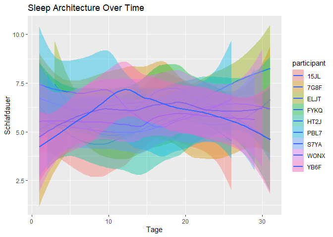
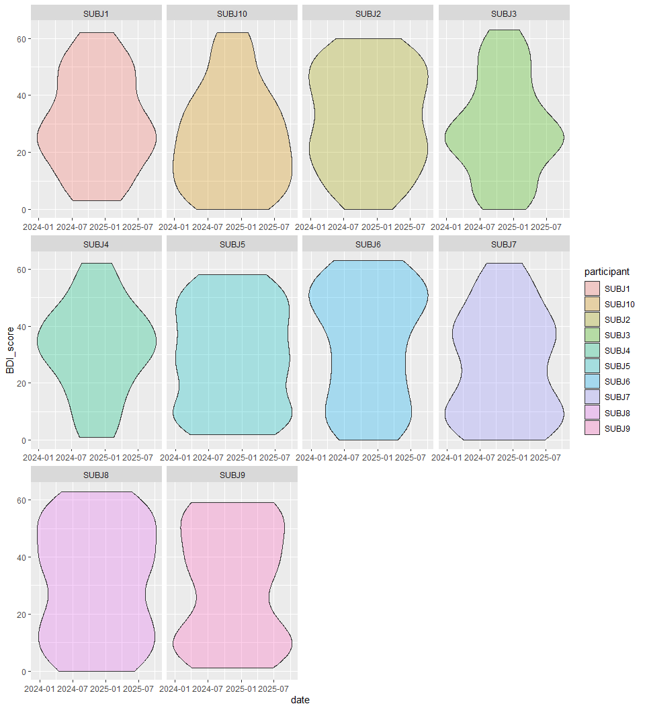
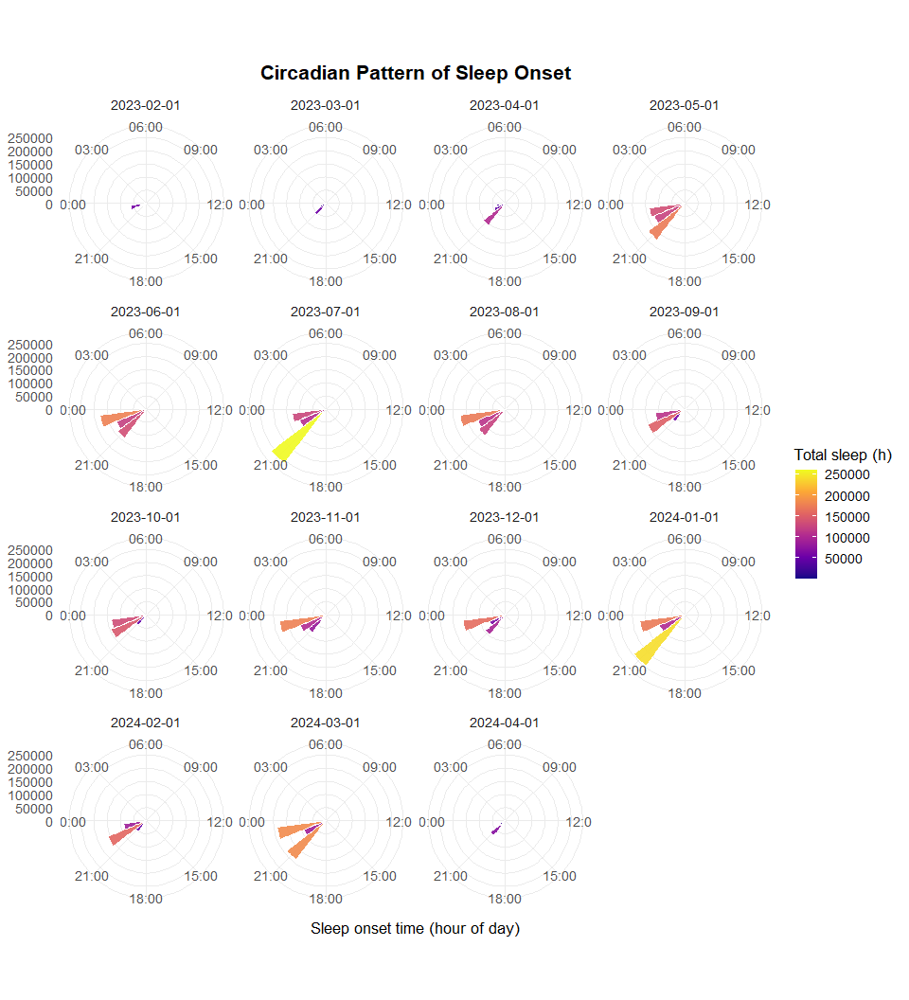

## Reading in the data

    setwd(this.path::this.dir())

    all_subjects <- map(
      list.files("Week4 Homework- Sleep synthetic project", pattern = "^subject_.*\\.csv$",  full.names = TRUE),
      read.csv
    ) %>% bind_rows()

    PANAS <- read.csv("Week4 Homework- Sleep synthetic project/PANAS_scores.csv")
    BDI<- read.csv("Week4 Homework- Sleep synthetic project/BDI_scores.csv")

## Cleaning and validating the data

    subjects_clean <- all_subjects %>% 
      mutate(
      # Formatting the Date
        von = ymd_hms(von),
        bis = ymd_hms(bis)
      ) %>% 
      #Removing Duplicates
      distinct(von, bis, participant, .keep_all = TRUE) %>% 
      # Filtering implausible values
      filter(!(Dauer.des.Schlafs..s. > 57600 | Herzfrequenz..min. < 30 | Herzfrequenz..max. > 200)) %>% 
      # Filtering sleep durations that dont add up:
      mutate(
        sleep_sum = `leicht..s.` + `tief..s.` + `rem..s.` + `wach..s.`,
        diff_secs = `Dauer.des.Schlafs..s.` - sleep_sum,
        sleep_ok  = abs(diff_secs) <= 600   # Toleranz 10 Minuten
      ) %>%
      filter(!(sleep_ok != TRUE)) %>% 
      # Filtering illogical timestamps (bis > von):
      filter(bis > von) %>% 
      # Check sleep period duration matches timestamp difference:
      mutate(
        duration_secs_calc = as.numeric(bis - von, units = "secs"),
        duration_check = abs(duration_secs_calc - `Dauer.des.Schlafs..s.`) <= 60*5 #5 Minutes Tolerance
      ) %>% 
      filter(duration_check != TRUE) %>% 
      #' Identify outliers: sleep duration < 3 hours or > 12 hours *(JUST FLAGGING; NOT REMOVING)*:
      mutate(
        sleepduration.over.12 = ifelse(Dauer.des.Schlafs..s. > 12*60*60, 1, 0),
        sleepduration.under.3 = ifelse(Dauer.des.Schlafs..s. < 3*60*60, 1, 0)
      ) %>% 
      #' Physiological plausibility *(SAME HERE)*:
      mutate(
        physiologically.plausible = ifelse(Herzfrequenz..min. > 40 & Herzfrequenz..max. < 100, 1, 0)
      )

## Visualization Goals

    # Sleep Architecture Over Time:

    subjects_clean %>% 
      ggplot(
        aes(x = day(von), fill = participant)
      )+
      geom_smooth(aes(y = Dauer.des.Schlafs..s./60/60),  method = "loess")+
      labs(
        y = "Schlafdauer",
        x = "Tage",
        title = "Sleep Architecture Over Time")

    ## `geom_smooth()` using formula = 'y ~ x'

    subjects_clean %>%
      mutate(
        date       = as_date(von),
        duration_h = `Dauer.des.Schlafs..s.` / 3600,
        week       = factor(floor_date(date, unit = "week"))  # "week" is enough
      ) %>%
      ggplot(aes(
        x = duration_h,
        y = week,
        fill = week
      )) +
      geom_density_ridges(
        alpha = 0.8,
        color = "white",
        scale = 1.2,
        rel_min_height = 0.01
      ) +
      labs(
        title = "Sleep Duration Distribution by Week",
        x = "Sleep Duration (hours)",
        y = "Week",
        fill = "Block Start"
      ) +
      theme_minimal(base_size = 14) +
      theme(
        plot.title = element_text(face = "bold"),
        legend.position = "none"
      )

    ## Picking joint bandwidth of 0.995

    # Overview of BDI Scores
    BDI <- BDI %>%
      mutate(date = ymd(date))

    BDI %>% 
      ggplot(
        aes(
          x = date,
          y = BDI_score
        )
      )+
      geom_violin(
        aes(
          fill = participant),
        alpha = 0.3
        )+
      facet_wrap(~ participant, scales = "free_x")

    #' Circadian Pattern Visualization
    ggplot(
      subjects_clean,
      aes(x = hour(von))
    ) +
      stat_summary_bin(
        aes(y = Dauer.des.Schlafs..s., fill = after_stat(y)),
        fun = sum,
        binwidth = 1,
        geom = "col",
        color = "white",
        alpha = 0.9
      ) +
      coord_polar(start = -pi/2) +
      scale_x_continuous(
        breaks = seq(0, 21, 3),
        limits = c(0, 24),
        minor_breaks = NULL,
        labels = function(x) sprintf("%02d:00", x)
      ) +
      scale_fill_viridis_c(option = "C", name = "Total sleep (h)") +
      facet_wrap(~ floor_date(von, "month")) +
      labs(
        title = "Circadian Pattern of Sleep Onset",
        x = "Sleep onset time (hour of day)",
        y = "Total sleep duration (hours, per bin)"
      ) +
      theme_minimal(base_size = 13) +
      theme(
        axis.title.y  = element_blank(),
        panel.grid.minor = element_blank(),
        plot.title = element_text(face = "bold", hjust = 0.5)
      )

    ## Warning: Removed 14 rows containing missing values or values outside the scale range
    ## (`geom_col()`).

    # Summary Statistics Table
    subjects_clean <- subjects_clean %>% 
      mutate(
        duration_h = `Dauer.des.Schlafs..s.` / 3600)

    outliers_before <- subjects_clean %>%
      summarise(outliers = sum(duration_h < 2 | duration_h > 14))

    df_cleaned <- subjects_clean %>%
      filter(duration_h >= 2, duration_h <= 14)

    outliers_after <- df_cleaned %>%
      summarise(outliers = sum(duration_h < 2 | duration_h > 14))

    data.frame(
      Stage = c("Before cleaning", "After cleaning"),
      Outliers = c(outliers_before$outliers, outliers_after$outliers)
    ) %>% 
    kable(caption = "Outlier Counts Before and After Cleaning")

<table>
<caption>Outlier Counts Before and After Cleaning</caption>
<thead>
<tr>
<th style="text-align: left;">Stage</th>
<th style="text-align: right;">Outliers</th>
</tr>
</thead>
<tbody>
<tr>
<td style="text-align: left;">Before cleaning</td>
<td style="text-align: right;">17</td>
</tr>
<tr>
<td style="text-align: left;">After cleaning</td>
<td style="text-align: right;">0</td>
</tr>
</tbody>
</table>
