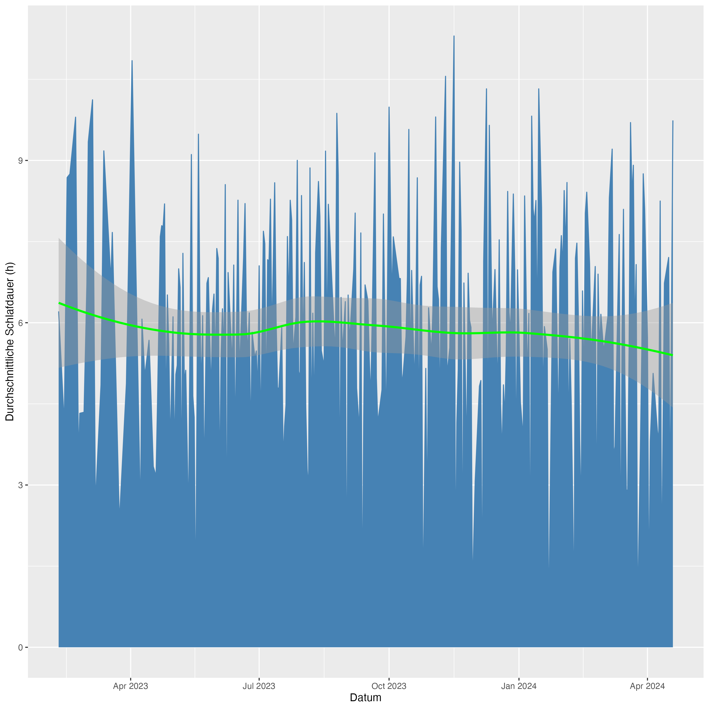
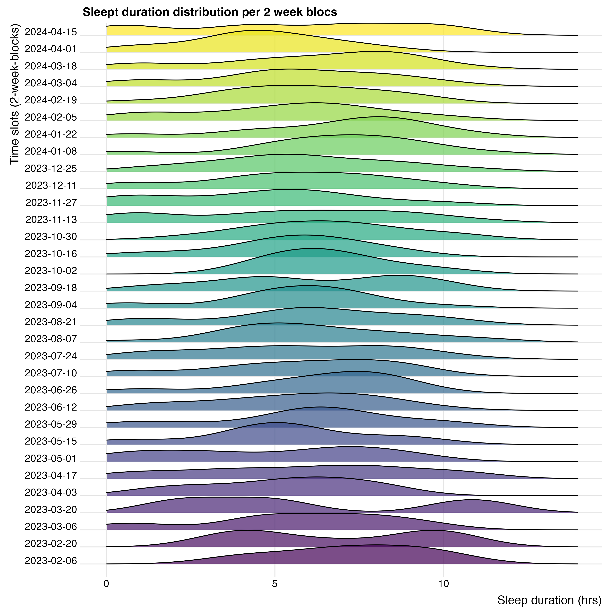
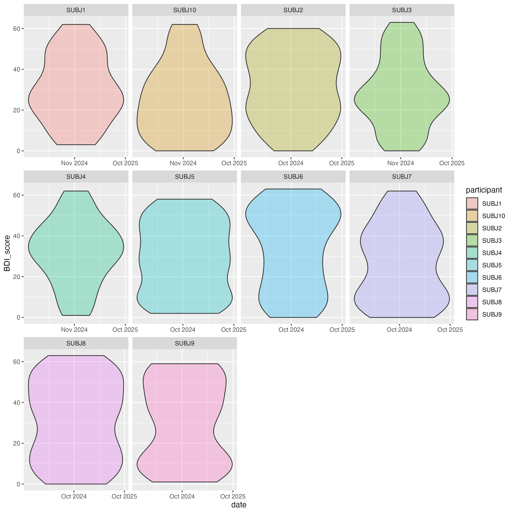
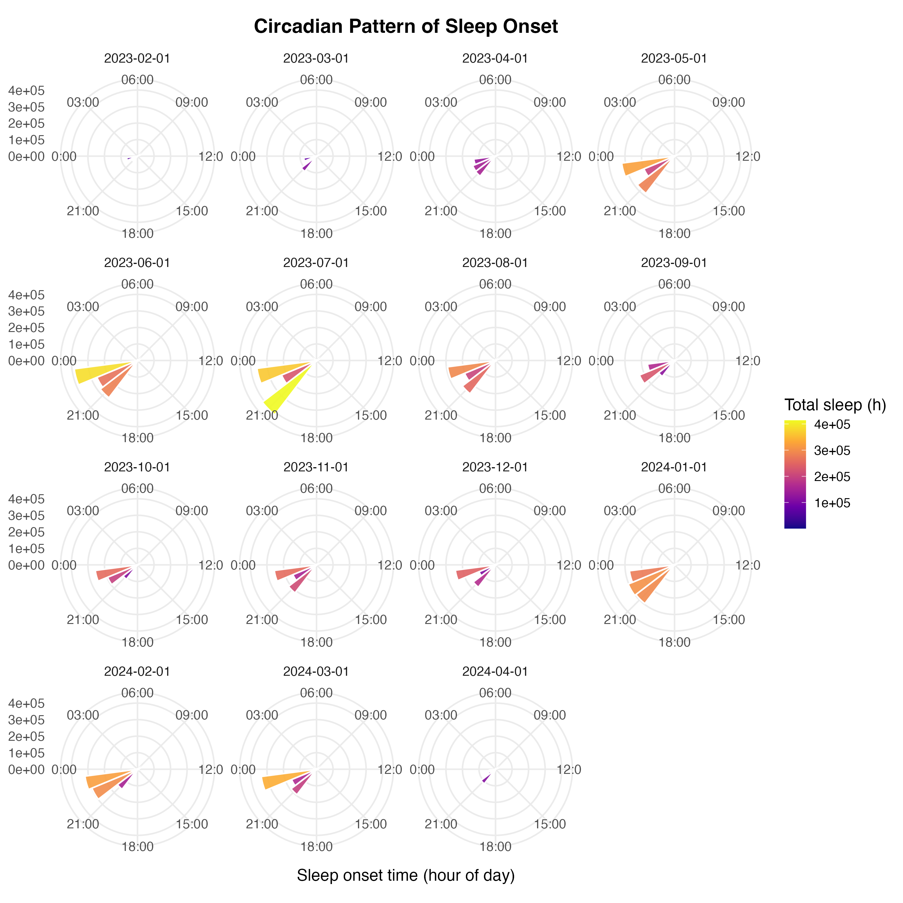

# 1. Data import

Ich war erst mal völlig überfordert und konnte mit den Anweisung gar nichts
anfangen. Dann habe ich mich von Gabriel inspirieren lassen:
```{r setup, echo = FALSE}
library(ggplot2)
library(lubridate)
library(tidyverse)
```

```{r import}
subjects <- list()

for (id in list.files(".", pattern = "^subject_.*\\.csv$")){
  subjects[[id]] <- read.csv(id)
}

all_subjects <- bind_rows(subjects)

PANAS <- read.csv("PANAS_scores.csv")
BDI <- read.csv("BDI_scores.csv")

```
Jetzt kommt das Data cleaning:

```{r datacleaning}
# Spalten umbenennen:
all_subjects <- all_subjects %>%
  mutate(
    von = ymd_hms(von),
    bis = ymd_hms(bis)
  )
# Duplikate entfernen: 
all_subjects <- all_subjects %>%
  arrange(von, bis, participant, desc(Dauer.des.Schlafs..s.)) %>%
  distinct(von, bis, participant, .keep_all = TRUE)
# 
only_duplicates <- all_subjects %>%
  filter(duplicated(across(c(participant, von, bis)))) %>%
  arrange(von, bis, participant, desc(Dauer.des.Schlafs..s.))
```
Da only_duplicates keine Zeilen hat, sind keine Duplikate mehr vorhanden.

```{r datacleaning2}
all_subjects %>% count(is.na(all_subjects))
all_subjects <- all_subjects %>% 
  mutate(
    unplausible =
      ifelse(Dauer.des.Schlafs..s. > 57600 | Herzfrequenz..min. < 30 | Herzfrequenz..max. > 200, 1, 0) # no implausible values
  )
```

```{r datavalidation}
# Verfiy sleep duration:

all_subjects <- all_subjects %>%
  mutate(
    sleep_sum =`leicht..s.` +`tief..s.`+`rem..s.`+`wach..s.`,
    diff_secs = `Dauer.des.Schlafs..s.` - sleep_sum, 
    sleep_ok = abs(diff_secs) <= 600
  )

# Confirm timestamp logical (bis > von): Wenn bis länger ist als von, dann kommt in die neue Spalte der Eintrag von TRUE!
all_subjects <- all_subjects %>%
  mutate(
    timestamp_ok = bis > von
  )

# Check sleep period duration matches timestamp difference:
all_subjects <- all_subjects %>% 
  mutate(
    duration_secs_calc = as.numeric(bis - von, units = "secs"),
    duration_check = abs(duration_secs_calc - `Dauer.des.Schlafs..s.`) <= 60*5 
  )
# duration_secs_calc rechnet die Schlafdauer in Sekundendauer aus
# die Logik oder sinnhaftigkeit prüft die neue Spalte: duration_check, dort steht überall False, sprich die Dauer sind gleich, die differenz ist 0

# Outlier identifier:
all_subjects <- all_subjects %>% 
  mutate(
    sleepduration.over.12 = ifelse(Dauer.des.Schlafs..s. > 12*60*60, 1, 0),
    sleepduration.under.3 = ifelse(Dauer.des.Schlafs..s. < 3*60*60, 1, 0)
  )
# Prüfen auf physiologische Plausibilität:
all_subjects <- all_subjects %>%
  mutate(
    physiologically.plausible= ifelse(Herzfrequenz..min. > 40 & Herzfrequenz..max. < 100, 1, 0)
  )
```

Ganz ehrlich, diese ganze Anleitung ist eine Anleitung der Verwirrung. Es ist eine Auflistung an Variablen und nicht an Handlungsanweisungen. Ich kann kaum etwas damit anfangen. 


```{r sleeparchitectureovertime}

all_subjects <- all_subjects %>%
  mutate(
    study_date = as.Date(`von`),
    duration_hrs = as.numeric(`Dauer.des.Schlafs..s.`/3600)
  ) %>%
  filter(duration_hrs <= 16)

# Variante: Durchschnitt pro Tag plotten
all_subjects %>%
  group_by(study_date) %>%
  summarise(mean_duration = mean(duration_hrs, na.rm = TRUE)) %>%
  ggplot(aes(x = study_date, y = mean_duration)) +
  geom_area(color = "steelblue", fill = "steelblue") +
  geom_smooth(method = "loess", color = "green") + # Die Trendlinie, die du wolltest
  labs(y = "Durchschnittliche Schlafdauer (h)", x = "Datum")
```


```{r vis2, fig.height=8}
# Sleep duration distribution:
library(ggridges)
all_subjects <- all_subjects %>%
  mutate(two_week = cut(study_date, breaks = "2 weeks"))

ggplot(all_subjects, aes(y = two_week, x = duration_hrs, fill = two_week))+
  geom_density_ridges(alpha = 0.7, scale = 1.5)+
  theme_ridges()+
  scale_fill_viridis_d(guide = "none")+
  labs(
    title = "Sleept duration distribution per 2 week blocs",
    x = "Sleep duration (hrs)",
    y = "Time slots (2-week-blocks)"
  )+
  xlim(0, 14)

ggsave("plots/visualization2.png", width = 10, height = 10, dpi = 300)
```



```{r vis3, warning = FALSE}

BDI <- BDI %>%
  mutate(date = ymd(date))

BDI %>% 
  ggplot(
    aes(
      x = date,
      y = BDI_score
    )
  )+
  geom_violin(
    aes(
      fill = participant),
    alpha = 0.3
    )+
  scale_x_date(date_breaks = "50 weeks", date_labels = "%b %Y")+
  facet_wrap(~ participant, scales = "free_x")
ggsave("plots/visualization3.png", width = 10, height = 10, dpi = 300)
```


Circadian Pattern Visualization
```{r vis4, fig.height=10}
all_subjects <- all_subjects %>%
  mutate(
    onset_hour = hour(von),
    month_block = floor_date(study_date, "month")
  ) %>%
  filter(duration_hrs > 0 & duration_hrs <= 16)
  
ggplot(
  all_subjects,
  aes(x = hour(von))
) +
  stat_summary_bin(
    aes(y = Dauer.des.Schlafs..s., fill = after_stat(y)),
    fun = sum,
    binwidth = 1,
    geom = "col",
    color = "white",
    alpha = 0.9
  ) +
  coord_polar(start = -pi/2) +
  scale_x_continuous(
    breaks = seq(0, 21, 3),
    limits = c(0, 24),
    minor_breaks = NULL,
    labels = function(x) sprintf("%02d:00", x)
  ) +
  scale_fill_viridis_c(option = "C", name = "Total sleep (h)") +
  facet_wrap(~ floor_date(von, "month")) +
  labs(
    title = "Circadian Pattern of Sleep Onset",
    x = "Sleep onset time (hour of day)",
    y = "Total sleep duration (hours, per bin)"
  ) +
  theme_minimal(base_size = 13) +
  theme(
    axis.title.y  = element_blank(),
    panel.grid.minor = element_blank(),
    plot.title = element_text(face = "bold", hjust = 0.5)
  )
ggsave("plots/visualization4.png", width = 10, height = 10, dpi = 300)
```


```{r formatedmarkdowntable}
library(dplyr)
library(knitr)

sumary_stats <- all_subjects %>%
  group_by(two_week) %>%
  summarise(
    N_Nights = n(),
    Mean_Duration = mean(duration_hrs, na.rm =TRUE),
    SD_Duration = sd(duration_hrs, na.rm = TRUE),
    Missing_Pct = mean(is.na(duration_hrs))*100
  )

overall_stats <- all_subjects %>%
  summarise(
    two_week = "Overall",
    N_Nights = n(),
    Mean_Duration = mean(duration_hrs, na.rm = TRUE),
    SD_Duration = sd(duration_hrs, na.rm = TRUE),
    Missing_Pct = mean(is.na(duration_hrs)) * 100
  )

final_table <- bind_rows(overall_stats, sumary_stats)
knitr::kable(final_table)
```
