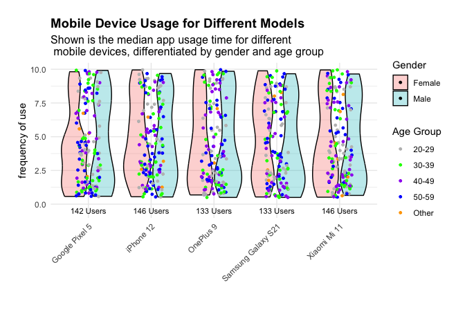

# Inspect the dataset

Data Manipulation Convert app usage time from minutes/day to hours/day.
Compute median app usage time for each device model. Calculate the
number of users for each device model.

# Create age group categories for visualization

Violin Plot by Device Model and Gender

# Create a violin plot with gender and age group differentiation

Adding User Counts to the Plot

Conclusion This analysis highlights trends in app usage time across
device models and demographic groups. Key findings include:

Median app usage time varies significantly by device model. Gender and
age groups show distinct usage patterns. Further exploration could
examine differences across operating systems, app categories, or user
satisfaction.

------------------------------------------------------------------------
