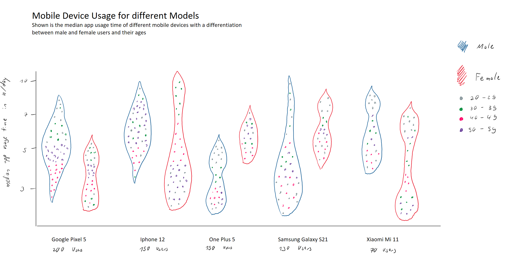

# General Topic

Mobile devices have become an essential part of our everyday life —
being used for communication, information gathering, education,
entertainment, and many more. It could even be argued that they have
become **too** essential, with people spending many hours looking at
their phones.

There are also many different models of mobile devices on the market
with different functions, user-friendliness, and app support.

Consequently, the question arises if there are some models which are so
well-designed that their users spend more time with them compared to
other models.

# The Dataset

The Dataset *“Mobile Device Usage and User Behavior”* has been published
by Vala Khorasani on the data-community platform Kaggle. The dataset
consists of only one .csv file with 10 attributes describing the device
name, operating system, app usage time, etc. and a total of 700
observations.

To download the dataset directly from the website you would have to
create an account. If you don’t want to do that, I’ve downloaded the
dataset myself and stored it in my directory on GitHub. The directory
can be found [here](kaggle_dataset.csv)

Still feel free to check out the dataset on Kaggle. It is located
[here](https://www.kaggle.com/datasets/valakhorasani/mobile-device-usage-and-user-behavior-dataset).
You can find further information about the dataset under the section
**Data Card**.

# Manipulation Goals

Luckily, the dataset is pretty straight-forward so there isn’t really
anything that is not tidy. The only things you have to do are the
following: 
- Change the App Usage Time from min/day to hours/day 
- For each Device Model compute the median App Usage Time 
- Sum up the amount of users for each Device Model

# Visualization Goals

Try to visualize the data in such a way that it will more or less lead
to such a graph: 

Here a short list of visualization tasks: 
- Violin chart for every Mobile Device Model and colored Gender 
- colored scatter plot for the users age with color groups being 20-29, 30-39, 40-49 and 50-59 
- arrange the charts with regards to the amount of users and show that number in the graph 
- add title and legend for colors 

It doesn’t have to be the exact same image I used, feel free to use
something different.
