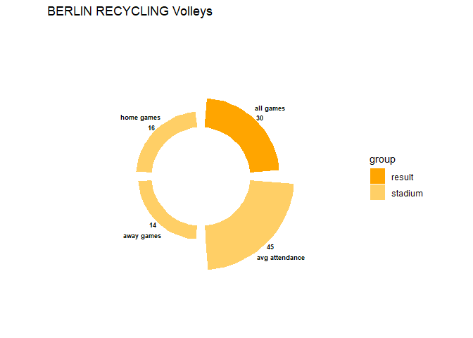
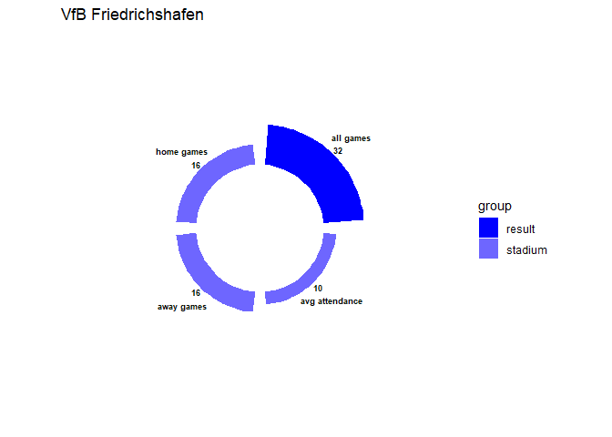

# Solution for the volleyball project

Unfortunately the circular bar plots do not contain much information,
since I could not resolve the issue how to know the team of the
topscores in the tables where they are not contained.

# Code for solving the project

The code for solving the project can be found
[here](https://github.com/Dr-Eberle-Zentrum/Data-projects-with-R-and-GitHub/blob/volleyball_solution_from_Jana/Projects/laura-burk/volleyball-project/JanaKimmich.Rmd).
The datasets where not displayed properly, therefore it was neccessary
to read them in with a specific encoding.

As far as I understood the task, several plots for several teams where
desired:

    knitr::opts_chunk$set(echo = TRUE)
    library(tidyverse)

    ## ── Attaching core tidyverse packages ──────────────────────── tidyverse 2.0.0 ──
    ## ✔ dplyr     1.1.3     ✔ readr     2.1.4
    ## ✔ forcats   1.0.0     ✔ stringr   1.5.0
    ## ✔ ggplot2   3.4.4     ✔ tibble    3.2.1
    ## ✔ lubridate 1.9.3     ✔ tidyr     1.3.0
    ## ✔ purrr     1.0.2     
    ## ── Conflicts ────────────────────────────────────────── tidyverse_conflicts() ──
    ## ✖ dplyr::filter() masks stats::filter()
    ## ✖ dplyr::lag()    masks stats::lag()
    ## ℹ Use the conflicted package (<http://conflicted.r-lib.org/>) to force all conflicts to become errors

    ########## load, adjust, join tables ##########
    # original tables
    roster_ber <-
      read_csv2("team-rosters/roster_BERLIN_RECYCLING_Volleys.csv", locale = locale(encoding = "cp852"))

    ## ℹ Using "','" as decimal and "'.'" as grouping mark. Use `read_delim()` for more control.
    ## Rows: 22 Columns: 10── Column specification ────────────────────────────────────────────────────────
    ## Delimiter: ";"
    ## chr (9): Last Name, First Name, First Name Last Name, Last Name First Name, ...
    ## dbl (1): Jersey Number
    ## ℹ Use `spec()` to retrieve the full column specification for this data.
    ## ℹ Specify the column types or set `show_col_types = FALSE` to quiet this message.

    roster_fri<-read_csv2("team-rosters/roster_VfB_Friedrichshafen.csv", locale = locale(encoding = "cp852"))

    ## ℹ Using "','" as decimal and "'.'" as grouping mark. Use `read_delim()` for more control.
    ## Rows: 25 Columns: 10── Column specification ────────────────────────────────────────────────────────
    ## Delimiter: ";"
    ## chr (9): Last Name, First Name, First Name Last Name, Last Name First Name, ...
    ## dbl (1): Jersey Number
    ## ℹ Use `spec()` to retrieve the full column specification for this data.
    ## ℹ Specify the column types or set `show_col_types = FALSE` to quiet this message.

    topscorer_intermediate_bottom <- read_tsv("topscorers/topscorer_vbl_intermediate_season2223_bottom_teams.txt",locale = locale(encoding = "cp852"))

    ## Rows: 50 Columns: 9
    ## ── Column specification ────────────────────────────────────────────────────────
    ## Delimiter: "\t"
    ## chr (3): Name, Position, Points per Set
    ## dbl (6): Rank, Points overall, Errors overall, Sets played, Games played, To...
    ## 
    ## ℹ Use `spec()` to retrieve the full column specification for this data.
    ## ℹ Specify the column types or set `show_col_types = FALSE` to quiet this message.

    topscorer_intermediate_bottom["Points per Set"] <- lapply(topscorer_intermediate_bottom["Points per Set"],as.character)
    topscorer_intermediate_top <- read_tsv("topscorers/topscorer_vbl_intermediate_season2223_top_teams.txt",locale = locale(encoding = "cp852"))

    ## Rows: 40 Columns: 11
    ## ── Column specification ────────────────────────────────────────────────────────
    ## Delimiter: "\t"
    ## chr (4): Name, Position, Team, Points per Set
    ## dbl (6): Rank, Points overall, Errors overall, Sets played, Games played, To...
    ## lgl (1): Country
    ## 
    ## ℹ Use `spec()` to retrieve the full column specification for this data.
    ## ℹ Specify the column types or set `show_col_types = FALSE` to quiet this message.

    topscorer_playoffs <- read_tsv("topscorers/topscorer_vbl_playoffs_season2223_allteams.txt", locale = locale(encoding = "cp852"))

    ## Rows: 70 Columns: 11
    ## ── Column specification ────────────────────────────────────────────────────────
    ## Delimiter: "\t"
    ## chr (4): Name, Position, Team, Points per Set
    ## dbl (6): Rank, Points overall, Errors overall, Sets played, Games played, To...
    ## lgl (1): Country
    ## 
    ## ℹ Use `spec()` to retrieve the full column specification for this data.
    ## ℹ Specify the column types or set `show_col_types = FALSE` to quiet this message.

    topscorer_regular <- read_tsv("topscorers/topscorer_vbl_regular_season2223_allteams.txt", locale = locale(encoding = "cp852"))

    ## Rows: 100 Columns: 9
    ## ── Column specification ────────────────────────────────────────────────────────
    ## Delimiter: "\t"
    ## chr (3): Name, Position, Points per Set
    ## dbl (6): Rank, Points overall, Errors overall, Sets played, Games played, To...
    ## 
    ## ℹ Use `spec()` to retrieve the full column specification for this data.
    ## ℹ Specify the column types or set `show_col_types = FALSE` to quiet this message.

    games_playoff <- read_csv2("games/Spielplan_1._Bundesliga_Männer_Playoff.csv",locale = locale(encoding = "cp852"),col_select = c("Datum","Uhrzeit","Mannschaft 1", "Mannschaft 2", "Ergebnis...7","Zuschauerzahl"))

    ## ℹ Using "','" as decimal and "'.'" as grouping mark. Use `read_delim()` for more control.
    ## New names:Rows: 19 Columns: 6── Column specification ────────────────────────────────────────────────────────
    ## Delimiter: ";"
    ## chr  (4): Datum, Mannschaft 1, Mannschaft 2, Ergebnis...7
    ## dbl  (1): Zuschauerzahl
    ## time (1): Uhrzeit
    ## ℹ Use `spec()` to retrieve the full column specification for this data.
    ## ℹ Specify the column types or set `show_col_types = FALSE` to quiet this message.

    games_regular <- read_csv2("games/Spielplan_1._Bundesliga_Männer_regular_season.csv",locale = locale(encoding = "cp852"),col_select = c("Datum","Uhrzeit","Mannschaft 1", "Mannschaft 2", "Ergebnis","Zuschauerzahl"))

    ## ℹ Using "','" as decimal and "'.'" as grouping mark. Use `read_delim()` for more control.
    ## New names:Rows: 72 Columns: 6── Column specification ────────────────────────────────────────────────────────
    ## Delimiter: ";"
    ## chr  (4): Datum, Mannschaft 1, Mannschaft 2, Ergebnis
    ## dbl  (1): Zuschauerzahl
    ## time (1): Uhrzeit
    ## ℹ Use `spec()` to retrieve the full column specification for this data.
    ## ℹ Specify the column types or set `show_col_types = FALSE` to quiet this message.

    games_zwr14 <- read_csv2("games/Spielplan_1._Bundesliga_Männer_Zwischenrunde_1-4.csv", locale = locale(encoding = "cp852"),col_select = c("Datum","Uhrzeit","Mannschaft 1", "Mannschaft 2", "Ergebnis","Zuschauerzahl"))

    ## ℹ Using "','" as decimal and "'.'" as grouping mark. Use `read_delim()` for more control.
    ## New names:Rows: 12 Columns: 6── Column specification ────────────────────────────────────────────────────────
    ## Delimiter: ";"
    ## chr  (4): Datum, Mannschaft 1, Mannschaft 2, Ergebnis
    ## dbl  (1): Zuschauerzahl
    ## time (1): Uhrzeit
    ## ℹ Use `spec()` to retrieve the full column specification for this data.
    ## ℹ Specify the column types or set `show_col_types = FALSE` to quiet this message.

    games_zwr59 <- read_csv2("games/Spielplan_1._Bundesliga_Männer_Zwischenrunde_5-9.csv",locale = locale(encoding = "cp852"),col_select = c("Datum","Uhrzeit","Mannschaft 1", "Mannschaft 2", "Ergebnis","Zuschauerzahl"))

    ## ℹ Using "','" as decimal and "'.'" as grouping mark. Use `read_delim()` for more control.
    ## New names:Rows: 16 Columns: 6── Column specification ────────────────────────────────────────────────────────
    ## Delimiter: ";"
    ## chr  (4): Datum, Mannschaft 1, Mannschaft 2, Ergebnis
    ## dbl  (1): Zuschauerzahl
    ## time (1): Uhrzeit
    ## ℹ Use `spec()` to retrieve the full column specification for this data.
    ## ℹ Specify the column types or set `show_col_types = FALSE` to quiet this message.

    games <- c()
    games[[1]]<- games_playoff
    games[[2]] <- games_regular
    games[[3]] <- games_zwr14
    games[[4]] <- games_zwr59
    games <- bind_rows(games) %>% rename("M1"= "Mannschaft 1","M2" ="Mannschaft 2")

    ## New names:
    ## • `Ergebnis...7` -> `Ergebnis`

    # make one topscorer file and add new column errors_per_set
    list_topscorer <- c()
    list_topscorer[[1]]<- topscorer_intermediate_bottom %>%mutate(name = "intermediate_bottom")
    list_topscorer[[2]] <- topscorer_intermediate_top %>%mutate(name = "intermediate_top")
    list_topscorer[[3]] <- topscorer_playoffs %>%mutate(name = "playoffs")
    list_topscorer[[4]] <- topscorer_regular %>%mutate(name = "regular")
    list_topscorer <- bind_rows(list_topscorer) %>% 
      rename("Errors_overall"="Errors overall","Sets_played"="Sets played") %>% 
      # adjust position
      mutate(errors_per_set = Errors_overall / Sets_played) %>%   
      mutate(Position, Position = case_when(str_detect(Position,"^Au.*|^outside.*")~"outside hitter",
                                     str_detect(Position,"^D.*|^d.*|^o.*")~"opposite hitter",
                                     str_detect(Position,"^Z.*|^z.*|^setter")~"setter",
                                     str_detect(Position,"^M.*|^m.*")~"middle blocker",
                                     str_detect(Position,"^Libero|^libero")~"libero",
                                     str_detect(Position,"^Chef.*|^chef.*|^head.*")~"head coach",
                                     .default = NA)) %>% 
      # delete each one of the staff that is not the head coach
      drop_na(Position)

    new_roster_ber <- roster_ber %>% 
      # adjust gender encoding, assuming there are only male and female
      mutate(Gender,Gender =ifelse(str_detect(Gender,"^f.*|^F.*|2"),"female","male")) %>% 
      # adjust position
      mutate(Position, Position = case_when(str_detect(Position,"^Au.*|^outside.*")~"outside hitter",
                                     str_detect(Position,"^D.*|^d.*|^o.*")~"opposite hitter",
                                     str_detect(Position,"^Z.*|^z.*|^setter")~"setter",
                                     str_detect(Position,"^M.*|^m.*")~"middle blocker",
                                     str_detect(Position,"^Libero|^libero")~"libero",
                                     str_detect(Position,"^Chef.*|^chef.*|^head.*")~"head coach",
                                     .default = NA)) %>% 
      # delete each one of the staff that is not the head coach
      drop_na(Position) %>% 
      # adjust height
      mutate(Height, Height =as.numeric(Height)/100)

    new_roster_fri <- roster_fri %>% 
      # adjust gender encoding, assuming there are only male and female
      mutate(Gender,Gender =ifelse(str_detect(Gender,"^f.*|^F.*|2"),"female","male")) %>% 
      # adjust position
      mutate(Position, Position = case_when(str_detect(Position,"^Au.*|^outside.*")~"outside hitter",
                                     str_detect(Position,"^D.*|^d.*|^o.*")~"opposite hitter",
                                     str_detect(Position,"^Z.*|^z.*|^setter")~"setter",
                                     str_detect(Position,"^M.*|^m.*")~"middle blocker",
                                     str_detect(Position,"^Libero|^libero")~"libero",
                                     str_detect(Position,"^Chef.*|^chef.*|^head.*")~"head coach",
                                     .default = NA)) %>% 
      # delete each one of the staff that is not the head coach
      drop_na(Position) %>% 
      # adjust height
      mutate(Height, Height =as.numeric(Height)/100)
      

    # join topscorer and roster files according to names 
    new_roster_ber <- new_roster_ber %>% rename("Name"="Last Name First Name")
    joined_topscorer_ber<-right_join(list_topscorer,new_roster_ber,"Name") 

    ########### compute values for bar plot ##########

    ##### results 
    # number of overall played games
    num_all_games_ber <- games%>%
      filter(M1=="BERLIN RECYCLING Volleys"|M2=="BERLIN RECYCLING Volleys") %>%
      nrow()

    num_all_games_fri <- games%>%
      filter(M1=="VfB Friedrichshafen"|M2=="VfB Friedrichshafen") %>%
      nrow()

    ##### attacking

    ##### stadium
    # number of home games
    num_home_games_ber <- games%>%
      filter(M1=="BERLIN RECYCLING Volleys") %>%
      nrow()
    num_home_games_fri <- games%>%
      filter(M1=="VfB Friedrichshafen") %>%
      nrow()

    # number of away games
    num_away_games_ber <- games%>%
      filter(M2=="BERLIN RECYCLING Volleys") %>%
      nrow()
    num_away_games_fri <- games%>%
      filter(M2=="VfB Friedrichshafen") %>%
      nrow()

    # average attendance in home stadium
    num_attendance_ber <- games%>%
      filter(M1=="BERLIN RECYCLING Volleys") %>%
      select(Zuschauerzahl)%>%
      colSums()
    avg_attendance_ber <- num_attendance_ber/num_home_games_ber

    num_attendance_fri <- games%>%
      filter(M1=="VfB Friedrichshafen") %>%
      select(Zuschauerzahl)%>%
      colSums()
    avg_attendance_fri <- num_attendance_fri/num_home_games_fri

    ##### top scorer

    ##### errors
    #outside_hitter_error_ber <- c()
    #outside_hitter_error_ber <- joined_topscorer_ber %>%
    #  filter(Position.x=="outside hitter") %>% 
    #  group_by(Name) %>% 
    #  select(errors_per_set) %>% 
    #  summarise(errors_per_set)
      

    # to plot better
    avg_attendance_ber <- round(avg_attendance_ber/100)
    avg_attendance_fri <- round(avg_attendance_fri/100)
    ########## circular bar plot #########
    stadium_ber <- as.data.frame(cbind(c(num_all_games_ber,num_home_games_ber,num_away_games_ber,avg_attendance_ber),c("all games","home games", "away games", "avg attendance"),c("result","stadium","stadium","stadium")))
    colnames(stadium_ber) = c("amount","name","group")

    stadium_fri <- as.data.frame(cbind(c(num_all_games_fri,num_home_games_fri,num_away_games_fri,avg_attendance_fri),c("all games","home games", "away games", "avg attendance"),c("result","stadium","stadium","stadium")))
    colnames(stadium_fri) = c("amount","name","group")

    p_ber <- ggplot(stadium_ber,aes(x=name,y=as.numeric(amount),fill=group)) +  
    # Note that id is a factor. If x is numeric, there is some space between the first bar
    # This add the bars with a blue color
      geom_bar(stat="identity") +
    scale_fill_manual(values = c("result"="orange",
                                   "stadium"="#ffcf66"))+
    # Limits of the plot = very important. The negative value controls the size of the inner circle, the positive one is useful to add size over each bar
    ylim(-50,75) +
    # Custom the theme: no axis title and no cartesian grid
    theme_minimal() +
    theme(axis.text = element_blank(),
      axis.title = element_blank(),
      panel.grid = element_blank())+
      #plot.margin = unit(rep(-2,4), "cm")+     
      # This remove unnecessary margin around plot
      #)+
    # This makes the coordinate polar instead of cartesian.
    coord_polar(start = 0)+
    geom_text(data=stadium_ber, aes(x=name, y=as.numeric(amount)+5, label=amount), color="black", fontface="bold", size=2.5,  inherit.aes = FALSE ) +
      geom_text(data=stadium_ber, aes(x=name, y=as.numeric(amount)+20, label=name), color="black", fontface="bold", size=2.5,  inherit.aes = FALSE ) +
      ggtitle("BERLIN RECYCLING Volleys")

    p_fri <- ggplot(stadium_fri,aes(x=name,y=as.numeric(amount),fill=group)) +  
    # Note that id is a factor. If x is numeric, there is some space between the first bar
    # This add the bars with a blue color
      geom_bar(stat="identity") +
    scale_fill_manual(values = c("result"="blue",
                                   "stadium"="#6e66ff"))+
    # Limits of the plot = very important. The negative value controls the size of the inner circle, the positive one is useful to add size over each bar
    ylim(-50,75) +
    # Custom the theme: no axis title and no cartesian grid
    theme_minimal() +
    theme(axis.text = element_blank(),
      axis.title = element_blank(),
      panel.grid = element_blank())+
      #plot.margin = unit(rep(-2,4), "cm")+     
      # This remove unnecessary margin around plot
      #)+
    # This makes the coordinate polar instead of cartesian.
    coord_polar(start = 0)+
    geom_text(data=stadium_ber, aes(x=name, y=as.numeric(amount)+5, label=amount), color="black", fontface="bold", size=2.5,  inherit.aes = FALSE ) +
      geom_text(data=stadium_ber, aes(x=name, y=as.numeric(amount)+20, label=name), color="black", fontface="bold", size=2.5,  inherit.aes = FALSE ) +
      ggtitle("VfB Friedrichshafen")

    p_ber

    p_fri

