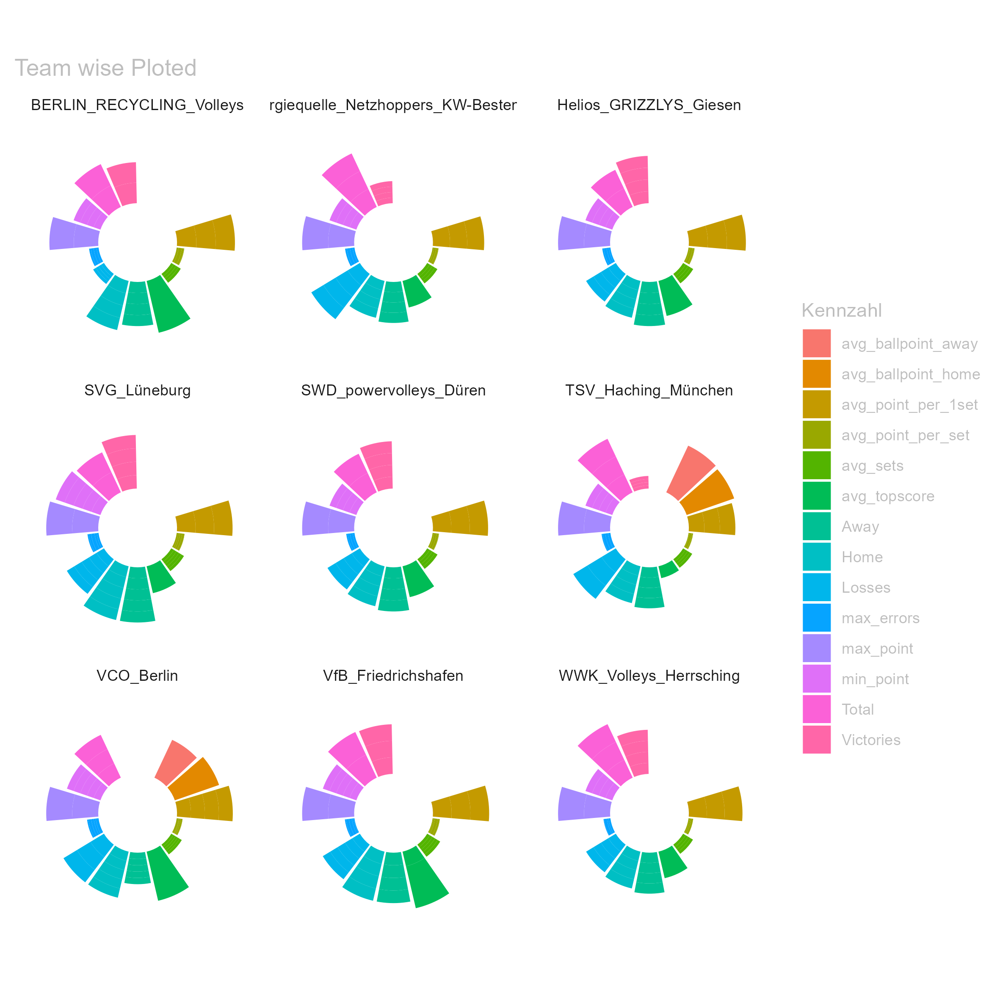

```{r setup, include=FALSE}
# get this packages
library(tidyverse)
library(countrycode)
library(emo)
library(purrr)
library(circlize)
knitr::opts_chunk$set(echo = TRUE)
#rm(list = ls())
```

# My Solution for the Volleyball Issue

```{r folder_content, echo=FALSE, eval=FALSE}
folder_path_roster <- file.path(getwd(), "team-rosters")
```


***

## Import the data Part:

***

Cous I'm damn lazy, even to write the import path twice, i first created a function to search for the files in the working direction and return the paths's of the folder's.

***

```{r all_paths, echo=TRUE}
folders <- list.files(getwd(), full.names = TRUE) %>%
  .[!grepl("\\.", .)]

```

***

To import all the files i recycled my `auto_import_csv`-function from the last Project.

***

```{r import_function, echo=TRUE }

auto_import <- function(file_path, datatyp, suffix = ""){
  
  file_list <- list.files(path = file_path, pattern = paste("\\.", datatyp, "$", sep = ""), full.names = TRUE) 
  
  #-> here we could change the auto import to other data type's  -> put that part in a seperate variable inside the function
  
  data_frames <- list()
  
  for (file in file_list) {
    df_name <- tools::file_path_sans_ext(basename(file))  # uses filename as dataframe
    
    read_call <- paste0("read_", datatyp, suffix, sep = "")
    # need to paste the "2" here to read (german) encodeing <- solved it with suffix
    
    data_frames[[df_name]] <- do.call(read_call, list(file, locale = locale(encoding = "cp852")))
  }
  
  return(data_frames)
}
```

***

Now we can simply import all the dat'S from a folder into a list by calling the path from the `folder`-path list and requiered datatyp.

```{r import_roster, echo=TRUE}
suppressMessages({
  all_rosters <- auto_import(folders[4], datatyp="csv", "2")
})

```

***

```{r unique_values, echo=FALSE, eval=FALSE}

get_unique_values <- function(data, column){
  unique_values <- unique(unlist(lapply(data, function(df) df[[column]])))
  return(unique_values)
}

```


```{r show_values, echo=FALSE, eval=FALSE}

#get_unique_values(all_rosters, "Gender")
#get_unique_values(all_rosters, "Position")
#get_unique_values(all_rosters_clean, "Nationality")

```

***

## Adjust the data Part:

***

In the data there been quiet some mistakes to correct.

Therefor I created some  **adjust_map's** with Regular Expressions.

***
```{r adjust_maps, echo=TRUE}
{
adjust_map_position <- c("^[zZ].*|^[sS]e.*" = "setter",
                "^[mM].*" = "middle blocker",
                "^[aA]u.*|^[oO]u.*" = "outside hitter",
                "^[dD].*|^[oO]p.*" = "opposite hitter",
                "^[uU].*|^[lL].*" = "libero",
                "^[tT]r.*|^[cC]h.*|.*[hH]ead.*" = "head coach")

adjust_map_country <- c("^[dD].*|^[gG].*" = "Deutschland",
                        "wenia$" = "venia",
                        "lie$" = "lia")

# could shorten it with ".*ie$" ->".*ia$" (eng. Australia) prob. str_detect than...
# -> just delete the ".*" in front and its solved

adjust_map_name <- c("B\\÷|B\\?" = "Bö",
                   "Bj\\?|Bj\\÷" = "Bjö",
                   "R\\?|R\\÷" = "Rö",
                   "Úe$" = "ée",
                   "ßn$" = "án",
                   "ńf$" = "äf",
                   "┴n" = "Án",
                   "'.*'" = "",
                   "^\\?" = "Š",
                   "\\?o" = "šo",
                   "\\?iga" = " Žiga",
                   "Djifa$" = "Djifa Julien",
                   ", Francisco$" = ", Francisco Javier",
                   ", Miguel$" = ", Miguel Angel")
}

```

***

The `Nationality` columns contains two different languages, but the `countrycode`-package can only handle one at the time,  so there's a function to shorten the call.

***

```{r two_language_code, echo=TRUE}

country_code <- function(df, language){
  df$Nationality <- countrycode(df$Nationality, origin = paste("country.name", language, sep = "."), destination = "ioc", nomatch=NULL)
  return(df)
}
```

***

Now let's apply all the predefined stuff on the data.

```{r adjust_roster, echo=TRUE}
{
all_rosters_clean <- lapply(all_rosters, function(df) {
  suppressWarnings({
    df %>%
      rename("Name"="Last Name First Name")%>%
      mutate(Gender = ifelse(str_detect(Gender, "^[fF]|2"), "female", "male"),
             Position = str_replace_all(Position, adjust_map_position),
             Nationality = str_replace_all(Nationality, adjust_map_country),
             Name = str_replace_all(Name, adjust_map_name))%>%
      filter(Position %in% adjust_map_position)%>%
      mutate(Height = as.numeric(Height)/100)%>%
      country_code(language ="de")%>%
      country_code(language ="en")%>%
      select(-(1:3))
    })
  })

all_rosters_clean2 <- all_rosters_clean%>%
   bind_rows(.id = "Team")%>%
  mutate(Team = gsub("^roster_", "", Team))
}
  
```

*Note: I used a second variable to apply the* `bind_row()` *-function, becouse i wasn't sure at that time, if i need the data later in a seperated order*

***

To import and clean the `topscorer`files with the import function, i first had to mutate the `.txt`into `.tsv`format.

***

```{r txt_to_tsv, echo=TRUE, eval=FALSE}

txt_files <- list.files(path = folder_path_topscorers, pattern = "\\.txt$", full.names = TRUE)

for (file in txt_files) {
  tsv_file <- sub("\\.txt$", ".tsv", file)
  file.copy(file, tsv_file)
}
```

  *Note: Erese the eval = FALSE part if you first using the code*

*** 

```{r import_topscore, echo=TRUE}
suppressMessages({
  all_topscorer <- auto_import(folders[5], datatyp="tsv")
})

```


```{r check_topscorer, echo=FALSE, eval=FALSE}
get_unique_values(all_topscorer_clean, "Team")
get_unique_values(all_topscorer_clean, "Position")
na_count <- sapply(all_topscorer_clean, function(df) sum(is.na(df$Position)))

na_count


```

Now clean the data with the`adjust_map`, and mutate the `errors_per_set`-column.

***

```{r adjust_topscorer, echo=TRUE}
{
all_topscorer_clean <- lapply(all_topscorer, function(df) {
    df %>%
    setNames(gsub(" ", "_", colnames(.)))%>%
    # instead of rename, replaces all "spaces" with "_",colnames(.)to backreference to df in functions
    mutate(Position = str_replace_all(Position, adjust_map_position),
           Name = str_replace_all(Name, adjust_map_name),
           errors_per_set = (Errors_overall / Sets_played)) 
})
all_topscorer_clean[[2]] <- all_topscorer_clean[[2]] %>%
  # couldn't find out how to do in lapply-fct, due to not all df got "team" column "yet"
  mutate(Team = gsub("Ř", "ü", Team))

all_topscorer_clean2 <- all_topscorer_clean %>%
  bind_rows()%>%
  select(-c("Team", "Country", "Position"))%>% 
  # otherwise we would had an "many to many" issues in the join-function
  mutate(Points_per_Set = as.numeric(gsub(",", ".",Points_per_Set)))
}
```

***

Same for the `games`files

```{r import_games, echo=TRUE}
suppressMessages({
  all_games <- auto_import(folders[2], datatyp="csv", "2")
})

```


```{r adjust_games, echo=TRUE}
all_games_clean <- lapply(all_games, function(df) {
    df %>%
    setNames(gsub(" ", "", gsub("-", "_", colnames(.)))) %>%
  mutate(Mannschaft1 = gsub("Ř", "ü", Mannschaft1),
         Mannschaft2 = gsub("Ř", "ü", Mannschaft2),
         Gastgeber = gsub("Ř", "ü", Gastgeber),
         Austragungsort = gsub("Ř", "ü", Austragungsort),
         Geschlecht = ifelse(str_detect(Geschlecht, "^[fF]|2"), "female", "male"))
})%>%
  bind_rows()
  
```

***

## Mutating the variables Part:

***

To mutate all the requiered values in the graph for all the teams at once, i created a list of **all teams**


```{r all_teams,echo=TRUE}

all_teams <- unique(all_games_clean$Mannschaft1)

```

***

```{r mutate_result_stadium_variable, echo=TRUE}

mutate_team_var1 <- function(team, df) {
  
  # Result Variables:
  
  total_games <- df %>%
    filter(Mannschaft1 == team | Mannschaft2 == team) %>%
    nrow()
  
  num_victory <- df%>%
    filter((Mannschaft1 == team & Satzpunkte1 == 3) | (Mannschaft2 == team & Satzpunkte2 == 3))%>%
    nrow()
  
  num_losses <-  df%>%
    filter((Mannschaft1 == team & Satzpunkte1 != 3) | (Mannschaft2 == team & Satzpunkte2 != 3))%>%
    nrow()
  
  sets_per_wingame <- df %>%
    filter(Mannschaft1 == team | Mannschaft2 == team) %>%
    summarise(
      #Sum_Satzpunkte = round(sum(Satzpunkte1 + Satzpunkte2), 2), # not sure if we need that one
      "Avg_Satzpunkte" = round(mean(Satzpunkte1 + Satzpunkte2), 2))
  
  avg_point_per_set <- df %>%  
    
    # why is it only working with backticks? -> cous i had an special letter in "-" gsub'ed it out, could remove backticks now
  filter(Mannschaft1 == team | Mannschaft2 == team) %>%
    summarise(
      "Avg_Ballpunkte_first_set" = round(mean(ifelse(Mannschaft1 == team, `Satz1_Ballpunkte1`, `Satz1_Ballpunkte2`)), 2),
      #Avg_Ballpunkte_sec_set = round(mean(ifelse(Mannschaft1 == team, `Satz2_Ballpunkte1`, `Satz2_Ballpunkte2`)), 2),
      #Avg_Ballpunkte_third_set = round(mean(ifelse(Mannschaft1 == team, `Satz3_Ballpunkte1`, `Satz3_Ballpunkte2`)), 2),
      #Avg_Ballpunkte_fourth_set = round(mean(ifelse(Mannschaft1 == team, `Satz4_Ballpunkte1`, `Satz4_Ballpunkte2`), na.rm=TRUE), 2),
      #Avg_Ballpunkte_fifth_set = round(mean(ifelse(Mannschaft1 == team, `Satz5_Ballpunkte1`, `Satz5_Ballpunkte2`), na.rm=TRUE), 2))
    ) # remove if take all
  
  
  max_ballpoint_ever <- max(ifelse(df$Mannschaft1 == team, df$Satz1_Ballpunkte1, df$Satz1_Ballpunkte2))
  
  min_ballpoint_ever <- min(ifelse(df$Mannschaft1 == team, df$Satz1_Ballpunkte1, df$Satz1_Ballpunkte2))
    
# don't know how to proper look for the max-value of all satz X, or condition (|), pmax(), max (..1,..2,..) don'T work
# could do an max and min for each set and do an max again on it but....
  
  
  
  # Stadium Variables:
  
  home_games <- df %>%
    filter(Mannschaft1 == team) %>%
    nrow()
  
  away_games <- df %>%
    filter(Mannschaft2 == team) %>%
    nrow()
  
  
  avg_ballpoint_home <- df %>%
  filter(Mannschaft1 == team) %>%
  mutate(Ballpunkte = str_extract(Ballpunkte, "\\d+")) %>%
  summarise(avg_ballpoint_home = round(mean(as.numeric(Ballpunkte)),2))
  
  avg_ballpoint_away <- df %>%
  filter(Mannschaft2 == team) %>%
  mutate(Ballpunkte = str_extract(Ballpunkte, "(?<=:)(\\d+)")) %>%
  summarise(avg_ballpoint_away = round(mean(as.numeric(Ballpunkte)),2))
  
  avg_attendance_home <- df %>%
  filter(Mannschaft1 == team) %>%
  summarise(avg_attendance_home = round(mean(as.numeric(Zuschauerzahl))))
  
  return(c(Team = team, Home = home_games, Away = away_games, Total = total_games,
           Victories = num_victory, Losses = num_losses,
           avg_sets = sets_per_wingame$Avg_Satzpunkte, avg_point_per_1set = avg_point_per_set$Avg_Ballpunkte_first_set,
           max_point = max_ballpoint_ever, min_point = min_ballpoint_ever,
           avg_ballpoint_home, avg_ballpoint_away, avg_attendance_home))
}

{
all_var1_list <- t(mapply(mutate_team_var1, team = all_teams, df = rep(list(all_games_clean), length(all_teams))))
#t() transponiert output Struktur ( für alle teams,home,etc. in einer Spalte)
all_var1 <- as_tibble(all_var1_list) %>%
  mutate(Team = as.character(Team),
         across(-Team, as.numeric))
all_var1 <- all_var1 %>%
  mutate(Team = as.factor(Team),
         Team = gsub(" ", "_", Team))
}
all_var1

```


```{r all_positions, echo=FALSE, eval=FALSE}

all_positions <- get_unique_values(all_rosters_clean, "Position")[-6] # removes the head coach

```

***

For further variable mutating, i need to join the `topscore`file with the `roster` file first.


```{r join_roster_topscore, echo=TRUE}
suppressWarnings({
  joined_topscore_roster <- right_join(all_topscorer_clean2,all_rosters_clean2, "Name")
})
```


***

```{r mutate_atck_topscore_var, echo=FALSE, eval=FALSE}
suppressMessages({
attack_var <- joined_topscore_roster%>%
  group_by(Team, Position)%>%
  summarise(avg_point_per_position = round(mean(Points_per_Set, na.rm = TRUE), 1))%>%
  ungroup()#%>%
  #filter(!is.na(avg_point_per_position)) # doesnt work proper in the knit verson

topscore_var <- joined_topscore_roster%>%
  group_by(Team, Position)%>%
  summarise(avg_toppoints_per_position = round(mean(Points_overall, na.rm = TRUE), 1))%>%
  ungroup()#%>%
  #filter(!is.na(avg_point_per_position))


})

#error_var
```

```{r combined, echo=TRUE}

suppressMessages({
  
  # Attacking & Topscorer Variables:
calculate_avg_var <- function(data, value_column) {
  result <- data %>%
    group_by(Team, Position) %>%
    summarise(avg_value = round(mean({{value_column}}, na.rm = TRUE), 1)) %>%
    ungroup() %>%
    filter(!is.na(avg_value))
  
  return(result)
}

attack_var2 <- calculate_avg_var(joined_topscore_roster, Points_per_Set)%>%
  rename("avg_point_per_set" = avg_value)
topscore_var2 <- calculate_avg_var(joined_topscore_roster, Points_overall)%>%
  rename("avg_topscore" = avg_value)

error_var <- joined_topscore_roster %>%
  group_by(Team, Position) %>%
    filter(!is.na(errors_per_set))%>%
  summarise(max_errors = round(max(errors_per_set),2)) %>%
  ungroup()

all_var2 <- attack_var2%>%
  mutate("avg_topscore" = topscore_var2$avg_topscore,
         "max_errors" = error_var$max_errors,
         "Team" = as_factor(Team),
         "Position" = as_factor(Position))

merged_var <- all_var1 %>%
  inner_join(all_var2, by = c("Team" = "Team"))
})
```


**Finally we got all requested variables in one table**

***

## Plotting the Graph Part:

***

First get them into a long-format:

```{r pivot_long, echo=TRUE}

tidy_var <- pivot_longer(merged_var, cols = -c(Team, Position), names_to = "Kennzahl", values_to = "Wert")%>%
  mutate("Kennzahl" = as.factor(Kennzahl))
tidy_var

```


```{r plot_all, echo=TRUE}

tidy_var %>%
  ggplot(aes(x = Kennzahl, y = Wert, fill = Kennzahl)) +
  geom_bar(stat = "identity") +
  ylim(-50, 75) +
  theme_minimal() +
  theme(axis.text = element_blank(),
        axis.title = element_blank(),
        panel.grid = element_blank()
        , text = element_text(color = "grey") #  in the png background is dark
        ) +
  coord_polar(start = 0) +
  facet_wrap(~ Team) +
  ggtitle("Team wise Ploted")
ggsave("All_team_plot.png", plot = last_plot(), width = 20, height = 20, units = "cm")

```



 So far working proper, of course there still lot of adjustments to do.
 The avg & max point/error per *Position* still not working.
 
 But i think its okay for now.
 
***

```{r only_plot_one, echo=TRUE}

tidy_team <- tidy_var %>%
  filter(Team == "BERLIN_RECYCLING_Volleys")

plot_try2 <- ggplot(tidy_team, aes(x = Kennzahl, y = Wert, fill = Kennzahl)) +
  geom_bar(stat = "identity") +
  ylim(-50, 75) +
  theme_minimal() +
  theme(axis.text = element_blank(),
        axis.title = element_blank(),
        panel.grid = element_blank()) +
  coord_polar(start = 0) +
  ggtitle("BERLIN RECYCLING Volleys")


print(plot_try2)

```

