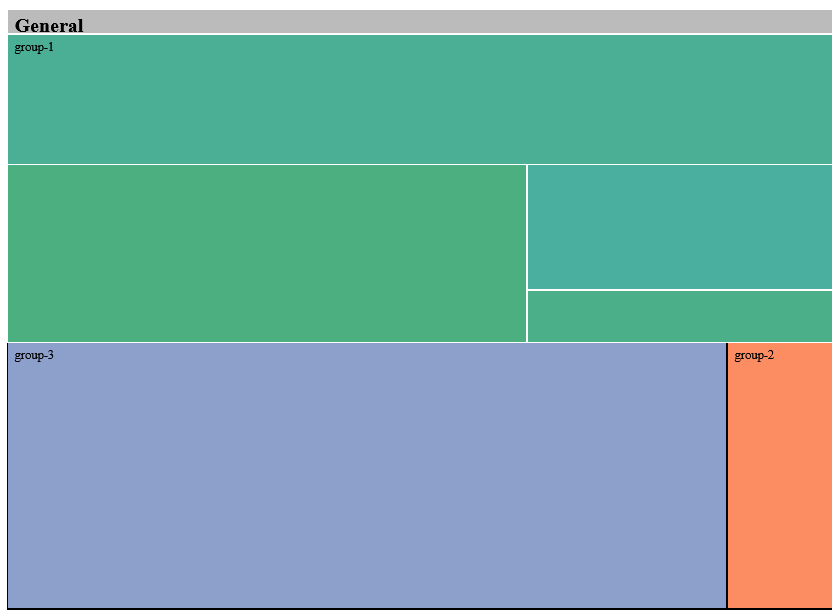

```{r setup, include=FALSE}
knitr::opts_chunk$set(echo = FALSE)
library(knitr)
library(emo)
```

# Laura's Volleyball Project
***
I have a passion for Volleyball! `r emo::ji("volleyball")`  Yay! `r emo::ji("party")`

Before I deep-dive into the ongoing 2023/24 indoor season and fangirl about my favourite club `r emo::ji("orange")` `r emo::ji("black")` , I would love to recap the 2022/23 season.
This is where I need your support! `r emo::ji("strong")`

### Background Knowlegde

The 'Volleyball Bundesliga' (short: VBL) is the highest Volleyball league in Germany.
Compared to Eastern or Southern European leagues, the VBL has a lower level, but we are getting there. `r emo::ji("up")`

You have absolutely no clue about Volleyball and its rules, but are eager to find out more?
I recommend [this](https://www.youtube.com/watch?v=OWCkPbzq81g) short video or the [Wikipedia page](https://en.wikipedia.org/wiki/Volleyball).

#### What you might want to google at some point
* the different positions, explained in [video](https://www.youtube.com/watch?v=aHZQfyl-hEA) or [text](https://en.wikipedia.org/wiki/Volleyball#Player_specialization) 
* game mode: best of five sets (first to three sets wins)
* first to 25 (two points gap) wins the set
* tie-break: fifth set is first to 15 (two points gap)

***


## The Data
The data was downloaded from the official VBL website [^1] and is free to use for private purposes. Surprisingly, it went from tidy to somewhat chaotic... `r emo::ji("ghost")` 

[^1]: Source: https://www.volleyball-bundesliga.de/cms/home/1_bundesliga_maenner/archiv/ergebnisse.xhtml

### Folder **team-rosters**
These files each contain a(n) (in)complete list of a teams' roster and staff, including relevant information about the team members:

* correct (!) name 
* height in cm
* gender
* date of birth
* jersey number
* nationality
* position

Unfortunately, not all information is in the desired format yet.

* I would love to have height measured in meters, instead of centimetres.
* The column on gender should only contain *male* or *female*. If there is a number,  `1 = male` and `2 = female`.
* I would love to have international country codes instead of country names as nationality.
* Additionally, the German position names are annoying me, please change them into English. You can use the Wikipedia page linked above as a guide, but I prefer *middle blocker*, *outside hitter* and *opposite hitter* over the suggestions from Wikipedia.
* Considering the staff, we only need data on the head coach. Please delete the other staffs' entries and thank them silently for their contribution to this wonderful, wonderful sport.

If a teams' roster happens to be incomplete, please include the missing player with all the available information and update the .csv-file in the *team-rosters*-folder.

***

### Folder **games**
The four files in this folder contain the results of all games played in different parts of the season.

1. regular season: Each team plays each of the other teams twice - once at home and once away.
2. intermediate round (*Zwischenrunde*): The league table is split into two groups - the top teams (4 teams) and the bottom teams (5 teams). Within these groups, each team plays each of the other teams twice - once at home and once away. (It's basically like regular season in two groups with fewer teams each.) Note: after the intermediate round, VCO Berlin was on 5th place in the bottom group and ended its season (as had been announced within the VBL before). Eight teams entered the play-off's.
3. Play-off's: Based on the team ranking achieved in the intermediate round, the first-ranked team from the top group faces the eighth-ranked team of the bottom group in the quarter-finals and so on. The game mode is noted in column *Spielgruppe* in the Play-off's .csv-file, that should help in understanding.

As the column names are in German, you might consider these comments helpful (or maybe not):

* Ergebnis - result; sets / ball points, for example 3:0 / 75:45
* Satzpunkte: result in sets, for example 3:0
* Ballpunkte: results in ball points (points per set added for both teams), for example 75:45

The rear columns provide detail on the (ball point) scores of each set for both teams.

***

#### Folder **topscorers**
As you learned about the different parts of the season above, the four provided files should be named straightforward to you.
The four files are not based on overlapping time periods! `r emo::ji("warning")`

The columns are explained here shortly:

* top scorer ranking in the respective part of the season
* name, might be slightly different to the name in the roster files
* position
* points overall: all the points the player scored in the respective part of the season
* errors overall: all the errors of a player in the respective part of the season
* `points per set = points overall / sets played `
* sets played: number of sets a player was (at least partially) playing on court
* games played: number of games a player was (at least partially) playing on court
* `top-scorer = points overall - errors overall`

Please add a column with the players' errors per set (`errors per set = errors overall / sets played `) and the team name to the top scorer files and update them on GitHub.

If a player appears in the top scorer ranking but not in the roster, please add the available information to the roster .csv-file and update it on GitHub.

***

#### Folder **team-logos**
Here I provide you with the team logos, needed for a visualization goal.

***

## Visualization Goals


### 1. Compare the attackers of a team - which position contributes most?

The goal is to visualize which attacking position contributed the most to the teams' results. 
Based on the combined top scorer lists across all parts of the season, how much did the players on the attacking positions contribute?

Reminder: attackers is a collective term for outside hitters, middle blockers and opposite hitters, thus all positions that are supposed to hit the ball over the net and score a point for their team.

I ask you to create an [interactive treemap](https://r-graph-gallery.com/237-interactive-treemap.html) for my favourite team, the Berlin Recycling Volleys  `r emo::ji("orange")` `r emo::ji("black")` , as well as their biggest opponent, the VfB Friedrichshafen  `r emo::ji("blue")` `r emo::ji("white")` .

(If you feel the strong urge to create an interactive  plot for each of the teams, I would greatly appreciate your effort, but also remind you of the things you possibly procrastinated while creating these.)





* As broad categories (green, blue and orange in the first picture), please use the three attacking positions.
* As subcategories (shades of green in the second picture), please use the individual attackers on the respective position of *one team*.
* As the value determining the size of the chart, use the combined top scorer value of each attacker across all parts of the season. Note: not all attackers might appear on all top scorer lists.

Similar to the example, please print the category and subcategory names in the plot.

In case you are into volleyball: yes I know that this visualization over-simplifies the game, but there are no free stats available on the VBL, that are both detailed and R-readable. `r emo::ji("sad")`

***

### 2. Overall Team Facts Plot

The goals is to visualize many different aspects of a teams' season in one plot.
Based on all available sources, thus all files in the project folder, how can we describe the season of a team?

I ask you to create an [circular barplot](https://r-graph-gallery.com/297-circular-barplot-with-groups.html) for my favourite team, the Berlin Recycling Volleys  `r emo::ji("orange")` `r emo::ji("black")` , as well as their biggest opponent, the VfB Friedrichshafen  `r emo::ji("blue")` `r emo::ji("white")` . 

(If you feel the strong urge to create an interactive  plot for each of the teams, I would greatly appreciate your effort, but also remind you of the things you possibly procrastinated while creating these.)

       

Include the following groups, described below in more detail:

#### Results
* number of overall played games
* number of victories
* number of losses (if none skip this bar)
* average number of sets per game
* average number of points per set
* highest ballpoints in a set
* lowest ballpoints in a set

#### Attacking
* average points per set over all outside hitters over the entire season
* average points per set over all middle blockers over the entire season
* average points per set over all opposite hitters over the entire season
* average points per set over all setters over the entire season

#### Stadium
* number of home games
* number of away games
* average ballpoints per game in home stadium
* average ballpoints per game in away stadium
* average attendance in home stadium

#### Top Scorer
* top scoring (over the entire season) outside hitter
* top scoring (over the entire season) middle blocker 
* top scoring (over the entire season) opposite hitter 
* top scoring (over the entire season) setter

#### Errors
* outside hitter with most errors per set across the season
* middle blocker with most errors per set across the season
* opposite hitter with most errors per set across the season
* setter with most errors per set across the season

A,B,C and D in the picture correspond to the categories above. Please include the names in the plot.

Similar to the example, please print the value above the respective bar.

Colouring: please adhere to the team colours (see team logo).

If possible, include the team logo as a picture in the middle of the circular bar plot.
