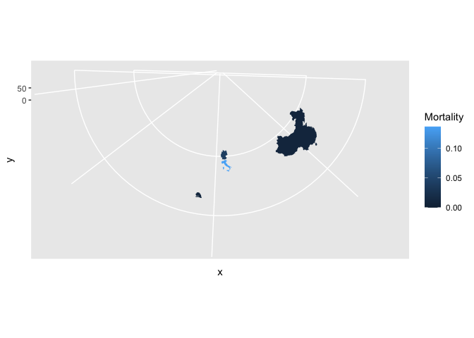

## My best try at a solution

Below is my best try at a solution. I have managed to produce some sort
of heat map for the first set of data.

    library(tidyverse)

    ## ── Attaching core tidyverse packages ──────────────────────── tidyverse 2.0.0 ──
    ## ✔ dplyr     1.1.2     ✔ readr     2.1.4
    ## ✔ forcats   1.0.0     ✔ stringr   1.5.0
    ## ✔ ggplot2   3.4.2     ✔ tibble    3.2.1
    ## ✔ lubridate 1.9.2     ✔ tidyr     1.3.0
    ## ✔ purrr     1.0.1     
    ## ── Conflicts ────────────────────────────────────────── tidyverse_conflicts() ──
    ## ✖ dplyr::filter() masks stats::filter()
    ## ✖ dplyr::lag()    masks stats::lag()
    ## ℹ Use the conflicted package (<http://conflicted.r-lib.org/>) to force all conflicts to become errors

    library(maps)

    ## 
    ## Attaching package: 'maps'
    ## 
    ## The following object is masked from 'package:purrr':
    ## 
    ##     map

    deaths2 <- read_csv("https://raw.githubusercontent.com/CSSEGISandData/COVID-19/master/csse_covid_19_data/csse_covid_19_time_series/time_series_covid19_deaths_global.csv")

    ## Rows: 289 Columns: 1147
    ## ── Column specification ────────────────────────────────────────────────────────
    ## Delimiter: ","
    ## chr    (2): Province/State, Country/Region
    ## dbl (1145): Lat, Long, 1/22/20, 1/23/20, 1/24/20, 1/25/20, 1/26/20, 1/27/20,...
    ## 
    ## ℹ Use `spec()` to retrieve the full column specification for this data.
    ## ℹ Specify the column types or set `show_col_types = FALSE` to quiet this message.

    cases <- read_csv("https://raw.githubusercontent.com/CSSEGISandData/COVID-19/master/csse_covid_19_data/csse_covid_19_time_series/time_series_covid19_confirmed_global.csv")

    ## Rows: 289 Columns: 1147
    ## ── Column specification ────────────────────────────────────────────────────────
    ## Delimiter: ","
    ## chr    (2): Province/State, Country/Region
    ## dbl (1145): Lat, Long, 1/22/20, 1/23/20, 1/24/20, 1/25/20, 1/26/20, 1/27/20,...
    ## 
    ## ℹ Use `spec()` to retrieve the full column specification for this data.
    ## ℹ Specify the column types or set `show_col_types = FALSE` to quiet this message.

    daten <-
    bind_rows(list("Death" = deaths2, "Cases" = cases), .id="table") %>% 

      dplyr::filter(`Country/Region` %in% c("US", "Germany", "Italy", "China", "Korea, South", "New Zealand", "Senegal")) %>% 

    transmute(
     table,  `Country/Region`, `Province/State`, Lat, Long, 
      early2020 = `4/30/20`-`2/1/20`
    ) %>% 

      pivot_longer(ends_with("2020"), names_to = "Time") %>% 
      pivot_wider(names_from = "table", values_from = "value") %>% 
      mutate(Mortality= Death / Cases)

     world_map <- map_data("world")

     daten %>%  
    ggplot( aes(map_id = `Country/Region`, fill = Mortality)) +
      geom_map(map = world_map) +
     expand_limits(x = world_map$long, y = world_map$lat) +
      coord_map("conic", lat0 = 30)

