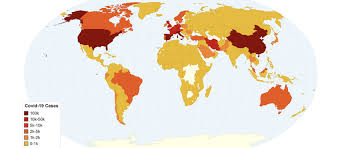

# Background

Since the outbreak of the SARS-CoV-2, there was a lot of talk about the dangers of the virus and the ability of the healthcare infrastructure to prevent deaths. In this context it might be interesting to look at the ratio of deaths and confirmed cases of Covid-19. This ratio might provide an interesting measure for the effectiveness of a healthcare system to cure or prevent the worst outcomes of an infection with SARS-CoV-2.

------------------------------------------------------------------------

# Data

The Johns Hopkins University Center for Systems Science and Engineering has compiled epidemiological data since 22 January 2020 from various sources (WHO, NHC, CCDC...). They track confirmed cases of SARS-Cov-2 as well as deaths caused by SARS-CoV-2. They provide this data on their [Git-Hub page](https://github.com/CSSEGISandData/COVID-19/tree/master/csse_covid_19_data/csse_covid_19_time_series) as a time series (time_series_covid19_confimed-global.csv and time_series_covid19_deaths_global.csv).\
Important columns:

-   Province/State
-   Country/Region
-   Lat (the latitude of the Country/Region)
-   Long (the longitude of the Country/Region)
-   confirmed cases/deaths (depending on which time series) for day x (e.g. 1/29/20)

| Province/State  | Country/Region | Lat      | Long      | 1/22/20 | 1/23/20 | 1/24/20 |
|-----------|-----------|-----------|-----------|-----------|-----------|-----------|
|                 | Afghanistan    | 33.93911 | 67.709953 | 0       | 0       | 0       |
|                 | Albania        | 41.1533  | 20.1683.  | 0       | 0       | 0       |
| South Australia | Australia      | -34.9285 | 138.6007  | 0       | 0       | 0       |

------------------------------------------------------------------------

# Goal

I am interested in the ratio of deaths and confirmed cases of the Covid-19 at different stages of the pandemic for the US, Germany, Italy, Australia, China, South Korea, New Zealand, Senegal and to visualize the results with heat maps. I hope to answer the following questions: - Did healtcare systems adapt to the outbreak virus over time (did the ratio shrink)? - Are healthcare systems of different countries equally effective?

### To do:

-   calculate the ratio of deaths and confirmed cases of Covis-19 for the time-windows february-april and juni-september of 2020, 2021 and 2022 for the aforementioned countries from the time series. (remember that the values for confirmed cases and deaths are cumulative, so you will need to subtract the value for the beginning of a time-window from the value for the end of the time-window)

-   visualize the average mortality rates for the aforementioned countries and for each time-window using a heat map (you will have to create six heat maps since there are six averages/time-windows) (regarding other countries, I think just leaving them uncolored/grey is fine)

The visualitzation should look somewhat like this:

------------------------------------------------------------------------

# helpful links

-   to create the heatmap [this](https://r-graphics.org/recipe-miscgraph-choropleth) may help

------------------------------------------------------------------------

I hope I was clear

Best Laurens
