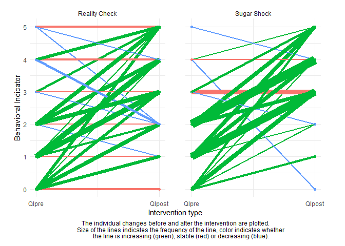
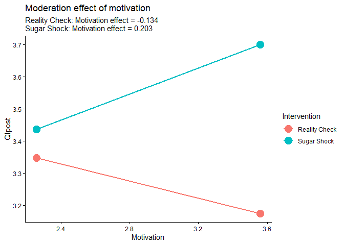

# Task 4: Comparison of the two interventions

# Task 5: Test whether motivation moderates the relationship between the intervention and the QIpost

Note: I added `child_id` as a random effect (as: `(1 | ID)`), since a
random effect is needed for the `lmer()` function.

    ## Linear mixed model fit by REML. t-tests use Satterthwaite's method [
    ## lmerModLmerTest]
    ## Formula: qi_post ~ Intervention * Motivation + qi_pre + (1 | child_id)
    ##    Data: data_full
    ## 
    ## REML criterion at convergence: 391.9
    ## 
    ## Scaled residuals: 
    ##     Min      1Q  Median      3Q     Max 
    ## -3.1694 -0.5469 -0.0095  0.7108  1.8329 
    ## 
    ## Random effects:
    ##  Groups   Name        Variance Std.Dev.
    ##  child_id (Intercept) 0.000    0.000   
    ##  Residual             1.528    1.236   
    ## Number of obs: 119, groups:  child_id, 20
    ## 
    ## Fixed effects:
    ##                                     Estimate Std. Error        df t value
    ## (Intercept)                          3.26988    0.77467 114.00000   4.221
    ## InterventionSugar Shock             -0.67304    1.05102 114.00000  -0.640
    ## Motivation                          -0.13397    0.25277 114.00000  -0.530
    ## qi_pre                               0.22875    0.08319 114.00000   2.750
    ## InterventionSugar Shock:Motivation   0.33717    0.35259 114.00000   0.956
    ##                                    Pr(>|t|)    
    ## (Intercept)                        4.91e-05 ***
    ## InterventionSugar Shock             0.52322    
    ## Motivation                          0.59715    
    ## qi_pre                              0.00694 ** 
    ## InterventionSugar Shock:Motivation  0.34096    
    ## ---
    ## Signif. codes:  0 '***' 0.001 '**' 0.01 '*' 0.05 '.' 0.1 ' ' 1
    ## 
    ## Correlation of Fixed Effects:
    ##             (Intr) IntrSS Motvtn qi_pre
    ## IntrvntnSgS -0.712                     
    ## Motivation  -0.962  0.700              
    ## qi_pre      -0.286  0.124  0.109       
    ## IntrvntSS:M  0.701 -0.976 -0.721 -0.119
    ## optimizer (nloptwrap) convergence code: 0 (OK)
    ## boundary (singular) fit: see help('isSingular')

There seems to be no significant interaction between the intervention
and the motivation (InterventionSugar Shock:Motivation : Est = 0.33717,
SE = 0.35259, t = 0.956, Pr(&gt;|t|) = 0.34096 &gt; .05) and therefore
no significant moderation effect of motivation on intervention.

# Task 6: Plot the moderation

