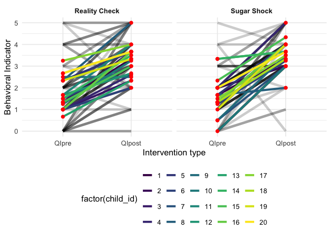
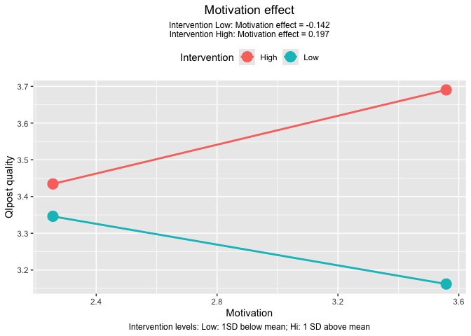

# Topic: The impact of various deterrents on children’s consumption of sweets–From Lea

## Load the file (btw. remove the missing values)

### Get Quick Overview of the data

1.The file consists of two sheets: “Intervention data” and
“questionaire”.

2.Each child was assigned to one of **two interventions**: “Reality
Check” or “Sugar Shock”.(in dataset we use “1” for “Reality Check” and
“2” for “Sugar Shock”).

3.Each type experiment was conducted in **three rounds**, with a pre-
and post-intervention measurement of the child’s consumption of sweets.
The pre-intervention measurement is represented by the columns “i1t0” to
“i5t0”, while the post-intervention measurement is represented by the
columns “i1” to “i5”.

<table>
<caption>Dataset</caption>
<colgroup>
<col style="width: 10%" />
<col style="width: 15%" />
<col style="width: 5%" />
<col style="width: 5%" />
<col style="width: 5%" />
<col style="width: 5%" />
<col style="width: 5%" />
<col style="width: 3%" />
<col style="width: 3%" />
<col style="width: 3%" />
<col style="width: 3%" />
<col style="width: 3%" />
<col style="width: 12%" />
<col style="width: 14%" />
</colgroup>
<thead>
<tr>
<th style="text-align: right;">child_id</th>
<th style="text-align: right;">Intervention</th>
<th style="text-align: right;">i1t0</th>
<th style="text-align: right;">i2t0</th>
<th style="text-align: right;">i3t0</th>
<th style="text-align: right;">i4t0</th>
<th style="text-align: right;">i5t0</th>
<th style="text-align: right;">i1</th>
<th style="text-align: right;">i2</th>
<th style="text-align: right;">i3</th>
<th style="text-align: right;">i4</th>
<th style="text-align: right;">i5</th>
<th style="text-align: right;">Motivation</th>
<th style="text-align: right;">Helpfulness</th>
</tr>
</thead>
<tbody>
<tr>
<td style="text-align: right;">1</td>
<td style="text-align: right;">1</td>
<td style="text-align: right;">0</td>
<td style="text-align: right;">0</td>
<td style="text-align: right;">0</td>
<td style="text-align: right;">0</td>
<td style="text-align: right;">0</td>
<td style="text-align: right;">0</td>
<td style="text-align: right;">1</td>
<td style="text-align: right;">1</td>
<td style="text-align: right;">1</td>
<td style="text-align: right;">1</td>
<td style="text-align: right;">3</td>
<td style="text-align: right;">4</td>
</tr>
<tr>
<td style="text-align: right;">1</td>
<td style="text-align: right;">2</td>
<td style="text-align: right;">0</td>
<td style="text-align: right;">1</td>
<td style="text-align: right;">0</td>
<td style="text-align: right;">0</td>
<td style="text-align: right;">0</td>
<td style="text-align: right;">1</td>
<td style="text-align: right;">1</td>
<td style="text-align: right;">1</td>
<td style="text-align: right;">0</td>
<td style="text-align: right;">0</td>
<td style="text-align: right;">2</td>
<td style="text-align: right;">4</td>
</tr>
<tr>
<td style="text-align: right;">1</td>
<td style="text-align: right;">1</td>
<td style="text-align: right;">0</td>
<td style="text-align: right;">0</td>
<td style="text-align: right;">0</td>
<td style="text-align: right;">1</td>
<td style="text-align: right;">1</td>
<td style="text-align: right;">1</td>
<td style="text-align: right;">1</td>
<td style="text-align: right;">1</td>
<td style="text-align: right;">1</td>
<td style="text-align: right;">1</td>
<td style="text-align: right;">3</td>
<td style="text-align: right;">4</td>
</tr>
<tr>
<td style="text-align: right;">1</td>
<td style="text-align: right;">1</td>
<td style="text-align: right;">1</td>
<td style="text-align: right;">1</td>
<td style="text-align: right;">0</td>
<td style="text-align: right;">0</td>
<td style="text-align: right;">0</td>
<td style="text-align: right;">0</td>
<td style="text-align: right;">1</td>
<td style="text-align: right;">0</td>
<td style="text-align: right;">0</td>
<td style="text-align: right;">0</td>
<td style="text-align: right;">3</td>
<td style="text-align: right;">4</td>
</tr>
<tr>
<td style="text-align: right;">1</td>
<td style="text-align: right;">2</td>
<td style="text-align: right;">0</td>
<td style="text-align: right;">0</td>
<td style="text-align: right;">1</td>
<td style="text-align: right;">1</td>
<td style="text-align: right;">0</td>
<td style="text-align: right;">1</td>
<td style="text-align: right;">1</td>
<td style="text-align: right;">1</td>
<td style="text-align: right;">1</td>
<td style="text-align: right;">0</td>
<td style="text-align: right;">3</td>
<td style="text-align: right;">3</td>
</tr>
</tbody>
</table>

<table>
<caption>Dataset</caption>
<thead>
<tr>
<th style="text-align: right;">id child</th>
<th style="text-align: right;">id age</th>
<th style="text-align: right;">sweet1</th>
<th style="text-align: right;">sweet2</th>
<th style="text-align: right;">sweet3</th>
<th style="text-align: right;">sweet4</th>
</tr>
</thead>
<tbody>
<tr>
<td style="text-align: right;">1</td>
<td style="text-align: right;">11</td>
<td style="text-align: right;">4</td>
<td style="text-align: right;">4</td>
<td style="text-align: right;">3</td>
<td style="text-align: right;">1</td>
</tr>
<tr>
<td style="text-align: right;">2</td>
<td style="text-align: right;">8</td>
<td style="text-align: right;">5</td>
<td style="text-align: right;">3</td>
<td style="text-align: right;">4</td>
<td style="text-align: right;">1</td>
</tr>
<tr>
<td style="text-align: right;">3</td>
<td style="text-align: right;">11</td>
<td style="text-align: right;">5</td>
<td style="text-align: right;">5</td>
<td style="text-align: right;">4</td>
<td style="text-align: right;">1</td>
</tr>
<tr>
<td style="text-align: right;">4</td>
<td style="text-align: right;">9</td>
<td style="text-align: right;">5</td>
<td style="text-align: right;">5</td>
<td style="text-align: right;">1</td>
<td style="text-align: right;">5</td>
</tr>
<tr>
<td style="text-align: right;">5</td>
<td style="text-align: right;">13</td>
<td style="text-align: right;">5</td>
<td style="text-align: right;">5</td>
<td style="text-align: right;">5</td>
<td style="text-align: right;">2</td>
</tr>
</tbody>
</table>

## Data cleaning

- Calculating the total value before intervention `QIpre`

- Calculating the total value before intervention `QIpost`

- using `across()` and `c()` to select the columns in a more “tidyverse”
  style

- Calculating mean of sweet to get children’s attitude toward sweet
  consumption, and then merge it with Intervention\_data by “child\_id”
  column.

## Data visualization

1.  To compare the effect of two interventions, we make the plot where
    each line represents one participant, connecting their pre score to
    post score. We need two datasets:

- the individual QIpre & QIpost scores

<table>
<caption>Dataset</caption>
<thead>
<tr>
<th style="text-align: right;">child_id</th>
<th style="text-align: right;">Intervention</th>
<th style="text-align: right;">trial_id</th>
<th style="text-align: left;">pair_id</th>
<th style="text-align: left;">time</th>
<th style="text-align: right;">score</th>
</tr>
</thead>
<tbody>
<tr>
<td style="text-align: right;">1</td>
<td style="text-align: right;">1</td>
<td style="text-align: right;">1</td>
<td style="text-align: left;">1_1_1</td>
<td style="text-align: left;">QIpre</td>
<td style="text-align: right;">0</td>
</tr>
<tr>
<td style="text-align: right;">1</td>
<td style="text-align: right;">1</td>
<td style="text-align: right;">1</td>
<td style="text-align: left;">1_1_1</td>
<td style="text-align: left;">QIpost</td>
<td style="text-align: right;">4</td>
</tr>
<tr>
<td style="text-align: right;">1</td>
<td style="text-align: right;">2</td>
<td style="text-align: right;">1</td>
<td style="text-align: left;">1_2_1</td>
<td style="text-align: left;">QIpre</td>
<td style="text-align: right;">1</td>
</tr>
<tr>
<td style="text-align: right;">1</td>
<td style="text-align: right;">2</td>
<td style="text-align: right;">1</td>
<td style="text-align: left;">1_2_1</td>
<td style="text-align: left;">QIpost</td>
<td style="text-align: right;">3</td>
</tr>
<tr>
<td style="text-align: right;">1</td>
<td style="text-align: right;">1</td>
<td style="text-align: right;">2</td>
<td style="text-align: left;">1_1_2</td>
<td style="text-align: left;">QIpre</td>
<td style="text-align: right;">2</td>
</tr>
</tbody>
</table>

- the mean score of all participants in each intervention group to
  present tendency

<table>
<caption>Dataset</caption>
<thead>
<tr>
<th style="text-align: right;">child_id</th>
<th style="text-align: right;">Intervention</th>
<th style="text-align: left;">time</th>
<th style="text-align: right;">mean</th>
</tr>
</thead>
<tbody>
<tr>
<td style="text-align: right;">1</td>
<td style="text-align: right;">1</td>
<td style="text-align: left;">QIpre</td>
<td style="text-align: right;">1.333333</td>
</tr>
<tr>
<td style="text-align: right;">1</td>
<td style="text-align: right;">1</td>
<td style="text-align: left;">QIpost</td>
<td style="text-align: right;">3.333333</td>
</tr>
<tr>
<td style="text-align: right;">1</td>
<td style="text-align: right;">2</td>
<td style="text-align: left;">QIpre</td>
<td style="text-align: right;">1.666667</td>
</tr>
<tr>
<td style="text-align: right;">1</td>
<td style="text-align: right;">2</td>
<td style="text-align: left;">QIpost</td>
<td style="text-align: right;">3.333333</td>
</tr>
<tr>
<td style="text-align: right;">2</td>
<td style="text-align: right;">1</td>
<td style="text-align: left;">QIpre</td>
<td style="text-align: right;">1.333333</td>
</tr>
</tbody>
</table>

From plot, we can conclude that there is no obvious difference between
two interventions, but the “Suger shock” intervention seems to have a
slightly better effect on reducing children’s consumption of sweets.

1.  We need to make a plot to explore whether **motivation** moderates
    the relationship between the **intervention** and the QIpost in
    quality (for each type) and control for the initial QIpre.

We should use
`model2 <- lmer(QIpost ~ intervention_type * motivaton + QIpre, data = data)`.
Because

`lmer() function` is used to fit linear mixed-effects models, which are
useful when you have data that is grouped or clustered, such as
**repeated measurements on the same subjects**. In this case, we have
repeated measurements of QIpost for each child, and we want to account
for the variability between children.

The random intercept variance was near 0 which indicates minimal between
participants variablity after controlling baseline quality.

    ## Linear mixed model fit by REML ['lmerMod']
    ## Formula: QIpost ~ Intervention * Motivation + QIpre + (1 | child_id)
    ##    Data: df_withmean
    ## 
    ## REML criterion at convergence: 391.9
    ## 
    ## Scaled residuals: 
    ##     Min      1Q  Median      3Q     Max 
    ## -3.1694 -0.5469 -0.0095  0.7108  1.8329 
    ## 
    ## Random effects:
    ##  Groups   Name        Variance Std.Dev.
    ##  child_id (Intercept) 0.000    0.000   
    ##  Residual             1.528    1.236   
    ## Number of obs: 119, groups:  child_id, 20
    ## 
    ## Fixed effects:
    ##                         Estimate Std. Error t value
    ## (Intercept)              3.94291    1.69237   2.330
    ## Intervention            -0.67304    1.05102  -0.640
    ## Motivation              -0.47114    0.56284  -0.837
    ## QIpre                    0.22875    0.08319   2.750
    ## Intervention:Motivation  0.33717    0.35259   0.956
    ## 
    ## Correlation of Fixed Effects:
    ##             (Intr) Intrvn Motvtn QIpre 
    ## Interventin -0.947                     
    ## Motivation  -0.974  0.926              
    ## QIpre       -0.208  0.124  0.124       
    ## Intrvntn:Mt  0.927 -0.976 -0.950 -0.119
    ## optimizer (nloptwrap) convergence code: 0 (OK)
    ## boundary (singular) fit: see help('isSingular')

    ## 
    ## Call:
    ## lm(formula = QIpost ~ Intervention * Motivation + QIpre, data = df_withmean)
    ## 
    ## Residuals:
    ##     Min      1Q  Median      3Q     Max 
    ## -3.9182 -0.6761 -0.0117  0.8788  2.2660 
    ## 
    ## Coefficients:
    ##                         Estimate Std. Error t value Pr(>|t|)   
    ## (Intercept)              3.94291    1.69237   2.330  0.02158 * 
    ## Intervention            -0.67304    1.05102  -0.640  0.52322   
    ## Motivation              -0.47114    0.56284  -0.837  0.40431   
    ## QIpre                    0.22875    0.08319   2.750  0.00694 **
    ## Intervention:Motivation  0.33717    0.35259   0.956  0.34096   
    ## ---
    ## Signif. codes:  0 '***' 0.001 '**' 0.01 '*' 0.05 '.' 0.1 ' ' 1
    ## 
    ## Residual standard error: 1.236 on 114 degrees of freedom
    ## Multiple R-squared:  0.08693,    Adjusted R-squared:  0.0549 
    ## F-statistic: 2.713 on 4 and 114 DF,  p-value: 0.03339

Conclusion: The interaction between intervention type and motivation was
not significant ( p = 0.341), suggesting that motivation did not
significantly moderate the relationship between intervention and QIpost.
