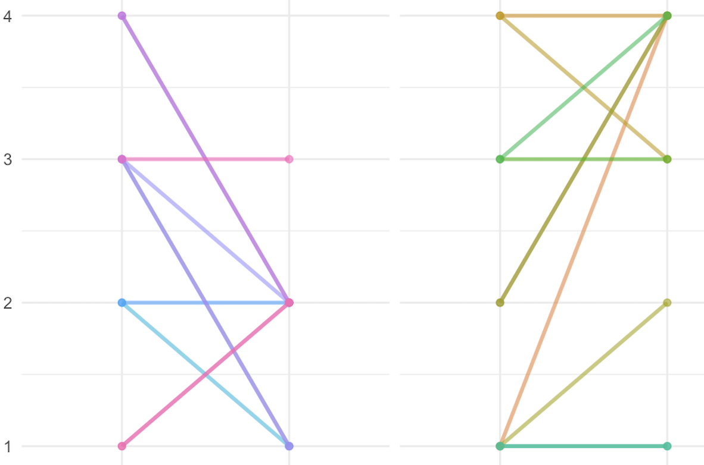

# Topic: The impact of various deterrents on children’s consumption of sweets

A research group wishes to investigate how different Interventions
effect children’s consumption of sweets. To this end, twenty children
were monitored over six different time points. At each measurement
point, the children were first given access to a selection of sweets
(chocolate, gummy bears, biscuits, etc.). Subsequently, one of two
interventions was carried out, designed to encourage a more mindful
approach to sweets. Afterwards, the children’s level of self-control
regarding sweets was assessed again.

As each child received both interventions during the course of the
study, this constitutes a within-subject design.

# The interventions:

### Intervention 1: Reality Check discussions

The children had short conversations with teenagers and adults who spoke
about their experiences of heavy sweet consumption. Topics included, for
example: - frequent visits to the dentist - stomach ache after eating
sweets, - dealing with being overweight and diabetes. The conversations
were intended to show the children in a vivid way what consequences
excessive sugar consumption can have.

### Intervention 2: The Sugar Shock videos

The children watched short videos showing just how much sugar is
actually contained in popular snacks and drinks. For example, sugar
cubes were shown alongside soft drinks, muesli bars or chocolate bars to
make the sugar content visible.

# Data

You find the data in the Excel tabs "Intervention data" and
"questionaire"

1.  Quality index prior to the intervention The variables i1t0 to i5t0
    capture five behavioural indicators prior to the intervention.
    Examples:

-   reaches straight for sweets
-   more than one sweet at a time
-   ask for sweets when hungry
-   asks for fruit instead of chocolate

2.  Quality index following the intervention Variables i1 to i5 measure
    the same behavioural indicators following the intervention. The sum
    gives the quality index after the intervention:

Coding: 0 = unfavourable behaviour 1 = favourable behaviour The sum
gives the quality index before the intervention e.g.: QIpre=
i1t0+i2t0+i3t0+i4t0+i5t0

3.  Additional variables

After each intervention, the children answered two questions: “How
motivated were you to eat fewer sweets?” Scale: 1 = not at all motivated
4 = very motivated “How helpful did you find the method?” Scale: 1 = not
at all helpful 4 = very helpful The aim is to investigate whether the
children’s motivation explains why one intervention is more effective
than the other. Intervention → Motivation/Helpfulness → ΔQI

4.  Childrens age was measured
5.  Childrens generall attitude towards sweets was measured with 4 items
    (sweet1-sweet4) on a 4-point scale. The sum of these items gives the
    general attitude towards sweets (Attitude).

# Tasks

1.  Read the data into R and prepare it for analysis.

2.  You need to calculate a sum score for the quality index before and
    after the intervention. Create two new variables, QIpre (the quality
    index before the intervention) and QIpost (the quality index after
    the intervention), that represent the quality index before and after
    the intervention, respectively.

3.  We further need to calculate the increase in quality (ΔQI) for each
    child and each intervention. Create a new variable, ΔQI, that
    represents the difference between QIpost and QIpre (ΔQI=
    QIpost-QIpre)

4.  Compare the two interventions in terms of their effect on the
    increase in quality.

5.  Test whether motivation mediates the relationship between the
    intervention and the increase in quality (for each type).

6.  Plot the individual changes in behavior before and after the two
    Interventions across the conditions. Therefore each panel shows a
    simple two-pint line (a connected dot plot) where each line
    represents one participant, connecting their pre score to post
    score. The panels should be titled "Reality Check" and "Sugar
    Shock". Both titles must appear centered above each panel. The two
    panels can share the same x- and y-axis, but each panel contains its
    own set of lines. Name the x-axis "Intervention type" (with two
    categorial positions; Quality Index Pre and Quality Index Post) and
    the y-axis "Behavioral Indicator" (Numeric scale 1-4; tick marks
    1,2,3,4). Similar to this:

    

   Or plot it completely different. You should at least highlight the
    changes from pre to post within your plot.

7.  Test whether helpfulness mediates the relationship between the
    intervention and the increase in quality (for each type).

8.  Test whether the children’s general attitude towards sweets
    moderates the effect of the intervention on the increase in quality
    (for each type).

9.  Think of a way to plot the results of 7 and 8
