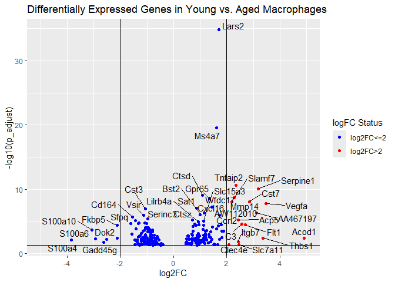

    transcript_data %>%
      select(1:3) -> DEG_data

    header_row2 <- as.character(DEG_data[2, ])
    colnames(DEG_data) <- header_row2
    DEG_data <- DEG_data[-c(1, 2), ]

    DEG_data %>% 
      rename(p_adjust = p.adjust) %>%
      mutate(p_adjust = as.double(p_adjust)) %>%
      mutate(logFC = as.numeric(logFC)) %>%
      filter(!if_all(everything(), is.na)) %>%
      mutate(logFC_high = if_else(logFC > 2 , TRUE, FALSE)) -> DEG_data

    DEG_data_t10 <- DEG_data %>%
      filter(p_adjust < 0.05) %>%      
      arrange(desc(logFC)) %>%        
      head(10) 

    DEG_data_t10 %>%
      select(1:3) %>%
      kable(
        caption = "Top 10 Differentially Expressed Genes (p.adjust < 0.05)",
        col.names = c("Gene Name", "LogFC", "P-value"),
        align = "lcc" 
      ) %>%
      kable_styling(
        bootstrap_options = c("striped", "hover", "condensed"),
        full_width = FALSE
      ) %>%
      add_header_above(c("Gene Information" = 1, "Expression Changes" = 2)) %>% 
      footnote(
        general = "Filtered for p.adjust < 0.05 and ranked by highest logFC. LogFC > 0 indicates upregulation.",
        footnote_as_chunk = TRUE
      ) %>%
      print()

    ## <table class="table table-striped table-hover table-condensed" style="width: auto !important; margin-left: auto; margin-right: auto;border-bottom: 0;">
    ## <caption>Top 10 Differentially Expressed Genes (p.adjust &lt; 0.05)</caption>
    ##  <thead>
    ## <tr>
    ## <th style="border-bottom:hidden;padding-bottom:0; padding-left:3px;padding-right:3px;text-align: center; " colspan="1">
Gene Information
</th>
    ## <th style="border-bottom:hidden;padding-bottom:0; padding-left:3px;padding-right:3px;text-align: center; " colspan="2">
Expression Changes
</th>
    ## </tr>
    ##   <tr>
    ##    <th style="text-align:left;"> Gene Name </th>
    ##    <th style="text-align:center;"> LogFC </th>
    ##    <th style="text-align:center;"> P-value </th>
    ##   </tr>
    ##  </thead>
    ## <tbody>
    ##   <tr>
    ##    <td style="text-align:left;"> Acod1 </td>
    ##    <td style="text-align:center;"> 4.919507 </td>
    ##    <td style="text-align:center;"> 0.0041432 </td>
    ##   </tr>
    ##   <tr>
    ##    <td style="text-align:left;"> Vegfa </td>
    ##    <td style="text-align:center;"> 3.464017 </td>
    ##    <td style="text-align:center;"> 0.0000000 </td>
    ##   </tr>
    ##   <tr>
    ##    <td style="text-align:left;"> Thbs1 </td>
    ##    <td style="text-align:center;"> 3.369642 </td>
    ##    <td style="text-align:center;"> 0.0039819 </td>
    ##   </tr>
    ##   <tr>
    ##    <td style="text-align:left;"> Serpine1 </td>
    ##    <td style="text-align:center;"> 3.197021 </td>
    ##    <td style="text-align:center;"> 0.0000000 </td>
    ##   </tr>
    ##   <tr>
    ##    <td style="text-align:left;"> AA467197 </td>
    ##    <td style="text-align:center;"> 3.112409 </td>
    ##    <td style="text-align:center;"> 0.0000005 </td>
    ##   </tr>
    ##   <tr>
    ##    <td style="text-align:left;"> Cst7 </td>
    ##    <td style="text-align:center;"> 2.847473 </td>
    ##    <td style="text-align:center;"> 0.0000000 </td>
    ##   </tr>
    ##   <tr>
    ##    <td style="text-align:left;"> Flt1 </td>
    ##    <td style="text-align:center;"> 2.698421 </td>
    ##    <td style="text-align:center;"> 0.0000350 </td>
    ##   </tr>
    ##   <tr>
    ##    <td style="text-align:left;"> C3 </td>
    ##    <td style="text-align:center;"> 2.566213 </td>
    ##    <td style="text-align:center;"> 0.0000280 </td>
    ##   </tr>
    ##   <tr>
    ##    <td style="text-align:left;"> Slc7a11 </td>
    ##    <td style="text-align:center;"> 2.457346 </td>
    ##    <td style="text-align:center;"> 0.0458777 </td>
    ##   </tr>
    ##   <tr>
    ##    <td style="text-align:left;"> Acp5 </td>
    ##    <td style="text-align:center;"> 2.441797 </td>
    ##    <td style="text-align:center;"> 0.0000066 </td>
    ##   </tr>
    ## </tbody>
    ## <tfoot><tr><td style="padding: 0; " colspan="100%">
    ## Note:   Filtered for p.adjust &lt; 0.05 and ranked by highest logFC. LogFC &gt; 0 indicates upregulation.</td></tr></tfoot>
    ## </table>

    transcript_data %>%
      select(6:11) -> GO_data_up

    header_row2 <- as.character(GO_data_up[2, ])
    colnames(GO_data_up) <- header_row2
    GO_data_up <- GO_data_up[-c(1, 2), ]

    terms <- c("angiogenesis", "immune response", "immunity", "cytokine", "vasculature", "wound", "inflammatory response", "chemokine", "lymphatic", "lymphocyte", "macrophage", "monocyte")
    pattern <- str_c(terms, collapse = "|")

    GO_data_up <- GO_data_up %>%
      rename(p_adjust_2 =p.adjust) %>%
      mutate(p_adjust_2 = as.double(p_adjust_2)) %>%
      separate(GeneRatio, into = c("num", "den"), sep = "/", convert = TRUE) %>%
      mutate(GeneRatio = as.double(num) / as.double(den)) %>%
      select( ID, Description,GeneRatio,p_adjust_2) %>%
      filter(!is.na(Description) & str_detect(Description, regex(pattern, ignore_case = TRUE)))

It didn’ make sense to me to delete the ID column, because I need this
one for the second data visualisation task.

    title_plot1 <-"Differentially Expressed Genes in Young vs. Aged Macrophages"

    DEG_data %>%
      ggplot(aes(x=logFC, y=-log10(p_adjust))) +
      geom_point(aes(colour = logFC_high)) +
        geom_text_repel(aes(label = gene), max.overlaps = 40) +
      geom_hline(yintercept = -log10(0.05), linetype = "solid", color = "black") +
      geom_vline(xintercept = c(-2, 2), linetype = "solid", color = "black") +
      labs(title = title_plot1, x="log2FC") +
      scale_color_manual(values = c("TRUE" = "red", "FALSE" = "blue"),labels = c("TRUE" = "log2FC>2", "FALSE" = "log2FC<=2"),name = "logFC Status")+
      scale_x_continuous(limits=c(-5, 5), breaks = c(-4, -2, 0, 2, 4))

 I didn’t add all
Gene names to the plot as the plot would be too cluttered.

    GO_data_up %>%
      mutate(ID=fct_reorder(ID, GeneRatio)) %>%
      ggplot(aes(GeneRatio, y=ID)) +
      geom_point(aes(color=p_adjust_2, size= GeneRatio)) +
       scale_color_gradient(
        low = "red", high = "lightgrey",
        name = "Adjusted p-value",
        guide = guide_colorbar(reverse = TRUE)  # darker = more significant
      ) +
      scale_size_continuous(name = "Gene Ratio") +
      labs(
        x = "Gene Ratio",
        y = "GO Term",
        title = "GO Term - Gene Ratio"
      ) +
      theme_minimal() +
      theme(
        legend.position = "right",
        axis.text.y = element_text(size = 10), axis.text.x = element_text(size = 4,angle = 90, vjust = 0.5, hjust = 1), plot.title = element_text(size = 20)
      )+
      coord_flip()

