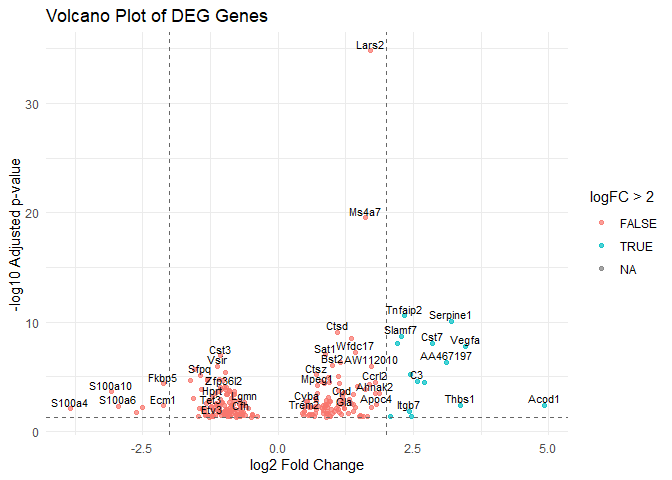
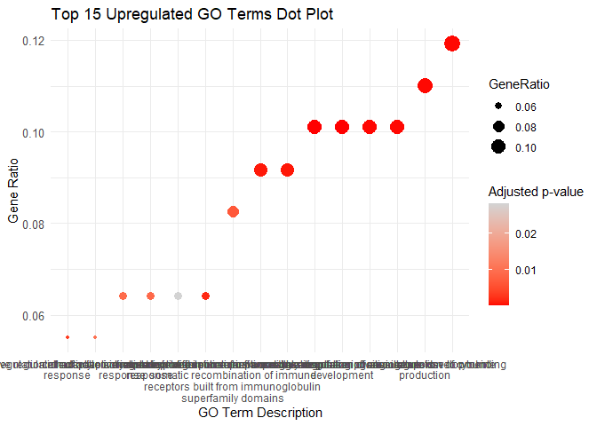

## Load Libraries

    library(readxl)
    library(knitr)
    library(ggplot2)
    library(stringr)
    library(gridExtra)
    library(tibble)
    library(dplyr)

## Data Manipulation

    # Read Excel file
    data <- read_excel("avym.xlsx")

    #  Set the first row as column names
    colnames(data) <- as.character(unlist(data[1, ]))

    # Remove the first row 
    data <- data[-1, ]

    # reset row numbers
    data <- remove_rownames(data)

    # Add "(up)" to columns 6 to 11
    colnames(data)[6:11] <- paste0(colnames(data)[6:11], " (up)")

    # Add "(down)" to columns 13 to 18
    colnames(data)[13:18] <- paste0(colnames(data)[13:18], " (down)")

    # Drop columns after column 18
    data <- data[, 1:18]

    # Drop columns 4, 5, and 12
    data <- data[, -c(4, 5, 12)]

    # Separate into DEG and GO data frames
    DEG <- data[, 1:3]
    GO_terms <- data[, 4:15]

    # Convert logFC column to numeric
    DEG$logFC <- as.numeric(DEG$logFC)

    # Create new column: TRUE if logFC > 2
    DEG$logFC_high <- abs(DEG$logFC) > 2

    # Ensure p.adjust is numeric
    DEG$p.adjust <- as.numeric(DEG$p.adjust)

## Filter DEGs

    # Filter for significant DEGs
    top10_DEGs <- DEG %>%
      mutate(
        p.adjust = as.numeric(p.adjust),
        logFC = as.numeric(logFC)
      ) %>%
      filter(p.adjust < 0.05) %>%
      slice_max(order_by = logFC, n = 10)

    # Remove logFC_high column before printing
    top10_DEGs <- top10_DEGs[, !(colnames(top10_DEGs) == "logFC_high")]

    # Show table
    kable(top10_DEGs, caption = "Top 10 Upregulated DEGs (p.adjust < 0.05)", align = "c")

<table>
<caption>Top 10 Upregulated DEGs (p.adjust &lt; 0.05)</caption>
<thead>
<tr>
<th style="text-align: center;">gene</th>
<th style="text-align: center;">logFC</th>
<th style="text-align: center;">p.adjust</th>
</tr>
</thead>
<tbody>
<tr>
<td style="text-align: center;">Acod1</td>
<td style="text-align: center;">4.919507</td>
<td style="text-align: center;">0.0041432</td>
</tr>
<tr>
<td style="text-align: center;">Vegfa</td>
<td style="text-align: center;">3.464017</td>
<td style="text-align: center;">0.0000000</td>
</tr>
<tr>
<td style="text-align: center;">Thbs1</td>
<td style="text-align: center;">3.369642</td>
<td style="text-align: center;">0.0039819</td>
</tr>
<tr>
<td style="text-align: center;">Serpine1</td>
<td style="text-align: center;">3.197021</td>
<td style="text-align: center;">0.0000000</td>
</tr>
<tr>
<td style="text-align: center;">AA467197</td>
<td style="text-align: center;">3.112409</td>
<td style="text-align: center;">0.0000005</td>
</tr>
<tr>
<td style="text-align: center;">Cst7</td>
<td style="text-align: center;">2.847473</td>
<td style="text-align: center;">0.0000000</td>
</tr>
<tr>
<td style="text-align: center;">Flt1</td>
<td style="text-align: center;">2.698421</td>
<td style="text-align: center;">0.0000350</td>
</tr>
<tr>
<td style="text-align: center;">C3</td>
<td style="text-align: center;">2.566213</td>
<td style="text-align: center;">0.0000280</td>
</tr>
<tr>
<td style="text-align: center;">Slc7a11</td>
<td style="text-align: center;">2.457346</td>
<td style="text-align: center;">0.0458777</td>
</tr>
<tr>
<td style="text-align: center;">Acp5</td>
<td style="text-align: center;">2.441797</td>
<td style="text-align: center;">0.0000066</td>
</tr>
</tbody>
</table>

## GO Term Filtering

    # Define keywords
    keywords <- c("angiogenesis", "immune response", "immunity", "cytokine", "vasculature",
                  "wound", "inflammatory response", "chemokine", "lymphatic",
                  "lymphocyte", "macrophage", "monocyte")

    # Collapse into regex pattern
    pattern <- paste(keywords, collapse = "|")

    # Filter GO terms (upregulated only)
    GO_up_filtered <- GO_terms %>%
      filter(grepl(pattern, `Description (up)`, ignore.case = TRUE)) %>%
      select(-matches("\\(down\\)"))

    # Remove unwanted columns
    GO_up_filtered <- GO_up_filtered %>%
      select(-any_of(c("BgRatio (up)", "pvalue (up)", "ID (up)")))

    # Rename columns
    colnames(GO_up_filtered) <- c("Description", "GeneRatio", "p.adjust")

## Volcano Plot

    # Recalculate -log10(p.adjust)
    DEG$neg_log10_padj <- -log10(DEG$p.adjust)

    # Volcano plot
    ggplot(DEG, aes(x = logFC, y = neg_log10_padj)) +
      geom_point(aes(color = logFC_high), alpha = 0.7) +
      geom_vline(xintercept = c(-2, 2), linetype = "dashed", color = "gray40") +
      geom_hline(yintercept = -log10(0.05), linetype = "dashed", color = "gray40") +
      annotate("text", x = -3, y = max(DEG$neg_log10_padj, na.rm = TRUE)*0.9, label = "logFC < -2", color = "blue", size = 5) +
      annotate("text", x = 0, y = max(DEG$neg_log10_padj, na.rm = TRUE)*0.9, label = "-2<logFC<2", color = "black", size = 5) +
      annotate("text", x = 3, y = max(DEG$neg_log10_padj, na.rm = TRUE)*0.9, label = "logFC > 2", color = "blue", size = 5) +
      geom_text(aes(label = gene), check_overlap = TRUE, size = 3, vjust = -0.3) +
      labs(
        title = "Volcano Plot of DEG Genes",
        x = "log2 Fold Change",
        y = "-log10 Adjusted p-value",
        color = "logFC > 2"
      ) +
      scale_color_manual(values = c("FALSE" = "black", "TRUE" = "blue"), guide = "none") +  # <- removes legend
      theme_minimal()

## GO Dot Plot

    # Wrap long descriptions
    GO_dotplot <- GO_up_filtered
    GO_dotplot$Description <- str_wrap(GO_dotplot$Description, width = 40)

    # Convert GeneRatio to numeric
    GO_dotplot$GeneRatio <- sapply(strsplit(GO_dotplot$GeneRatio, "/"), function(x) as.numeric(x[1]) / as.numeric(x[2]))

    # Convert p.adjust to numeric
    GO_dotplot$p.adjust <- as.numeric(GO_dotplot$p.adjust)

    # Sort and select top 15
    GO_dotplot_top <- GO_dotplot %>%
      slice_max(order_by = GeneRatio, n = 15)

    # Dot plot
    # Create letter labels
    GO_dotplot_top$Label <- LETTERS[1:nrow(GO_dotplot_top)]

    # Save a lookup table (if you want to display separately too)
    label_lookup <- GO_dotplot_top[, c("Label", "Description")]

    # Dot plot using label letters
    ggplot(GO_dotplot_top, aes(x = Label, y = GeneRatio)) +
      geom_point(aes(size = GeneRatio, color = p.adjust)) +
      scale_color_gradient(low = "red", high = "lightgray", name = "Adjusted p-value") +
      labs(
        title = "Top 15 Upregulated GO Terms Dot Plot",
        x = "GO Term (Letter Code)",
        y = "Gene Ratio"
      ) +
      theme_minimal() +
      theme(
        axis.text.x = element_text(size = 12),
        legend.position = "right"
      ) +
      # Add table below
      annotation_custom(
        gridExtra::tableGrob(label_lookup, rows = NULL),
        ymin = -0.2, ymax = -0.1, xmin = -Inf, xmax = Inf
      )

