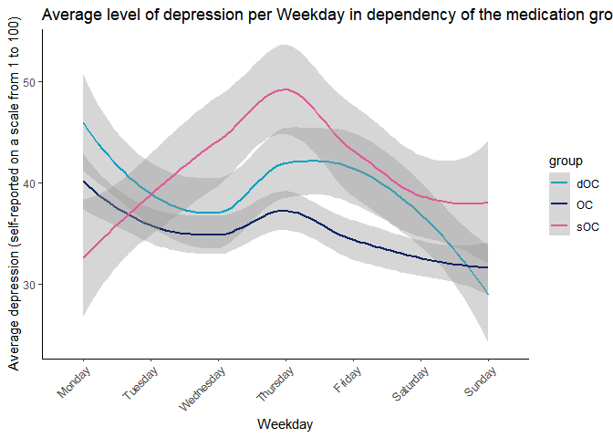
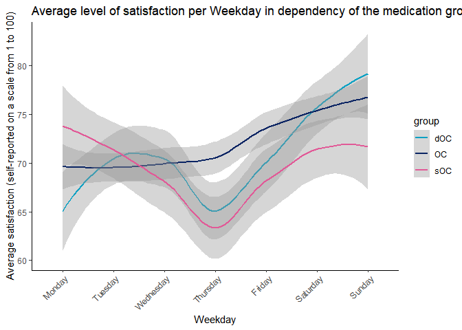
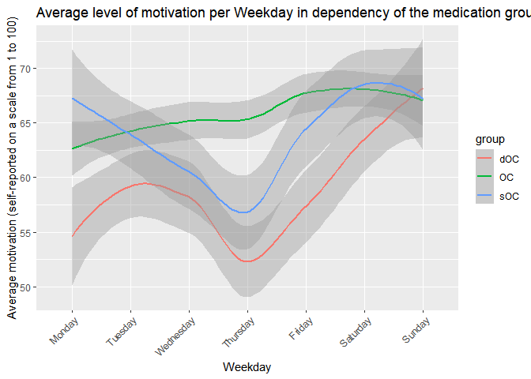
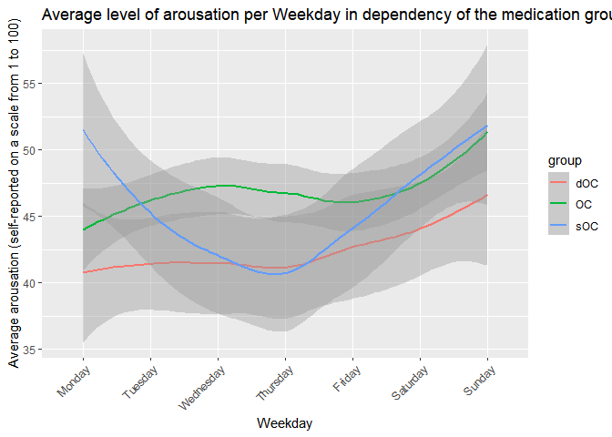

# Loading packages and R-setup

    library(tidyverse)

    ## Warning: Paket 'tidyverse' wurde unter R Version 4.4.3 erstellt

    ## Warning: Paket 'lubridate' wurde unter R Version 4.4.3 erstellt

    ## ── Attaching core tidyverse packages ──────────────────────── tidyverse 2.0.0 ──
    ## ✔ dplyr     1.1.4     ✔ readr     2.1.5
    ## ✔ forcats   1.0.0     ✔ stringr   1.5.1
    ## ✔ ggplot2   3.5.1     ✔ tibble    3.2.1
    ## ✔ lubridate 1.9.4     ✔ tidyr     1.3.1
    ## ✔ purrr     1.0.2     
    ## ── Conflicts ────────────────────────────────────────── tidyverse_conflicts() ──
    ## ✖ dplyr::filter() masks stats::filter()
    ## ✖ dplyr::lag()    masks stats::lag()
    ## ℹ Use the conflicted package (<http://conflicted.r-lib.org/>) to force all conflicts to become errors

    library(readxl)

    ## Warning: Paket 'readxl' wurde unter R Version 4.4.3 erstellt

    library(rstudioapi)

    ## Warning: Paket 'rstudioapi' wurde unter R Version 4.4.3 erstellt

    library(lubridate)
    setwd(dirname(rstudioapi::getActiveDocumentContext()$path))

# Loading data

    Data <- read_xlsx("stress_ratings_anonymized.xlsx")

    ## New names:
    ## • `` -> `...17`

# Data manipulation

## Data cleaning:

    # Remove column 17 (is empty) and incomeplete entries (= remove all rows/entries that contain NAs besides for the last 3 variables -> dOC variables for the lv. 2 task)
    CleanData <- Data %>%  
      select(-17) %>% 
      filter(if_all(-c(id_dOC, dOC_cycle_date, dOC_cycle_day), ~ !is.na(.)))

## Data aggregation:

    # Give out a tibble containing the mean and standard deviation for each mood and stress item for each participant
    CleanData %>% 
      group_by(id) %>% 
      summarise(mean_stressed_24h = mean(stressed_24h),
                SD_stressed_24h = sd(stressed_24h),
                mean_stressed_moment = mean(stressed_moment),
                SD_stressed_moment = sd(stressed_moment),
                mean_depressed = mean(depressed),
                SD_depressed = sd(depressed),
                mean_satisfied = mean(satisfied),
                SD_satisfied = sd(satisfied),
                mean_motivated = mean(motivated),
                SD_motivated = sd(motivated),
                mean_aroused = mean(aroused),
                SD_aroused = sd(aroused))

    ## # A tibble: 52 × 13
    ##       id mean_stressed_24h SD_stressed_24h mean_stressed_moment
    ##    <dbl>             <dbl>           <dbl>                <dbl>
    ##  1     2              45.2            27.7                 9.62
    ##  2     3              55.1            19.5                 8.63
    ##  3     5              39.0            29.3                 8.40
    ##  4     6              28.6            19.1                 6.80
    ##  5     7              59.5            25.2                10.0 
    ##  6     8              61.4            21.6                10.2 
    ##  7     9              60.5            25.9                 8.60
    ##  8    11              40.7            32.5                 7.84
    ##  9    12              34.4            26.9                 7.64
    ## 10    13              40.0            25.1                 8.12
    ## # ℹ 42 more rows
    ## # ℹ 9 more variables: SD_stressed_moment <dbl>, mean_depressed <dbl>,
    ## #   SD_depressed <dbl>, mean_satisfied <dbl>, SD_satisfied <dbl>,
    ## #   mean_motivated <dbl>, SD_motivated <dbl>, mean_aroused <dbl>,
    ## #   SD_aroused <dbl>

    # Give out a tibble containing the mean and standard deviation for each mood and stress item for each group
    CleanData %>% 
      group_by(group) %>% 
      summarise(mean_stressed_24h = mean(stressed_24h),
                SD_stressed_24h = sd(stressed_24h),
                mean_stressed_moment = mean(stressed_moment),
                SD_stressed_moment = sd(stressed_moment),
                mean_depressed = mean(depressed),
                SD_depressed = sd(depressed),
                mean_satisfied = mean(satisfied),
                SD_satisfied = sd(satisfied),
                mean_motivated = mean(motivated),
                SD_motivated = sd(motivated),
                mean_aroused = mean(aroused),
                SD_aroused = sd(aroused))

    ## # A tibble: 3 × 13
    ##   group mean_stressed_24h SD_stressed_24h mean_stressed_moment
    ##   <chr>             <dbl>           <dbl>                <dbl>
    ## 1 OC                 43.6            26.9                 8.49
    ## 2 dOC                48.0            29.6                 8.89
    ## 3 sOC                51.1            32.2                 9.15
    ## # ℹ 9 more variables: SD_stressed_moment <dbl>, mean_depressed <dbl>,
    ## #   SD_depressed <dbl>, mean_satisfied <dbl>, SD_satisfied <dbl>,
    ## #   mean_motivated <dbl>, SD_motivated <dbl>, mean_aroused <dbl>,
    ## #   SD_aroused <dbl>

## Data transformation:

    # Scatterplots for association between self reportet stress and mood
    # Negative mood: x = stressed_24h, y = depressed, confidence interval = 99%
    ggplot(CleanData, aes(x= stressed_24h, y= depressed))+
      geom_point(col = "#7699D4", size=0.8)+
      geom_smooth(method= "lm",col = "#480355", se = TRUE, level= 0.99, fill = "#9448BC")+
      labs(
        title= "How stress influences negative mood",
        subtitle= "(Self-reported perception, scores from 0 to 100)",
        x = "How stressed did you feel today? (stressed_24h)",
        y = "How depressed did you feel today? (depressed)"
      )+
      theme(panel.background = element_blank())

    ## `geom_smooth()` using formula = 'y ~ x'

    #Positive mood: x = stressed_24h, y = satisfied, confidence interval = 99%
    ggplot(CleanData, aes(x= stressed_24h, y= satisfied))+
      geom_point(col = "#7699D4", size=0.8)+
      geom_smooth(method= "lm",col = "#480355", se = TRUE, level= 0.99, fill = "#9448BC")+
      labs(
        title= "How stress influences positive mood",
        subtitle= "(Self-reported perception, scores from 0 to 100)",
        x = "How stressed did you feel today? (stressed_24h)",
        y = "How satisfied did you feel today? (satisfied)"
      )+
      theme(panel.background = element_blank())

    ## `geom_smooth()` using formula = 'y ~ x'

# Visualization

    # Convert timestamps to weekdays with lubridate (I use timeStampStop, since this seems to make the most sense to me considering your definition of the different time stamps)
    WeekdayData <- CleanData %>% 
      mutate(
        date = as_datetime(timeStampStop),
        days_since_start = as.integer(difftime(date, min(date), units = "days")),
        weekday = factor((days_since_start%%7)+1,
                         levels = 1:7,
                         labels= c("Monday","Tuesday","Wednesday","Thursday","Friday","Saturday","Sunday"))
      )

    # Create 4 plots with ggplot, one for each mood. In each plot there are 3 line graphs, one for each medication group(as shown on the legend)
    # Plot for depressed: (confidence interval =75%)
    ggplot(WeekdayData,aes(x=weekday, y=depressed, col = group, group = group))+
      geom_smooth(method = "loess", se = TRUE, level =0.75)+
      labs(
        title="Average level of depression per Weekday in dependency of the medication group",
        x="Weekday",
        y="Average depression (self-reported on a scale from 1 to 100)")+
      theme(axis.text.x = element_text(angle = 45, hjust = 1))

    ## `geom_smooth()` using formula = 'y ~ x'

    # Plot for satisfied: (confidence interval =75%)
    ggplot(WeekdayData,aes(x=weekday, y=satisfied, col = group, group = group))+
      geom_smooth(method = "loess", se = TRUE, level =0.75)+
      labs(
        title="Average level of satisfaction per Weekday in dependency of the medication group",
        x="Weekday",
        y="Average satisfaction (self-reported on a scale from 1 to 100)")+
      theme(axis.text.x = element_text(angle = 45, hjust = 1))

    ## `geom_smooth()` using formula = 'y ~ x'

    # Plot for motivated: (confidence interval =75%)
    ggplot(WeekdayData,aes(x=weekday, y=motivated, col = group, group = group))+
      geom_smooth(method = "loess", se = TRUE, level =0.75)+
      labs(
        title="Average level of motivation per Weekday in dependency of the medication group",
        x="Weekday",
        y="Average motivation (self-reported on a scale from 1 to 100)")+
      theme(axis.text.x = element_text(angle = 45, hjust = 1))

    ## `geom_smooth()` using formula = 'y ~ x'

    # Plot for aroused: (confidence interval =75%)
    ggplot(WeekdayData,aes(x=weekday, y=aroused, col = group, group = group))+
      geom_smooth(method = "loess", se = TRUE, level =0.75)+
      labs(
        title="Average level of arousation per Weekday in dependency of the medication group",
        x="Weekday",
        y="Average arousation (self-reported on a scale from 1 to 100)")+
      theme(axis.text.x = element_text(angle = 45, hjust = 1))

    ## `geom_smooth()` using formula = 'y ~ x'

# Level 2

    #Make 5 graphs, one for the stress level and one for each mood. If I find the time I will maybe later also try to add the cycle phases like in your example graph.
    #Graph for stress: (confidence interval=95%)
    CleanData %>% 
      filter(group == "dOC") %>% 
      ggplot(aes(x=dOC_cycle_day, y=stressed_24h))+
      geom_smooth(method="loess", se=TRUE)+
      labs(
        title = "Mean stress rating by cycle phase (day)",
        x="Cycle day",
        y="Mean stress level (self-reported on a scale from 1 to 100)"
      )+
      theme_minimal()

    ## `geom_smooth()` using formula = 'y ~ x'

    ## Warning: Removed 247 rows containing non-finite outside the scale range
    ## (`stat_smooth()`).

    #Graph for depressed: (confidence interval=95%)
    CleanData %>% 
      filter(group == "dOC") %>% 
      ggplot(aes(x=dOC_cycle_day, y=depressed))+
      geom_smooth(method="loess", se=TRUE)+
      labs(
        title = "Mean depression rating by cycle phase (day)",
        x="Cycle day",
        y="Mean depression level (self-reported on a scale from 1 to 100)"
      )+
      theme_minimal()

    ## `geom_smooth()` using formula = 'y ~ x'

    ## Warning: Removed 247 rows containing non-finite outside the scale range
    ## (`stat_smooth()`).

    #Graph for satisfied: (confidence interval=95%)
    CleanData %>% 
      filter(group == "dOC") %>% 
      ggplot(aes(x=dOC_cycle_day, y=satisfied))+
      geom_smooth(method="loess", se=TRUE)+
      labs(
        title = "Mean satisfaction rating by cycle phase (day)",
        x="Cycle day",
        y="Mean satisfaction level (self-reported on a scale from 1 to 100)"
      )+
      theme_minimal()

    ## `geom_smooth()` using formula = 'y ~ x'

    ## Warning: Removed 247 rows containing non-finite outside the scale range
    ## (`stat_smooth()`).

    #Graph for motivated: (confidence interval=95%)
    CleanData %>% 
      filter(group == "dOC") %>% 
      ggplot(aes(x=dOC_cycle_day, y=motivated))+
      geom_smooth(method="loess", se=TRUE)+
      labs(
        title = "Mean motivation rating by cycle phase (day)",
        x="Cycle day",
        y="Mean motivation level (self-reported on a scale from 1 to 100)"
      )+
      theme_minimal()

    ## `geom_smooth()` using formula = 'y ~ x'

    ## Warning: Removed 247 rows containing non-finite outside the scale range
    ## (`stat_smooth()`).

    #Graph for aroused: (confidence interval=95%)
    CleanData %>% 
      filter(group == "dOC") %>% 
      ggplot(aes(x=dOC_cycle_day, y=aroused))+
      geom_smooth(method="loess", se=TRUE)+
      labs(
        title = "Mean arousation rating by cycle phase (day)",
        x="Cycle day",
        y="Mean arousation level (self-reported on a scale from 1 to 100)"
      )+
      theme_minimal()

    ## `geom_smooth()` using formula = 'y ~ x'

    ## Warning: Removed 247 rows containing non-finite outside the scale range
    ## (`stat_smooth()`).

\## Kommentar: - I made the line plots with geom\_smooth, beacuse it is
easy to generate confidence intervals with this. I hope this is ok, if I
should calculate the mean first and just plot the mean as a geom\_line,
just tell me. - The way I understand it i should always do the plots for
each mood seperateley, or did you imagine a solution where all 4 moods
are in some way calculated together for a general mood rating - Because
of that I also have a lot of redundant code I will try to reduce this if
find some solutions, maybe you have an idea how? - It was a really cool
project and I had a lot of fun doing this, thanks! :)
