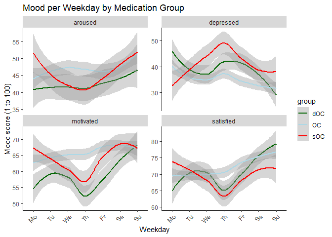
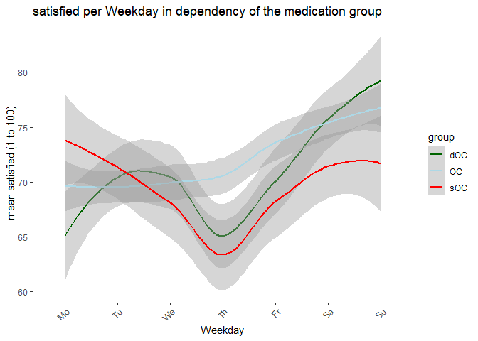
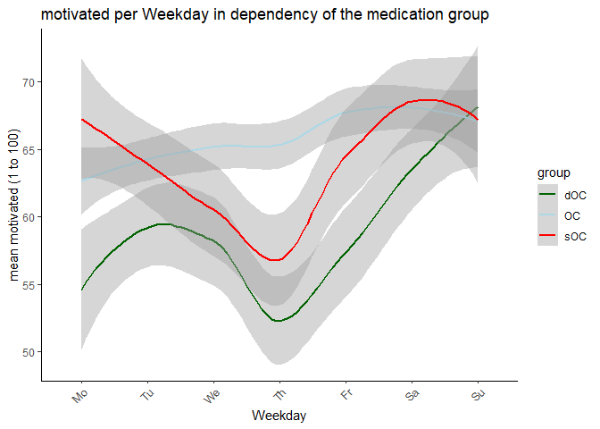

# data manipulation

After the necessary packages an the dataset were loaded the dataset was
cleaned up by removing all Na’s and datasets that contain Na’s. After
that the data will be summarized by the ‘id’ of the patient with mean
and deviation of ‘stressed\_24h’,‘stressed\_moment’, ‘depressed’,
‘satisfied’, ‘motivated’ and ‘aroused’. Then the same is made by
grouping the data by ‘group’.

Then the correlation between a stress moment and the a positive and
negative mood is created with the stress moment beeing
‘stressed\_moment’ and the positive/negative mood beeing
‘motivated’/‘tense’.

\# Visualization The visualization of the participants mood and stress
are shown during weekdays. The result shows that the majority of all
medication starter **sOC** is feeling most depressed at the middle of
the week (Th). For the **dOC** group the mood varies much more during
the week. For the **OC** group the mood varies even less and is even is
better in comparison to **doc**.  

# Level 2

## Kommentar:

Sorry that I couldn’t add the Tier 2 plots yet.
