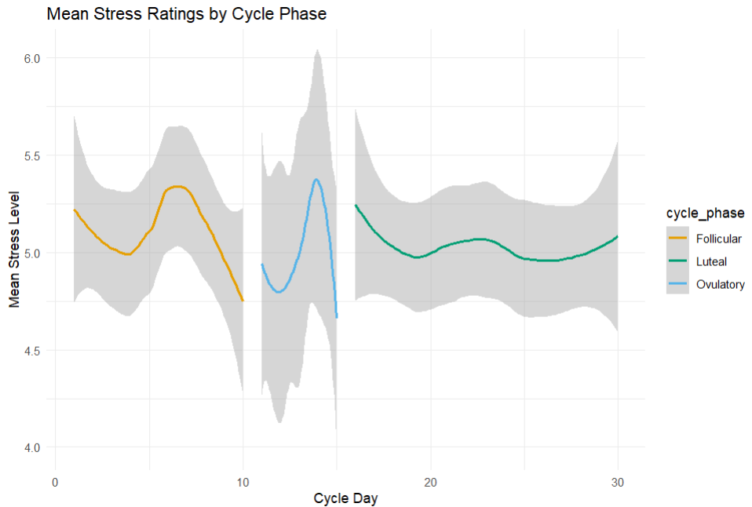
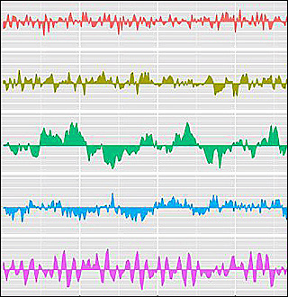

```{r setup, include=FALSE}
knitr::opts_chunk$set(echo = TRUE)
```

# **Introduction**  
This project analyzes self-reported mood items and stress levels in three groups: **Women who start taking medication (sOC), Women who stop taking medication (dOC), and continuous medication user (OC)**. Participants recorded their mood and stress levels once a day, two to three times per week over the course of 90 days using an app. If they answered 100%, there are 30 ratings per person. The dataset also contains information on the menstrual cycle phase of the dOC (women who stop taking medication). A regular cycle is about 28 days long, with ovulation occurring around day 14. The cycle lengths for the dOC group vary a lot. The dataset contains the date of the menstrual cycle phase and the day of the menstrual cycle phase so it should be possible to match the cycle day with the mood and stress ratings.

# **Dataset Description**  
The dataset originates from an app-based study and includes mood & stress ratings recorded 2–3 times per week over 90 days (30 times in total). The key variables include:

- `id`: Participant ID  
- `group`: **medication starter (sOC), medication discontinuation (dOC), continuous medication user (OC)**  
- `timeStamp`: Date & time of the mood/stress rating; scheduled: when it was supposed to be filled out, sent: when it reached the participants phone, start: when the participant started filling it out, stop: when the participant finished filling it out
- `stressed_24h, depressed, satisfied, motivated, aroused`: How did you feel today? (1–100 scale)
- `stressed_moment, tense, challenged, burdened, overwhelmed`: How do you feel right now? (1–10 scale)

The dataset also contains information on the menstrual cycle phase of the dOC group.
- `id_dOC`: Participant ID of the dOC group
- `dOC_cycle_date`: Date of the menstrual cycle phase
- `dOC_cycle_day`: Day of the menstrual cycle phase (normal would be 1-28 days)

# **Data manipulation goals**

- **Data Cleaning**: Check for missing values, duplicates, outliers and for normality of the data
- **Data Transformation**: Create new variables to analyze the relationship between mood and stress, and how the three groups differ in their ratings, and how the ratings change over time. Also check if the mood and stress ratings are correlated  
- **Data Aggregation**: Calculate the mean and standard deviation for mood and stress ratings for each participant.
- reshape data if needed

# **Visualization goals**

Our goal is to visualize stress and mood trends over time for each group and explore individual variability. Additionally, it would be great to display a time series plot for the dOC group, highlighting the menstrual cycle phase and their mood and stress ratings accordingly. For that, I have provided an example plot:


Key visualizations include:

- **Time Series**: Plot the mood and stress ratings over time for each group
  - time series plot for dOC group with mood/stress ratings (y-axis) and menstrual cycle phase (x-axis). Keep in mind that we do not have daily mood/stress ratings, but we have the information of their cycle for 90 days.
- **Smoothed trend lines** for group-level comparisons
- display fluctuations in mood and stress ratings over time
- **Correlation matrix**: Heatmap of the correlation matrix between mood and stress ratings
- check example plots that I have provided:




# **Roadmap**
- Load and inspect the dataset
- Perform necessary data manipulation steps
- Generate visualizations to explore trends
- Interpret findings and discuss implications

# **Dataset**
[Download the Excel file](./stress_ratings_anonymized.xlsx)

