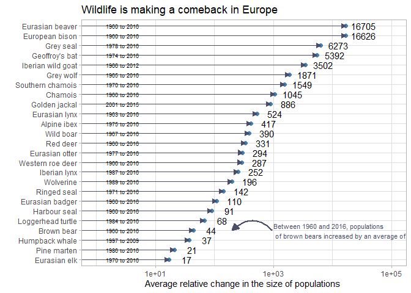

    library (tidyverse)

    ## ── Attaching core tidyverse packages ──────────────────────── tidyverse 2.0.0 ──
    ## ✔ dplyr     1.1.1     ✔ readr     2.1.4
    ## ✔ forcats   1.0.0     ✔ stringr   1.5.0
    ## ✔ ggplot2   3.4.1     ✔ tibble    3.2.1
    ## ✔ lubridate 1.9.2     ✔ tidyr     1.3.0
    ## ✔ purrr     1.0.1     
    ## ── Conflicts ────────────────────────────────────────── tidyverse_conflicts() ──
    ## ✖ dplyr::filter() masks stats::filter()
    ## ✖ dplyr::lag()    masks stats::lag()
    ## ℹ Use the conflicted package (<http://conflicted.r-lib.org/>) to force all conflicts to become errors

    library (ggplot2)

    #df <- readr::read_csv("/Users/huangziyi/Mammal-comeback-in-Europe-data-OWID-download .csv", show_col_types = FALSE)
    df <- read_csv("https://ourworldindata.org/uploads/2022/09/Mammal-comeback-in-Europe-data-OWID-download.csv")

    ## Rows: 25 Columns: 6
    ## ── Column specification ────────────────────────────────────────────────────────
    ## Delimiter: ","
    ## chr (3): Common name of species, Species name, Average relative change in ab...
    ## dbl (3): Number of mammal populations included, Start year, End year
    ## 
    ## ℹ Use `spec()` to retrieve the full column specification for this data.
    ## ℹ Specify the column types or set `show_col_types = FALSE` to quiet this message.

    df <-lapply(df, gsub, pattern="%", replaceme="")
    df<- as_tibble(df)
    colnames(df)<- c("common_name", "species_name", "number_populations", "start_year", "end_year", "average_change")
    df[6]<-as.numeric(unlist(df[6]))
    df$common_name=with(df, reorder(common_name, average_change))
    br <-10^(0:4)

    #Plot
    plot<- ggplot(df, aes (x=df$common_name, y=df$average_change)) + 
      geom_point(color="#4682B4", size=2, alpha=1) +
      geom_segment(aes(x=common_name, xend=common_name, y=0, yend=average_change),
                   color="#4a4e69",
                   arrow = arrow(length=unit(0.02, "npc"), type = "closed"),
                   lineend = "round") +
      scale_y_continuous(trans="log10",limits = c(1, 100000),
                        # labels = str_c(br)(comma_format(big.mark = ".", decimal.mark = ","), "%"), breaks = br) 
                        )+
      geom_text (aes(label=df$average_change), nudge_y = 0.3) +
      labs(title = "Wildlife is making a comeback in Europe", 
           y = "Average relative change in the size of populations ",
           x = "") +
      theme_light() +
      coord_flip() +
      annotate ("text", x="Brown bear", y=1000,
                  label="Between 1960 and 2016, populations \n of brown bears increased by an average of 44%",
                  color="#4a4e69", hjust=0, size=3) +
      geom_text (
        aes(label=paste(df$start_year, "to", df$end_year)),
        y=1, hjust=1.5, check_overlap = TRUE, size=2.5
      )+
      geom_curve(
        aes(x=4, y=950, xend=4, yend=200),
        arrow=arrow(length= unit(0.03,"npc"),
        type="closed"),color="#4a4e69", size=1, angle = 90)

    ## Warning: Using `size` aesthetic for lines was deprecated in ggplot2 3.4.0.
    ## ℹ Please use `linewidth` instead.
    ## This warning is displayed once every 8 hours.
    ## Call `lifecycle::last_lifecycle_warnings()` to see where this warning was
    ## generated.

    print(plot)

    ## Warning: Use of `df$common_name` is discouraged.
    ## ℹ Use `common_name` instead.

    ## Warning: Use of `df$average_change` is discouraged.
    ## ℹ Use `average_change` instead.
    ## Use of `df$average_change` is discouraged.
    ## ℹ Use `average_change` instead.

    ## Warning: Use of `df$common_name` is discouraged.
    ## ℹ Use `common_name` instead.

    ## Warning: Use of `df$average_change` is discouraged.
    ## ℹ Use `average_change` instead.

    ## Warning: Use of `df$start_year` is discouraged.
    ## ℹ Use `start_year` instead.

    ## Warning: Use of `df$end_year` is discouraged.
    ## ℹ Use `end_year` instead.

    ## Warning: Use of `df$common_name` is discouraged.
    ## ℹ Use `common_name` instead.

    ## Warning: Transformation introduced infinite values in continuous y-axis

    library (tidyverse)
    library (ggplot2)

    #df <- readr::read_csv("/Users/huangziyi/Mammal-comeback-in-Europe-data-OWID-download .csv", show_col_types = FALSE)
    df <- read_csv("https://ourworldindata.org/uploads/2022/09/Mammal-comeback-in-Europe-data-OWID-download.csv")

    ## Rows: 25 Columns: 6
    ## ── Column specification ────────────────────────────────────────────────────────
    ## Delimiter: ","
    ## chr (3): Common name of species, Species name, Average relative change in ab...
    ## dbl (3): Number of mammal populations included, Start year, End year
    ## 
    ## ℹ Use `spec()` to retrieve the full column specification for this data.
    ## ℹ Specify the column types or set `show_col_types = FALSE` to quiet this message.

    df <-lapply(df, gsub, pattern="%", replaceme="")
    df<- as_tibble(df)
    colnames(df)<- c("common_name", "species_name", "number_populations", "start_year", "end_year", "average_change")
    df[6]<-as.numeric(unlist(df[6]))
    df$common_name=with(df, reorder(common_name, average_change))
    br <-10^(0:4)

    #Plot
    plot<- ggplot(df, aes (x=df$common_name, y=df$average_change)) + 
      geom_point(color="#4682B4", size=2, alpha=1) +
      geom_segment(aes(x=common_name, xend=common_name, y=0, yend=average_change),
                   color="#4a4e69",
                   arrow = arrow(length=unit(0.02, "npc"), type = "closed"),
                   lineend = "round") +
      scale_y_continuous(trans="log10",limits = c(1, 100000),
                        # labels = str_c(br)(comma_format(big.mark = ".", decimal.mark = ","), "%"), breaks = br) 
                        )+
      geom_text (aes(label=df$average_change), nudge_y = 0.3) +
      labs(title = "Wildlife is making a comeback in Europe", 
           y = "Average relative change in the size of populations ",
           x = "") +
      theme_light() +
      coord_flip() +
      annotate ("text", x="Brown bear", y=1000,
                  label="Between 1960 and 2016, populations \n of brown bears increased by an average of 44%",
                  color="#4a4e69", hjust=0, size=3) +
      geom_text (
        aes(label=paste(df$start_year, "to", df$end_year)),
        y=1, hjust=1.5, check_overlap = TRUE, size=2.5
      )

    library (tidyverse)
    library (ggplot2)

    # df <- readr::read_csv("/Users/huangziyi/Mammal-comeback-in-Europe-data-OWID-download .csv", show_col_types = FALSE)
    df <- read_csv("https://ourworldindata.org/uploads/2022/09/Mammal-comeback-in-Europe-data-OWID-download.csv")

    ## Rows: 25 Columns: 6
    ## ── Column specification ────────────────────────────────────────────────────────
    ## Delimiter: ","
    ## chr (3): Common name of species, Species name, Average relative change in ab...
    ## dbl (3): Number of mammal populations included, Start year, End year
    ## 
    ## ℹ Use `spec()` to retrieve the full column specification for this data.
    ## ℹ Specify the column types or set `show_col_types = FALSE` to quiet this message.

    df <-lapply(df, gsub, pattern="%", replaceme="")
    df<- as_tibble(df)
    colnames(df)<- c("common_name", "species_name", "number_populations", "start_year", "end_year", "average_change")
    df[6]<-as.numeric(unlist(df[6]))
    df$common_name=with(df, reorder(common_name, average_change))
    br <-10^(0:4)

    #Plot
    plot<- ggplot(df, aes (x=df$common_name, y=df$average_change)) + 
      geom_point(color="#4682B4", size=2, alpha=1) +
      geom_segment(aes(x=common_name, xend=common_name, y=0, yend=average_change),
                   color="#4a4e69",
                   arrow = arrow(length=unit(0.02, "npc"), type = "closed"),
                   lineend = "round") +
      scale_y_continuous(trans="log10",limits = c(1, 100000),
                        # labels = str_c(br)(comma_format(big.mark = ".", decimal.mark = ","), "%"), breaks = br) 
                        )+
      geom_text (aes(label=df$average_change), nudge_y = 0.3) +
      labs(title = "Wildlife is making a comeback in Europe", 
           y = "Average relative change in the size of populations ",
           x = "") +
      theme_light() +
      coord_flip() +
      annotate ("text", x="Brown bear", y=1000,
                  label="Between 1960 and 2016, populations \n of brown bears increased by an average of 44%",
                  color="#4a4e69", hjust=0, size=3) +
      geom_text (
        aes(label=paste(df$start_year, "to", df$end_year)),
        y=1, hjust=1.5, check_overlap = TRUE, size=2.5
      )+
        geom_curve(
        aes(x=4, y=950, xend=4, yend=200),
        arrow=arrow(length= unit(0.03,"npc"),
        type="closed"),color="#4a4e69", size=1, angle = 90)

    print(plot)

    ## Warning: Use of `df$common_name` is discouraged.
    ## ℹ Use `common_name` instead.

    ## Warning: Use of `df$average_change` is discouraged.
    ## ℹ Use `average_change` instead.
    ## Use of `df$average_change` is discouraged.
    ## ℹ Use `average_change` instead.

    ## Warning: Use of `df$common_name` is discouraged.
    ## ℹ Use `common_name` instead.

    ## Warning: Use of `df$average_change` is discouraged.
    ## ℹ Use `average_change` instead.

    ## Warning: Use of `df$start_year` is discouraged.
    ## ℹ Use `start_year` instead.

    ## Warning: Use of `df$end_year` is discouraged.
    ## ℹ Use `end_year` instead.

    ## Warning: Use of `df$common_name` is discouraged.
    ## ℹ Use `common_name` instead.

    ## Warning: Transformation introduced infinite values in continuous y-axis

