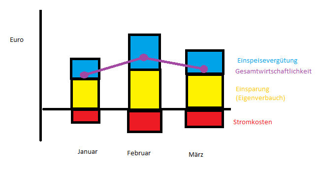
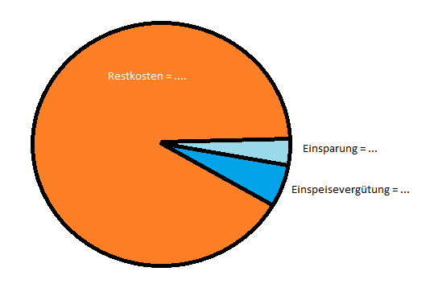

# Analyse einer Photovoltaikanlage

Viele Haushalte in Deutschland nutzen Photovoltaikanlagen, um ihren
eigenen Strom zu erzeugen. Dies bietet die Möglichkeit, den produzierten
Strom selbst zu verbrauchen und somit die Kosten für den Strombezug zu
senken. Dieser sogenannte Eigenverbrauch kann durch den Einsatz von
Batteriespeichern weiter erhöht werden. In den meisten Fällen wird
überschüssiger Strom ins Netz eingespeist, wofür eine Einspeisevergütung
gezahlt wird.

In dieser Analyse sollen die Daten einer Photovoltaikanlage untersucht
werden, um den Eigenverbrauchsanteil zu bestimmen und die
Wirtschaftlichkeit der Anlage zu bewerten. Dazu werden verschiedene
Kennzahlen berechnet und visualisiert.

## Die Photovoltaikanlage

Die Anlage selbst besteht aus einer 9 kWp Photovoltaikanlage und einem 6
kWh Batteriespeicher. Hierbei bedeutet “9 kWp” (Kilowatt Peak), dass die
Anlage unter optimalen Bedingungen eine maximale Leistung von 9 Kilowatt
erzeugen kann. Und die “6 kWh” (Kilowattstunden) bedeuten, dass der
Batteriespeicher 6 Kilowatt Leistung für eine Stunde bereitstellen kann
(oder entsprechend weniger Leistung für eine längere Zeit).

Zur Orientierung, ein Fön benötigt etwa 1.5 kW Leistung. Wenn man seine
Haare für 10 Minuten föhnt, verbraucht man somit 0.25 kWh (1.5 kW \* 1/6
Stunde) Strom. Mit dem 6 kWh Speicher könnten wir also 4 Stunden lang
unsere Haare föhnen, wenn der Speicher voll aufgeladen ist.

Die Hersteller solcher Anlagen ermöglichen es, die Daten der Anlage über
eine Online-Plattform zu überwachen. Hier ein Beispiel der
Produktionsübersicht einer VARTA Anlage.

Oftmals können die Daten auch als tabellarische Datei heruntergeladen
werden, was die persönliche Analyse erleichtert.

## Daten

Die Daten der Photovoltaikanlage inklusive Speicher wurden von der
Herstellerseite monatsweise exportiert und stehen im `./PV/` Unterordner
dieses Projektverzeichnisses jeweils als ZIP Datei zur Verfügung. Jede
ZIP-Datei enthält eine CSV-Datei mit den Daten des jeweiligen Monats,
welche wie folgt strukturiert sind:

<table>
<colgroup>
<col style="width: 20%" />
<col style="width: 20%" />
<col style="width: 20%" />
<col style="width: 20%" />
<col style="width: 20%" />
</colgroup>
<thead>
<tr>
<th>Datum</th>
<th>Netzeinspeisung [kWh]</th>
<th>Netzbezug [kWh]</th>
<th>Speicherung [kWh]</th>
<th>PV Ertrag [kWh]</th>
</tr>
</thead>
<tbody>
<tr>
<td>31.01.2025</td>
<td>6,9</td>
<td>0,75</td>
<td>4,4</td>
<td>11,99</td>
</tr>
<tr>
<td>30.01.2025</td>
<td>8,11</td>
<td>0,88</td>
<td>4,25</td>
<td>14,77</td>
</tr>
<tr>
<td>29.01.2025</td>
<td>7,85</td>
<td>0,94</td>
<td>3,46</td>
<td>11,7</td>
</tr>
<tr>
<td>28.01.2025</td>
<td>2,07</td>
<td>0,76</td>
<td>4,37</td>
<td>6,96</td>
</tr>
</tbody>
</table>

Hierbei sind die Spalten wie folgt zu verstehen:

-   **Datum**: Das Datum des jeweiligen Tages.
-   **Netzeinspeisung \[kWh\]**: Die Menge an Strom (in
    Kilowattstunden), die an diesem Tag ins öffentliche Netz eingespeist
    wurde.
-   **Netzbezug \[kWh\]**: Die Menge an Strom (in Kilowattstunden), die
    an diesem Tag aus dem öffentlichen Netz bezogen wurde.
-   **Speicherung \[kWh\]**: Die Menge an Strom (in Kilowattstunden),
    die an diesem Tag in den Batteriespeicher geladen wurde.
-   **PV Ertrag \[kWh\]**: Die Menge an Strom (in Kilowattstunden), die
    die Photovoltaikanlage an diesem Tag erzeugt hat.

# Aufgaben

## Datenimport

Die Daten der Photovoltaikanlage liegen in mehreren ZIP-Dateien vor, die
jeweils eine CSV-Datei mit den Daten eines Monats enthalten. Die Aufgabe
besteht darin, alle ZIP-Dateien zu entpacken, die enthaltenen
CSV-Dateien zu lesen und die Daten in einem einzigen DataFrame
zusammenzuführen. Dabei soll darauf geachtet werden, dass die Datentypen
korrekt interpretiert werden (z.B. Datum als Date, Zahlen als numerische
Werte).

Zudem soll die Integrität der Daten geprüft werden:

-   Ist jeder Datensatz vollständig (keine fehlenden Werte)?
    -   Falls nein, können fehlende Werte sinnvoll ergänzt werden?
        -   Falls nein, sollen die entsprechenden Zeilen entfernt
            werden.
-   Gibt es doppelte Einträge?
    -   Falls ja, soll der Eintrag mit dem höheren PV Ertrag behalten
        werden.
-   Nur die Daten für das Jahr 2025 sollen berücksichtigt werden.

(!) Die Datenintegrität und -korrektur soll in der Markdownausgabe
dokumentiert werden.

(!) Der Datenimport (read\* call) soll direkt die CSV Datei aus der ZIP
Datei lesen, ohne die Datei vorher explizit zu entpacken (d.h. es sollen
keine neuen Dateien auf der Festplatte erstellt werden). Hierfür kann
die `unz()` Funktion im `file=` Argument der `read*` Funktion verwendet
werden.

(!) Das Script soll so geschrieben sein, dass es die Liste der
ZIP-Dateien automatisch aus dem PV Ordner liest (und somit flexibel auf
weitere Dateien reagiert).

## Datenaufbereitung

(!) Nach dem Import der Daten sollen folgende zusätzlichen Spalten
berechnet und dem DataFrame hinzugefügt werden:

-   **Eigenverbrauch \[kWh\]**: Die Menge an Strom (in Kilowattstunden),
    die von der Photovoltaikanlage direkt im Haushalt verbraucht wurde.
    -   Berechnung: `PV Ertrag - Netzeinspeisung - Speicherung`
-   **Gesamtverbrauch \[kWh\]**: Die Gesamtmenge an Strom (in
    Kilowattstunden), die im Haushalt verbraucht wurde.
    -   Berechnung: `Eigenverbrauch + Netzbezug`
-   **Eigenverbrauchsanteil \[%\]**: Der Anteil des Eigenverbrauchs am
    Gesamtverbrauch.
    -   Berechnung: `(Eigenverbrauch / Gesamtverbrauch) * 100`

(!) Zudem sollen die Daten nach Datum sortiert werden.

## Datenanalyse und -visualisierung

In der folgenden Datenanalyse und -visualisierung wollen wir einigen
Fragen auf den Grund gehen, die sich im Zusammenhang mit der
Photovoltaikanlage ergeben.

### Monatliche Kennzahlen

Wenn man den Jahresverlauf im Blick hat, stellen sich u.a. folgende
Fragen.

-   (?) Wie hoch ist der Eigenverbrauchsanteil im Jahresverlauf?
-   (?) In welchen Monaten habe ich besonders viel Strom ins Netz
    eingespeist?
-   (?) Wie verändern sich die Stromkosten und Einsparungen durch die
    Anlage im Jahresverlauf?
-   …

Hierfür im Folgenden ein paar Aufgaben.

(!) Berechne für jeden Monat die folgenden Kennzahlen und stelle sie in
einer übersichtlichen Tabelle dar:

-   **Monat**: Der Monat (z.B. Januar, Februar, etc.).
-   **PV Ertrag \[kWh\]**: Die Summe des PV Ertrags für den Monat.
-   **Eigenverbrauch \[kWh\]**: Die Summe des Eigenverbrauchs für den
    Monat.
-   **Gesamtverbrauch \[kWh\]**: Die Summe des Gesamtverbrauchs für den
    Monat.
-   **Netzeinspeisung \[kWh\]**: Die Summe der Netzeinspeisung für den
    Monat.
-   **Netzbezug \[kWh\]**: Die Summe des Netzbezugs für den Monat.

(!) Verwenden sie Sie die `dplyr` Bibliothek für die Datenmanipulation
und -aggregation. Insbesondere `group_by()` und `accross()` können
hierbei hilfreich sein.

(!) Erweitern Sie die Tabelle umfolgende Spalten.

-   **Stromkosten \[€\]**: Die Kosten für den Netzbezug, basierend auf
    einem angenommenen Strompreis von 0,30 €/kWh.
    -   Berechnung: `Netzbezug * 0.30`
-   **Einspeisevergütung \[€\]**: Die Einnahmen aus der Netzeinspeisung,
    basierend auf einer angenommenen Einspeisevergütung von 0,08 €/kWh.
    -   Berechnung: `Netzeinspeisung * 0.08`
-   **Einsparungen durch Eigenverbrauch \[€\]**: Die Einsparungen, die
    durch den Eigenverbrauch erzielt wurden, basierend auf dem
    angenommenen Strompreis von 0,30 €/kWh.
    -   Berechnung: `Eigenverbrauch * 0.30`
-   **Gesamtwirtschaftlichkeit \[€\]**: Die Gesamtwirtschaftlichkeit der
    Anlage für den Monat, berechnet als Einsparungen durch
    Eigenverbrauch plus Einspeisevergütung minus Stromkosten.
    -   Berechnung:
        `Einsparungen durch Eigenverbrauch + Einspeisevergütung - Stromkosten`

(!) Alle Daten der Tabelle auf zwei Nachkommastellen runden.

(!) Die Tabelle soll nach Monat sortiert sein (beginnend mit Januar) und
als Markdown Tabelle in der Ausgabe dargestellt werden.

Zudem sollen die Kosten-/Vergütungsbezogenen Spalten visualisiert
werden.

(!) Erstellen Sie ein gruppiertes Balkendiagramm, das die Stromkosten
als negative Werte und die Einspeisevergütung sowie die Einsparungen
durch Eigenverbrauch als positive Werte für jeden Monat darstellt. Wobei
die positiven Werte (Einspeisevergütung und Einsparungen durch
Eigenverbrauch) gestapelt dargestellt werden sollen. Zudem soll mit
einer Linie die Gesamtwirtschaftlichkeit für jeden Monat dargestellt
werden.

Grob sollte das dann etwa so aussehen:

(!) Verwenden Sie hierfür die `ggplot2` Bibliothek.

### Jahresübersicht

Nun wollen wir einen Blick auf das gesamte Jahr werfen und haben
folgende Fragen im Sinn.

-   (?) Hat sich die Investition schon amortisiert?
-   (?) Wie oft bin ich noch deutlich auf das Netz angewiesen?
-   (?) An wieviel Tagen im Jahr brauchte ich keinen Batteriespeicher?
-   …

(!) Berechnen Sie hierfür die folgenden Kennzahlen für das gesamte Jahr
2025:

-   **Amortisierung \[€\]**: Summe der Einsparung und Einspeisevergütung
    für das Jahr.
-   **Durchschnittlicher Netzbezug \[kWh\]**: Durchschnittlicher
    Netzbezug pro Tag.
-   **Tage mit vollem Speicher \[%\]**: Anteil der Tage im Datensatz, an
    denen der Batteriespeicher vollständig genutzt wurde (d.h. die
    Speicherung an diesem Tag liegt unter 0,5 kWh).
    -   Berechnung:
        `(Anzahl der Tage mit Speicherung < 0.5 kWh / Gesamtanzahl der Tage) * 100`  
-   **Tage mit überdurchschnittlichem Netzbezug \[%\]**: Anteil der Tage
    im Datensatz, an denen der Netzbezug deutlich über dem Durchschnitt
    liegt.
    -   Berechnung:
        `(Anzahl der Tage mit Netzbezug > (Mittelwert + Standardabweichung) / Gesamtanzahl der Tage) * 100`

(!) Stellen Sie die Jahresübersicht in einer übersichtlichen Tabelle
dar, wobei alle Werte auf zwei Nachkommastellen gerundet sind.

(!) Visualisieren sie die Amortisierung in einem Tortendiagramm, das die
Anteile der Einsparungen durch Eigenverbrauch und der Einspeisevergütung
darstellt, wenn die Gesamtinvestition der Anlage 12.000 € beträgt.

Versuchen sie das Diagramm hübscher zu gestalten als das Beispielbild.
